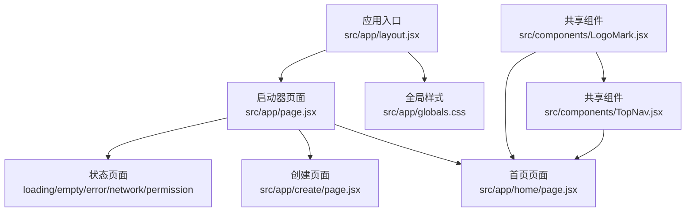
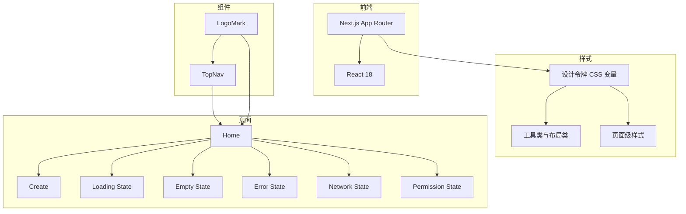
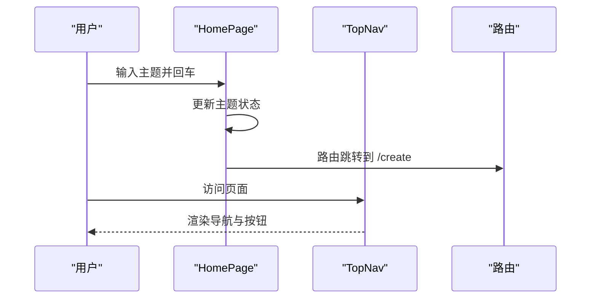
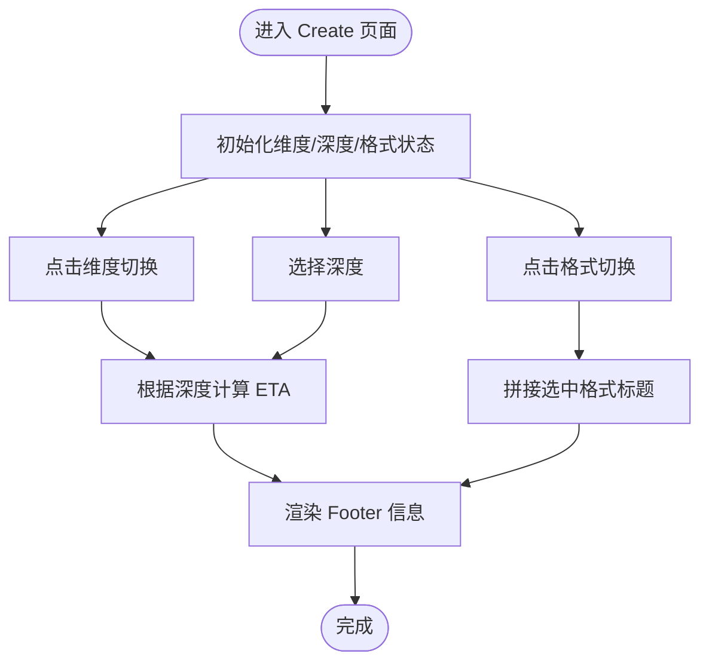
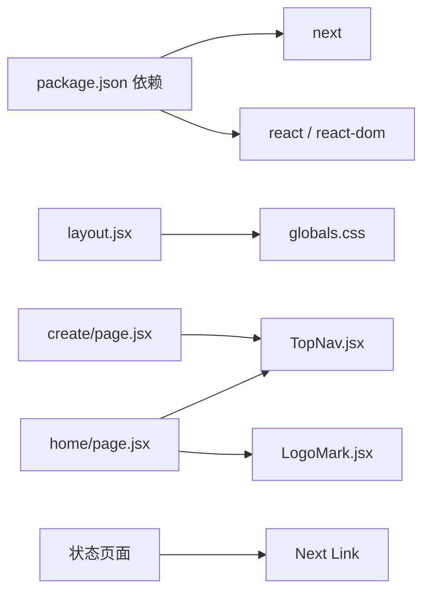

# 代码规范与最佳实践

<cite>
**本文引用的文件**
- [README.md](file://README.md)
- [package.json](file://package.json)
- [layout.jsx](file://src/app/layout.jsx)
- [globals.css](file://src/app/globals.css)
- [LogoMark.jsx](file://src/components/LogoMark.jsx)
- [TopNav.jsx](file://src/components/TopNav.jsx)
- [page.jsx](file://src/app/page.jsx)
- [home/page.jsx](file://src/app/home/page.jsx)
- [create/page.jsx](file://src/app/create/page.jsx)
- [states/loading/page.jsx](file://src/app/states/loading/page.jsx)
- [states/empty/page.jsx](file://src/app/states/empty/page.jsx)
- [states/error/page.jsx](file://src/app/states/error/page.jsx)
- [states/network/page.jsx](file://src/app/states/network/page.jsx)
- [states/permission/page.jsx](file://src/app/states/permission/page.jsx)
</cite>

## 目录
1. [简介](#简介)
2. [项目结构](#项目结构)
3. [核心组件](#核心组件)
4. [架构总览](#架构总览)
5. [详细组件分析](#详细组件分析)
6. [依赖关系分析](#依赖关系分析)
7. [性能考虑](#性能考虑)
8. [故障排查指南](#故障排查指南)
9. [结论](#结论)
10. [附录](#附录)

## 简介
本规范旨在为 InsightMesh 项目提供统一的代码风格与最佳实践，覆盖 React 组件开发、JavaScript 编码标准、CSS Modules 与样式编写、注释与文档、组件复用与模块化、性能优化以及团队协作风格。项目采用 Next.js App Router + React 18，样式集中于全局样式文件，组件以共享 TopNav 与 LogoMark 为主。

## 项目结构
- 应用层（App Router）：页面组件位于 src/app 下，按路由组织，根布局负责引入全局样式与元数据。
- 组件层：共享组件位于 src/components，如 TopNav、LogoMark。
- 样式层：全局样式 src/app/globals.css，集中定义设计令牌、基础样式、工具类与页面级样式。
- 资源：public/assets 用于原型素材。



**图表来源**
- [layout.jsx:1-21](file://src/app/layout.jsx#L1-L21)
- [globals.css:1-200](file://src/app/globals.css#L1-L200)
- [page.jsx:1-78](file://src/app/page.jsx#L1-L78)
- [home/page.jsx:1-212](file://src/app/home/page.jsx#L1-L212)
- [create/page.jsx:1-183](file://src/app/create/page.jsx#L1-L183)
- [TopNav.jsx:1-45](file://src/components/TopNav.jsx#L1-L45)
- [LogoMark.jsx:1-19](file://src/components/LogoMark.jsx#L1-L19)

**章节来源**
- [README.md:13-39](file://README.md#L13-L39)
- [layout.jsx:1-21](file://src/app/layout.jsx#L1-L21)
- [globals.css:1-200](file://src/app/globals.css#L1-L200)
- [page.jsx:1-78](file://src/app/page.jsx#L1-L78)

## 核心组件
- 共享导航 TopNav：接收 active、ctaHref、ctaLabel，渲染品牌、导航链接与操作按钮。
- LogoMark：无状态 SVG 标识，支持 size 参数控制尺寸。
- 页面组件：Launcher 负责路由入口与卡片导航；Home 提供英雄区、模板芯片、场景与统计；Create 提供维度、深度、格式配置与预计耗时展示；状态页提供 loading/empty/error/network/permission 的统一视觉与交互。

**章节来源**
- [TopNav.jsx:1-45](file://src/components/TopNav.jsx#L1-L45)
- [LogoMark.jsx:1-19](file://src/components/LogoMark.jsx#L1-L19)
- [page.jsx:1-78](file://src/app/page.jsx#L1-L78)
- [home/page.jsx:1-212](file://src/app/home/page.jsx#L1-L212)
- [create/page.jsx:1-183](file://src/app/create/page.jsx#L1-L183)
- [states/loading/page.jsx:1-12](file://src/app/states/loading/page.jsx#L1-L12)
- [states/empty/page.jsx:1-25](file://src/app/states/empty/page.jsx#L1-L25)
- [states/error/page.jsx:1-21](file://src/app/states/error/page.jsx#L1-L21)
- [states/network/page.jsx:1-33](file://src/app/states/network/page.jsx#L1-L33)
- [states/permission/page.jsx:1-28](file://src/app/states/permission/page.jsx#L1-L28)

## 架构总览
- 前端框架：Next.js App Router + React 18
- 样式策略：全局样式集中管理，使用 CSS 变量作为设计令牌，配合工具类与页面级样式
- 组件策略：共享组件（TopNav、LogoMark）跨页面复用，页面组件内部组合与状态管理
- 交互策略：页面内使用 React 状态与路由跳转，保持与原型交互一致



**图表来源**
- [package.json:12-16](file://package.json#L12-L16)
- [globals.css:12-134](file://src/app/globals.css#L12-L134)
- [TopNav.jsx:1-45](file://src/components/TopNav.jsx#L1-L45)
- [LogoMark.jsx:1-19](file://src/components/LogoMark.jsx#L1-L19)
- [home/page.jsx:1-212](file://src/app/home/page.jsx#L1-L212)
- [create/page.jsx:1-183](file://src/app/create/page.jsx#L1-L183)
- [states/loading/page.jsx:1-12](file://src/app/states/loading/page.jsx#L1-L12)
- [states/empty/page.jsx:1-25](file://src/app/states/empty/page.jsx#L1-L25)
- [states/error/page.jsx:1-21](file://src/app/states/error/page.jsx#L1-L21)
- [states/network/page.jsx:1-33](file://src/app/states/network/page.jsx#L1-L33)
- [states/permission/page.jsx:1-28](file://src/app/states/permission/page.jsx#L1-L28)

## 详细组件分析

### 组件命名约定
- 组件文件使用帕斯卡命名法（如 TopNav.jsx、LogoMark.jsx），与 React 组件命名一致
- 页面组件文件使用小写加斜杠路径（如 home/page.jsx），对应路由层级
- 类名采用语义化命名，如 topnav、hero-input、page-card、state-body 等

**章节来源**
- [TopNav.jsx:1-45](file://src/components/TopNav.jsx#L1-L45)
- [LogoMark.jsx:1-19](file://src/components/LogoMark.jsx#L1-L19)
- [page.jsx:1-78](file://src/app/page.jsx#L1-L78)
- [home/page.jsx:1-212](file://src/app/home/page.jsx#L1-L212)
- [create/page.jsx:1-183](file://src/app/create/page.jsx#L1-L183)

### Props 设计原则
- 可选 Props 使用默认值（如 TopNav 的 active、ctaHref、ctaLabel）
- 将 UI 行为与数据分离，如 TopNav 不关心跳转逻辑，仅消费 props
- 页面组件内部状态使用 useState 管理，避免过度提升状态



**图表来源**
- [home/page.jsx:30-52](file://src/app/home/page.jsx#L30-L52)
- [TopNav.jsx:7-44](file://src/components/TopNav.jsx#L7-L44)

**章节来源**
- [TopNav.jsx:7-44](file://src/components/TopNav.jsx#L7-L44)
- [home/page.jsx:30-52](file://src/app/home/page.jsx#L30-L52)

### 状态管理最佳实践
- 页面内状态优先：如 Home 的 HeroInputZone、Create 的维度/深度/格式状态均在组件内管理
- 使用对象/数组聚合状态，减少分散的 useState 调用
- 通过计算派生状态（如 Create 中根据深度计算 ETA、根据选中格式生成标题）



**图表来源**
- [create/page.jsx:45-56](file://src/app/create/page.jsx#L45-L56)

**章节来源**
- [create/page.jsx:45-56](file://src/app/create/page.jsx#L45-L56)

### JavaScript 编码标准（ES6+ 与函数式）
- 使用严格模式与模块导入导出
- 函数式组件优先，必要时使用 "use client" 指令启用客户端状态
- 使用解构赋值与展开运算符简化状态更新（如对象展开）
- 使用常量声明不可变配置（如 Home 的模板数组、场景数组）

**章节来源**
- [home/page.jsx:1-212](file://src/app/home/page.jsx#L1-L212)
- [create/page.jsx:1-183](file://src/app/create/page.jsx#L1-L183)

### 错误处理规范
- 状态页提供明确的错误信息与操作按钮（如 ErrorStatePage 的错误详情与重试/微调按钮）
- 网络异常页提供排查建议与刷新动作
- 权限页引导登录与权益说明

**章节来源**
- [states/error/page.jsx:1-21](file://src/app/states/error/page.jsx#L1-L21)
- [states/network/page.jsx:1-33](file://src/app/states/network/page.jsx#L1-L33)
- [states/permission/page.jsx:1-28](file://src/app/states/permission/page.jsx#L1-L28)

### CSS Modules 与样式编写指南
- 设计令牌集中于 :root，使用 CSS 变量统一颜色、字体、间距、圆角、阴影等
- 工具类（如 container、stack、row、grid-*）用于布局与排版
- 页面级样式按页面划分（如 Home、Launcher），避免样式冲突
- 使用类名前缀区分作用域（如 topnav-*、hero-*、page-card-*）

```mermaid
classDiagram
class DesignTokens {
"+颜色变量"
"+字体变量"
"+间距变量"
"+圆角变量"
"+阴影变量"
}
class Utils {
"+容器类"
"+布局类"
"+文本类"
"+动画类"
}
class Pages {
"+Launcher 样式"
"+Home 样式"
"+Create 样式"
"+State 样式"
}
DesignTokens --> Utils : "提供变量"
Utils --> Pages : "组合使用"
```

**图表来源**
- [globals.css:12-134](file://src/app/globals.css#L12-L134)
- [globals.css:160-189](file://src/app/globals.css#L160-L189)
- [globals.css:545-632](file://src/app/globals.css#L545-L632)
- [globals.css:633-800](file://src/app/globals.css#L633-L800)

**章节来源**
- [globals.css:12-134](file://src/app/globals.css#L12-L134)
- [globals.css:160-189](file://src/app/globals.css#L160-L189)
- [globals.css:545-800](file://src/app/globals.css#L545-L800)

### 代码注释与文档编写标准
- 组件文件顶部添加简要说明（如 TopNav 的“Shared top navigation”）
- 关键状态与交互逻辑添加注释（如 Create 中的状态初始化与计算）
- 页面组件导出函数命名清晰（如 LauncherPage、HomePage、CreatePage）

**章节来源**
- [TopNav.jsx:4-7](file://src/components/TopNav.jsx#L4-L7)
- [create/page.jsx:45-56](file://src/app/create/page.jsx#L45-L56)
- [page.jsx:27-27](file://src/app/page.jsx#L27-L27)

### 组件复用与模块化开发规范
- 共享组件：TopNav、LogoMark 在多个页面复用，降低重复代码
- 页面组件内部组合：页面内状态与子组件组合，保持页面职责单一
- 路由与页面映射清晰：页面组件路径与路由一致，便于维护

**章节来源**
- [TopNav.jsx:1-45](file://src/components/TopNav.jsx#L1-L45)
- [LogoMark.jsx:1-19](file://src/components/LogoMark.jsx#L1-L19)
- [page.jsx:1-78](file://src/app/page.jsx#L1-L78)

## 依赖关系分析
- 项目依赖 Next.js 与 React，使用 Next.js 提供的 App Router 与客户端指令
- 根布局引入全局样式，保证页面一致性
- 页面组件依赖共享组件与全局样式



**图表来源**
- [package.json:12-16](file://package.json#L12-L16)
- [layout.jsx:1-21](file://src/app/layout.jsx#L1-L21)
- [home/page.jsx:1-212](file://src/app/home/page.jsx#L1-L212)
- [create/page.jsx:1-183](file://src/app/create/page.jsx#L1-L183)
- [TopNav.jsx:1-45](file://src/components/TopNav.jsx#L1-L45)
- [LogoMark.jsx:1-19](file://src/components/LogoMark.jsx#L1-L19)

**章节来源**
- [package.json:12-16](file://package.json#L12-L16)
- [layout.jsx:1-21](file://src/app/layout.jsx#L1-L21)

## 性能考虑
- 避免不必要的重渲染：页面组件内部状态局部化，仅在需要时更新（如 Home 的 HeroInputZone、Create 的维度/格式切换）
- 保持组件纯度：TopNav 为纯展示组件，不持有状态，减少副作用
- 合理使用动画与渐变：全局样式提供淡入、脉冲、旋转等动画，避免复杂动画影响首屏性能
- 静态预渲染：构建产物为静态预渲染，有利于性能与 SEO

**章节来源**
- [home/page.jsx:30-52](file://src/app/home/page.jsx#L30-L52)
- [create/page.jsx:45-56](file://src/app/create/page.jsx#L45-L56)
- [TopNav.jsx:1-45](file://src/components/TopNav.jsx#L1-L45)
- [README.md:82-86](file://README.md#L82-L86)

## 故障排查指南
- 加载中状态：检查路由与状态页渲染是否正确
- 空数据状态：确认数据为空时的引导与按钮跳转
- 错误状态：查看错误详情与重试/微调按钮是否可用
- 网络异常：确认刷新按钮与返回首页逻辑
- 权限状态：确认登录引导与权益说明

**章节来源**
- [states/loading/page.jsx:1-12](file://src/app/states/loading/page.jsx#L1-L12)
- [states/empty/page.jsx:1-25](file://src/app/states/empty/page.jsx#L1-L25)
- [states/error/page.jsx:1-21](file://src/app/states/error/page.jsx#L1-L21)
- [states/network/page.jsx:1-33](file://src/app/states/network/page.jsx#L1-L33)
- [states/permission/page.jsx:1-28](file://src/app/states/permission/page.jsx#L1-L28)

## 结论
本规范结合 InsightMesh 的现有实现，制定了统一的组件命名、Props 设计、状态管理、JS 编码、样式组织、注释与复用策略，并给出性能与故障排查建议。遵循这些规范有助于提升代码质量、可维护性与团队协作效率。

## 附录
- 运行与构建命令参考 README
- 全局样式设计令牌与工具类参考 globals.css
- 页面路由与状态页参考各页面组件

**章节来源**
- [README.md:52-86](file://README.md#L52-L86)
- [globals.css:12-134](file://src/app/globals.css#L12-L134)
- [page.jsx:61-77](file://src/app/page.jsx#L61-L77)