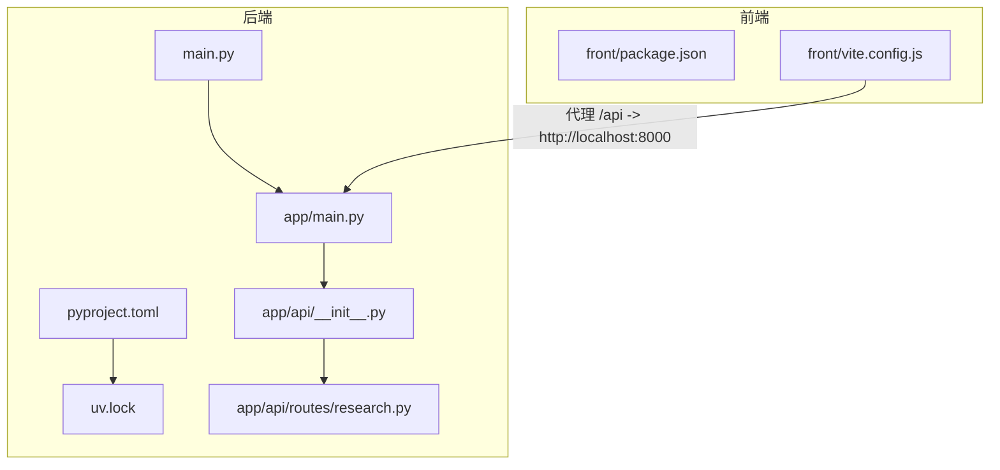
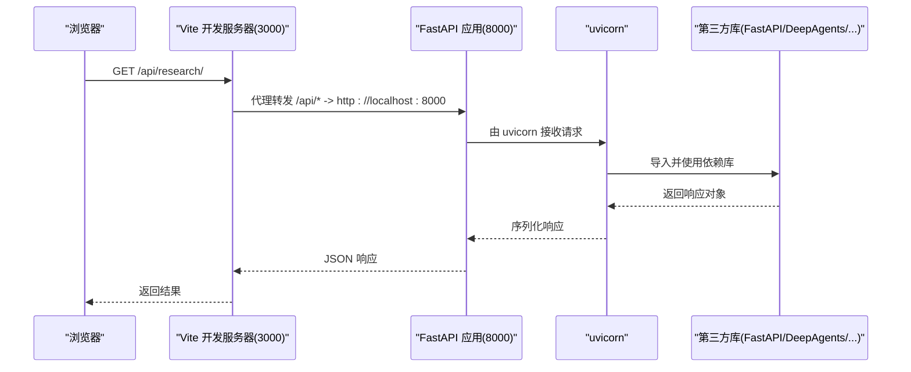
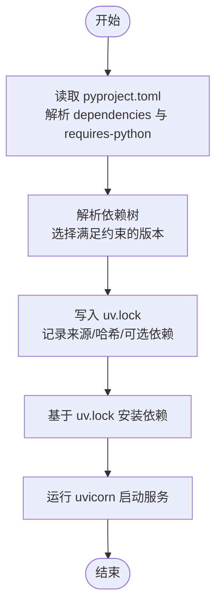
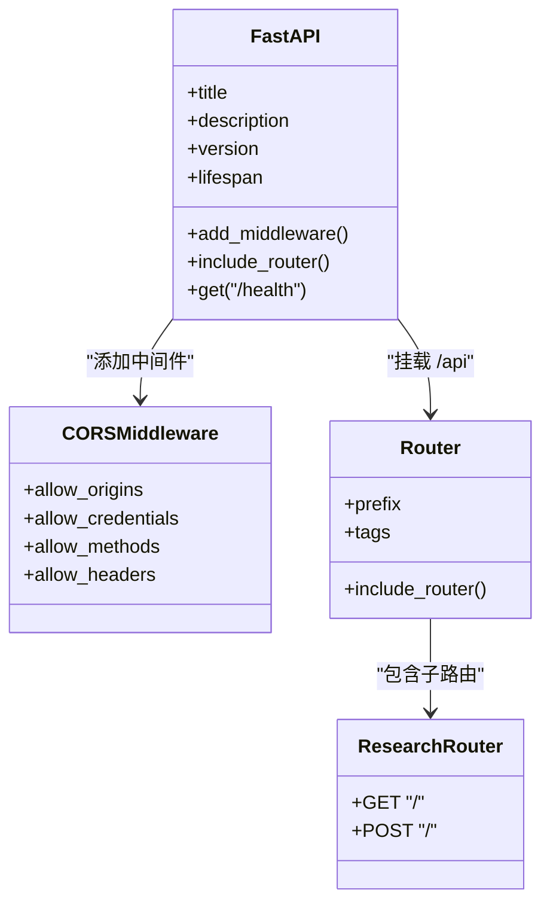
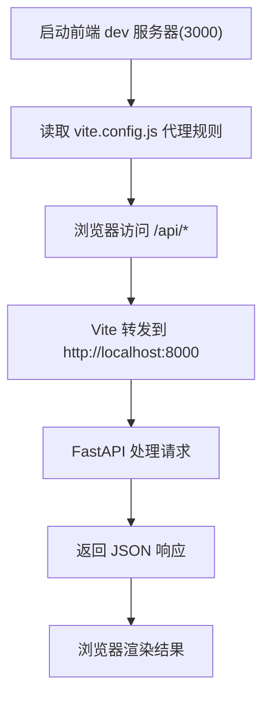
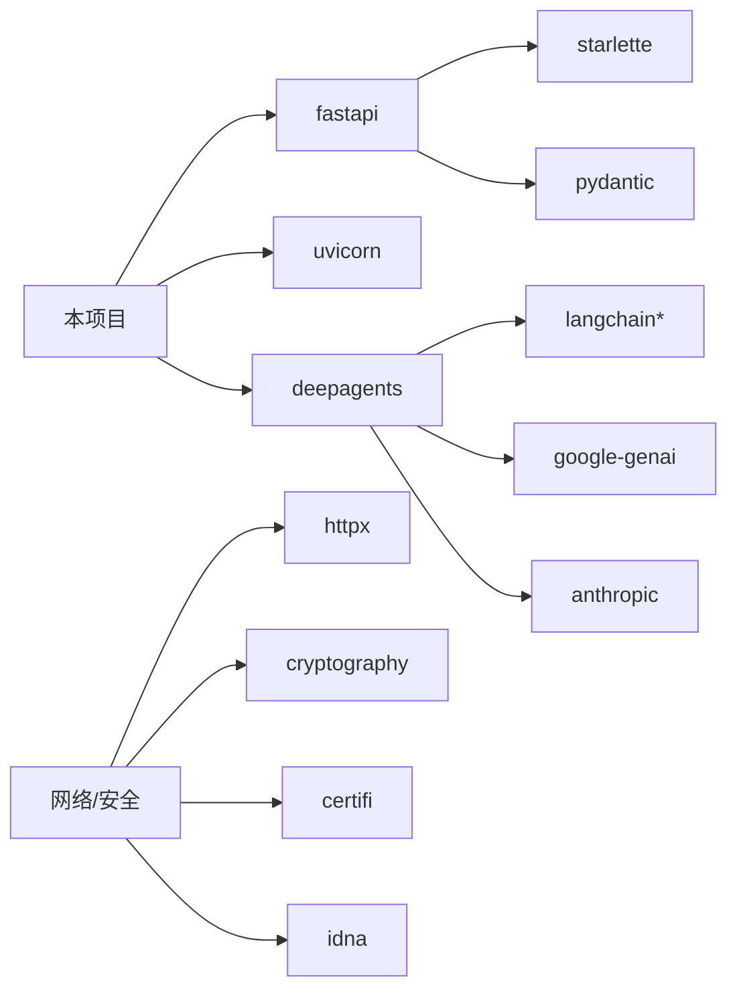

# 依赖管理

<cite>
**本文引用的文件**   
- [pyproject.toml](file://pyproject.toml)
- [uv.lock](file://uv.lock)
- [main.py](file://main.py)
- [app/main.py](file://app/main.py)
- [app/api/__init__.py](file://app/api/__init__.py)
- [app/api/routes/research.py](file://app/api/routes/research.py)
- [front/package.json](file://front/package.json)
- [front/vite.config.js](file://front/vite.config.js)
</cite>

## 目录
1. [简介](#简介)
2. [项目结构](#项目结构)
3. [核心组件](#核心组件)
4. [架构总览](#架构总览)
5. [详细组件分析](#详细组件分析)
6. [依赖关系分析](#依赖关系分析)
7. [性能与可维护性建议](#性能与可维护性建议)
8. [故障排查指南](#故障排查指南)
9. [结论](#结论)

## 简介
本仓库为“InsightMesh 多 AI Agent 智能调研平台”，采用前后端分离：
- 后端：Python + FastAPI，使用 uv 进行包管理与锁定。
- 前端：React + Vite，通过开发服务器代理访问后端 API。

本文聚焦于“依赖管理”，涵盖 Python 与前端两个生态的依赖声明、解析、锁定与运行期加载路径，并给出可视化依赖图与常见问题排障建议。

## 项目结构
- 后端根配置与入口
  - pyproject.toml：声明 Python 项目元数据、运行时依赖与脚本命令。
  - uv.lock：由 uv 生成的精确锁定文件，记录所有已解析依赖及其来源、哈希等。
  - main.py：本地启动脚本，调用 uvicorn 运行 app.main:app。
  - app/main.py：FastAPI 应用实例、CORS 中间件、路由挂载与健康检查。
  - app/api/*：按功能划分的 API 路由聚合与具体路由实现。
- 前端配置与入口
  - front/package.json：声明 React 运行时依赖与 Vite 构建工具链。
  - front/vite.config.js：Vite 插件、别名、开发服务器端口与 /api 代理到后端 8000 端口。

图表来源
- [pyproject.toml:1-18](file://pyproject.toml#L1-L18)
- [uv.lock:56-73](file://uv.lock#L56-L73)
- [main.py:1-13](file://main.py#L1-L13)
- [app/main.py:1-39](file://app/main.py#L1-L39)
- [app/api/__init__.py:1-9](file://app/api/__init__.py#L1-L9)
- [app/api/routes/research.py:1-19](file://app/api/routes/research.py#L1-L19)
- [front/package.json:1-22](file://front/package.json#L1-L22)
- [front/vite.config.js:1-22](file://front/vite.config.js#L1-L22)

章节来源
- [pyproject.toml:1-18](file://pyproject.toml#L1-L18)
- [uv.lock:56-73](file://uv.lock#L56-L73)
- [main.py:1-13](file://main.py#L1-L13)
- [app/main.py:1-39](file://app/main.py#L1-L39)
- [app/api/__init__.py:1-9](file://app/api/__init__.py#L1-L9)
- [app/api/routes/research.py:1-19](file://app/api/routes/research.py#L1-L19)
- [front/package.json:1-22](file://front/package.json#L1-L22)
- [front/vite.config.js:1-22](file://front/vite.config.js#L1-L22)

## 核心组件
- Python 依赖声明与锁定
  - 运行时依赖：fastapi、uvicorn、deepagents（>= 指定最低版本）。
  - 脚本命令：dev 指向 uvicorn:main，便于快速启动。
  - 锁定文件：uv.lock 包含完整依赖树、来源与校验信息，确保可重复安装。
- 前端依赖声明
  - 运行时依赖：react、react-dom、react-router-dom。
  - 开发依赖：@vitejs/plugin-react、vite。
- 应用入口与路由
  - 后端入口：main.py 启动 uvicorn；app/main.py 创建 FastAPI 实例、注册 CORS、挂载路由。
  - 路由组织：app/api 聚合子路由，research 模块提供示例接口。
- 前后端联调
  - 前端 Vite 开发服务器监听 3000，将 /api 请求代理至后端 8000。

章节来源
- [pyproject.toml:1-18](file://pyproject.toml#L1-L18)
- [uv.lock:56-73](file://uv.lock#L56-L73)
- [main.py:1-13](file://main.py#L1-L13)
- [app/main.py:1-39](file://app/main.py#L1-L39)
- [app/api/__init__.py:1-9](file://app/api/__init__.py#L1-L9)
- [app/api/routes/research.py:1-19](file://app/api/routes/research.py#L1-L19)
- [front/package.json:1-22](file://front/package.json#L1-L22)
- [front/vite.config.js:1-22](file://front/vite.config.js#L1-L22)

## 架构总览
下图展示从浏览器发起请求到后端处理的关键路径，以及依赖在其中的作用。

图表来源
- [front/vite.config.js:12-21](file://front/vite.config.js#L12-L21)
- [app/main.py:17-33](file://app/main.py#L17-L33)
- [main.py:5-6](file://main.py#L5-L6)
- [pyproject.toml:7-14](file://pyproject.toml#L7-L14)

## 详细组件分析

### Python 依赖声明与解析流程
- 声明位置：pyproject.toml 的 dependencies 字段。
- 解析与锁定：uv 根据声明解析最小兼容版本集，生成 uv.lock，记录每个包的来源、哈希与可选依赖。
- 安装与复现：基于 uv.lock 可精确还原环境，避免“在我机器上能跑”的问题。

图表来源
- [pyproject.toml:1-18](file://pyproject.toml#L1-L18)
- [uv.lock:56-73](file://uv.lock#L56-L73)

章节来源
- [pyproject.toml:1-18](file://pyproject.toml#L1-L18)
- [uv.lock:56-73](file://uv.lock#L56-L73)

### 关键依赖角色与职责
- fastapi：Web 框架，定义路由、中间件、请求/响应模型等。
- uvicorn：ASGI 服务器，负责高性能并发请求处理。
- deepagents：AI Agent 能力集成（作为业务依赖引入）。
- 其他间接依赖：如 pydantic、starlette、httpx、cryptography 等，由上述三方库传递引入。

章节来源
- [pyproject.toml:7-11](file://pyproject.toml#L7-L11)
- [uv.lock:330-343](file://uv.lock#L330-L343)
- [uv.lock:394-400](file://uv.lock#L394-L400)
- [uv.lock:245-292](file://uv.lock#L245-L292)

### 应用入口与路由挂载
- 启动入口：main.py 调用 uvicorn.run 指向 app.main:app。
- 应用初始化：app/main.py 创建 FastAPI 实例、添加 CORS、挂载 /api 前缀路由。
- 路由组织：app/api/__init__.py 聚合子路由，research 模块提供示例接口。

图表来源
- [app/main.py:17-33](file://app/main.py#L17-L33)
- [app/api/__init__.py:1-9](file://app/api/__init__.py#L1-L9)
- [app/api/routes/research.py:1-19](file://app/api/routes/research.py#L1-L19)

章节来源
- [main.py:5-6](file://main.py#L5-L6)
- [app/main.py:17-33](file://app/main.py#L17-L33)
- [app/api/__init__.py:1-9](file://app/api/__init__.py#L1-L9)
- [app/api/routes/research.py:1-19](file://app/api/routes/research.py#L1-L19)

### 前端依赖与开发代理
- 依赖声明：package.json 中声明 react、react-dom、react-router-dom 及 vite 相关开发依赖。
- 开发代理：vite.config.js 将 /api 请求代理到后端 8000 端口，解决跨域问题。

图表来源
- [front/package.json:12-20](file://front/package.json#L12-L20)
- [front/vite.config.js:12-21](file://front/vite.config.js#L12-L21)

章节来源
- [front/package.json:12-20](file://front/package.json#L12-L20)
- [front/vite.config.js:12-21](file://front/vite.config.js#L12-L21)

## 依赖关系分析
- 直接依赖
  - Python：fastapi、uvicorn、deepagents。
  - 前端：react、react-dom、react-router-dom（运行时）；@vitejs/plugin-react、vite（开发时）。
- 间接依赖
  - 由 fastapi 引入 starlette、pydantic、typing-extensions 等。
  - 由 deepagents 引入 langchain 系列、google-genai、anthropic 等。
  - 由网络与安全栈引入 httpx、cryptography、certifi、idna 等。
- 版本策略
  - 使用 >= 指定最低版本，结合 uv.lock 锁定实际安装版本，兼顾灵活性与稳定性。

图表来源
- [pyproject.toml:7-11](file://pyproject.toml#L7-L11)
- [uv.lock:330-343](file://uv.lock#L330-L343)
- [uv.lock:295-309](file://uv.lock#L295-L309)
- [uv.lock:372-391](file://uv.lock#L372-L391)
- [uv.lock:416-428](file://uv.lock#L416-L428)
- [uv.lock:245-292](file://uv.lock#L245-L292)
- [uv.lock:85-91](file://uv.lock#L85-L91)
- [uv.lock:431-437](file://uv.lock#L431-L437)

章节来源
- [pyproject.toml:7-11](file://pyproject.toml#L7-L11)
- [uv.lock:330-343](file://uv.lock#L330-L343)
- [uv.lock:295-309](file://uv.lock#L295-L309)
- [uv.lock:372-391](file://uv.lock#L372-L391)
- [uv.lock:416-428](file://uv.lock#L416-L428)
- [uv.lock:245-292](file://uv.lock#L245-L292)
- [uv.lock:85-91](file://uv.lock#L85-L91)
- [uv.lock:431-437](file://uv.lock#L431-L437)

## 性能与可维护性建议
- 依赖裁剪
  - 评估 deepagents 是否必需；若仅用于实验或按需启用，可考虑将其放入可选依赖组，减少默认安装体积。
- 版本策略
  - 对关键依赖（如 fastapi、uvicorn）建议使用固定版本或较窄范围，配合 uv.lock 提升稳定性。
- 缓存与镜像
  - 在生产环境中配置私有源或缓存镜像，加速依赖下载与安装。
- 前端依赖
  - 定期更新 react 与 vite 版本，关注安全公告；使用 lock 文件（如 pnpm-lock.yaml/yarn.lock）保证团队一致性。

[本节为通用建议，不直接分析具体文件]

## 故障排查指南
- 无法解析依赖或安装失败
  - 检查 pyproject.toml 中的 requires-python 与系统 Python 版本是否匹配。
  - 确认 uv.lock 未被破坏；必要时重新生成锁文件。
- 启动后访问 /api 报跨域错误
  - 确认前端 Vite 代理配置是否正确，且后端 CORS 允许来源包含前端地址。
- 路由未生效
  - 检查 app/api/__init__.py 是否正确 include_router，以及 app/main.py 是否 include_router 并设置正确 prefix。
- 健康检查不可用
  - 确认 app/main.py 中 /health 路由存在且未被覆盖。

章节来源
- [pyproject.toml:6](file://pyproject.toml#L6)
- [uv.lock:1-3](file://uv.lock#L1-L3)
- [front/vite.config.js:12-21](file://front/vite.config.js#L12-L21)
- [app/main.py:24-33](file://app/main.py#L24-L33)
- [app/api/__init__.py:7-8](file://app/api/__init__.py#L7-L8)
- [app/main.py:36-38](file://app/main.py#L36-L38)

## 结论
本项目在后端使用 pyproject.toml 与 uv.lock 实现了明确的依赖声明与可复现的安装过程；在前端通过 package.json 管理运行时与开发依赖，并结合 Vite 代理简化了前后端联调。建议在后续迭代中持续优化依赖粒度与版本策略，以提升构建效率与部署稳定性。