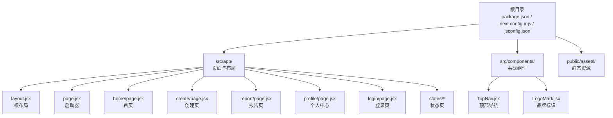
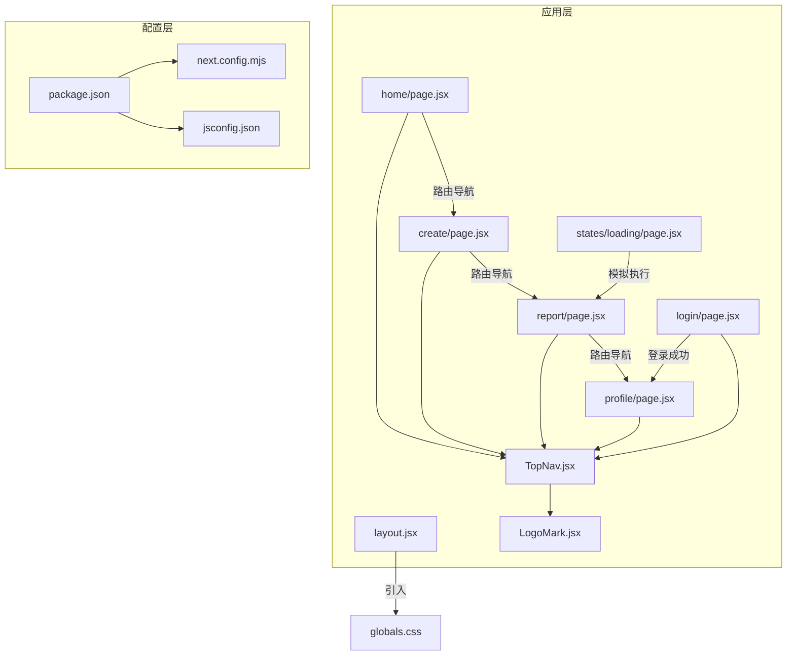
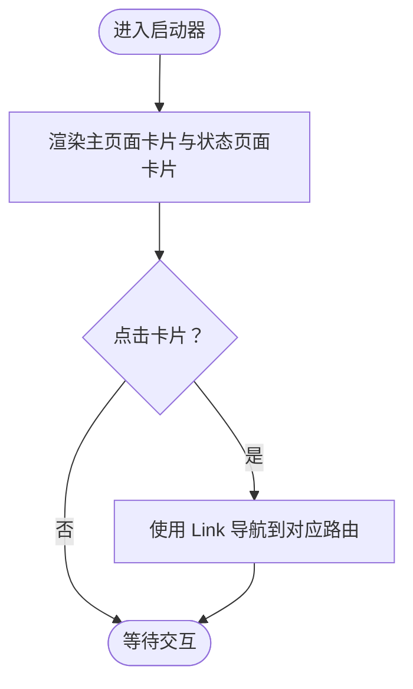
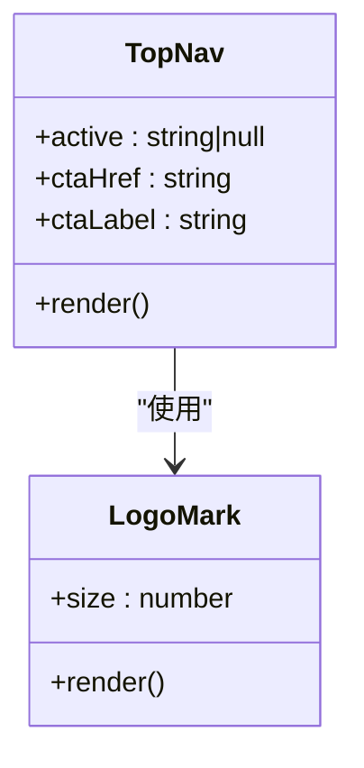
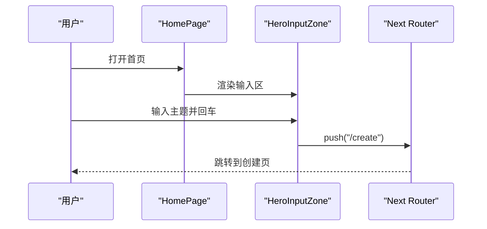
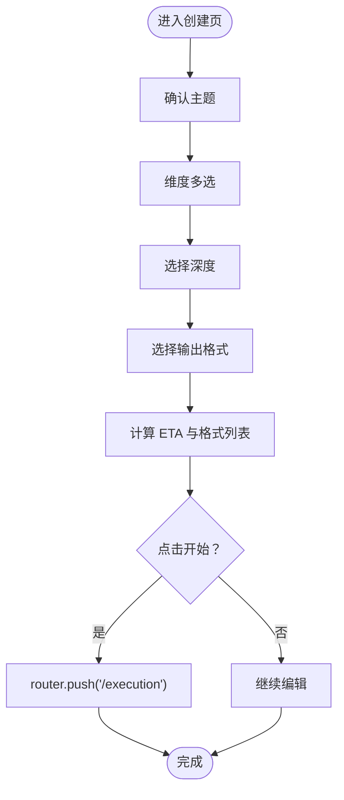
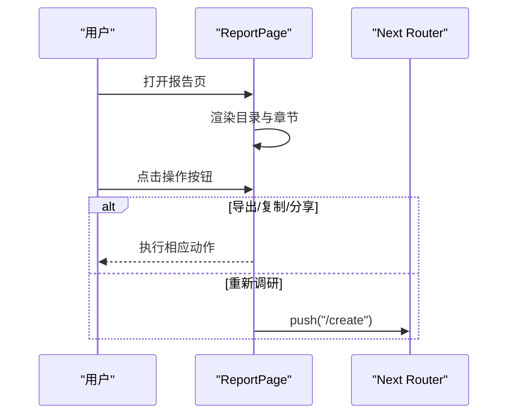
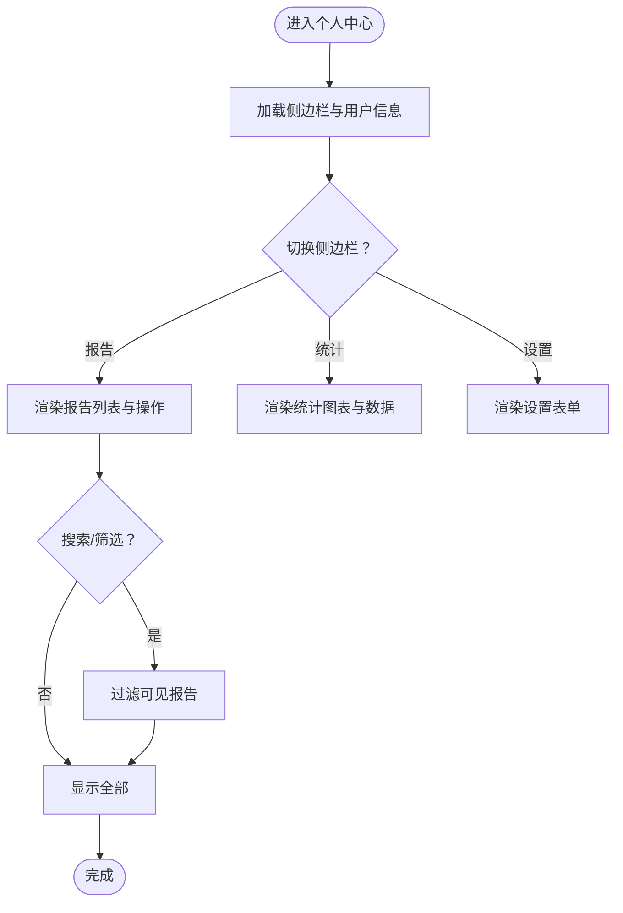
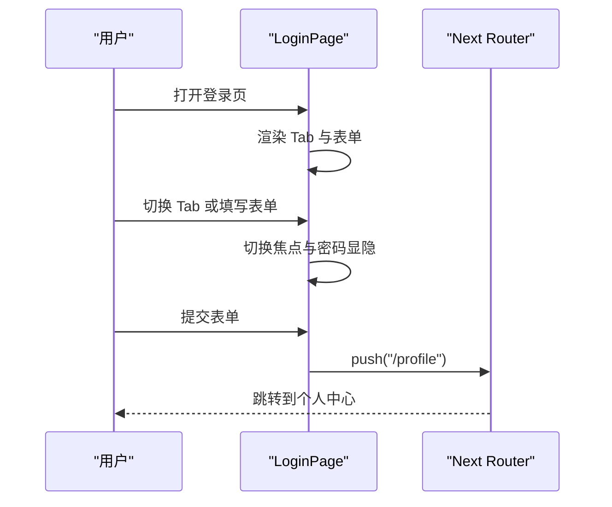
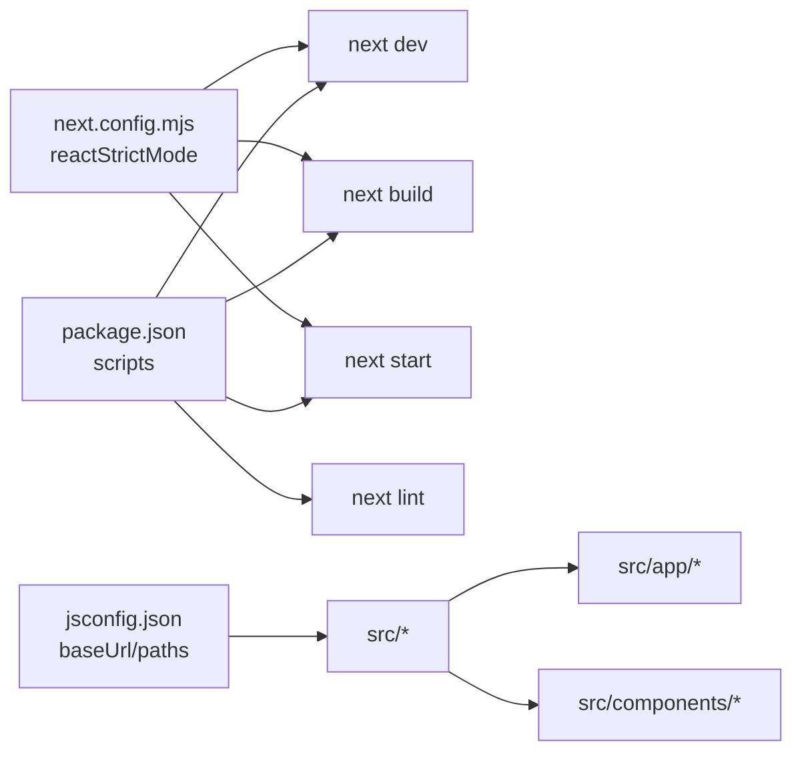

# 开发指南

<cite>
**本文引用的文件**
- [package.json](file://package.json)
- [next.config.mjs](file://next.config.mjs)
- [jsconfig.json](file://jsconfig.json)
- [README.md](file://README.md)
- [layout.jsx](file://src/app/layout.jsx)
- [page.jsx](file://src/app/page.jsx)
- [TopNav.jsx](file://src/components/TopNav.jsx)
- [home/page.jsx](file://src/app/home/page.jsx)
- [create/page.jsx](file://src/app/create/page.jsx)
- [report/page.jsx](file://src/app/report/page.jsx)
- [profile/page.jsx](file://src/app/profile/page.jsx)
- [login/page.jsx](file://src/app/login/page.jsx)
- [states/loading/page.jsx](file://src/app/states/loading/page.jsx)
- [.gitignore](file://.gitignore)
</cite>

## 目录
1. [简介](#简介)
2. [项目结构](#项目结构)
3. [核心组件](#核心组件)
4. [架构总览](#架构总览)
5. [详细组件分析](#详细组件分析)
6. [依赖关系分析](#依赖关系分析)
7. [性能考虑](#性能考虑)
8. [调试指南](#调试指南)
9. [代码规范与最佳实践](#代码规范与最佳实践)
10. [版本控制与协作开发](#版本控制与协作开发)
11. [开发流程与部署](#开发流程与部署)
12. [结语](#结语)

## 简介
本指南面向 InsightMesh 项目的个人开发者与团队协作，围绕开发环境配置、构建与优化、代码规范、调试技巧、性能优化、版本控制与协作流程等方面提供系统化的说明。项目基于 Next.js App Router，采用 React 18，页面组件与共享组件清晰分层，具备良好的可维护性与扩展性。

## 项目结构
- 根目录包含构建脚本、Next.js 配置、路径别名配置与仓库忽略规则。
- 源代码位于 src/ 下，采用 App Router 结构：
  - app/ 根布局与各页面组件
  - components/ 共享 UI 组件
- public/assets/ 用于存放原型 PNG 素材等静态资源。
- README.md 提供技术栈、项目结构、运行与预览路由说明，以及构建产物与与原型差异说明。

**图表来源**
- [package.json](file://package.json)
- [next.config.mjs](file://next.config.mjs)
- [jsconfig.json](file://jsconfig.json)
- [layout.jsx](file://src/app/layout.jsx)
- [page.jsx](file://src/app/page.jsx)
- [TopNav.jsx](file://src/components/TopNav.jsx)

**章节来源**
- [README.md](file://README.md)
- [layout.jsx](file://src/app/layout.jsx)
- [page.jsx](file://src/app/page.jsx)
- [TopNav.jsx](file://src/components/TopNav.jsx)

## 核心组件
- 根布局与元数据：定义站点标题、描述、viewport 与全局样式引入。
- 启动器页面：聚合 6 个主页面与 5 个状态页入口，便于原型导航与演示。
- 共享导航 TopNav：支持 active 高亮与右侧主按钮配置，复用性强。
- 页面组件：home、create、report、profile、login 等均采用客户端组件（“use client”），配合 React Hooks 实现交互逻辑。
- 状态页：loading 等状态页提供占位与过渡体验。

**章节来源**
- [layout.jsx](file://src/app/layout.jsx)
- [page.jsx](file://src/app/page.jsx)
- [TopNav.jsx](file://src/components/TopNav.jsx)
- [home/page.jsx](file://src/app/home/page.jsx)
- [create/page.jsx](file://src/app/create/page.jsx)
- [report/page.jsx](file://src/app/report/page.jsx)
- [profile/page.jsx](file://src/app/profile/page.jsx)
- [login/page.jsx](file://src/app/login/page.jsx)
- [states/loading/page.jsx](file://src/app/states/loading/page.jsx)

## 架构总览
Next.js App Router 以页面为中心的文件系统组织，页面组件通过客户端与服务端渲染结合的方式提供交互体验。共享组件（TopNav、LogoMark）在多页面复用，减少重复逻辑。路径别名 @/* 映射到 src/，提升导入可读性与一致性。

**图表来源**
- [layout.jsx](file://src/app/layout.jsx)
- [home/page.jsx](file://src/app/home/page.jsx)
- [create/page.jsx](file://src/app/create/page.jsx)
- [report/page.jsx](file://src/app/report/page.jsx)
- [profile/page.jsx](file://src/app/profile/page.jsx)
- [login/page.jsx](file://src/app/login/page.jsx)
- [states/loading/page.jsx](file://src/app/states/loading/page.jsx)
- [TopNav.jsx](file://src/components/TopNav.jsx)
- [LogoMark.jsx](file://src/components/LogoMark.jsx)
- [package.json](file://package.json)
- [next.config.mjs](file://next.config.mjs)
- [jsconfig.json](file://jsconfig.json)

## 详细组件分析

### 启动器页面（page.jsx）
- 职责：聚合主页面与状态页面入口，提供卡片式导航。
- 关键点：使用 Link 组件进行客户端导航；主页面与状态页面分别定义数组，便于维护与扩展。

**图表来源**
- [page.jsx](file://src/app/page.jsx)

**章节来源**
- [page.jsx](file://src/app/page.jsx)

### 顶部导航（TopNav.jsx）
- 职责：提供统一的顶部导航与主按钮，支持 active 高亮与右对齐操作区。
- 关键点：通过 props 控制当前激活项与按钮文案；LogoMark 作为品牌标识复用。

**图表来源**
- [TopNav.jsx](file://src/components/TopNav.jsx)
- [LogoMark.jsx](file://src/components/LogoMark.jsx)

**章节来源**
- [TopNav.jsx](file://src/components/TopNav.jsx)
- [LogoMark.jsx](file://src/components/LogoMark.jsx)

### 首页（home/page.jsx）
- 职责：Hero 区域输入与模板选择、信任度展示、场景卡片与统计数据、CTA。
- 关键点：“use client”启用客户端状态；HeroInputZone 通过 router.push 进入创建页；模板芯片点击设置隐藏输入值。

**图表来源**
- [home/page.jsx](file://src/app/home/page.jsx)

**章节来源**
- [home/page.jsx](file://src/app/home/page.jsx)

### 创建页（create/page.jsx）
- 职责：主题确认、维度多选、深度选择、输出格式多选、预计耗时与格式汇总、提交跳转执行页。
- 关键点：useState 管理维度、深度、格式状态；根据深度计算 ETA；格式联动显示。

**图表来源**
- [create/page.jsx](file://src/app/create/page.jsx)

**章节来源**
- [create/page.jsx](file://src/app/create/page.jsx)

### 报告页（report/page.jsx）
- 职责：报告头部信息、目录、章节内容、图表、来源清单、操作区（导出、复制、分享、重新调研）。
- 关键点：使用 SVG 图标与锚点导航；目录与章节 ID 对应；操作区按钮提供返回与刷新能力。

**图表来源**
- [report/page.jsx](file://src/app/report/page.jsx)

**章节来源**
- [report/page.jsx](file://src/app/report/page.jsx)

### 个人中心（profile/page.jsx）
- 职责：侧边栏导航（报告/收藏/统计/设置）、报告列表（搜索、筛选、状态标签）、统计面板、设置表单。
- 关键点：useState 管理当前侧边栏区域、筛选条件与查询词；根据状态渲染不同操作按钮。

**图表来源**
- [profile/page.jsx](file://src/app/profile/page.jsx)

**章节来源**
- [profile/page.jsx](file://src/app/profile/page.jsx)

### 登录页（login/page.jsx）
- 职责：登录/注册 Tab 切换、表单字段、密码显隐、第三方登录、提交后跳转。
- 关键点：Tab 状态切换与焦点管理；键盘导航支持左右箭头在 Tab 间切换；提交后 router.push("/profile")。

**图表来源**
- [login/page.jsx](file://src/app/login/page.jsx)

**章节来源**
- [login/page.jsx](file://src/app/login/page.jsx)

### 加载状态页（states/loading/page.jsx）
- 职责：多 Agent 执行过程中的加载提示，提供剩余时间提示。
- 关键点：简洁的居中卡片与旋转指示器，配合执行页路由使用。

**章节来源**
- [states/loading/page.jsx](file://src/app/states/loading/page.jsx)

## 依赖关系分析
- 构建与运行：通过 npm scripts 提供 dev/build/start/lint。
- Next.js 配置：启用严格模式，保证开发期更严格的 React 检查。
- 路径别名：jsconfig.json 中 @/* 指向 src/，简化导入路径。
- 路由与页面：App Router 以文件系统为路由定义，页面组件通过 Link 客户端导航。

**图表来源**
- [package.json](file://package.json)
- [next.config.mjs](file://next.config.mjs)
- [jsconfig.json](file://jsconfig.json)

**章节来源**
- [package.json](file://package.json)
- [next.config.mjs](file://next.config.mjs)
- [jsconfig.json](file://jsconfig.json)

## 性能考虑
- 静态预渲染：构建产物中所有 14 个路由均为静态预渲染，有利于首屏性能与 SEO。
- 体积与加载：首屏 JS 在 87–101 kB 左右，建议保持组件体积与依赖精简。
- 优化策略（通用建议）：
  - 代码分割：利用 Next.js 的路由级代码分割，避免一次性加载过多页面。
  - 懒加载：对非首屏关键资源使用动态导入与 Suspense 边界。
  - 缓存策略：合理使用浏览器缓存与 CDN，静态资源版本化。
  - 图片与图标：SVG 内联或按需加载，避免阻塞主线程。
  - 事件与状态：避免不必要的重渲染，使用 useMemo/useCallback 优化高频交互组件。
  - 路由过渡：在页面切换时提供骨架屏或轻量过渡，改善感知性能。

[本节为通用性能建议，不直接分析具体文件]

## 调试指南
- 开发服务器：使用 npm run dev 启动，默认端口 3000，热更新生效。
- 代码检查：使用 npm run lint 运行 Next.js 默认 ESLint 规则，建议在本地与 CI 中统一执行。
- 浏览器调试：利用 React DevTools 检查组件树与状态；Network 面板观察静态资源与请求。
- 路由调试：通过启动器页面与各页面链接验证导航是否正确；在登录页验证 Tab 与键盘导航。
- 状态页：加载状态页用于模拟执行阶段的过渡，可在执行页与报告页之间验证路由跳转。

**章节来源**
- [README.md](file://README.md)
- [package.json](file://package.json)

## 代码规范与最佳实践
- React 组件开发规范
  - 函数组件优先，合理拆分子组件，保持单一职责。
  - “use client”仅在需要客户端状态或副作用的页面/组件中使用。
  - 使用受控组件处理表单输入，避免内联事件处理器导致的性能问题。
  - 使用 SVG 作为图标，保持体积小且可主题化。
- JavaScript 编码标准
  - 使用 const/let 声明变量，避免 var。
  - 导入路径使用 @/* 别名，提升可读性与迁移便利性。
  - 避免魔法数字与字符串，集中管理在常量或配置处。
- 样式编写指南
  - 全局样式通过根布局引入，避免在组件内重复引入。
  - 使用 CSS 变量与设计令牌，统一颜色、间距与字号。
  - 类名语义化，避免深层嵌套，必要时使用 BEM 风格。
- 可访问性（A11y）
  - 表单字段提供 label 与正确的 aria 属性。
  - Tab 切换与键盘导航可用，焦点管理清晰。
  - 图标提供 aria-hidden 或替代文本。

**章节来源**
- [jsconfig.json](file://jsconfig.json)
- [layout.jsx](file://src/app/layout.jsx)
- [home/page.jsx](file://src/app/home/page.jsx)
- [create/page.jsx](file://src/app/create/page.jsx)
- [report/page.jsx](file://src/app/report/page.jsx)
- [profile/page.jsx](file://src/app/profile/page.jsx)
- [login/page.jsx](file://src/app/login/page.jsx)

## 版本控制与协作开发
- 分支管理
  - 主分支保护：仅允许通过合并请求（MR）合并到主分支。
  - 功能分支：feature/xxx、hotfix/xxx、chore/xxx 前缀命名，保持分支聚焦。
- 提交规范
  - 类型限定：feat、fix、docs、style、refactor、perf、test、build、ci、chore、revert。
  - 格式：type(scope): subject；subject 首字母不大写，末尾不加句号。
- 代码审查（Code Review）
  - 至少一名 reviewer 通过，确保变更符合规范与设计。
  - 关注可读性、可维护性、性能与可访问性。
- 仓库忽略
  - .gitignore 已包含 node_modules、Next.js 构建输出、生产构建目录、调试日志与本地 env 文件等。

**章节来源**
- [.gitignore](file://.gitignore)

## 开发流程与部署
- 本地开发
  - 安装依赖后运行 npm run dev，访问 http://localhost:3000。
  - 使用 npm run lint 在提交前检查代码质量。
- 预览与构建
  - npm run build 生成静态预渲染产物，README 指出所有路由均为静态。
- 部署
  - 可部署至支持 Next.js 的平台（如 Vercel、Netlify 等）。若使用静态托管，确保路由回退与静态资源路径正确。
- 回归验证
  - 构建后运行 npm run lint，确保无新增问题。
  - 手动验证关键路由与交互：启动器、首页、创建页、执行页、报告页、个人中心、登录页与状态页。

**章节来源**
- [README.md](file://README.md)
- [package.json](file://package.json)

## 结语
本指南提供了 InsightMesh 项目的开发环境、构建配置、组件架构、调试与性能优化、代码规范与协作流程的系统化说明。建议团队在日常开发中遵循上述规范与流程，持续提升代码质量与交付效率。