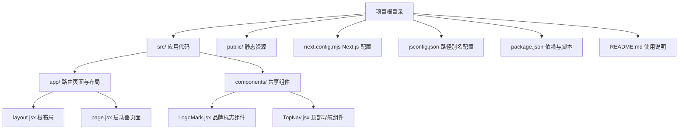
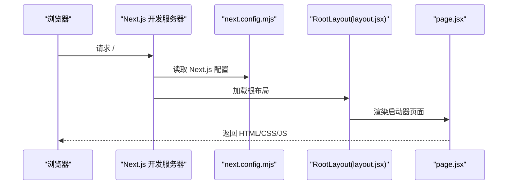
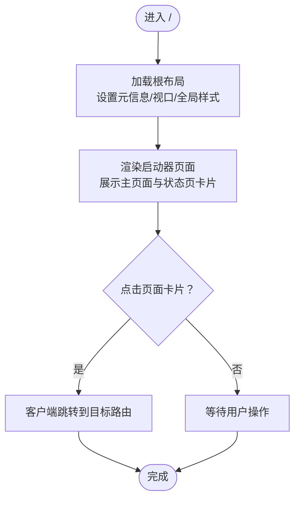
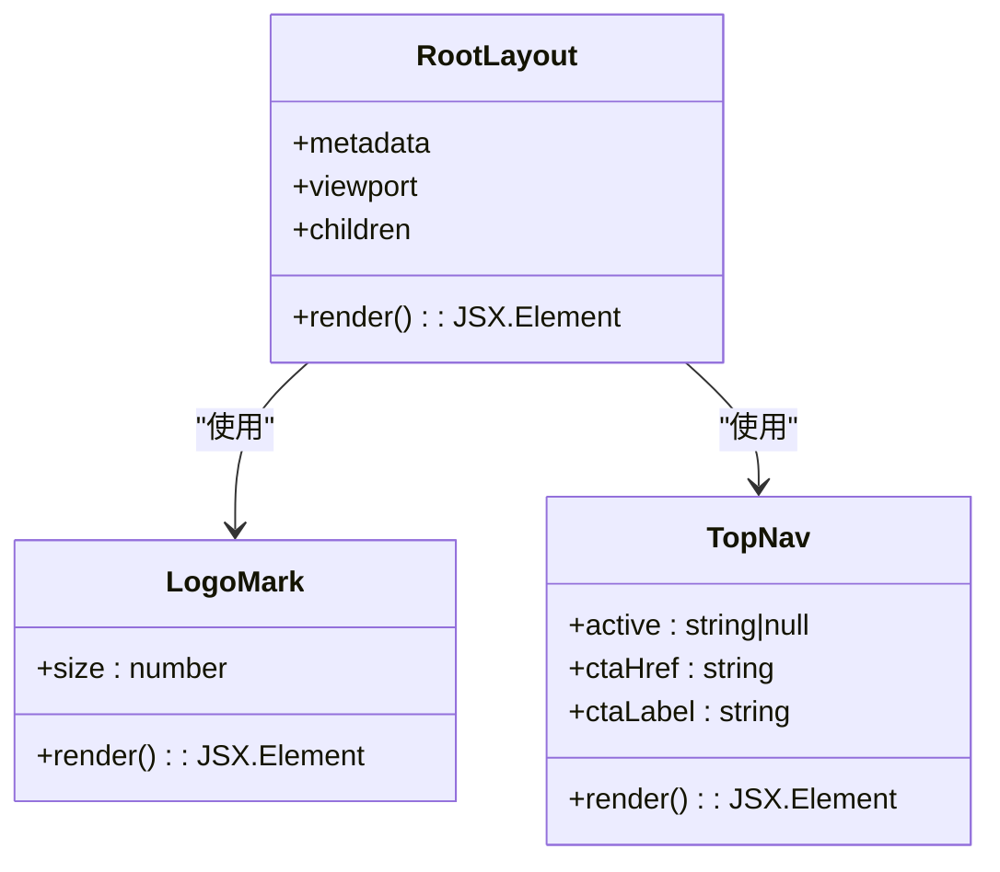
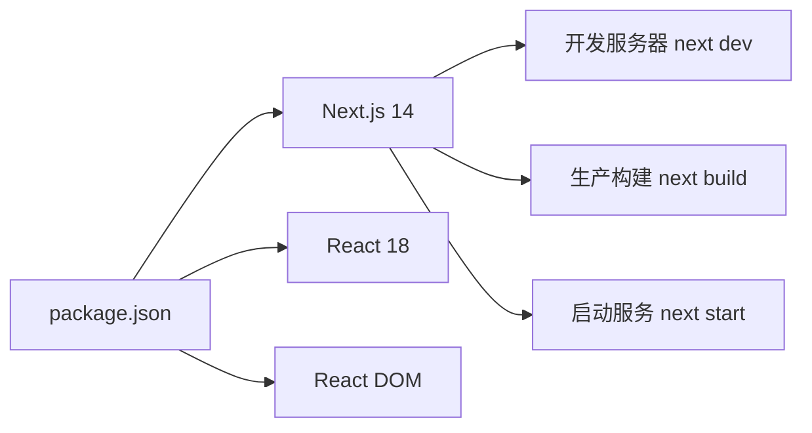

# 开发环境配置

<cite>
**本文引用的文件**
- [package.json](file://package.json)
- [next.config.mjs](file://next.config.mjs)
- [jsconfig.json](file://jsconfig.json)
- [README.md](file://README.md)
- [src/app/layout.jsx](file://src/app/layout.jsx)
- [src/app/page.jsx](file://src/app/page.jsx)
- [src/components/LogoMark.jsx](file://src/components/LogoMark.jsx)
- [src/components/TopNav.jsx](file://src/components/TopNav.jsx)
</cite>

## 目录
1. [简介](#简介)
2. [项目结构](#项目结构)
3. [核心组件](#核心组件)
4. [架构总览](#架构总览)
5. [详细组件分析](#详细组件分析)
6. [依赖关系分析](#依赖关系分析)
7. [性能考虑](#性能考虑)
8. [故障排除指南](#故障排除指南)
9. [结论](#结论)
10. [附录](#附录)

## 简介
本指南面向 InsightMesh 项目的开发者，帮助你在不同操作系统上快速搭建一致的开发环境。内容涵盖 Node.js 版本要求与包管理器选择、项目安装与启动、IDE 推荐配置（VS Code 扩展、ESLint、Prettier）、路径别名与 TypeScript 支持、Next.js 开发服务器配置（热重载与调试）、环境变量与本地数据库连接建议，以及跨平台安装与配置要点。

## 项目结构
InsightMesh 是一个基于 Next.js App Router 的前端原型项目，采用 JavaScript（JSX）与全局样式组织页面与组件。根目录包含应用入口、页面路由、共享组件与配置文件。

图表来源
- [package.json:1-18](file://package.json#L1-L18)
- [next.config.mjs:1-7](file://next.config.mjs#L1-L7)
- [jsconfig.json:1-14](file://jsconfig.json#L1-L14)
- [src/app/layout.jsx:1-21](file://src/app/layout.jsx#L1-L21)
- [src/app/page.jsx:1-78](file://src/app/page.jsx#L1-L78)
- [src/components/LogoMark.jsx:1-19](file://src/components/LogoMark.jsx#L1-L19)
- [src/components/TopNav.jsx:1-45](file://src/components/TopNav.jsx#L1-L45)

章节来源
- [README.md:13-39](file://README.md#L13-L39)
- [package.json:1-18](file://package.json#L1-L18)
- [next.config.mjs:1-7](file://next.config.mjs#L1-L7)
- [jsconfig.json:1-14](file://jsconfig.json#L1-L14)

## 核心组件
- Next.js 14：使用 App Router，页面以路由形式组织，支持静态预渲染。
- React 18：作为 UI 渲染引擎，组件化开发。
- 路径别名：通过 jsconfig.json 将 @ 映射到 src，简化导入路径。
- 全局样式：根布局引入全局样式文件，统一设计语言与排版。
- 共享组件：LogoMark 与 TopNav 提供品牌标识与导航能力。

章节来源
- [package.json:12-16](file://package.json#L12-L16)
- [jsconfig.json:4-6](file://jsconfig.json#L4-L6)
- [src/app/layout.jsx:1-7](file://src/app/layout.jsx#L1-L7)
- [src/components/LogoMark.jsx:1-19](file://src/components/LogoMark.jsx#L1-L19)
- [src/components/TopNav.jsx:7-44](file://src/components/TopNav.jsx#L7-L44)

## 架构总览
下图展示了从浏览器请求到页面渲染的关键路径，以及开发服务器如何加载配置与组件。

图表来源
- [next.config.mjs:1-7](file://next.config.mjs#L1-L7)
- [src/app/layout.jsx:14-20](file://src/app/layout.jsx#L14-L20)
- [src/app/page.jsx:27-77](file://src/app/page.jsx#L27-L77)

## 详细组件分析

### 路由与页面
- 启动器页面：聚合主页面与状态页入口，使用 Link 组件进行客户端导航。
- 根布局：设置文档元信息、视口参数与全局样式注入。

图表来源
- [src/app/layout.jsx:3-12](file://src/app/layout.jsx#L3-L12)
- [src/app/page.jsx:10-25](file://src/app/page.jsx#L10-L25)
- [src/app/page.jsx:44-54](file://src/app/page.jsx#L44-L54)

章节来源
- [src/app/layout.jsx:1-21](file://src/app/layout.jsx#L1-L21)
- [src/app/page.jsx:1-78](file://src/app/page.jsx#L1-L78)

### 共享组件
- LogoMark：品牌星形标志 SVG 组件，支持尺寸定制。
- TopNav：顶部导航栏，支持高亮当前活动项与右侧按钮配置。

图表来源
- [src/components/LogoMark.jsx:2-18](file://src/components/LogoMark.jsx#L2-L18)
- [src/components/TopNav.jsx:7-44](file://src/components/TopNav.jsx#L7-L44)
- [src/app/layout.jsx:14-20](file://src/app/layout.jsx#L14-L20)

章节来源
- [src/components/LogoMark.jsx:1-19](file://src/components/LogoMark.jsx#L1-L19)
- [src/components/TopNav.jsx:1-45](file://src/components/TopNav.jsx#L1-L45)
- [src/app/layout.jsx:1-21](file://src/app/layout.jsx#L1-L21)

## 依赖关系分析
- 包管理：使用 npm（package.json 中定义了 scripts 与依赖）。
- 运行时依赖：Next.js 14、React 18、React DOM。
- 开发依赖：无显式声明，但可通过 npm install 安装与运行。

图表来源
- [package.json:6-16](file://package.json#L6-L16)

章节来源
- [package.json:1-18](file://package.json#L1-L18)

## 性能考虑
- 静态预渲染：构建产物全部为静态路由，有利于首屏性能与 SEO。
- 资源体积：首屏 JS 在指定范围内，有助于减少初始加载时间。
- 样式组织：全局样式集中管理，避免重复与冲突。

章节来源
- [README.md:86-86](file://README.md#L86-L86)

## 故障排除指南
- 开发服务器无法启动
  - 确认 Node.js 版本满足 Next.js 14 要求（建议使用长期支持版本 LTS）。
  - 清理缓存后重新安装依赖：删除 node_modules 与锁定文件后执行安装命令。
  - 检查端口占用，默认端口为 3000，如被占用请调整或释放端口。
- 路由跳转无效
  - 确认页面文件位于正确路径（App Router），并遵循 Next.js 路由约定。
  - 检查 Link 组件的 href 是否与实际路由匹配。
- 样式未生效
  - 确认根布局已引入全局样式文件。
  - 检查 CSS 类名是否正确拼写，以及样式作用域是否覆盖目标元素。
- 路径别名不生效
  - 确认 jsconfig.json 中 baseUrl 与 paths 配置正确，并包含 src/**/* 与 next.config.mjs。
  - 重启编辑器或 IDE 的 TypeScript/JavaScript 服务以刷新配置。

章节来源
- [README.md:52-59](file://README.md#L52-L59)
- [jsconfig.json:3-12](file://jsconfig.json#L3-L12)
- [src/app/layout.jsx:1-7](file://src/app/layout.jsx#L1-L7)

## 结论
通过本指南，你可以在不同操作系统上快速完成 InsightMesh 的开发环境搭建。建议优先使用 Node.js LTS 版本与 npm，严格遵循路径别名与 Next.js 配置，结合 VS Code 扩展与 ESLint/Prettier 规范提升开发体验与代码质量。若需本地数据库，请参考后端服务对接方案并在开发环境中通过环境变量隔离配置。

## 附录

### Node.js 版本要求与包管理器选择
- Node.js：建议使用 LTS 版本（如 18.x 或 20.x），以获得稳定性和兼容性。
- 包管理器：使用 npm（package.json 已内置脚本与依赖）。如需替代包管理器（如 pnpm/yarn），请确保其与 Next.js 14 兼容并保持依赖一致性。

章节来源
- [package.json:12-16](file://package.json#L12-L16)

### 项目安装与启动步骤
- 安装依赖：在项目根目录执行安装命令。
- 启动开发服务器：执行开发脚本，默认监听本地端口。
- 访问应用：在浏览器打开开发服务器地址。

章节来源
- [README.md:52-59](file://README.md#L52-L59)
- [package.json:6-10](file://package.json#L6-L10)

### IDE 推荐配置（VS Code）
- 扩展推荐
  - ESLint：提供语法与风格检查。
  - Prettier：统一代码格式。
  - Tailwind CSS IntelliSense：辅助 CSS 类名补全（如使用 Tailwind）。
  - Path Intellisense：增强路径自动补全（尤其配合路径别名）。
- 设置建议
  - 启用保存时格式化（prettier + editorconfig 协同）。
  - 启用 ESLint 自动修复（On Save）。
  - 关闭不必要的文件关联（如 .mjs 使用正确的语言模式）。

章节来源
- [jsconfig.json:3-12](file://jsconfig.json#L3-L12)

### 路径别名与 TypeScript 支持
- 路径别名：通过 jsconfig.json 将 @ 映射到 src，便于模块导入。
- TypeScript：当前项目为 JavaScript（JSX），如需启用 TS，请添加 tsconfig.json 并迁移部分文件至 TSX。

章节来源
- [jsconfig.json:4-6](file://jsconfig.json#L4-L6)

### Next.js 开发服务器配置
- 开发服务器：next dev 默认监听本地端口，支持热重载。
- 调试模式：可在 IDE 中附加调试器（如 VS Code 的 Node 调试器），或使用 npm scripts 的调试参数。
- 配置文件：next.config.mjs 用于扩展 Next.js 行为（如严格模式等）。

章节来源
- [package.json:7-7](file://package.json#L7-L7)
- [next.config.mjs:2-4](file://next.config.mjs#L2-L4)

### 环境变量与本地开发数据库
- 环境变量：Next.js 通过 @next/env 加载 .env* 文件，支持按环境区分（如 .env.development/.env.production）。
- 本地数据库：如项目需要数据库，请在本地准备数据库实例，并通过环境变量配置连接字符串。开发阶段建议使用独立的 .env.local 与 .env.development 文件隔离配置。

章节来源
- [README.md:52-59](file://README.md#L52-L59)

### 不同操作系统安装与配置要点
- macOS
  - 使用 Homebrew 安装 Node.js（推荐 LTS）。
  - 使用终端执行安装与启动命令。
- Windows
  - 使用 Chocolatey 或直接下载安装 Node.js（推荐 LTS）。
  - PowerShell 或 WSL 中执行安装与启动命令。
- Linux
  - 使用发行版包管理器或 NodeSource 仓库安装 Node.js（推荐 LTS）。
  - 在终端中执行安装与启动命令。

章节来源
- [README.md:52-59](file://README.md#L52-L59)