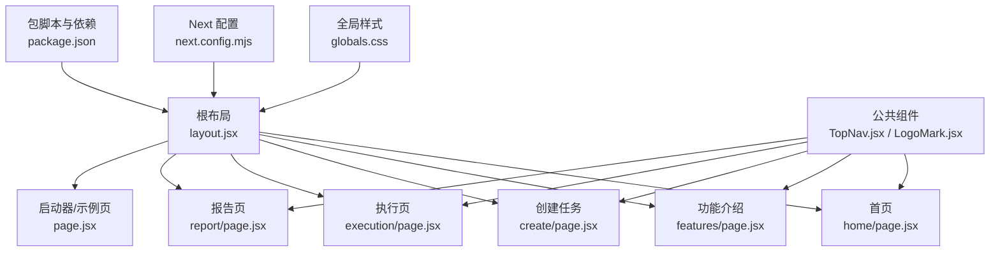
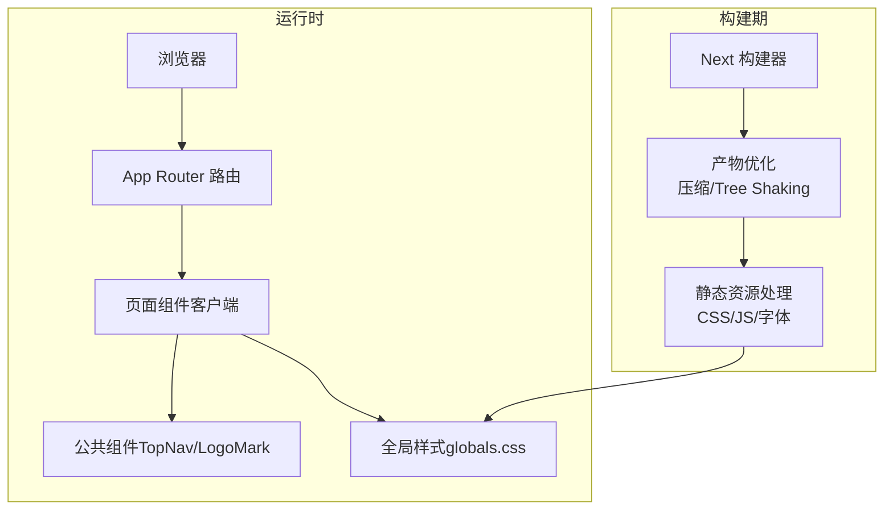
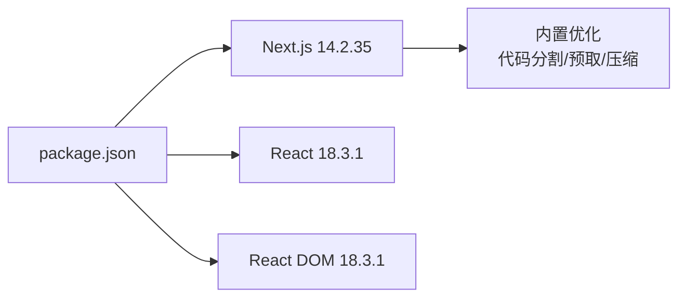

# 性能优化策略

<cite>
**本文引用的文件**   
- [next.config.mjs](file://next.config.mjs)
- [package.json](file://package.json)
- [src/app/layout.jsx](file://src/app/layout.jsx)
- [src/app/page.jsx](file://src/app/page.jsx)
- [src/app/home/page.jsx](file://src/app/home/page.jsx)
- [src/app/features/page.jsx](file://src/app/features/page.jsx)
- [src/app/create/page.jsx](file://src/app/create/page.jsx)
- [src/app/execution/page.jsx](file://src/app/execution/page.jsx)
- [src/app/report/page.jsx](file://src/app/report/page.jsx)
- [src/components/TopNav.jsx](file://src/components/TopNav.jsx)
- [src/components/LogoMark.jsx](file://src/components/LogoMark.jsx)
- [src/app/globals.css](file://src/app/globals.css)
</cite>

## 目录
1. [引言](#引言)
2. [项目结构](#项目结构)
3. [核心组件](#核心组件)
4. [架构总览](#架构总览)
5. [详细组件分析](#详细组件分析)
6. [依赖分析](#依赖分析)
7. [性能考量](#性能考量)
8. [故障排查指南](#故障排查指南)
9. [结论](#结论)
10. [附录](#附录)

## 引言
本文件面向 InsightMesh 项目，系统化提出一套可落地的性能优化策略，覆盖 Next.js 内置优化、React 渲染与记忆化、静态资源与构建优化、运行时监控与移动端优化，以及生产环境的持续优化流程。文档基于仓库现有代码进行分析，避免脱离实际的空谈，确保每一条建议均可在当前工程中实施。

## 项目结构
InsightMesh 采用 Next.js App Router 结构，页面位于 src/app 下，全局样式集中于 src/app/globals.css，公共组件位于 src/components。根布局负责站点元数据与 viewport 设置，各页面按功能模块划分清晰，便于后续按需加载与缓存策略制定。

**图表来源**
- [src/app/layout.jsx:1-21](file://src/app/layout.jsx#L1-L21)
- [src/app/home/page.jsx:1-212](file://src/app/home/page.jsx#L1-L212)
- [src/app/features/page.jsx:1-96](file://src/app/features/page.jsx#L1-L96)
- [src/app/create/page.jsx:1-183](file://src/app/create/page.jsx#L1-L183)
- [src/app/execution/page.jsx:1-169](file://src/app/execution/page.jsx#L1-L169)
- [src/app/report/page.jsx:1-250](file://src/app/report/page.jsx#L1-L250)
- [src/app/page.jsx:1-78](file://src/app/page.jsx#L1-L78)
- [src/components/TopNav.jsx:1-45](file://src/components/TopNav.jsx#L1-L45)
- [src/components/LogoMark.jsx:1-19](file://src/components/LogoMark.jsx#L1-L19)
- [src/app/globals.css:1-800](file://src/app/globals.css#L1-L800)
- [next.config.mjs:1-7](file://next.config.mjs#L1-L7)
- [package.json:1-18](file://package.json#L1-L18)

**章节来源**
- [src/app/layout.jsx:1-21](file://src/app/layout.jsx#L1-L21)
- [src/app/globals.css:1-800](file://src/app/globals.css#L1-L800)
- [next.config.mjs:1-7](file://next.config.mjs#L1-L7)
- [package.json:1-18](file://package.json#L1-L18)

## 核心组件
- 根布局与元数据：定义站点标题、描述、viewport，确保移动端与 SEO 基础性能。
- 页面组件：各页面均采用客户端渲染（"use client"），适合后续引入懒加载与记忆化优化。
- 公共组件：TopNav 作为跨页面导航，LogoMark 为轻量 SVG 图标，利于按需加载与缓存复用。
- 全局样式：集中定义设计令牌、排版、动画与页面级样式，便于 Tree Shaking 与按需提取。

**章节来源**
- [src/app/layout.jsx:1-21](file://src/app/layout.jsx#L1-L21)
- [src/app/home/page.jsx:1-212](file://src/app/home/page.jsx#L1-L212)
- [src/components/TopNav.jsx:1-45](file://src/components/TopNav.jsx#L1-L45)
- [src/components/LogoMark.jsx:1-19](file://src/components/LogoMark.jsx#L1-L19)
- [src/app/globals.css:1-800](file://src/app/globals.css#L1-L800)

## 架构总览
Next.js 在本项目中的角色：
- App Router：页面路由与静态生成/服务端渲染的基础。
- 构建与打包：默认启用压缩与 Tree Shaking，可进一步通过配置增强。
- 运行时：客户端组件按需加载，配合 React Strict Mode 与开发期严格检查。

**图表来源**
- [next.config.mjs:1-7](file://next.config.mjs#L1-L7)
- [package.json:1-18](file://package.json#L1-L18)
- [src/app/layout.jsx:1-21](file://src/app/layout.jsx#L1-L21)
- [src/app/globals.css:1-800](file://src/app/globals.css#L1-L800)

## 详细组件分析

### 根布局与元数据优化
- viewport 设置：确保移动端缩放与布局视口一致，减少重排与重绘。
- metadata：有助于搜索引擎索引与社交分享的首屏渲染表现。
- 全局样式：集中导入，避免重复请求与 FOUC。

**章节来源**
- [src/app/layout.jsx:1-21](file://src/app/layout.jsx#L1-L21)
- [src/app/globals.css:1-800](file://src/app/globals.css#L1-L800)

### 页面组件渲染与交互
- 首页与功能页：包含大量卡片网格与交互元素，适合引入虚拟滚动、分块渲染与事件节流。
- 创建页：多选配置与状态联动，适合 useMemo/useCallback 缓存计算结果与稳定回调。
- 执行页：定时器驱动的进度动画，注意清理副作用与避免无效重渲染。
- 报告页：图表与目录锚点，建议延迟加载图表与目录交互。

**章节来源**
- [src/app/home/page.jsx:1-212](file://src/app/home/page.jsx#L1-L212)
- [src/app/features/page.jsx:1-96](file://src/app/features/page.jsx#L1-L96)
- [src/app/create/page.jsx:1-183](file://src/app/create/page.jsx#L1-L183)
- [src/app/execution/page.jsx:1-169](file://src/app/execution/page.jsx#L1-L169)
- [src/app/report/page.jsx:1-250](file://src/app/report/page.jsx#L1-L250)

### 公共组件优化
- TopNav：跨页面导航，建议将导航链接与图标按需加载，避免不必要的渲染。
- LogoMark：SVG 图标，建议内联或缓存，减少网络往返。

**章节来源**
- [src/components/TopNav.jsx:1-45](file://src/components/TopNav.jsx#L1-L45)
- [src/components/LogoMark.jsx:1-19](file://src/components/LogoMark.jsx#L1-L19)

### 样式与动画
- 动画：fadeIn/pulse/spin/shimmer 等动画类，建议仅在可见区域启用，避免离屏动画浪费。
- 响应式：媒体查询与 clamp 使用合理，建议合并与去重，减少 CSS 体积。

**章节来源**
- [src/app/globals.css:518-544](file://src/app/globals.css#L518-L544)
- [src/app/globals.css:636-783](file://src/app/globals.css#L636-L783)

## 依赖分析
- Next.js 版本：14.2.35，支持现代浏览器与默认优化。
- React 18.3.1：支持并发特性与 Suspense，有利于懒加载与渐进渲染。
- 依赖脚本：dev/build/start/lint，构建与启动流程清晰。

**图表来源**
- [package.json:1-18](file://package.json#L1-L18)

**章节来源**
- [package.json:1-18](file://package.json#L1-L18)

## 性能考量

### Next.js 内置优化配置与使用
- 代码分割与懒加载
  - App Router 默认按页面拆分路由，建议将大型图表库、编辑器、可视化组件按需加载，减少首屏 JS 体积。
  - 对于非关键路径的页面（如“状态页”），可在路由切换时再加载对应模块。
- 预取与预加载
  - 使用 next/link 的预取能力，对高频访问页面（首页、功能页、创建页）进行预取，缩短二次跳转延迟。
- 构建优化
  - 当前配置启用 reactStrictMode，有助于发现潜在性能问题；可结合生产构建开启更多压缩选项。
- 静态生成与 ISR
  - 对于不频繁变动的页面（如“功能介绍”、“协作原理”），可考虑静态生成或增量静态再生，降低服务器压力。

**章节来源**
- [src/app/page.jsx:1-78](file://src/app/page.jsx#L1-L78)
- [src/app/features/page.jsx:1-96](file://src/app/features/page.jsx#L1-L96)
- [src/app/home/page.jsx:1-212](file://src/app/home/page.jsx#L1-L212)
- [next.config.mjs:1-7](file://next.config.mjs#L1-L7)

### React 性能优化技术
- useMemo/useCallback 的正确使用
  - 在创建页中，维度/深度/格式的状态切换频繁，建议对计算“已选格式列表”“预估耗时”的纯函数使用 useMemo，对传给子组件的回调使用 useCallback，避免子组件无谓重渲染。
  - 在执行页中，进度动画使用定时器，应在清理副作用时确保不会触发额外渲染。
- 组件渲染优化
  - 将 TopNav 与 LogoMark 设计为稳定组件，避免在每次渲染中创建新对象或新函数。
  - 对网格类组件（首页卡片、报告目录）采用分块渲染或虚拟滚动，减少一次性渲染节点数量。
- 事件与交互
  - 输入框与键盘事件建议节流/防抖，避免高频重渲染。

**章节来源**
- [src/app/create/page.jsx:1-183](file://src/app/create/page.jsx#L1-L183)
- [src/app/execution/page.jsx:1-169](file://src/app/execution/page.jsx#L1-L169)
- [src/components/TopNav.jsx:1-45](file://src/components/TopNav.jsx#L1-L45)
- [src/components/LogoMark.jsx:1-19](file://src/components/LogoMark.jsx#L1-L19)

### 静态资源优化
- 图片与图标
  - 使用 next/image（若引入）以获得自动尺寸裁剪、格式优化与懒加载；当前项目使用 SVG，建议内联关键图标，减少请求。
- 字体优化
  - 全局字体变量已定义，建议使用 CSS 变量与字体回退，避免 FOIT/FOUT；必要时可引入字体子集化与预加载策略。
- CSS 提取与压缩
  - 全局样式集中于 globals.css，建议在构建时进行 CSS 提取与最小化；对动画与响应式规则进行合并与去重。

**章节来源**
- [src/app/globals.css:62-86](file://src/app/globals.css#L62-L86)
- [src/app/globals.css:518-544](file://src/app/globals.css#L518-L544)

### 构建优化配置
- Bundle 分析
  - 在构建脚本中集成分析工具，定位超大依赖与重复模块，指导拆分与去重。
- Tree Shaking
  - 确保第三方库使用 ES Module 导入，避免打包整包；对按需加载的组件与库明确入口。
- 压缩设置
  - 生产构建默认启用压缩，可结合 gzip 或 Brotli 压缩策略进一步优化传输体积。

**章节来源**
- [package.json:1-18](file://package.json#L1-L18)

### 运行时性能监控与分析
- Lighthouse 检测
  - 在 CI 中集成 Lighthouse，定期检测性能、可访问性与最佳实践，形成基线。
- 性能指标跟踪
  - 使用 Performance API 与 Web Vitals（CLS、FCP、LCP、INP、TBT）监控真实用户表现。
- 错误与崩溃上报
  - 集成前端错误监控，记录堆栈与上下文，定位渲染瓶颈与内存泄漏。

**章节来源**
- [src/app/layout.jsx:1-21](file://src/app/layout.jsx#L1-L21)

### 内存管理与垃圾回收优化
- 避免内存泄漏
  - 清理定时器、订阅与事件监听；在组件卸载时释放大对象。
- 减少闭包捕获
  - 将大型对象与函数移出渲染作用域，或使用 useRef/useMemo 缓存。
- 控制状态规模
  - 将历史日志与大数据结构拆分为可选加载，避免阻塞主线程。

**章节来源**
- [src/app/execution/page.jsx:55-110](file://src/app/execution/page.jsx#L55-L110)

### 移动端性能优化
- 触摸事件优化
  - 使用 passive 事件监听，避免滚动卡顿；对按钮与交互元素设置合适的命中盒。
- 动画性能提升
  - 优先使用 transform/opacity 等合成属性；减少强制同步布局与重绘。
- 视口与渲染
  - 合理设置 viewport，避免不必要的缩放与布局抖动。

**章节来源**
- [src/app/layout.jsx:9-12](file://src/app/layout.jsx#L9-L12)
- [src/app/globals.css:518-544](file://src/app/globals.css#L518-L544)

### 生产环境性能监控与持续优化流程
- 监控体系
  - 前端性能指标（LCP、CLS、INP）、资源瀑布、错误率与用户路径埋点。
- 优化闭环
  - 通过分析报告设定优化目标，实施改进并通过 A/B 测试验证收益，再固化为规范。

**章节来源**
- [src/app/layout.jsx:1-21](file://src/app/layout.jsx#L1-L21)

## 故障排查指南
- 首屏慢
  - 检查是否将重型模块按需加载；确认关键路径 CSS 与 JS 是否过长。
- 交互卡顿
  - 关注高频事件与状态更新，使用 useMemo/useCallback 与节流/防抖。
- 内存占用高
  - 检查定时器与事件监听是否清理；避免在渲染中创建临时对象。
- Lighthouse 不达标
  - 重点优化 CLS（布局变化）、LCP（首屏内容）、INP（交互延迟）与资源体积。

**章节来源**
- [src/app/execution/page.jsx:55-110](file://src/app/execution/page.jsx#L55-L110)
- [src/app/create/page.jsx:1-183](file://src/app/create/page.jsx#L1-L183)

## 结论
InsightMesh 已具备良好的 Next.js 基础与清晰的页面结构。通过在现有基础上强化懒加载、记忆化、静态资源与构建优化，并建立完善的运行时监控与持续优化流程，可显著提升首屏性能、交互流畅度与长期稳定性，满足多页面原型的高性能要求。

## 附录
- 优化清单
  - 页面级按需加载与预取
  - useMemo/useCallback 稳定化
  - CSS 提取与动画按需
  - 构建分析与 Tree Shaking
  - Lighthouse 基线与回归测试
  - 内存与 GC 专项排查
  - 移动端交互与动画优化
  - 生产监控与持续优化