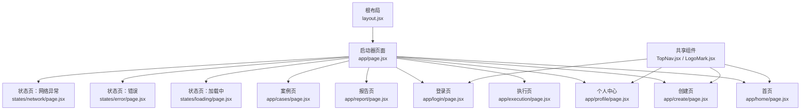
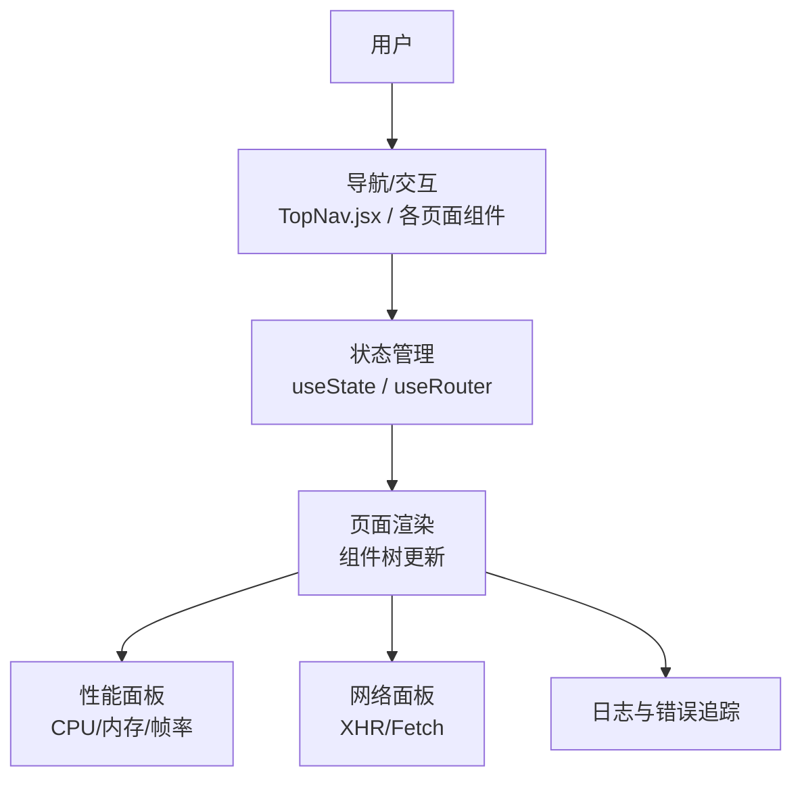
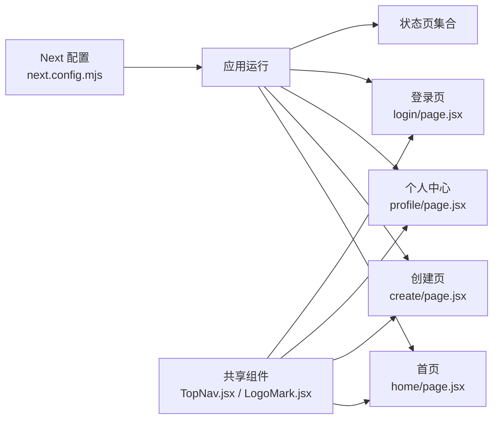

# 调试工具与技巧

<cite>
**本文引用的文件**
- [package.json](file://package.json)
- [next.config.mjs](file://next.config.mjs)
- [README.md](file://README.md)
- [layout.jsx](file://src/app/layout.jsx)
- [page.jsx](file://src/app/page.jsx)
- [home/page.jsx](file://src/app/home/page.jsx)
- [create/page.jsx](file://src/app/create/page.jsx)
- [profile/page.jsx](file://src/app/profile/page.jsx)
- [login/page.jsx](file://src/app/login/page.jsx)
- [states/loading/page.jsx](file://src/app/states/loading/page.jsx)
- [states/error/page.jsx](file://src/app/states/error/page.jsx)
- [states/network/page.jsx](file://src/app/states/network/page.jsx)
- [TopNav.jsx](file://src/components/TopNav.jsx)
- [LogoMark.jsx](file://src/components/LogoMark.jsx)
</cite>

## 目录
1. [简介](#简介)
2. [项目结构](#项目结构)
3. [核心组件](#核心组件)
4. [架构总览](#架构总览)
5. [详细组件分析](#详细组件分析)
6. [依赖关系分析](#依赖关系分析)
7. [性能考量](#性能考量)
8. [故障排查指南](#故障排查指南)
9. [结论](#结论)
10. [附录](#附录)

## 简介
本指南面向 InsightMesh 团队成员，聚焦于浏览器开发者工具与 Next.js 开发模式下的调试实践，涵盖 React DevTools、Network 面板、Performance 分析、严格模式与错误边界、组件树与 Props/State 调试、常见问题诊断、日志与错误追踪、网络请求验证、移动端与跨浏览器测试，以及团队统一的调试流程与问题排查方法。内容结合项目实际文件与路由结构，帮助快速定位与解决渲染、状态同步与性能瓶颈等问题。

## 项目结构
InsightMesh 采用 Next.js App Router，页面集中在 src/app 下，根布局负责全局样式与元数据，各页面组件集中体现交互逻辑与状态管理。组件层包含共享导航与品牌标识等通用元素。

**图表来源**
- [layout.jsx:14-20](file://src/app/layout.jsx#L14-L20)
- [page.jsx:27-77](file://src/app/page.jsx#L27-L77)
- [home/page.jsx:54-190](file://src/app/home/page.jsx#L54-L190)
- [create/page.jsx:45-182](file://src/app/create/page.jsx#L45-L182)
- [profile/page.jsx:42-282](file://src/app/profile/page.jsx#L42-L282)
- [login/page.jsx:18-184](file://src/app/login/page.jsx#L18-L184)
- [states/loading/page.jsx:1-11](file://src/app/states/loading/page.jsx#L1-L11)
- [states/error/page.jsx:3-20](file://src/app/states/error/page.jsx#L3-L20)
- [states/network/page.jsx:8-32](file://src/app/states/network/page.jsx#L8-L32)
- [TopNav.jsx:7-44](file://src/components/TopNav.jsx#L7-L44)
- [LogoMark.jsx:2-18](file://src/components/LogoMark.jsx#L2-L18)

**章节来源**
- [README.md:13-39](file://README.md#L13-L39)
- [layout.jsx:14-20](file://src/app/layout.jsx#L14-L20)
- [page.jsx:27-77](file://src/app/page.jsx#L27-L77)

## 核心组件
- 根布局与元数据：负责全局样式引入与页面元信息，是所有页面的容器。
- 启动器页面：聚合主页面与状态页入口，便于快速导航与调试。
- 业务页面：首页、创建页、个人中心、登录页等均采用“use client”启用客户端状态与导航。
- 状态页：加载中、错误、网络异常等，用于模拟与验证异常路径。
- 共享组件：TopNav 提供导航与高亮，LogoMark 提供品牌标识。

**章节来源**
- [layout.jsx:14-20](file://src/app/layout.jsx#L14-L20)
- [page.jsx:27-77](file://src/app/page.jsx#L27-L77)
- [home/page.jsx:30-52](file://src/app/home/page.jsx#L30-L52)
- [create/page.jsx:45-182](file://src/app/create/page.jsx#L45-L182)
- [profile/page.jsx:42-282](file://src/app/profile/page.jsx#L42-L282)
- [login/page.jsx:18-184](file://src/app/login/page.jsx#L18-L184)
- [states/loading/page.jsx:1-11](file://src/app/states/loading/page.jsx#L1-L11)
- [states/error/page.jsx:3-20](file://src/app/states/error/page.jsx#L3-L20)
- [states/network/page.jsx:8-32](file://src/app/states/network/page.jsx#L8-L32)
- [TopNav.jsx:7-44](file://src/components/TopNav.jsx#L7-L44)
- [LogoMark.jsx:2-18](file://src/components/LogoMark.jsx#L2-L18)

## 架构总览
下图展示浏览器端调试视角下的关键交互链路：用户操作触发组件状态变更，Next.js 客户端导航驱动页面切换，网络面板观察 API 请求，性能面板评估渲染与交互成本。

[此图为概念性示意，不直接映射具体源文件，故无图表来源]

## 详细组件分析

### 首页（home/page.jsx）调试要点
- 关键交互：主题输入区支持回车跳转，模板芯片点击写入主题值。
- 调试关注点：
  - 输入框受控/非受控状态一致性
  - 键盘事件监听与回车判定
  - 主题值写入隐藏字段后的可见性与可读性
- 推荐调试步骤：
  - 在 React DevTools 中选中 HeroInputZone，观察 props 与 state 变化
  - 在 Console 中临时注入事件回调，打印当前主题值
  - 使用 Performance 面板录制键盘输入到跳转过程，观察是否有不必要的重渲染

**章节来源**
- [home/page.jsx:30-52](file://src/app/home/page.jsx#L30-L52)
- [home/page.jsx:54-190](file://src/app/home/page.jsx#L54-L190)

### 创建页（create/page.jsx）调试要点
- 关键交互：维度多选、深度三选一、格式多选、预计耗时与输出格式动态展示。
- 调试关注点：
  - 多选状态对象的初始化与切换
  - 深度选择影响 ETA 文案
  - 已选格式集合的计算与展示
- 推荐调试步骤：
  - 在 React DevTools 中展开 CreatePage，检查 dims/depth/fmts 的初始值与变化
  - 在 Elements 面板观察“已选格式”文本节点，确认与状态同步
  - 使用 Performance 面板录制点击切换动作，避免深层子组件重复渲染

**章节来源**
- [create/page.jsx:45-182](file://src/app/create/page.jsx#L45-L182)

### 个人中心（profile/page.jsx）调试要点
- 关键交互：侧边栏切换、搜索过滤、筛选标签、报告列表渲染。
- 调试关注点：
  - section/filter/query 三状态联动
  - 可见报告集合的过滤逻辑
  - “执行中”状态的视觉与交互差异
- 推荐调试步骤：
  - 在 React DevTools 中观察 visibleReports 的计算与依赖
  - 在 Console 中断言过滤条件，确保大小写不敏感与包含匹配
  - 使用 Performance 面板录制搜索输入，避免每次输入都触发昂贵计算

**章节来源**
- [profile/page.jsx:42-282](file://src/app/profile/page.jsx#L42-L282)

### 登录页（login/page.jsx）调试要点
- 关键交互：登录/注册 Tab 切换、密码显隐、第三方登录、表单提交。
- 调试关注点：
  - Tab 状态切换与焦点管理
  - 密码输入框类型切换
  - 表单提交后的导航
- 推荐调试步骤：
  - 在 React DevTools 中切换 tab，观察状态变化与 DOM 焦点
  - 在 Elements 面板检查密码输入框的 type 属性变化
  - 使用 Network 面板观察提交后是否存在无效请求或重复请求

**章节来源**
- [login/page.jsx:18-184](file://src/app/login/page.jsx#L18-L184)

### 状态页（loading/error/network）调试要点
- 加载中：验证加载指示与文案提示是否与预期一致。
- 错误：验证错误码、未响应数据源数量、重试/微调主题链接。
- 网络异常：验证重连按钮与返回首页链接的行为。
- 推荐调试步骤：
  - 在 Network 面板拦截或模拟失败请求，验证错误页渲染
  - 在 Application 面板检查缓存与本地存储是否影响状态页切换
  - 使用 Performance 面板评估状态页切换的渲染成本

**章节来源**
- [states/loading/page.jsx:1-11](file://src/app/states/loading/page.jsx#L1-L11)
- [states/error/page.jsx:3-20](file://src/app/states/error/page.jsx#L3-L20)
- [states/network/page.jsx:8-32](file://src/app/states/network/page.jsx#L8-L32)

### 共享组件（TopNav.jsx、LogoMark.jsx）调试要点
- TopNav：active 参数控制导航高亮，ctaHref/ctaLabel 控制右侧按钮。
- LogoMark：SVG 图标尺寸与可访问性属性。
- 推荐调试步骤：
  - 在 React DevTools 中传入不同 active 值，观察高亮样式
  - 在 Elements 面板检查 SVG 的 stroke/width 是否符合设计规范
  - 使用 Accessibility 面板验证可访问性属性（aria-*）

**章节来源**
- [TopNav.jsx:7-44](file://src/components/TopNav.jsx#L7-L44)
- [LogoMark.jsx:2-18](file://src/components/LogoMark.jsx#L2-L18)

## 依赖关系分析
- Next.js 配置启用严格模式，有助于提前暴露副作用与不安全的渲染行为。
- 各页面组件通过“use client”启用客户端状态与导航，减少服务端渲染负担。
- 共享组件在多个页面复用，降低耦合度，提升调试一致性。

**图表来源**
- [next.config.mjs:3](file://next.config.mjs#L3)
- [home/page.jsx:1](file://src/app/home/page.jsx#L1)
- [create/page.jsx:1](file://src/app/create/page.jsx#L1)
- [profile/page.jsx:1](file://src/app/profile/page.jsx#L1)
- [login/page.jsx:1](file://src/app/login/page.jsx#L1)
- [TopNav.jsx:7-44](file://src/components/TopNav.jsx#L7-L44)
- [LogoMark.jsx:2-18](file://src/components/LogoMark.jsx#L2-L18)

**章节来源**
- [next.config.mjs:3](file://next.config.mjs#L3)
- [package.json:6-10](file://package.json#L6-L10)

## 性能考量
- 渲染优化
  - 使用 React DevTools Profiler 捕获长列表与复杂组件的渲染热点，必要时拆分组件或使用 memo 化。
  - 对高频输入（如搜索框）使用防抖，减少不必要的状态更新与重渲染。
- 网络优化
  - 使用 Network 面板识别重复请求、慢请求与失败请求，合并请求或增加缓存策略。
- 内存与垃圾回收
  - 使用 Performance 面板监控内存峰值与 GC 活动，避免闭包泄漏与未清理的定时器/订阅。
- 移动端与跨浏览器
  - 在 DevTools 中启用设备仿真与跨浏览器测试，关注主线程阻塞与布局抖动。

[本节为通用指导，不直接分析具体文件，故无章节来源]

## 故障排查指南

### 浏览器开发者工具使用
- React DevTools
  - 安装官方扩展，查看组件树、Props 与 State，定位状态来源与更新路径。
  - 使用 Profiler 分析渲染耗时，识别不必要的重渲染。
- Network 面板
  - 观察请求发起者、URL、状态码、响应体与耗时，识别慢请求与失败请求。
  - 使用“Disable cache”与“Throttling”模拟真实网络环境。
- Performance 面板
  - 录制用户操作（如输入、切换 Tab），分析 CPU 占用、内存增长与帧率波动。
  - 使用“Coverage”检查未使用的 CSS/JS，减少包体积。

**章节来源**
- [README.md:52-57](file://README.md#L52-L57)

### Next.js 开发模式调试特性
- 严格模式（reactStrictMode）
  - 作用：在开发阶段对组件进行额外的检查与双重渲染，帮助发现副作用与不安全的渲染行为。
  - 注意：某些副作用可能在严格模式下被触发两次，需确保幂等性与资源释放。
- 错误边界
  - 项目未内置错误边界组件，可在根布局或页面级包裹错误边界，捕获子树异常并降级显示。
  - 建议：为关键页面（如执行页、报告页）添加错误边界，保障用户体验。

**章节来源**
- [next.config.mjs:3](file://next.config.mjs#L3)
- [layout.jsx:14-20](file://src/app/layout.jsx#L14-L20)

### 组件调试技巧
- 组件树检查
  - 在 React DevTools 中展开组件树，确认父子关系与状态传递路径。
- Props 与 State 调试
  - 在组件内部临时打印 props/state，或使用 React DevTools 的“右键检查变量”能力。
  - 对复杂状态使用浅拷贝与不可变更新，避免意外共享引用。
- 事件与导航
  - 使用“Event Listener Breakpoints”捕获事件触发点，结合断点与日志定位问题。

**章节来源**
- [home/page.jsx:30-52](file://src/app/home/page.jsx#L30-L52)
- [create/page.jsx:45-182](file://src/app/create/page.jsx#L45-L182)
- [profile/page.jsx:42-282](file://src/app/profile/page.jsx#L42-L282)
- [login/page.jsx:18-184](file://src/app/login/page.jsx#L18-L184)

### 常见问题诊断
- 组件渲染问题
  - 症状：UI 不更新、闪烁、布局错乱。
  - 方法：检查状态更新是否在正确的组件中发生，确认受控/非受控输入的一致性；使用 Profiler 定位重渲染热点。
- 状态同步问题
  - 症状：搜索/筛选结果与输入不一致。
  - 方法：在 Console 断言过滤逻辑，确保大小写不敏感与包含匹配；检查依赖状态的顺序。
- 性能瓶颈识别
  - 症状：输入延迟、切换卡顿、内存持续上涨。
  - 方法：录制操作，分析主线程占用与 GC；对长列表与复杂计算进行拆分与缓存。

**章节来源**
- [profile/page.jsx:54-58](file://src/app/profile/page.jsx#L54-L58)
- [home/page.jsx:30-52](file://src/app/home/page.jsx#L30-L52)

### 日志记录与错误追踪最佳实践
- console.log 使用规范
  - 使用语义化前缀区分模块与级别（如 "[Home]"、"[Create]"），便于快速定位。
  - 避免在生产环境输出敏感信息；仅在开发环境输出详细上下文。
- 错误上报机制
  - 建议集成轻量错误上报 SDK，在开发阶段输出到控制台，生产阶段发送至日志服务。
  - 对关键路径（如导航、提交、网络请求）增加 try/catch 与错误埋点。

**章节来源**
- [login/page.jsx:36-39](file://src/app/login/page.jsx#L36-L39)

### 网络请求调试与 API 调用验证
- 步骤
  - 在 Network 面板中过滤 XHR/Fetch，观察请求参数、响应体与状态码。
  - 使用“Copy as fetch”复制请求，便于在 Console 中复现与调试。
  - 结合 Performance 面板，识别长时间阻塞的请求。
- 常见问题
  - CORS 与鉴权失败：检查请求头与凭据设置。
  - 重复请求：检查事件绑定与状态更新逻辑，避免重复触发。

**章节来源**
- [README.md:52-57](file://README.md#L52-L57)

### 移动端调试与跨浏览器兼容性测试
- 移动端调试
  - 使用 DevTools 的设备仿真，测试触摸交互与布局适配。
  - 关注字体缩放、点击区域与滚动性能。
- 跨浏览器测试
  - 在 Chrome、Firefox、Safari 中验证核心交互与样式一致性。
  - 使用 Can I Use 检查 API 兼容性，必要时引入 polyfill。

**章节来源**
- [README.md:52-57](file://README.md#L52-L57)

### 团队统一调试流程与问题排查方法
- 流程建议
  - 发现问题 → 复现步骤 → 使用 Network/Performance 定位 → React DevTools 检查状态 → Console 打印与断点 → 修复与回归测试 → 文档更新。
- 规范建议
  - 统一命名与注释风格，为关键交互添加可访问性标签。
  - 对复杂页面（如个人中心）建立“状态快照”，便于对比修复前后差异。

**章节来源**
- [README.md:52-57](file://README.md#L52-L57)

## 结论
通过系统化运用浏览器开发者工具与 Next.js 开发特性，结合组件级调试与性能分析，能够高效定位并解决 InsightMesh 项目中的渲染、状态与性能问题。建议团队在日常开发中遵循统一的调试流程与规范，持续优化用户体验与代码质量。

## 附录
- 快速参考
  - 开发命令：参见 [package.json:6-10](file://package.json#L6-L10)
  - 严格模式：参见 [next.config.mjs](file://next.config.mjs#L3)
  - 页面路由概览：参见 [README.md:61-77](file://README.md#L61-L77)