# 快速开始

<cite>
**本文引用的文件**   
- [package.json](file://package.json)
- [README.md](file://README.md)
- [next.config.mjs](file://next.config.mjs)
- [jsconfig.json](file://jsconfig.json)
- [src/app/layout.jsx](file://src/app/layout.jsx)
- [src/app/page.jsx](file://src/app/page.jsx)
- [src/app/home/page.jsx](file://src/app/home/page.jsx)
- [src/app/create/page.jsx](file://src/app/create/page.jsx)
- [src/app/execution/page.jsx](file://src/app/execution/page.jsx)
- [src/app/report/page.jsx](file://src/app/report/page.jsx)
- [src/app/profile/page.jsx](file://src/app/profile/page.jsx)
- [src/app/login/page.jsx](file://src/app/login/page.jsx)
- [src/app/cases/page.jsx](file://src/app/cases/page.jsx)
- [src/components/TopNav.jsx](file://src/components/TopNav.jsx)
- [src/components/LogoMark.jsx](file://src/components/LogoMark.jsx)
</cite>

## 目录
1. [简介](#简介)
2. [项目结构](#项目结构)
3. [核心组件](#核心组件)
4. [架构总览](#架构总览)
5. [详细组件分析](#详细组件分析)
6. [依赖分析](#依赖分析)
7. [性能考虑](#性能考虑)
8. [故障排除指南](#故障排除指南)
9. [结论](#结论)
10. [附录](#附录)

## 简介
本指南面向前端开发新手，帮助你在本地快速搭建 InsightMesh 项目并运行起来。你将学会：
- 环境要求与推荐开发工具
- 项目克隆、依赖安装与本地开发环境搭建
- 常用 npm 脚本命令与开发服务器访问方式
- 首次运行后的页面功能定位与导航
- 常见问题的排查思路与解决方法

## 项目结构
InsightMesh 是一个基于 Next.js App Router 的 React 原型项目，采用“按页面组织”的结构，根布局负责全局样式与元信息，各页面位于 src/app 下，共享组件位于 src/components。

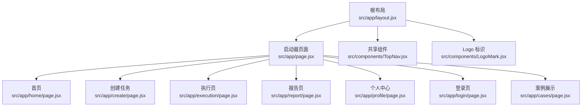

**图表来源**
- [src/app/layout.jsx:1-21](file://src/app/layout.jsx#L1-L21)
- [src/app/page.jsx:1-78](file://src/app/page.jsx#L1-L78)
- [src/app/home/page.jsx:1-212](file://src/app/home/page.jsx#L1-L212)
- [src/app/create/page.jsx:1-183](file://src/app/create/page.jsx#L1-L183)
- [src/app/execution/page.jsx:1-169](file://src/app/execution/page.jsx#L1-L169)
- [src/app/report/page.jsx:1-250](file://src/app/report/page.jsx#L1-L250)
- [src/app/profile/page.jsx:1-284](file://src/app/profile/page.jsx#L1-L284)
- [src/app/login/page.jsx:1-185](file://src/app/login/page.jsx#L1-L185)
- [src/app/cases/page.jsx:1-161](file://src/app/cases/page.jsx#L1-L161)
- [src/components/TopNav.jsx:1-45](file://src/components/TopNav.jsx#L1-L45)
- [src/components/LogoMark.jsx:1-19](file://src/components/LogoMark.jsx#L1-L19)

**章节来源**
- [README.md:13-39](file://README.md#L13-L39)

## 核心组件
- 根布局：定义全局样式、站点元信息与根 html 结构
- 启动器页面：聚合 6 个主页面与 5 个状态页的入口卡片
- 页面组件：home、create、execution、report、profile、login、cases
- 共享组件：TopNav（顶部导航）、LogoMark（品牌标识）

这些组件共同构成原型的导航与页面流转骨架。

**章节来源**
- [src/app/layout.jsx:1-21](file://src/app/layout.jsx#L1-L21)
- [src/app/page.jsx:1-78](file://src/app/page.jsx#L1-L78)
- [src/components/TopNav.jsx:1-45](file://src/components/TopNav.jsx#L1-L45)
- [src/components/LogoMark.jsx:1-19](file://src/components/LogoMark.jsx#L1-L19)

## 架构总览
Next.js App Router 以页面为中心进行组织，每个页面是一个 React 组件，通过客户端导航实现无刷新跳转。根布局负责注入全局样式与元信息，页面间通过 Link 组件进行跳转。

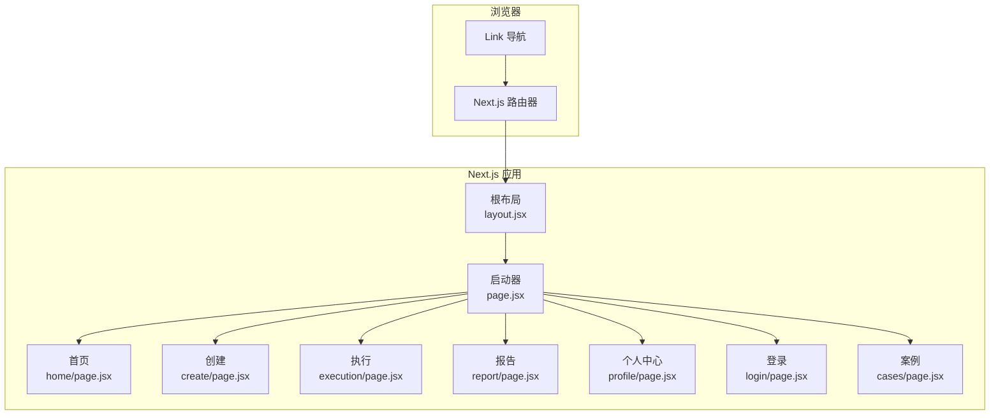

**图表来源**
- [src/app/layout.jsx:1-21](file://src/app/layout.jsx#L1-L21)
- [src/app/page.jsx:1-78](file://src/app/page.jsx#L1-L78)
- [src/app/home/page.jsx:1-212](file://src/app/home/page.jsx#L1-L212)
- [src/app/create/page.jsx:1-183](file://src/app/create/page.jsx#L1-L183)
- [src/app/execution/page.jsx:1-169](file://src/app/execution/page.jsx#L1-L169)
- [src/app/report/page.jsx:1-250](file://src/app/report/page.jsx#L1-L250)
- [src/app/profile/page.jsx:1-284](file://src/app/profile/page.jsx#L1-L284)
- [src/app/login/page.jsx:1-185](file://src/app/login/page.jsx#L1-L185)
- [src/app/cases/page.jsx:1-161](file://src/app/cases/page.jsx#L1-L161)

## 详细组件分析

### 启动器页面与页面卡片
启动器页面聚合主页面与状态页入口，使用 Link 组件实现页面跳转，卡片包含编号、标签、标题与描述，便于快速预览与导航。

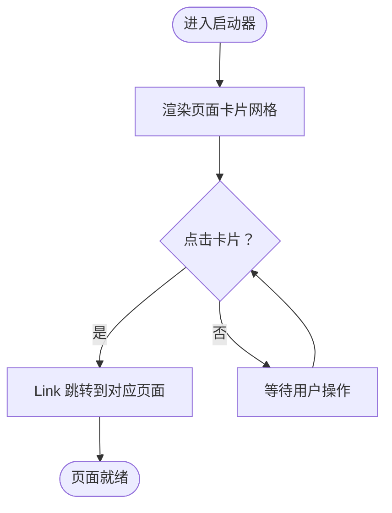

**图表来源**
- [src/app/page.jsx:10-77](file://src/app/page.jsx#L10-L77)

**章节来源**
- [src/app/page.jsx:1-78](file://src/app/page.jsx#L1-L78)

### 首页（Home）
首页包含主题输入区、模板芯片、信任徽标、功能导航卡、适用场景与统计数据、CTA 等模块，输入框支持回车跳转到创建页。

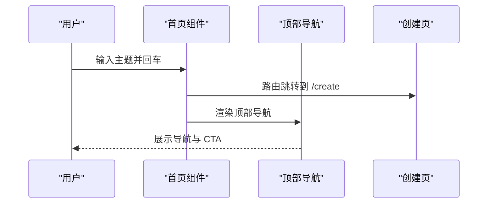

**图表来源**
- [src/app/home/page.jsx:30-52](file://src/app/home/page.jsx#L30-L52)
- [src/components/TopNav.jsx:1-45](file://src/components/TopNav.jsx#L1-L45)

**章节来源**
- [src/app/home/page.jsx:1-212](file://src/app/home/page.jsx#L1-L212)

### 创建任务（Create）
创建页支持主题确认、维度多选、深度档位选择、输出格式多选，并根据选择动态计算预计耗时与输出格式。

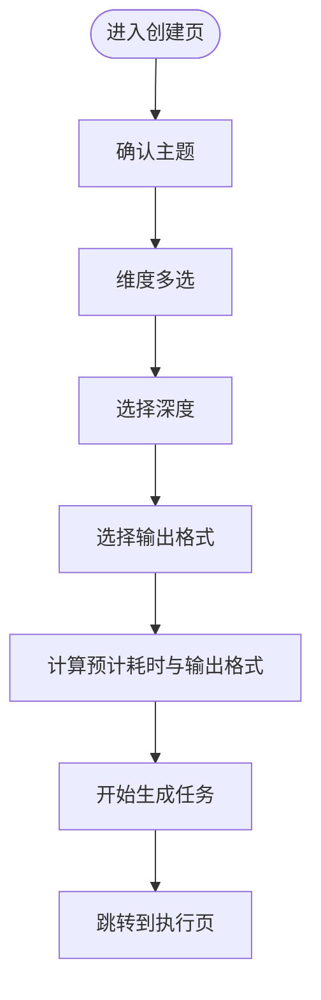

**图表来源**
- [src/app/create/page.jsx:45-182](file://src/app/create/page.jsx#L45-L182)

**章节来源**
- [src/app/create/page.jsx:1-183](file://src/app/create/page.jsx#L1-L183)

### 执行页（Execution）
执行页模拟多 Agent 实时执行，包含整体进度条、Agent 工作看板与实时日志流。

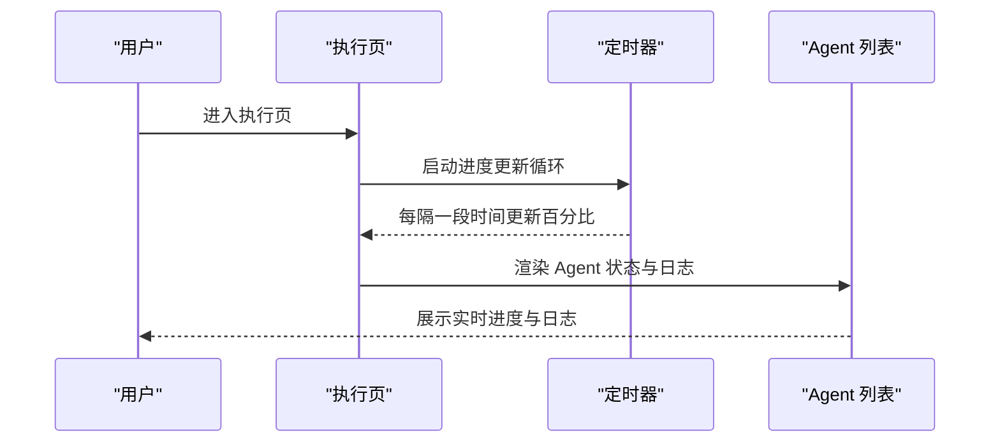

**图表来源**
- [src/app/execution/page.jsx:55-63](file://src/app/execution/page.jsx#L55-L63)

**章节来源**
- [src/app/execution/page.jsx:1-169](file://src/app/execution/page.jsx#L1-L169)

### 报告页（Report）
报告页展示完整的调研报告，包含目录、图表、观点对比、趋势预判、问题与建议以及参考资料。

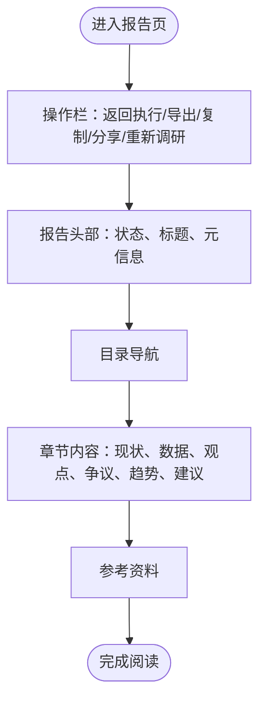

**图表来源**
- [src/app/report/page.jsx:37-250](file://src/app/report/page.jsx#L37-L250)

**章节来源**
- [src/app/report/page.jsx:1-250](file://src/app/report/page.jsx#L1-L250)

### 个人中心（Profile）
个人中心包含侧边栏导航、报告列表、搜索与筛选、使用统计与账户设置等模块。

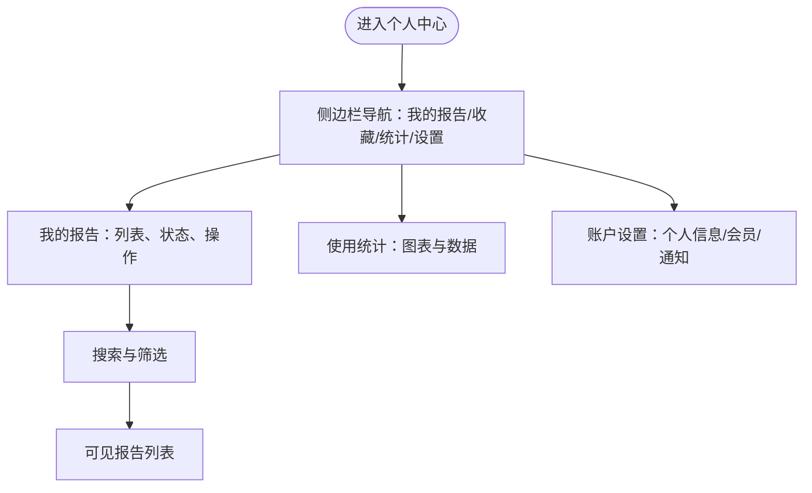

**图表来源**
- [src/app/profile/page.jsx:42-283](file://src/app/profile/page.jsx#L42-L283)

**章节来源**
- [src/app/profile/page.jsx:1-284](file://src/app/profile/page.jsx#L1-L284)

### 登录页（Login）
登录页支持登录/注册 Tab 切换、密码显隐、第三方登录、表单校验与提交后跳转。

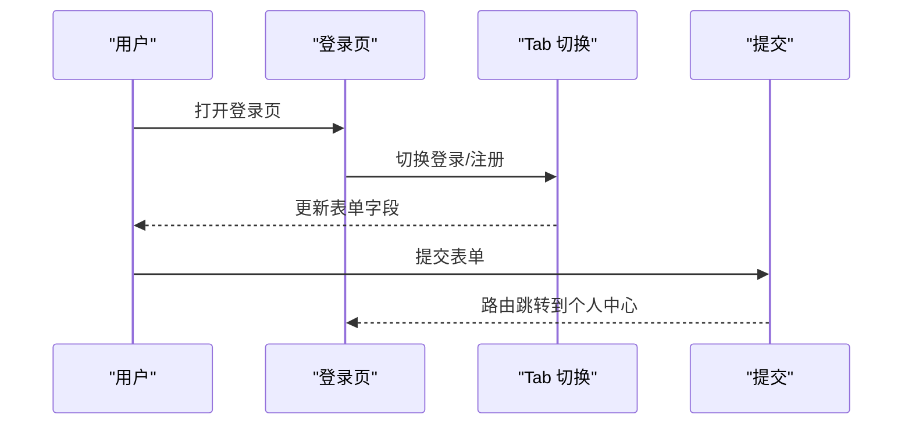

**图表来源**
- [src/app/login/page.jsx:18-39](file://src/app/login/page.jsx#L18-L39)

**章节来源**
- [src/app/login/page.jsx:1-185](file://src/app/login/page.jsx#L1-L185)

### 案例展示（Cases）
案例展示页提供分类筛选与卡片列表，点击卡片可跳转到报告页。

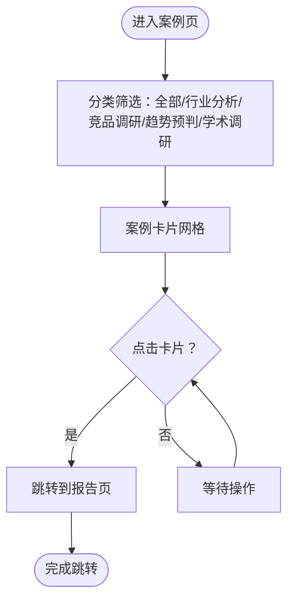

**图表来源**
- [src/app/cases/page.jsx:79-160](file://src/app/cases/page.jsx#L79-L160)

**章节来源**
- [src/app/cases/page.jsx:1-161](file://src/app/cases/page.jsx#L1-L161)

## 依赖分析
- 运行时依赖：Next.js、React 与 React DOM
- 构建与开发：Next.js 提供开发服务器、构建与启动命令
- 严格模式：启用 React 严格模式以帮助发现潜在问题

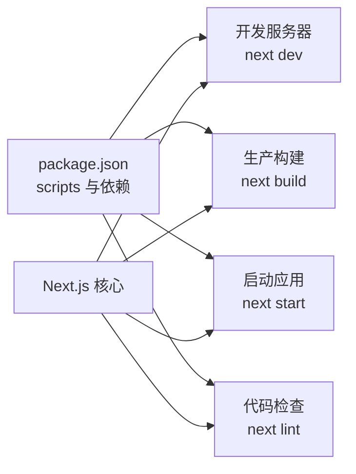

**图表来源**
- [package.json:1-18](file://package.json#L1-L18)
- [next.config.mjs:1-7](file://next.config.mjs#L1-L7)

**章节来源**
- [package.json:1-18](file://package.json#L1-L18)
- [next.config.mjs:1-7](file://next.config.mjs#L1-L7)

## 性能考虑
- 静态预渲染：构建产物中所有 14 个路由均为静态预渲染，有利于首屏性能与 SEO
- 资源体积：首屏 JS 体积在合理范围内，有助于缩短 TTFB 与 FCP
- 优化建议：避免在页面中引入过大的静态资源；按需加载非关键资源；利用浏览器缓存策略

**章节来源**
- [README.md:86-86](file://README.md#L86-L86)

## 故障排除指南
- 端口占用
  - 现象：开发服务器无法启动，提示端口被占用
  - 处理：更换端口或释放占用端口
- 依赖安装失败
  - 现象：npm install 报错
  - 处理：清理缓存后重试；检查网络与代理；确保 Node.js 版本满足要求
- Node.js 版本要求
  - 要求：请使用稳定版 Node.js LTS（建议 18 或以上）
  - 检查：在终端执行 node -v 与 npm -v
- 路由跳转无效
  - 现象：点击链接无响应
  - 处理：确认页面文件名与路径正确；检查 Link 组件的 href 是否拼写正确
- 样式未生效
  - 现象：页面样式异常
  - 处理：确认根布局已导入全局样式；检查 CSS 文件路径与命名

**章节来源**
- [README.md:59-59](file://README.md#L59-L59)

## 结论
通过本指南，你已经完成了 InsightMesh 项目的环境准备、依赖安装与本地运行，并了解了各页面的功能定位与基本交互。建议在开发过程中充分利用 Next.js 的路由与组件化能力，逐步扩展页面与功能。

## 附录

### 环境要求与推荐工具
- Node.js：建议使用 LTS 版本（18 或更高）
- 包管理器：npm（随 Node.js 附带）
- 文本编辑器：VS Code（推荐安装 Prettier、ESLint 插件）
- 浏览器：Chrome（便于调试）

**章节来源**
- [README.md:52-59](file://README.md#L52-L59)

### 逐步操作步骤
- 克隆仓库到本地
- 在项目根目录执行依赖安装
- 启动开发服务器
- 在浏览器中访问默认地址

**章节来源**
- [README.md:54-57](file://README.md#L54-L57)

### 常用 npm 脚本命令
- 开发服务器：npm run dev
- 生产构建：npm run build
- 启动生产应用：npm run start
- 代码检查：npm run lint

**章节来源**
- [package.json:6-11](file://package.json#L6-L11)

### 开发服务器访问方式与默认端口
- 默认地址：http://localhost:3000
- 如需更改端口，可在开发命令中指定（例如：PORT=3001 npm run dev）

**章节来源**
- [README.md:59-59](file://README.md#L59-L59)

### 首次访问页面功能定位
- 启动器：6 个主页面 + 5 个状态页入口
- 首页：主题输入、模板芯片、功能与场景介绍
- 创建：维度、深度、格式配置与预计耗时
- 执行：多 Agent 实时执行与日志
- 报告：完整报告与参考资料
- 个人中心：报告列表、搜索筛选、统计与设置
- 登录：登录/注册、第三方登录
- 案例：案例分类筛选与卡片展示

**章节来源**
- [README.md:61-78](file://README.md#L61-L78)