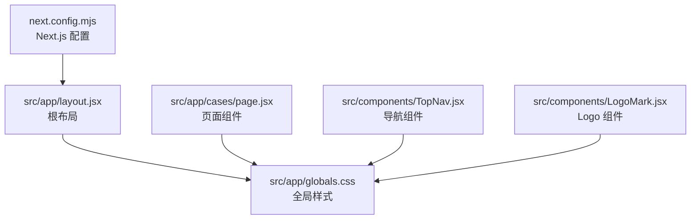
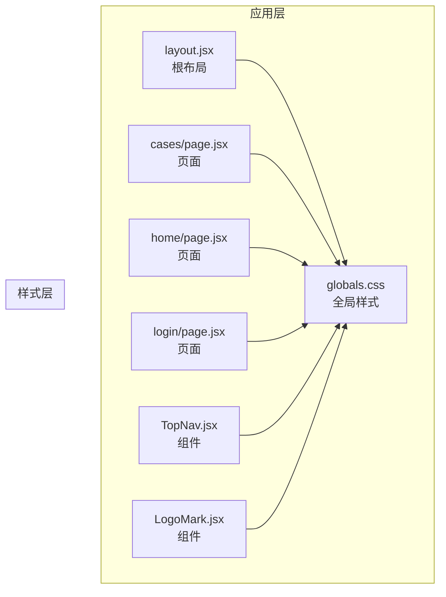
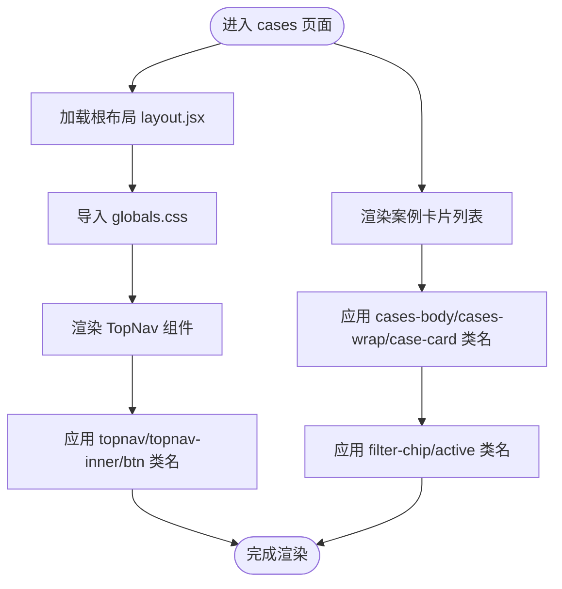
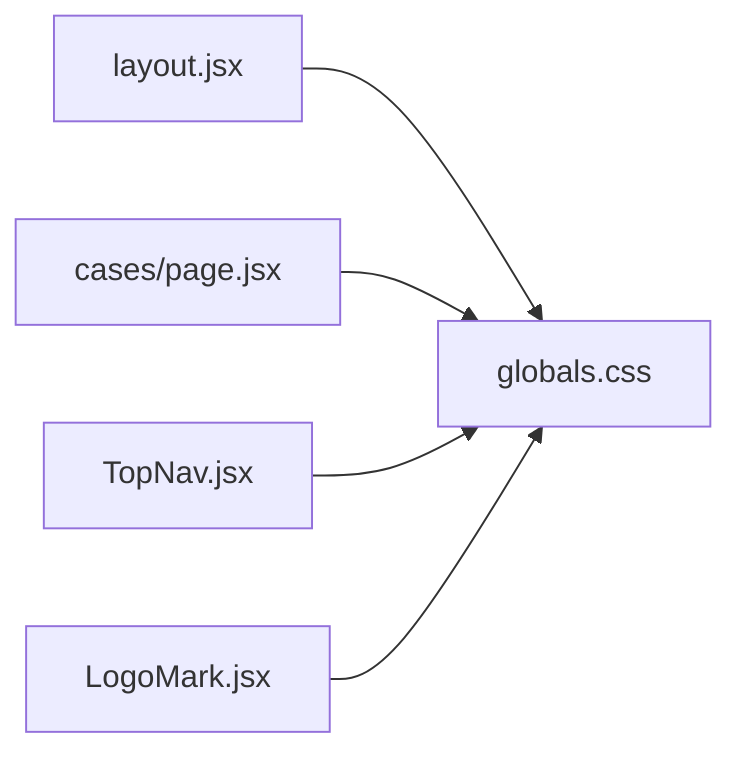
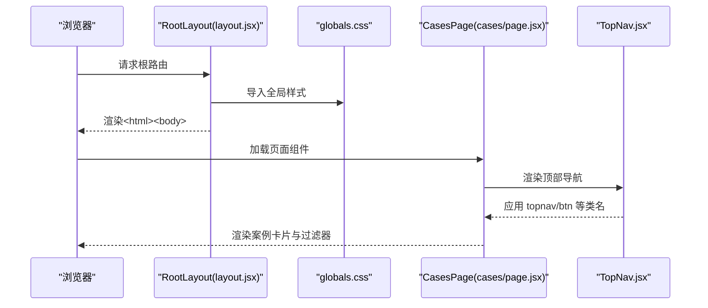

# CSS Modules 使用

<cite>
**本文档引用的文件**
- [next.config.mjs](file://next.config.mjs)
- [package.json](file://package.json)
- [src/app/layout.jsx](file://src/app/layout.jsx)
- [src/app/globals.css](file://src/app/globals.css)
- [src/app/cases/page.jsx](file://src/app/cases/page.jsx)
- [src/components/TopNav.jsx](file://src/components/TopNav.jsx)
- [src/components/LogoMark.jsx](file://src/components/LogoMark.jsx)
</cite>

## 目录
1. [简介](#简介)
2. [项目结构](#项目结构)
3. [核心组件](#核心组件)
4. [架构总览](#架构总览)
5. [详细组件分析](#详细组件分析)
6. [依赖分析](#依赖分析)
7. [性能考量](#性能考量)
8. [故障排查指南](#故障排查指南)
9. [结论](#结论)
10. [附录](#附录)

## 简介
本文件面向 InsightMesh 项目，系统性阐述在 Next.js App Router 中的样式组织与使用模式。当前仓库未启用 CSS Modules（即未使用以.module.css 结尾的样式文件），而是采用全局样式与原子化类名相结合的方式：通过根布局引入全局样式表，并在组件与页面中直接使用诸如“topnav”“btn”“page-card”等通用类名。本文将基于现有实现，给出在 Next.js 中集成 CSS Modules 的可行方案、最佳实践与注意事项，帮助团队在保持现有风格的同时平滑过渡到模块化样式。

## 项目结构
- 根配置
  - Next.js 配置位于 next.config.mjs，默认开启严格模式，未启用 CSS Modules。
  - 依赖管理位于 package.json，使用 Next.js 14。
- 全局样式
  - 根布局 layout.jsx 导入 src/app/globals.css，作为全站设计令牌与通用样式的统一入口。
- 页面与组件
  - 页面如 cases/page.jsx 直接使用类名进行布局与视觉控制。
  - 组件如 TopNav.jsx、LogoMark.jsx 通过类名与内联样式组合实现交互与视觉反馈。

图表来源
- [next.config.mjs:1-7](file://next.config.mjs#L1-L7)
- [src/app/layout.jsx:1-21](file://src/app/layout.jsx#L1-L21)
- [src/app/globals.css:1-134](file://src/app/globals.css#L1-L134)
- [src/app/cases/page.jsx:1-161](file://src/app/cases/page.jsx#L1-L161)
- [src/components/TopNav.jsx:1-45](file://src/components/TopNav.jsx#L1-L45)
- [src/components/LogoMark.jsx:1-19](file://src/components/LogoMark.jsx#L1-L19)

章节来源
- [next.config.mjs:1-7](file://next.config.mjs#L1-L7)
- [package.json:1-18](file://package.json#L1-L18)
- [src/app/layout.jsx:1-21](file://src/app/layout.jsx#L1-L21)
- [src/app/globals.css:1-134](file://src/app/globals.css#L1-L134)
- [src/app/cases/page.jsx:1-161](file://src/app/cases/page.jsx#L1-L161)
- [src/components/TopNav.jsx:1-45](file://src/components/TopNav.jsx#L1-L45)
- [src/components/LogoMark.jsx:1-19](file://src/components/LogoMark.jsx#L1-L19)

## 核心组件
- 根布局与全局样式
  - layout.jsx 通过 import "./globals.css" 引入全局样式，确保所有页面共享设计令牌与通用组件样式。
  - globals.css 定义了设计令牌、基础重置、布局辅助类、按钮、卡片、标签、表单、动画等通用样式，并按页面分段组织。
- 页面与组件中的类名使用
  - cases/page.jsx 展示了大量通用类名的使用，如“cases-body”“cases-wrap”“filter-chip”“case-card”等，用于页面结构与视觉控制。
  - TopNav.jsx 使用“topnav”“topnav-inner”“btn”“btn-primary”等类名构建导航与操作按钮。
  - LogoMark.jsx 通过“logo-mark”类名配合 SVG 实现品牌标识的统一视觉。

章节来源
- [src/app/layout.jsx:1-21](file://src/app/layout.jsx#L1-L21)
- [src/app/globals.css:245-497](file://src/app/globals.css#L245-L497)
- [src/app/cases/page.jsx:79-160](file://src/app/cases/page.jsx#L79-L160)
- [src/components/TopNav.jsx:20-42](file://src/components/TopNav.jsx#L20-L42)
- [src/components/LogoMark.jsx:1-19](file://src/components/LogoMark.jsx#L1-L19)

## 架构总览
下图展示了从根布局到页面与组件的样式加载与使用关系，体现当前项目采用的全局样式与通用类名策略。

图表来源
- [src/app/layout.jsx:1-21](file://src/app/layout.jsx#L1-L21)
- [src/app/globals.css:1-134](file://src/app/globals.css#L1-L134)
- [src/app/cases/page.jsx:79-160](file://src/app/cases/page.jsx#L79-L160)
- [src/components/TopNav.jsx:20-42](file://src/components/TopNav.jsx#L20-L42)
- [src/components/LogoMark.jsx:1-19](file://src/components/LogoMark.jsx#L1-L19)

## 详细组件分析

### 全局样式与设计令牌（globals.css）
- 设计令牌
  - 定义了表面色、前景色、边框、强调色、语义色、分类色、字体族、字号、行高、字距、间距、圆角、阴影、玻璃效果、动效曲线与持续时间等变量，集中管理视觉一致性。
- 基础与重置
  - 对全局元素进行盒模型、文本渲染、链接、按钮、输入等基础设置，确保跨页面一致的基础表现。
- 通用布局与工具类
  - 提供 container、stack、row、gap、grid 等布局辅助类，以及文本、对齐、背景、圆角等常用工具类。
- 组件与页面样式
  - 包含“Topnav”“Buttons”“Card/Surface”“Pill/Badge/Tag”“Form”“Divider”“Pagefoot”等组件级样式，以及“Launcher/Home”等页面级样式块，便于直接复用。

章节来源
- [src/app/globals.css:12-134](file://src/app/globals.css#L12-L134)
- [src/app/globals.css:139-159](file://src/app/globals.css#L139-L159)
- [src/app/globals.css:160-189](file://src/app/globals.css#L160-L189)
- [src/app/globals.css:190-233](file://src/app/globals.css#L190-L233)
- [src/app/globals.css:245-497](file://src/app/globals.css#L245-L497)

### 页面与组件中的类名使用（以 cases/page.jsx 为例）
- 页面结构
  - 使用“cases-body”“cases-wrap”“cases-head”“cases-filter”“case-grid”“case-card”等类名组织页面结构与内容区块。
- 交互与状态
  - 使用“filter-chip”“active”等类名表达筛选状态；通过内联样式控制动画与布局。
- 组件复用
  - 顶部导航 TopNav.jsx 通过“topnav”“topnav-inner”“btn”“btn-primary”等类名实现统一风格。

图表来源
- [src/app/layout.jsx:1-21](file://src/app/layout.jsx#L1-L21)
- [src/app/globals.css:245-497](file://src/app/globals.css#L245-L497)
- [src/app/cases/page.jsx:79-160](file://src/app/cases/page.jsx#L79-L160)
- [src/components/TopNav.jsx:20-42](file://src/components/TopNav.jsx#L20-L42)

章节来源
- [src/app/cases/page.jsx:79-160](file://src/app/cases/page.jsx#L79-L160)
- [src/components/TopNav.jsx:20-42](file://src/components/TopNav.jsx#L20-L42)

### 组件级样式管理（TopNav.jsx 与 LogoMark.jsx）
- TopNav.jsx
  - 通过 className 与内联样式结合，实现导航容器、Logo、导航链接、操作按钮的统一风格。
  - 使用“topnav”“topnav-inner”“logo”“btn”“btn-ghost”“btn-primary”等类名，确保与全局样式一致。
- LogoMark.jsx
  - 通过“logo-mark”类名与 SVG 图标组合，保证品牌标识的一致性与可扩展性。

章节来源
- [src/components/TopNav.jsx:7-44](file://src/components/TopNav.jsx#L7-L44)
- [src/components/LogoMark.jsx:1-19](file://src/components/LogoMark.jsx#L1-L19)

## 依赖分析
- 当前样式依赖链
  - layout.jsx -> globals.css
  - 各页面与组件 -> globals.css
- 依赖关系可视化

图表来源
- [src/app/layout.jsx:1-21](file://src/app/layout.jsx#L1-L21)
- [src/app/globals.css:1-134](file://src/app/globals.css#L1-L134)
- [src/app/cases/page.jsx:79-160](file://src/app/cases/page.jsx#L79-L160)
- [src/components/TopNav.jsx:20-42](file://src/components/TopNav.jsx#L20-L42)
- [src/components/LogoMark.jsx:1-19](file://src/components/LogoMark.jsx#L1-L19)

章节来源
- [src/app/layout.jsx:1-21](file://src/app/layout.jsx#L1-L21)
- [src/app/globals.css:1-134](file://src/app/globals.css#L1-L134)
- [src/app/cases/page.jsx:79-160](file://src/app/cases/page.jsx#L79-L160)
- [src/components/TopNav.jsx:20-42](file://src/components/TopNav.jsx#L20-L42)
- [src/components/LogoMark.jsx:1-19](file://src/components/LogoMark.jsx#L1-L19)

## 性能考量
- 全局样式加载
  - 通过根布局一次性引入全局样式，减少重复定义，提升加载效率。
- 类名复用与体积
  - 通用类名减少重复样式声明，降低 CSS 体积；但需注意避免过度堆叠导致选择器复杂度上升。
- 动画与玻璃态
  - globals.css 中的动画与玻璃态效果需关注浏览器兼容性与性能表现，必要时在生产环境进行针对性优化。

## 故障排查指南
- 类名不生效
  - 确认根布局已正确导入 globals.css。
  - 检查目标元素是否拼写正确且与 globals.css 中定义一致。
- 样式冲突
  - 若出现意外覆盖，优先检查是否存在更具体的选择器或后加载的样式。
- 动画异常
  - 检查动画名称与 keyframes 是否匹配，确认动画属性与过渡时序符合预期。

章节来源
- [src/app/layout.jsx:1-21](file://src/app/layout.jsx#L1-L21)
- [src/app/globals.css:518-544](file://src/app/globals.css#L518-L544)

## 结论
当前 InsightMesh 采用全局样式与通用类名策略，具备良好的可读性与一致性。若未来需要引入 CSS Modules，可在不破坏现有全局样式的前提下，逐步在特定页面或组件中启用模块化样式，结合设计令牌与通用类名，实现更细粒度的样式隔离与可维护性提升。

## 附录

### 在 Next.js 中集成 CSS Modules 的步骤与建议
- 启用方式
  - Next.js 默认支持 CSS Modules，无需额外配置。将样式文件命名为 *.module.css 即可启用模块化作用域。
- 文件命名与目录结构
  - 建议按页面或组件维度组织模块化样式，例如：
    - src/app/cases/cases.module.css
    - src/components/TopNav/TopNav.module.css
- 类名冲突避免
  - 通过模块导出的对象访问类名，避免直接使用字符串类名，降低冲突风险。
- 与全局样式的协同
  - 保留 globals.css 作为设计令牌与通用组件样式，模块化样式仅用于局部组件级样式。
- 迁移策略
  - 优先迁移高频修改的页面或组件，逐步替换通用类名为模块化类名，确保过渡期样式一致性。

### 关键流程：页面渲染与样式应用序列

图表来源
- [src/app/layout.jsx:1-21](file://src/app/layout.jsx#L1-L21)
- [src/app/globals.css:245-497](file://src/app/globals.css#L245-L497)
- [src/app/cases/page.jsx:79-160](file://src/app/cases/page.jsx#L79-L160)
- [src/components/TopNav.jsx:20-42](file://src/components/TopNav.jsx#L20-L42)