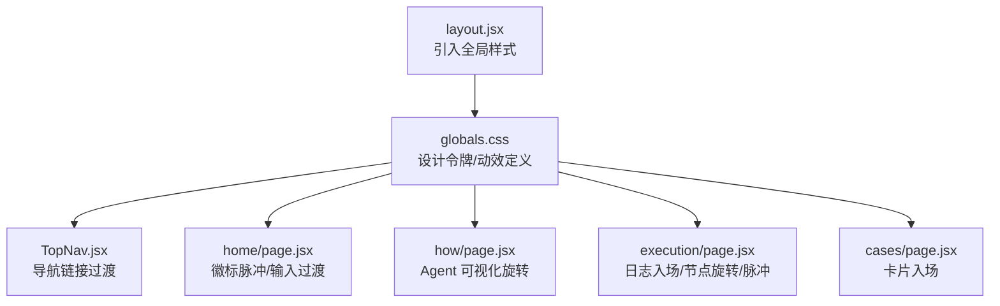
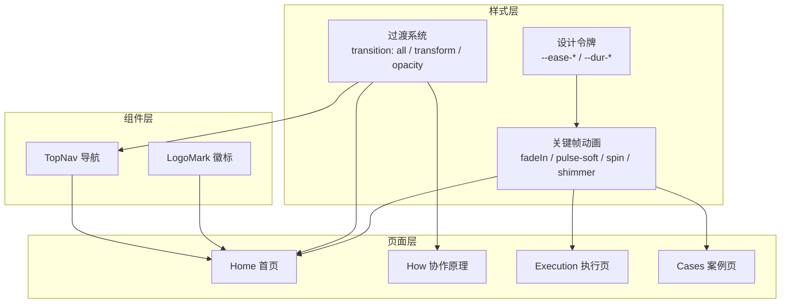
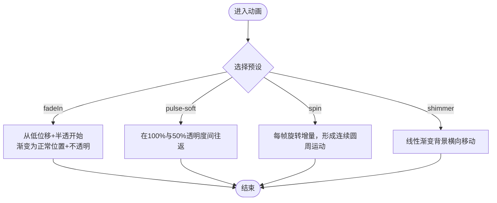
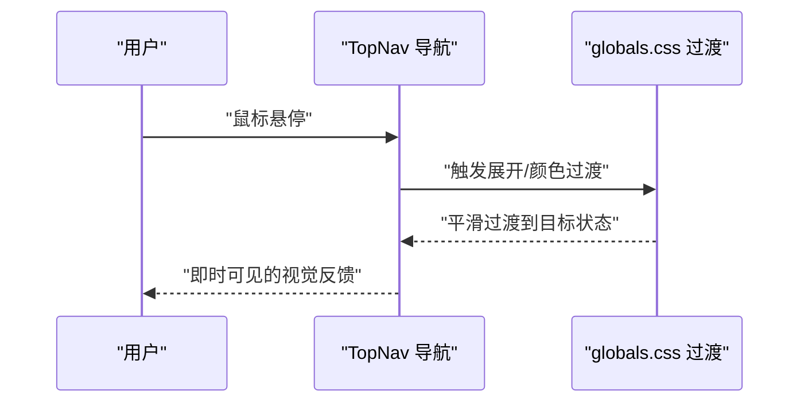
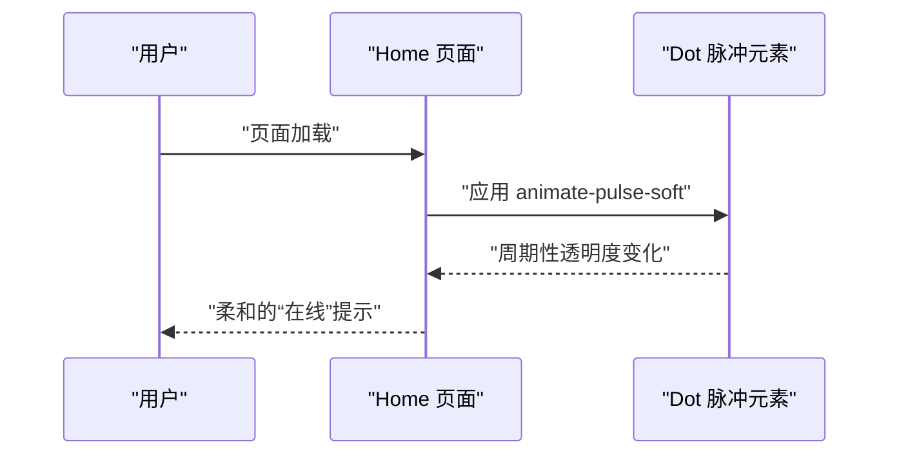
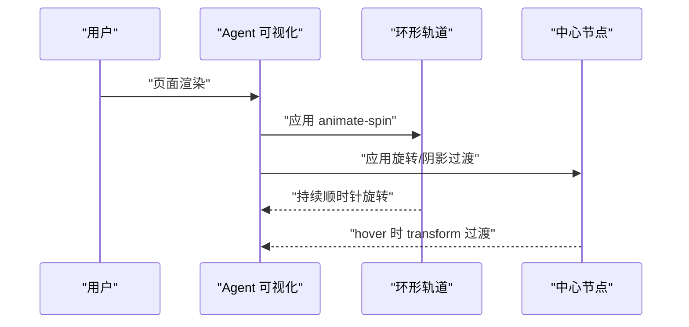
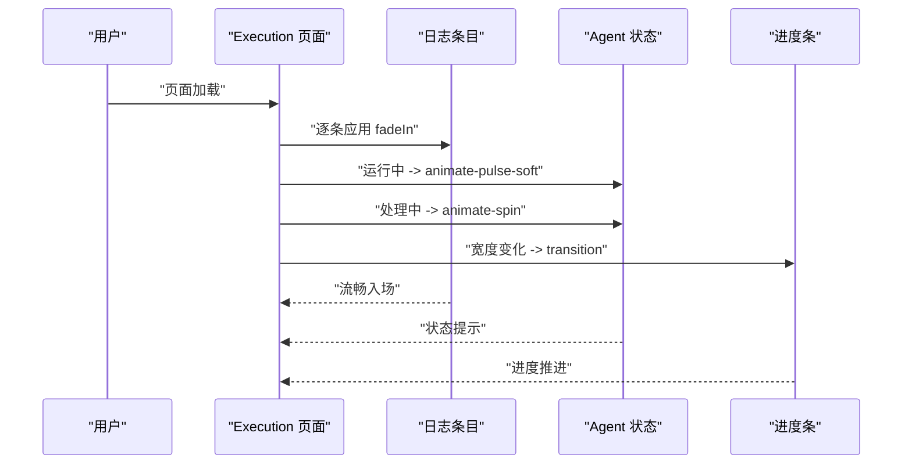
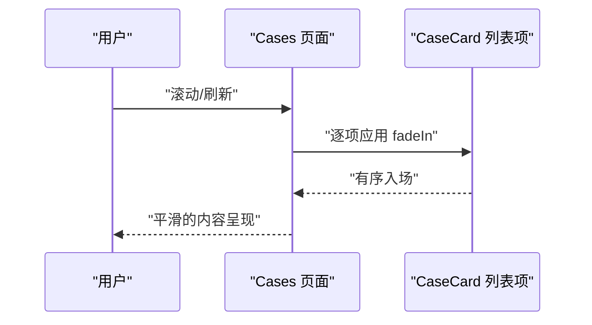
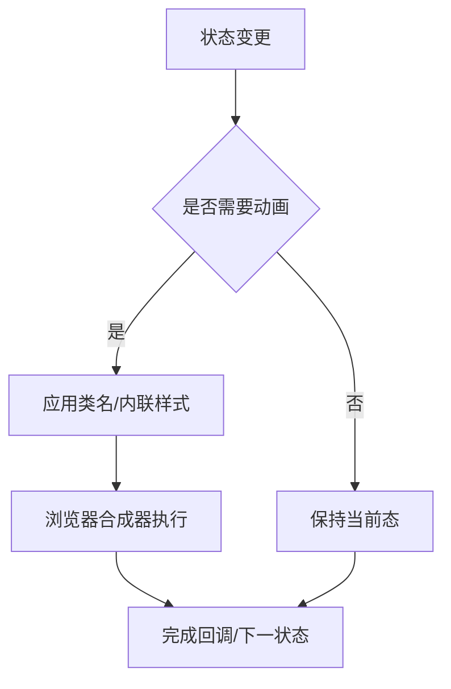
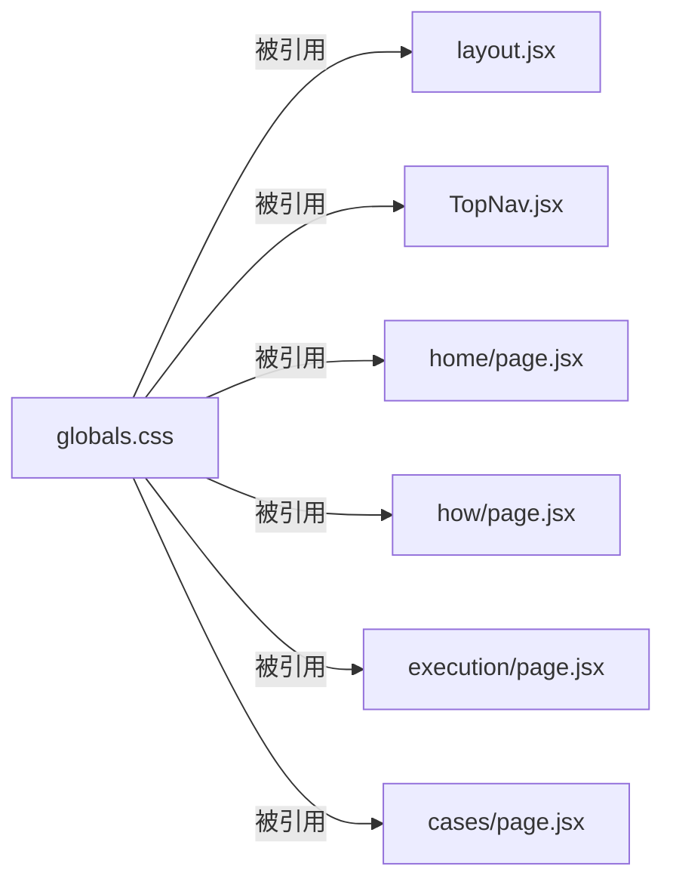

# 动画与过渡效果

<cite>
**本文引用的文件**
- [src/app/globals.css](file://src/app/globals.css)
- [src/app/layout.jsx](file://src/app/layout.jsx)
- [src/components/TopNav.jsx](file://src/components/TopNav.jsx)
- [src/components/LogoMark.jsx](file://src/components/LogoMark.jsx)
- [src/app/home/page.jsx](file://src/app/home/page.jsx)
- [src/app/how/page.jsx](file://src/app/how/page.jsx)
- [src/app/execution/page.jsx](file://src/app/execution/page.jsx)
- [src/app/cases/page.jsx](file://src/app/cases/page.jsx)
</cite>

## 目录
1. [简介](#简介)
2. [项目结构](#项目结构)
3. [核心组件](#核心组件)
4. [架构总览](#架构总览)
5. [详细组件分析](#详细组件分析)
6. [依赖关系分析](#依赖关系分析)
7. [性能考量](#性能考量)
8. [故障排查指南](#故障排查指南)
9. [结论](#结论)
10. [附录](#附录)

## 简介
本文件系统性梳理 InsightMesh 的动画与过渡效果体系，覆盖关键帧动画（如 fadeIn、pulse-soft、spin、shimmer）的定义与使用场景、CSS 过渡设计原则（transform、opacity、background 等属性的平滑变化）、性能优化策略（硬件加速、帧率控制、内存管理）、动画状态管理与触发机制（与用户交互的协调），以及可访问性（减少动画偏好与运动敏感用户的适配）。同时提供可复用的动画样式与自定义动画开发指南，帮助开发者快速构建一致且高性能的动效体验。

## 项目结构
动画与过渡效果主要集中在全局样式表中，通过类名与内联样式组合在各页面组件中使用。布局层负责引入全局样式，导航组件承载部分交互态动效，页面组件则按需应用动画类或内联动画。

图表来源
- [src/app/layout.jsx:1-21](file://src/app/layout.jsx#L1-L21)
- [src/app/globals.css:126-134](file://src/app/globals.css#L126-L134)
- [src/components/TopNav.jsx:1-45](file://src/components/TopNav.jsx#L1-L45)
- [src/app/home/page.jsx:167-210](file://src/app/home/page.jsx#L167-L210)
- [src/app/how/page.jsx:103-143](file://src/app/how/page.jsx#L103-L143)
- [src/app/execution/page.jsx:1419-1511](file://src/app/execution/page.jsx#L1419-L1511)
- [src/app/cases/page.jsx:106-137](file://src/app/cases/page.jsx#L106-L137)

章节来源
- [src/app/layout.jsx:1-21](file://src/app/layout.jsx#L1-L21)
- [src/app/globals.css:126-134](file://src/app/globals.css#L126-L134)

## 核心组件
- 设计令牌与缓动曲线：通过 CSS 变量统一管理缓动曲线与时长，保证动效一致性与可维护性。
- 关键帧动画库：提供 fadeIn、pulse-soft、spin、shimmer 四类基础动效，配合类名直接使用。
- 过渡系统：大量使用 transition 对 transform、opacity、box-shadow 等属性进行平滑变化，提升交互反馈质量。
- 场景化应用：首页徽标脉冲、执行页日志条目入场、案例页卡片入场、导航链接悬停等均体现动效与交互的结合。

章节来源
- [src/app/globals.css:518-543](file://src/app/globals.css#L518-L543)
- [src/app/globals.css:287-291](file://src/app/globals.css#L287-L291)
- [src/app/globals.css:586-593](file://src/app/globals.css#L586-L593)

## 架构总览
全局样式集中定义动效基元，页面组件通过类名或内联样式选择性启用；布局层确保全局样式在根节点生效；组件层（导航、徽标等）提供交互态过渡。

图表来源
- [src/app/globals.css:126-543](file://src/app/globals.css#L126-L543)
- [src/components/TopNav.jsx:1-45](file://src/components/TopNav.jsx#L1-L45)
- [src/components/LogoMark.jsx:1-19](file://src/components/LogoMark.jsx#L1-L19)
- [src/app/home/page.jsx:167-210](file://src/app/home/page.jsx#L167-L210)
- [src/app/how/page.jsx:103-143](file://src/app/how/page.jsx#L103-L143)
- [src/app/execution/page.jsx:1419-1511](file://src/app/execution/page.jsx#L1419-L1511)
- [src/app/cases/page.jsx:106-137](file://src/app/cases/page.jsx#L106-L137)

## 详细组件分析

### 关键帧动画库
- fadeIn：从半透明与位移状态渐入到完全不透明与原位，常用于内容首次出现。
- pulse-soft：在高亮与低透明度之间循环，营造柔和呼吸感，适合指示器与状态提示。
- spin：围绕自身轴心持续旋转，适用于加载与状态指示。
- shimmer：线性渐变背景沿水平方向滚动，模拟“活化”或占位闪烁效果。

图表来源
- [src/app/globals.css:518-543](file://src/app/globals.css#L518-L543)

章节来源
- [src/app/globals.css:518-543](file://src/app/globals.css#L518-L543)

### 过渡系统与交互态
- 导航链接：hover 时颜色过渡，体现轻量反馈。
- 卡片与按钮：hover 时阴影与边框过渡，强调层级变化。
- 输入框：聚焦时边框与阴影过渡，增强可用性。
- 链接图标：hover 时间距过渡，改善点击区域与视觉反馈。

图表来源
- [src/components/TopNav.jsx:1-45](file://src/components/TopNav.jsx#L1-L45)
- [src/app/globals.css:287-291](file://src/app/globals.css#L287-L291)
- [src/app/globals.css:377-378](file://src/app/globals.css#L377-L378)
- [src/app/globals.css:452-461](file://src/app/globals.css#L452-L461)

章节来源
- [src/components/TopNav.jsx:1-45](file://src/components/TopNav.jsx#L1-L45)
- [src/app/globals.css:287-291](file://src/app/globals.css#L287-L291)
- [src/app/globals.css:377-378](file://src/app/globals.css#L377-L378)
- [src/app/globals.css:452-461](file://src/app/globals.css#L452-L461)

### 场景化应用

#### 首页徽标与标题脉冲
- 徽标右侧小圆点使用 pulse-soft 动画，传达“在线/活跃”的状态。
- 输入框与按钮组采用统一过渡时长与缓动，确保交互节奏一致。

图表来源
- [src/app/home/page.jsx:167-210](file://src/app/home/page.jsx#L167-L210)
- [src/app/globals.css:686-688](file://src/app/globals.css#L686-L688)

章节来源
- [src/app/home/page.jsx:167-210](file://src/app/home/page.jsx#L167-L210)
- [src/app/globals.css:686-688](file://src/app/globals.css#L686-L688)

#### 协作原理页 Agent 可视化
- 中心节点与环形轨道使用 spin 动画，形成稳定旋转，营造“Agent 协作”的动态氛围。
- 节点标签 hover 时有 transform 过渡，突出交互细节。

图表来源
- [src/app/how/page.jsx:103-143](file://src/app/how/page.jsx#L103-L143)
- [src/app/globals.css:877-884](file://src/app/globals.css#L877-L884)
- [src/app/globals.css:911](file://src/app/globals.css#L911)

章节来源
- [src/app/how/page.jsx:103-143](file://src/app/how/page.jsx#L103-L143)
- [src/app/globals.css:877-884](file://src/app/globals.css#L877-L884)
- [src/app/globals.css:911](file://src/app/globals.css#L911)

#### 执行页日志与进度
- 日志条目使用 fadeIn 动画逐条入场，避免一次性渲染造成的视觉冲击。
- Agent 节点状态使用 pulse-soft 表示“运行中”，旋转动画表示“处理中”。
- 进度条宽度使用 transition 实现平滑推进。

图表来源
- [src/app/execution/page.jsx:1419-1511](file://src/app/execution/page.jsx#L1419-L1511)
- [src/app/globals.css:1552-1553](file://src/app/globals.css#L1552-L1553)
- [src/app/globals.css:1419-1424](file://src/app/globals.css#L1419-L1424)
- [src/app/globals.css:1497-1503](file://src/app/globals.css#L1497-L1503)
- [src/app/globals.css:1375](file://src/app/globals.css#L1375)

章节来源
- [src/app/execution/page.jsx:1419-1511](file://src/app/execution/page.jsx#L1419-L1511)
- [src/app/globals.css:1552-1553](file://src/app/globals.css#L1552-L1553)
- [src/app/globals.css:1419-1424](file://src/app/globals.css#L1419-L1424)
- [src/app/globals.css:1497-1503](file://src/app/globals.css#L1497-L1503)
- [src/app/globals.css:1375](file://src/app/globals.css#L1375)

#### 案例页卡片入场
- 列表项使用内联动画样式触发 fadeIn，确保批量渲染时的有序出现。

图表来源
- [src/app/cases/page.jsx:106-137](file://src/app/cases/page.jsx#L106-L137)
- [src/app/globals.css:518-525](file://src/app/globals.css#L518-L525)

章节来源
- [src/app/cases/page.jsx:106-137](file://src/app/cases/page.jsx#L106-L137)
- [src/app/globals.css:518-525](file://src/app/globals.css#L518-L525)

### 动画状态管理与触发机制
- 基于类名的静态触发：通过添加 animate-* 类实现一次性或无限循环动画。
- 基于交互的过渡：hover/active/focus 等伪类驱动 transition，实现即时反馈。
- 基于数据的动态触发：日志条目与卡片列表通过内联样式或状态切换触发入场动画。

图表来源
- [src/app/globals.css:518-543](file://src/app/globals.css#L518-L543)
- [src/app/globals.css:287-291](file://src/app/globals.css#L287-L291)
- [src/app/execution/page.jsx:1419-1511](file://src/app/execution/page.jsx#L1419-L1511)
- [src/app/cases/page.jsx:106-137](file://src/app/cases/page.jsx#L106-L137)

章节来源
- [src/app/globals.css:518-543](file://src/app/globals.css#L518-L543)
- [src/app/globals.css:287-291](file://src/app/globals.css#L287-L291)
- [src/app/execution/page.jsx:1419-1511](file://src/app/execution/page.jsx#L1419-L1511)
- [src/app/cases/page.jsx:106-137](file://src/app/cases/page.jsx#L106-L137)

## 依赖关系分析
- 全局样式依赖：所有页面与组件共享设计令牌与动效定义，降低重复与不一致风险。
- 组件耦合：导航与徽标组件对过渡与关键帧存在弱耦合（类名/变量），便于扩展与替换。
- 性能耦合：关键帧动画与过渡均基于浏览器合成器，避免强制同步布局与绘制。

图表来源
- [src/app/layout.jsx:1-21](file://src/app/layout.jsx#L1-L21)
- [src/app/globals.css:126-134](file://src/app/globals.css#L126-L134)
- [src/components/TopNav.jsx:1-45](file://src/components/TopNav.jsx#L1-L45)
- [src/app/home/page.jsx:167-210](file://src/app/home/page.jsx#L167-L210)
- [src/app/how/page.jsx:103-143](file://src/app/how/page.jsx#L103-L143)
- [src/app/execution/page.jsx:1419-1511](file://src/app/execution/page.jsx#L1419-L1511)
- [src/app/cases/page.jsx:106-137](file://src/app/cases/page.jsx#L106-L137)

章节来源
- [src/app/layout.jsx:1-21](file://src/app/layout.jsx#L1-L21)
- [src/app/globals.css:126-134](file://src/app/globals.css#L126-L134)
- [src/components/TopNav.jsx:1-45](file://src/components/TopNav.jsx#L1-L45)
- [src/app/home/page.jsx:167-210](file://src/app/home/page.jsx#L167-L210)
- [src/app/how/page.jsx:103-143](file://src/app/how/page.jsx#L103-L143)
- [src/app/execution/page.jsx:1419-1511](file://src/app/execution/page.jsx#L1419-L1511)
- [src/app/cases/page.jsx:106-137](file://src/app/cases/page.jsx#L106-L137)

## 性能考量
- 硬件加速优先：关键帧动画与过渡尽量作用于 transform、opacity 等可由合成器处理的属性，减少强制同步布局与绘制。
- 帧率控制：通过统一的时长与缓动变量（--dur-*、--ease-*）控制动画节奏，避免过快导致卡顿。
- 内存管理：无限循环动画（如 spin、pulse-soft）应仅在必要场景启用；复杂路径动画（如 shimmer）建议限制在占位或加载态。
- 减少重排重绘：过渡与动画尽量使用 will-change 或 transform/opacity，避免频繁修改布局相关属性。
- 可访问性降级：针对“减少动画”偏好，提供媒体查询降级（见下节）。

## 故障排查指南
- 动画未生效
  - 检查是否正确引入全局样式（layout.jsx）。
  - 确认类名拼写与命名空间一致（animate-*）。
  - 确认父容器未设置 overflow 隐藏动画边界。
- 过渡卡顿
  - 将动画属性改为 transform/opacity，避免影响布局的属性。
  - 合理设置 --dur-*，避免过短时长造成丢帧。
- 与交互冲突
  - 使用 hover/active/focus 等伪类触发过渡，避免与 JS 状态切换冲突。
  - 对高频交互（如滚动）建议节流或禁用动画降级。
- 减少动画偏好
  - 使用 prefers-reduced-motion: reduce 的媒体查询，将动画时长与过渡时长降至极低值，或禁用关键帧动画。

章节来源
- [src/app/layout.jsx:1-21](file://src/app/layout.jsx#L1-L21)
- [src/app/globals.css:2396-2400](file://src/app/globals.css#L2396-L2400)

## 结论
InsightMesh 的动画与过渡体系以全局样式为核心，通过统一的设计令牌与关键帧库，结合合理的过渡策略，在保证一致性的同时兼顾性能与可访问性。场景化的应用（首页、执行页、协作页、案例页）展示了从基础动效到复杂可视化动效的完整实践路径。建议在新增动效时遵循“属性选择优先合成器属性、时长与缓动统一管理、可访问性优先”的原则，确保体验与性能的平衡。

## 附录

### 动画示例清单
- fadeIn：内容首次出现、日志条目入场、案例卡片入场
- pulse-soft：在线指示器、运行中状态提示
- spin：加载指示器、Agent 节点处理中
- shimmer：占位/活化背景

章节来源
- [src/app/globals.css:518-543](file://src/app/globals.css#L518-L543)
- [src/app/execution/page.jsx:1419-1511](file://src/app/execution/page.jsx#L1419-L1511)
- [src/app/cases/page.jsx:106-137](file://src/app/cases/page.jsx#L106-L137)

### 自定义动画开发指南
- 基础步骤
  - 在全局样式中定义关键帧与类名，复用 --dur-* 与 --ease-*。
  - 通过类名或内联样式触发，避免在组件内部重复定义。
  - 优先使用 transform/opacity，确保硬件加速。
- 交互态建议
  - hover/active/focus 使用 transition，时长与缓动与全局一致。
  - 对高频交互场景，考虑禁用或缩短动画时长。
- 可访问性
  - 提供 prefers-reduced-motion 降级策略，保障运动敏感用户的体验。

章节来源
- [src/app/globals.css:126-134](file://src/app/globals.css#L126-L134)
- [src/app/globals.css:2396-2400](file://src/app/globals.css#L2396-L2400)