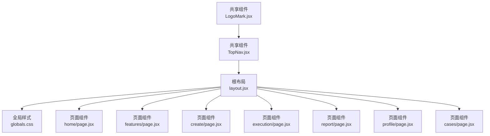
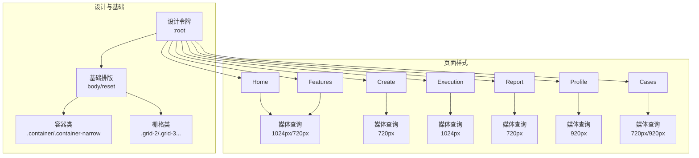
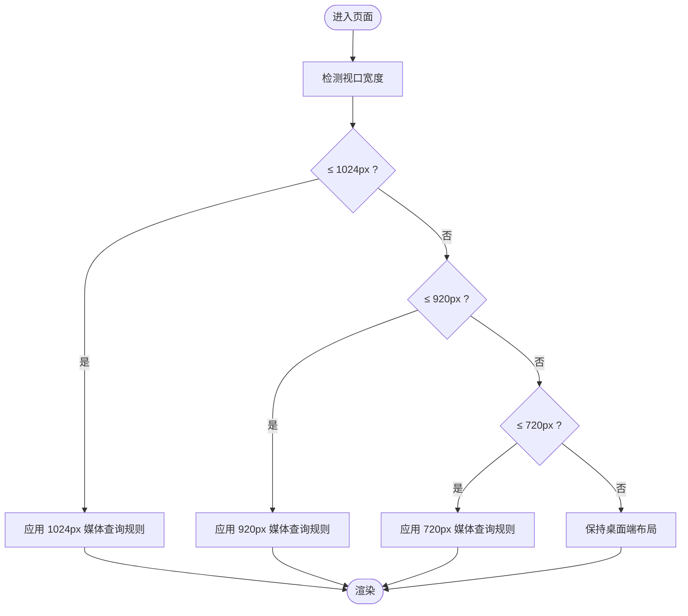
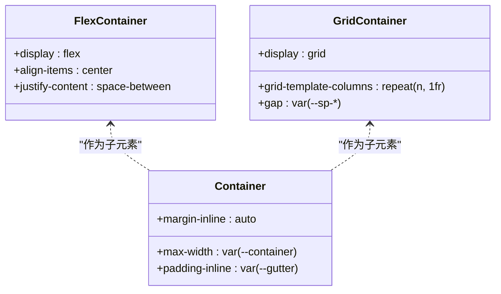
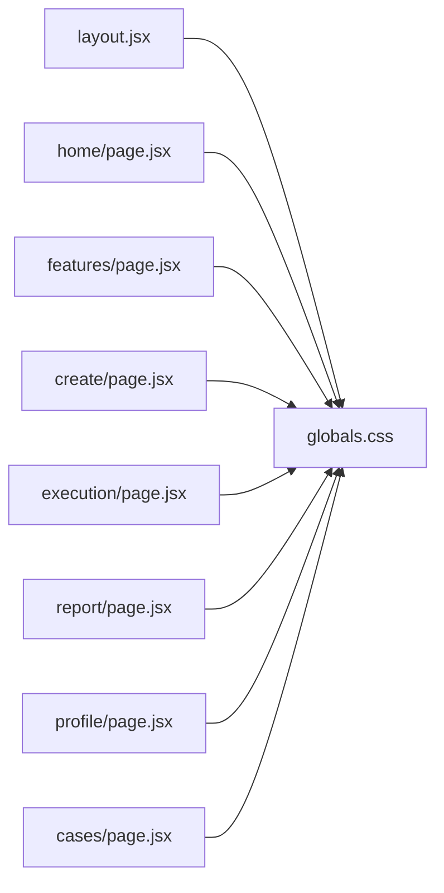

# 响应式设计

<cite>
**本文引用的文件**
- [README.md](file://README.md)
- [layout.jsx](file://src/app/layout.jsx)
- [globals.css](file://src/app/globals.css)
- [TopNav.jsx](file://src/components/TopNav.jsx)
- [LogoMark.jsx](file://src/components/LogoMark.jsx)
- [home/page.jsx](file://src/app/home/page.jsx)
- [features/page.jsx](file://src/app/features/page.jsx)
- [create/page.jsx](file://src/app/create/page.jsx)
- [execution/page.jsx](file://src/app/execution/page.jsx)
- [report/page.jsx](file://src/app/report/page.jsx)
- [profile/page.jsx](file://src/app/profile/page.jsx)
- [cases/page.jsx](file://src/app/cases/page.jsx)
</cite>

## 目录
1. [简介](#简介)
2. [项目结构](#项目结构)
3. [核心组件](#核心组件)
4. [架构总览](#架构总览)
5. [详细组件分析](#详细组件分析)
6. [依赖分析](#依赖分析)
7. [性能考量](#性能考量)
8. [故障排查指南](#故障排查指南)
9. [结论](#结论)
10. [附录](#附录)

## 简介
本文件面向 InsightMesh 的响应式设计系统，系统性梳理媒体查询策略、断点设计原则、弹性布局与网格系统、流式布局与相对单位、触摸交互优化、以及图片与媒体处理方案。文档以实际源码为依据，结合可视化图表与分层讲解，帮助开发者在桌面端、平板端与移动端获得一致且高质量的用户体验。

## 项目结构
InsightMesh 采用 Next.js App Router 架构，根布局统一注入全局样式，页面级样式集中在全局样式表中，配合少量页面组件完成响应式布局与交互。

**图表来源**
- [layout.jsx:1-21](file://src/app/layout.jsx#L1-L21)
- [globals.css:1-134](file://src/app/globals.css#L1-L134)
- [home/page.jsx:167-191](file://src/app/home/page.jsx#L167-L191)
- [features/page.jsx:59-95](file://src/app/features/page.jsx#L59-L95)
- [create/page.jsx:1074-1295](file://src/app/create/page.jsx#L1074-L1295)
- [execution/page.jsx:1300-1604](file://src/app/execution/page.jsx#L1300-L1604)
- [report/page.jsx:1608-1849](file://src/app/report/page.jsx#L1608-L1849)
- [profile/page.jsx:1854-2107](file://src/app/profile/page.jsx#L1854-L2107)
- [cases/page.jsx:106-137](file://src/app/cases/page.jsx#L106-L137)
- [TopNav.jsx:1-45](file://src/components/TopNav.jsx#L1-L45)
- [LogoMark.jsx:1-19](file://src/components/LogoMark.jsx#L1-L19)

**章节来源**
- [README.md:1-94](file://README.md#L1-L94)
- [layout.jsx:1-21](file://src/app/layout.jsx#L1-L21)

## 核心组件
- 视口配置：根布局设置视口宽度为设备宽度，初始缩放为 1，确保移动端按设备宽度渲染。
- 全局样式：集中定义设计令牌、基础排版、容器与栅格辅助类、页面级样式与媒体查询。
- 顶层导航：使用 Flex 布局与容器类，配合粘滞定位与玻璃态背景，保证在各尺寸下稳定显示。
- 图标与品牌标识：SVG 图标与 LogoMark 组件内联，使用相对尺寸与语义化标签，便于缩放与无障碍访问。

**章节来源**
- [layout.jsx:9-12](file://src/app/layout.jsx#L9-L12)
- [globals.css:12-134](file://src/app/globals.css#L12-L134)
- [TopNav.jsx:20-42](file://src/components/TopNav.jsx#L20-L42)
- [LogoMark.jsx:1-19](file://src/components/LogoMark.jsx#L1-L19)

## 架构总览
响应式体系由“设计令牌 + 基础排版 + 容器与栅格 + 页面样式 + 媒体查询”构成。页面组件通过容器类与栅格类组合，配合媒体查询在不同断点下调整布局与间距，实现从桌面到移动的平滑过渡。

**图表来源**
- [globals.css:12-134](file://src/app/globals.css#L12-L134)
- [globals.css:160-189](file://src/app/globals.css#L160-L189)
- [globals.css:1057-1069](file://src/app/globals.css#L1057-L1069)
- [globals.css:1289-1295](file://src/app/globals.css#L1289-L1295)
- [globals.css:1601-1604](file://src/app/globals.css#L1601-L1604)
- [globals.css:1844-1849](file://src/app/globals.css#L1844-L1849)
- [globals.css:2103-2107](file://src/app/globals.css#L2103-L2107)

## 详细组件分析

### 断点与媒体查询策略
- 桌面端优先：以较大断点为主，优先保证大屏体验，再向下兼容小屏。
- 常用断点：
  - 1024px：用于首页、执行页等复杂布局的两列/一列切换。
  - 920px：用于个人中心侧边导航的布局切换。
  - 720px：用于多数页面的移动端适配，如输入区垂直排列、网格列数减少等。
- 媒体查询覆盖范围：首页、功能页、创建页、执行页、报告页、个人中心、案例页均有对应断点规则。

**图表来源**
- [globals.css:1057-1069](file://src/app/globals.css#L1057-L1069)
- [globals.css:1289-1295](file://src/app/globals.css#L1289-L1295)
- [globals.css:1601-1604](file://src/app/globals.css#L1601-L1604)
- [globals.css:1844-1849](file://src/app/globals.css#L1844-L1849)
- [globals.css:2103-2107](file://src/app/globals.css#L2103-L2107)

**章节来源**
- [globals.css:1057-1069](file://src/app/globals.css#L1057-L1069)
- [globals.css:1289-1295](file://src/app/globals.css#L1289-L1295)
- [globals.css:1601-1604](file://src/app/globals.css#L1601-L1604)
- [globals.css:1844-1849](file://src/app/globals.css#L1844-L1849)
- [globals.css:2103-2107](file://src/app/globals.css#L2103-L2107)

### 弹性布局与网格系统
- Flex 布局：
  - 顶层导航使用 Flex 在水平方向分布，支持两端对齐与居中对齐。
  - 执行页头部信息在小屏下垂直堆叠，提升可读性。
- CSS Grid：
  - 提供 grid-2 至 grid-5 等栅格类，配合固定列数与等宽列。
  - 案例页使用自动填充网格，最小卡片宽度为 320px，保证在中小屏仍有良好密度。
  - 报告页图表区域采用网格布局，小屏下切换为纵向排列。
- 相对单位与流式设计：
  - 使用 rem/em、百分比、clamp() 等相对单位，使文本与元素随视口或字体大小变化而缩放。
  - 容器类使用 max-width 与内边距，确保内容在大屏不无限拉伸，在小屏不拥挤。

**图表来源**
- [globals.css:178-189](file://src/app/globals.css#L178-L189)
- [globals.css:161-170](file://src/app/globals.css#L161-L170)
- [globals.css:572-579](file://src/app/globals.css#L572-L579)

**章节来源**
- [globals.css:178-189](file://src/app/globals.css#L178-L189)
- [globals.css:161-170](file://src/app/globals.css#L161-L170)
- [globals.css:572-579](file://src/app/globals.css#L572-L579)

### 流式布局与相对单位
- 文本与标题使用 clamp() 限定最小/最大值与增长速率，避免在极端尺寸下出现过小或过大文字。
- 容器与间距使用设计令牌变量，保证在不同断点下视觉节奏一致。
- 图片与 SVG 默认最大宽度为 100%，配合容器类实现流式缩放。

**章节来源**
- [globals.css:567-569](file://src/app/globals.css#L567-L569)
- [globals.css:691-700](file://src/app/globals.css#L691-L700)
- [globals.css:153-153](file://src/app/globals.css#L153-L153)

### 触摸设备交互优化
- 按钮与可点击元素具备明确的触控目标尺寸与间距，避免误触。
- 表单控件在聚焦时提供高对比度的焦点环，增强可访问性。
- 顶层导航采用粘滞定位与玻璃态背景，保证滚动时操作区域始终可见。
- 媒体查询中针对减少动画偏好进行降级处理，尊重用户设置。

**章节来源**
- [globals.css:316-368](file://src/app/globals.css#L316-L368)
- [globals.css:512-516](file://src/app/globals.css#L512-L516)
- [globals.css:25-25](file://src/app/globals.css#L25-L25)
- [globals.css:2396-2399](file://src/app/globals.css#L2396-L2399)

### 响应式图片与媒体处理
- 图片与矢量图形均限制最大宽度为 100%，配合容器类实现流式缩放。
- 案例页卡片封面使用背景色与伪元素模拟占位，避免无资源时的布局塌陷。
- 媒体查询在小屏下减少列数与间距，保证内容可读性与触控可达性。

**章节来源**
- [globals.css:153-153](file://src/app/globals.css#L153-L153)
- [cases/page.jsx:115-115](file://src/app/cases/page.jsx#L115-L115)

### 页面级响应式要点

#### 首页（Home）
- 标题与副标题使用 clamp() 保证在不同尺寸下字号自然过渡。
- 英雄区输入区在小屏下垂直堆叠，提交按钮全宽显示。
- 场景网格在 1024px 下变为两列，720px 下变为一列。

**章节来源**
- [globals.css:691-700](file://src/app/globals.css#L691-L700)
- [globals.css:1062-1069](file://src/app/globals.css#L1062-L1069)
- [globals.css:1057-1061](file://src/app/globals.css#L1057-L1061)

#### 功能页（Features）
- CTA 区域与页脚在小屏下进行垂直堆叠与换行，保证信息层级清晰。

**章节来源**
- [features/page.jsx:59-95](file://src/app/features/page.jsx#L59-L95)
- [globals.css:1057-1061](file://src/app/globals.css#L1057-L1061)

#### 创建页（Create）
- 维度、深度、格式选择器在 720px 下逐项独占一行，提升触控精度与可读性。
- 底部信息区在小屏下垂直堆叠，确认按钮全宽显示。

**章节来源**
- [globals.css:1289-1295](file://src/app/globals.css#L1289-L1295)

#### 执行页（Execution）
- 执行面板在 1024px 下由两列变为一列，头部信息垂直堆叠，提升阅读与操作效率。

**章节来源**
- [globals.css:1601-1604](file://src/app/globals.css#L1601-L1604)

#### 报告页（Report）
- 报告工具栏在小屏下垂直堆叠，图表与对比区在小屏下纵向排列，保证信息密度与可读性。

**章节来源**
- [globals.css:1844-1849](file://src/app/globals.css#L1844-L1849)

#### 个人中心（Profile）
- 侧边导航在 920px 下移至静态布局并横向换行，避免遮挡主要内容。

**章节来源**
- [globals.css:2103-2107](file://src/app/globals.css#L2103-L2107)

#### 案例页（Cases）
- 案例网格使用自动填充，最小卡片宽度为 320px；在 720px/920px 下进一步调整列数与间距。

**章节来源**
- [globals.css:572-579](file://src/app/globals.css#L572-L579)
- [globals.css:1844-1849](file://src/app/globals.css#L1844-L1849)
- [globals.css:2103-2107](file://src/app/globals.css#L2103-L2107)

## 依赖分析
- 根布局依赖全局样式，确保所有页面共享同一套设计令牌与响应式规则。
- 页面组件通过容器类与栅格类复用全局样式，减少重复定义。
- 媒体查询在全局样式中集中维护，便于统一更新与调试。

**图表来源**
- [layout.jsx:1-1](file://src/app/layout.jsx#L1-L1)
- [globals.css:1-134](file://src/app/globals.css#L1-L134)
- [home/page.jsx:167-191](file://src/app/home/page.jsx#L167-L191)
- [features/page.jsx:59-95](file://src/app/features/page.jsx#L59-L95)
- [create/page.jsx:1074-1295](file://src/app/create/page.jsx#L1074-L1295)
- [execution/page.jsx:1300-1604](file://src/app/execution/page.jsx#L1300-L1604)
- [report/page.jsx:1608-1849](file://src/app/report/page.jsx#L1608-L1849)
- [profile/page.jsx:1854-2107](file://src/app/profile/page.jsx#L1854-L2107)
- [cases/page.jsx:106-137](file://src/app/cases/page.jsx#L106-L137)

**章节来源**
- [layout.jsx:1-1](file://src/app/layout.jsx#L1-L1)
- [globals.css:1-134](file://src/app/globals.css#L1-L134)

## 性能考量
- 静态预渲染：项目构建为全静态，路由均为静态预渲染，有利于首屏性能与 SEO。
- 样式体积：全局样式集中于单一文件，减少请求次数；媒体查询按需生效，避免冗余规则。
- 动画降级：针对减少动画偏好的媒体查询进行降级，兼顾性能与体验。

**章节来源**
- [README.md:86-86](file://README.md#L86-L86)
- [globals.css:2396-2399](file://src/app/globals.css#L2396-L2399)

## 故障排查指南
- 视口异常：若页面在移动端显示异常，检查根布局的视口配置是否正确。
- 媒体查询未生效：确认断点条件与设备宽度匹配，必要时在浏览器开发者工具中切换设备模式验证。
- 栅格错乱：检查容器类与栅格类的组合是否符合预期，避免在小屏下列数过多导致拥挤。
- 触控目标过小：检查按钮与链接的最小触控尺寸，确保满足可访问性要求。
- 图片变形：确认图片最大宽度为 100%，并配合容器类使用，避免超出容器边界。

**章节来源**
- [layout.jsx:9-12](file://src/app/layout.jsx#L9-L12)
- [globals.css:153-153](file://src/app/globals.css#L153-L153)
- [globals.css:316-368](file://src/app/globals.css#L316-L368)

## 结论
InsightMesh 的响应式设计以“设计令牌 + 容器与栅格 + 媒体查询”为核心，通过桌面端优先与渐进增强策略，在桌面、平板与移动端均提供一致的视觉与交互体验。页面组件遵循统一的布局规范，媒体查询覆盖关键断点，确保在不同设备上内容可读、操作可达、性能稳定。

## 附录
- 测试方法建议：
  - 使用浏览器开发者工具的设备模式，依次测试 1024px、920px、720px 与更小尺寸，观察布局与交互变化。
  - 对关键页面（首页、创建页、执行页、报告页、个人中心、案例页）进行端到端交互验证。
  - 关注可访问性：键盘导航、焦点环、减少动画偏好等。
- 优化建议：
  - 在小屏下进一步压缩非关键动画与阴影，提升滚动流畅度。
  - 对图片与媒体资源进行懒加载与多分辨率适配，降低首屏负担。