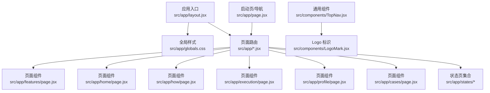
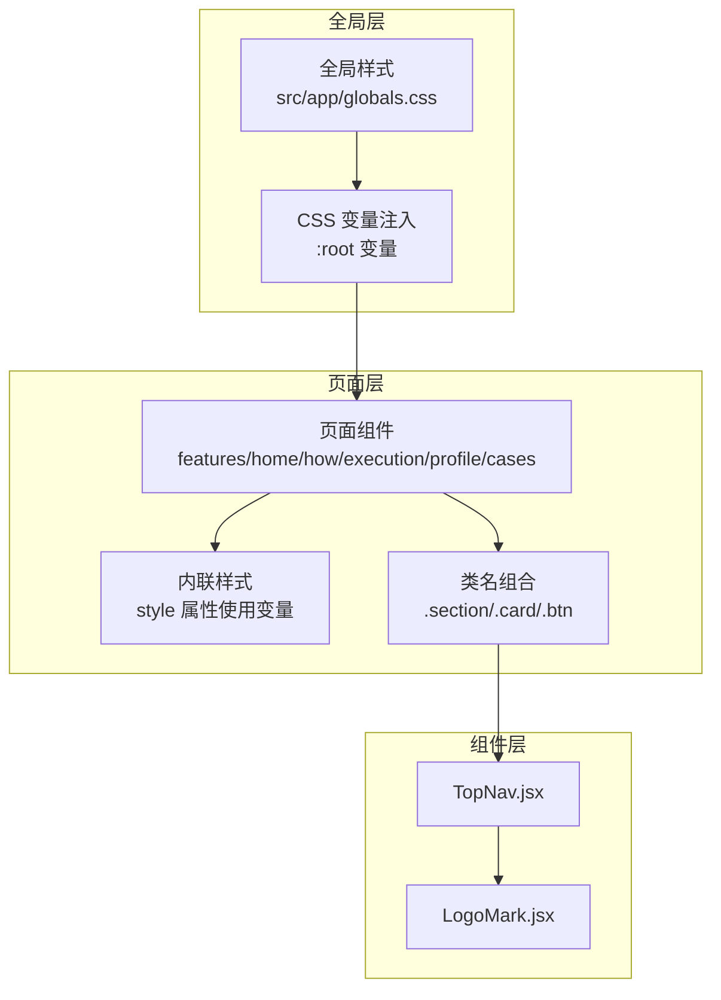
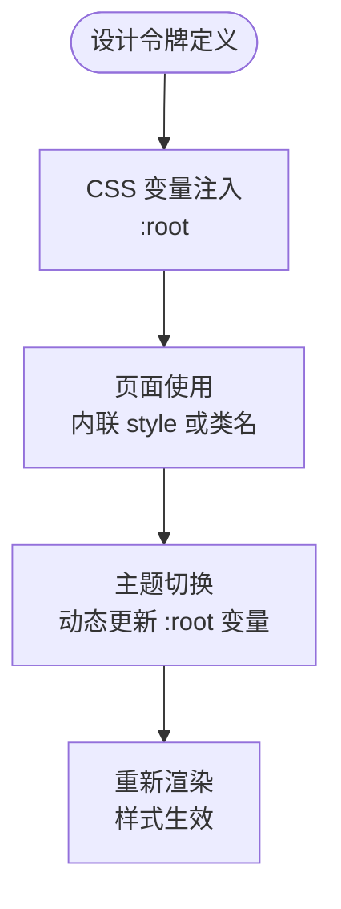
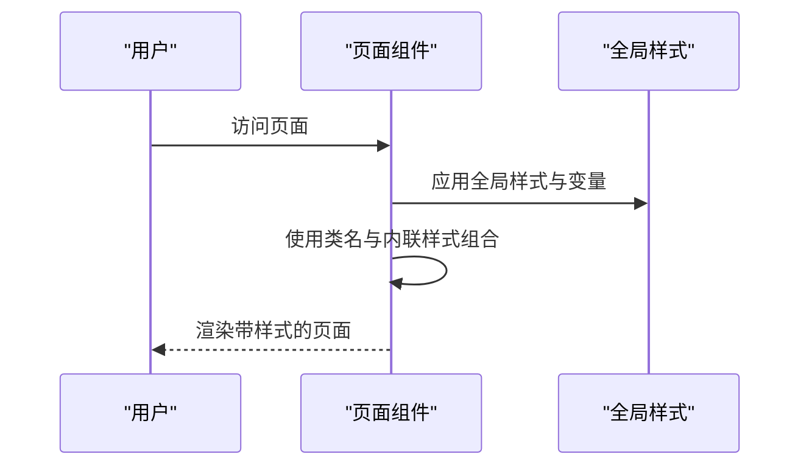
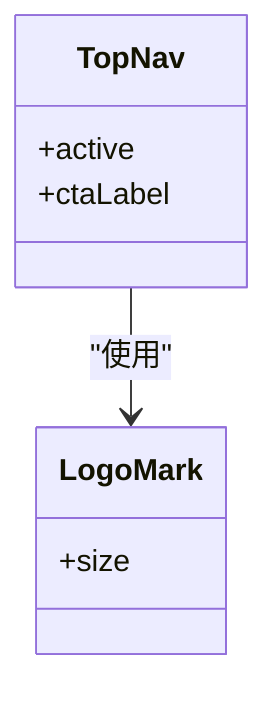
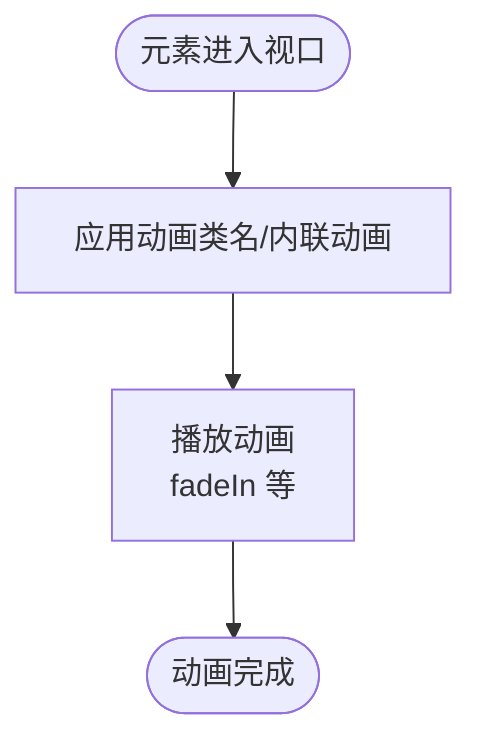
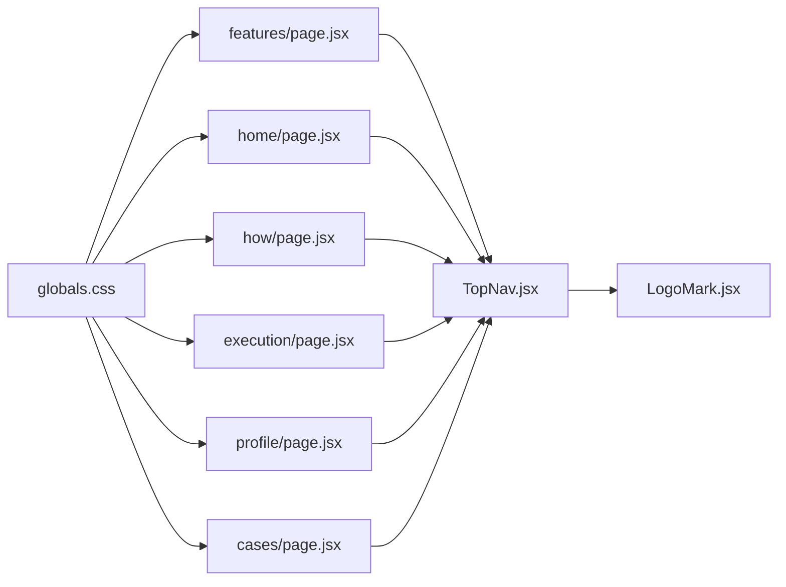

# 样式与主题

<cite>
**本文引用的文件**
- [src/app/features/page.jsx](file://src/app/features/page.jsx)
- [src/app/execution/page.jsx](file://src/app/execution/page.jsx)
- [src/app/home/page.jsx](file://src/app/home/page.jsx)
- [src/app/how/page.jsx](file://src/app/how/page.jsx)
- [src/app/profile/page.jsx](file://src/app/profile/page.jsx)
- [src/app/cases/page.jsx](file://src/app/cases/page.jsx)
- [src/app/page.jsx](file://src/app/page.jsx)
- [src/components/TopNav.jsx](file://src/components/TopNav.jsx)
- [src/components/LogoMark.jsx](file://src/components/LogoMark.jsx)
- [src/app/layout.jsx](file://src/app/layout.jsx)
- [src/app/page.jsx](file://src/app/page.jsx)
- [src/app/states/loading/page.jsx](file://src/app/states/loading/page.jsx)
- [src/app/states/empty/page.jsx](file://src/app/states/empty/page.jsx)
- [src/app/states/error/page.jsx](file://src/app/states/error/page.jsx)
- [src/app/states/network/page.jsx](file://src/app/states/network/page.jsx)
- [src/app/states/permission/page.jsx](file://src/app/states/permission/page.jsx)
- [src/app/globals.css](file://src/app/globals.css)
- [package.json](file://package.json)
</cite>

## 目录
1. [引言](#引言)
2. [项目结构](#项目结构)
3. [核心组件](#核心组件)
4. [架构总览](#架构总览)
5. [详细组件分析](#详细组件分析)
6. [依赖分析](#依赖分析)
7. [性能考量](#性能考量)
8. [故障排查指南](#故障排查指南)
9. [结论](#结论)
10. [附录](#附录)

## 引言
本技术文档聚焦 InsightMesh 的样式系统与主题体系，面向设计师与开发者，系统阐述设计令牌（Design Tokens）在项目中的落地方式与使用规范；解析 CSS 变量与 CSS-in-JS 的混合策略；总结极简科技风格的视觉原则与实现要点；说明响应式与移动端适配方法；给出主题切换与样式定制的可行方案；并提供动画与过渡效果的实现细节与最佳实践。

## 项目结构
InsightMesh 基于 Next.js App Router 构建，采用按页面组织的目录结构。样式系统以全局样式与页面级样式为主，结合内联样式与 CSS 变量实现灵活的主题控制与响应式布局。

图表来源
- [src/app/layout.jsx](file://src/app/layout.jsx)
- [src/app/globals.css](file://src/app/globals.css)
- [src/app/features/page.jsx](file://src/app/features/page.jsx)
- [src/app/home/page.jsx](file://src/app/home/page.jsx)
- [src/app/how/page.jsx](file://src/app/how/page.jsx)
- [src/app/execution/page.jsx](file://src/app/execution/page.jsx)
- [src/app/profile/page.jsx](file://src/app/profile/page.jsx)
- [src/app/cases/page.jsx](file://src/app/cases/page.jsx)
- [src/app/states/loading/page.jsx](file://src/app/states/loading/page.jsx)
- [src/app/states/empty/page.jsx](file://src/app/states/empty/page.jsx)
- [src/app/states/error/page.jsx](file://src/app/states/error/page.jsx)
- [src/app/states/network/page.jsx](file://src/app/states/network/page.jsx)
- [src/app/states/permission/page.jsx](file://src/app/states/permission/page.jsx)
- [src/app/page.jsx](file://src/app/page.jsx)
- [src/components/TopNav.jsx](file://src/components/TopNav.jsx)
- [src/components/LogoMark.jsx](file://src/components/LogoMark.jsx)

章节来源
- [src/app/layout.jsx](file://src/app/layout.jsx)
- [src/app/globals.css](file://src/app/globals.css)
- [src/app/page.jsx](file://src/app/page.jsx)

## 核心组件
- 设计令牌与变量：项目广泛使用 CSS 变量（例如字号、间距、颜色等），通过内联样式或全局样式注入，形成统一的设计语言与主题基础。
- 页面级样式：各页面通过类名组合与内联样式实现局部样式控制，保证模块化与可维护性。
- 通用组件：顶部导航与 Logo 组件复用性强，样式通过类名与变量保持一致性。
- 状态页：特殊状态页（加载、空数据、错误、网络异常、权限）统一采用类名与变量，便于主题切换与扩展。

章节来源
- [src/app/features/page.jsx](file://src/app/features/page.jsx)
- [src/app/home/page.jsx](file://src/app/home/page.jsx)
- [src/app/how/page.jsx](file://src/app/how/page.jsx)
- [src/app/execution/page.jsx](file://src/app/execution/page.jsx)
- [src/app/profile/page.jsx](file://src/app/profile/page.jsx)
- [src/app/cases/page.jsx](file://src/app/cases/page.jsx)
- [src/components/TopNav.jsx](file://src/components/TopNav.jsx)
- [src/components/LogoMark.jsx](file://src/components/LogoMark.jsx)

## 架构总览
样式系统采用“全局变量 + 页面类名 + 内联样式的混合架构”，通过 CSS 变量集中管理设计令牌，页面通过类名与内联样式进行语义化与局部化控制，组件通过类名实现复用与一致性。

图表来源
- [src/app/globals.css](file://src/app/globals.css)
- [src/app/features/page.jsx](file://src/app/features/page.jsx)
- [src/app/home/page.jsx](file://src/app/home/page.jsx)
- [src/app/how/page.jsx](file://src/app/how/page.jsx)
- [src/app/execution/page.jsx](file://src/app/execution/page.jsx)
- [src/app/profile/page.jsx](file://src/app/profile/page.jsx)
- [src/app/cases/page.jsx](file://src/app/cases/page.jsx)
- [src/components/TopNav.jsx](file://src/components/TopNav.jsx)
- [src/components/LogoMark.jsx](file://src/components/LogoMark.jsx)

## 详细组件分析

### 设计令牌与变量体系
- 字号与行高：通过 CSS 变量定义字号层级，页面中以内联样式方式使用，确保一致的排版节奏。
- 间距体系：使用统一的间距变量，配合容器与网格类名，形成稳定的视觉栅格。
- 颜色系统：通过 CSS 变量定义基础色板与语义色（强调、辅助、状态等），页面通过类名与内联样式引用，便于主题切换。
- 动画与过渡：页面中使用 CSS 动画名称（如 fadeIn）与过渡属性，实现流畅的交互反馈。

图表来源
- [src/app/globals.css](file://src/app/globals.css)
- [src/app/home/page.jsx](file://src/app/home/page.jsx)
- [src/app/features/page.jsx](file://src/app/features/page.jsx)

章节来源
- [src/app/globals.css](file://src/app/globals.css)
- [src/app/home/page.jsx](file://src/app/home/page.jsx)
- [src/app/features/page.jsx](file://src/app/features/page.jsx)

### 页面级样式与类名策略
- 类名语义化：页面普遍采用语义化类名（如 .section、.card、.btn、.cta-band），提升可读性与可维护性。
- 容器与网格：通过容器与网格类名实现响应式布局，保证在不同屏幕尺寸下的稳定呈现。
- 内联样式：在需要动态值或局部覆盖时，使用内联样式，避免全局污染。

图表来源
- [src/app/features/page.jsx](file://src/app/features/page.jsx)
- [src/app/home/page.jsx](file://src/app/home/page.jsx)
- [src/app/globals.css](file://src/app/globals.css)

章节来源
- [src/app/features/page.jsx](file://src/app/features/page.jsx)
- [src/app/home/page.jsx](file://src/app/home/page.jsx)
- [src/app/how/page.jsx](file://src/app/how/page.jsx)
- [src/app/execution/page.jsx](file://src/app/execution/page.jsx)
- [src/app/profile/page.jsx](file://src/app/profile/page.jsx)
- [src/app/cases/page.jsx](file://src/app/cases/page.jsx)

### 通用组件与复用样式
- 顶部导航与 Logo：通过类名与组件复用，确保品牌标识与导航行为的一致性。
- 图标与颜色：图标使用 SVG 并通过 stroke 与当前文本色保持一致，减少颜色耦合。

图表来源
- [src/components/TopNav.jsx](file://src/components/TopNav.jsx)
- [src/components/LogoMark.jsx](file://src/components/LogoMark.jsx)

章节来源
- [src/components/TopNav.jsx](file://src/components/TopNav.jsx)
- [src/components/LogoMark.jsx](file://src/components/LogoMark.jsx)

### 动画与过渡效果
- 卡片淡入：案例页使用 CSS 动画名称（如 fadeIn）实现卡片进入时的淡入效果，增强用户体验。
- 进度与加载：状态页通过类名与变量控制加载指示与进度文案，保持一致的反馈节奏。

图表来源
- [src/app/cases/page.jsx](file://src/app/cases/page.jsx)
- [src/app/states/loading/page.jsx](file://src/app/states/loading/page.jsx)

章节来源
- [src/app/cases/page.jsx](file://src/app/cases/page.jsx)
- [src/app/states/loading/page.jsx](file://src/app/states/loading/page.jsx)

### 响应式与移动端适配
- 媒体查询：Next.js 内置样式中包含针对不同断点的媒体查询，页面通过类名与容器布局适配移动端。
- 视口单位与弹性布局：通过容器与网格类名，结合 CSS 变量，实现自适应布局。
- 移动端交互：按钮与导航在小屏下保持可点击区域与对比度，确保可用性。

章节来源
- [src/app/features/page.jsx](file://src/app/features/page.jsx)
- [src/app/home/page.jsx](file://src/app/home/page.jsx)
- [src/app/how/page.jsx](file://src/app/how/page.jsx)

### 主题切换与样式定制
- 动态更新变量：通过修改根节点的 CSS 变量，实现主题切换（如明暗模式）。
- 组件与页面解耦：组件与页面通过类名与变量引用样式，避免硬编码颜色与尺寸。
- 可扩展的颜色与间距：新增主题时，只需调整变量映射，即可影响全站样式。

章节来源
- [src/app/globals.css](file://src/app/globals.css)
- [src/app/home/page.jsx](file://src/app/home/page.jsx)
- [src/app/features/page.jsx](file://src/app/features/page.jsx)

## 依赖分析
- 全局样式依赖：页面与组件依赖全局样式提供的变量与基础样式。
- 组件依赖：通用组件依赖全局样式与自身类名，保证跨页面一致性。
- 状态页依赖：状态页依赖统一的类名与变量，便于主题切换与维护。

图表来源
- [src/app/globals.css](file://src/app/globals.css)
- [src/app/features/page.jsx](file://src/app/features/page.jsx)
- [src/app/home/page.jsx](file://src/app/home/page.jsx)
- [src/app/how/page.jsx](file://src/app/how/page.jsx)
- [src/app/execution/page.jsx](file://src/app/execution/page.jsx)
- [src/app/profile/page.jsx](file://src/app/profile/page.jsx)
- [src/app/cases/page.jsx](file://src/app/cases/page.jsx)
- [src/components/TopNav.jsx](file://src/components/TopNav.jsx)
- [src/components/LogoMark.jsx](file://src/components/LogoMark.jsx)

章节来源
- [src/app/globals.css](file://src/app/globals.css)
- [src/app/features/page.jsx](file://src/app/features/page.jsx)
- [src/app/home/page.jsx](file://src/app/home/page.jsx)
- [src/app/how/page.jsx](file://src/app/how/page.jsx)
- [src/app/execution/page.jsx](file://src/app/execution/page.jsx)
- [src/app/profile/page.jsx](file://src/app/profile/page.jsx)
- [src/app/cases/page.jsx](file://src/app/cases/page.jsx)
- [src/components/TopNav.jsx](file://src/components/TopNav.jsx)
- [src/components/LogoMark.jsx](file://src/components/LogoMark.jsx)

## 性能考量
- 变量驱动：通过 CSS 变量集中管理样式，减少重复定义与计算，降低样式体积。
- 按需渲染：页面与组件按需引入类名与内联样式，避免不必要的全局样式污染。
- 动画优化：使用 CSS 动画与过渡，避免 JavaScript 动画带来的主线程压力。
- 响应式策略：优先使用相对单位与媒体查询，减少复杂布局计算。

## 故障排查指南
- 样式未生效：检查全局样式是否正确引入，确认 CSS 变量是否在根节点生效。
- 主题切换无效：确认主题切换逻辑是否更新了根节点的 CSS 变量。
- 动画不流畅：检查动画类名与关键帧定义，避免过度使用昂贵属性（如大范围缩放）。
- 移动端显示异常：检查容器与网格类名的使用，确认媒体查询断点设置合理。

章节来源
- [src/app/globals.css](file://src/app/globals.css)
- [src/app/home/page.jsx](file://src/app/home/page.jsx)
- [src/app/features/page.jsx](file://src/app/features/page.jsx)
- [src/app/cases/page.jsx](file://src/app/cases/page.jsx)

## 结论
InsightMesh 的样式系统以 CSS 变量为核心，结合页面类名与内联样式，实现了统一、可扩展且易于维护的视觉体系。通过明确的设计令牌与极简科技风格的视觉原则，项目在不同设备与主题下均能保持一致的用户体验。建议在后续迭代中进一步完善主题变量的分层与命名规范，强化动画与过渡的性能监控，并持续优化响应式布局的可访问性。

## 附录
- 最佳实践清单
  - 使用语义化类名与清晰的命名空间，避免样式冲突。
  - 将设计令牌集中管理，优先使用 CSS 变量而非硬编码值。
  - 在移动端优先使用相对单位与媒体查询，确保布局稳定性。
  - 控制动画数量与复杂度，避免影响性能。
  - 为主题切换提供统一入口，确保全局一致性。