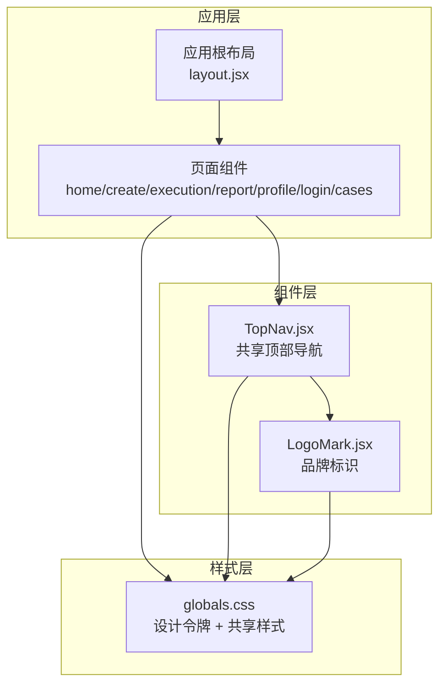
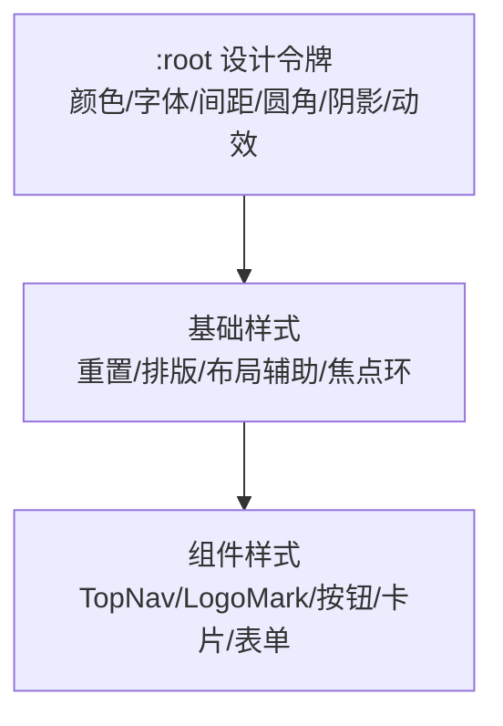
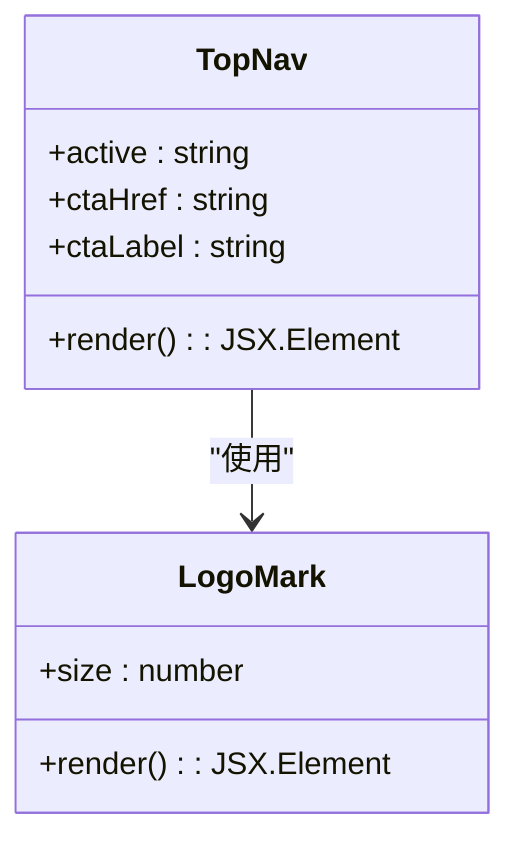
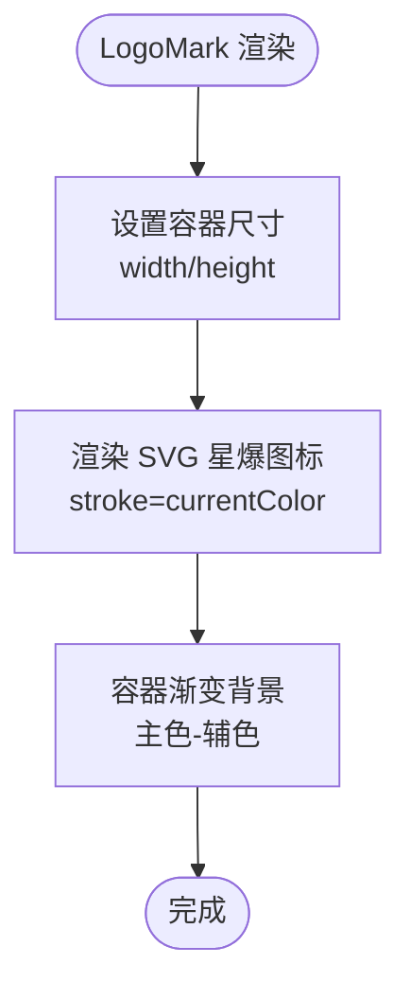
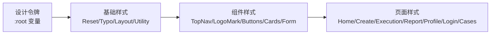
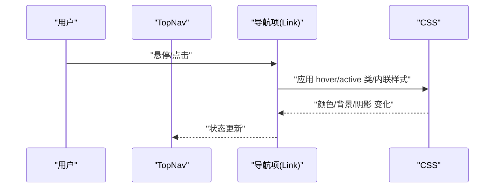
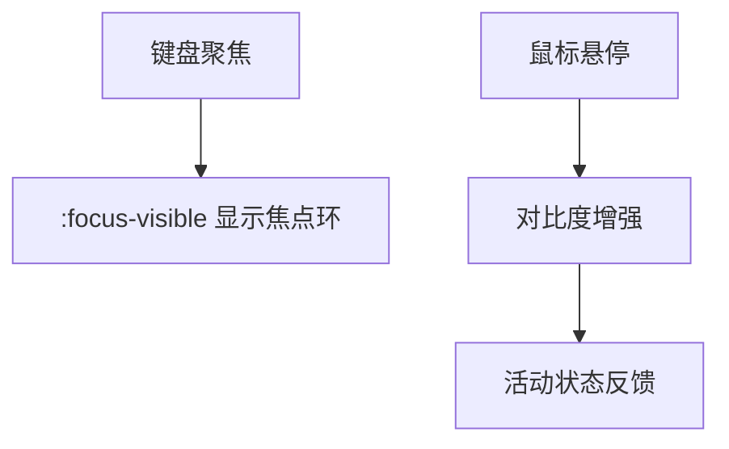
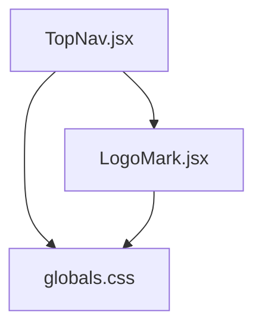

# 组件样式规范

<cite>
**本文档引用的文件**
- [TopNav.jsx](file://src/components/TopNav.jsx)
- [LogoMark.jsx](file://src/components/LogoMark.jsx)
- [globals.css](file://src/app/globals.css)
- [README.md](file://README.md)
</cite>

## 目录
1. [简介](#简介)
2. [项目结构](#项目结构)
3. [核心组件](#核心组件)
4. [架构概览](#架构概览)
5. [详细组件分析](#详细组件分析)
6. [依赖关系分析](#依赖关系分析)
7. [性能考量](#性能考量)
8. [可访问性指南](#可访问性指南)
9. [故障排除指南](#故障排除指南)
10. [结论](#结论)

## 简介
本文件为 InsightMesh 项目的组件样式规范，聚焦于共享组件的样式设计原则与实现方式，重点覆盖 TopNav 顶部导航与 LogoMark 品牌标识的设计与实现。文档从模块化组织、继承与覆盖机制、可访问性、性能优化等维度，提供可复用的样式模板与最佳实践，帮助开发者在保持视觉一致性的同时提升开发效率。

## 项目结构
InsightMesh 采用 Next.js App Router 结构，样式通过单一全局样式文件集中管理，并以原子化与语义化相结合的方式组织组件样式。核心组件位于 src/components 目录，全局样式位于 src/app/globals.css，README 提供了项目背景与技术栈说明。

**图表来源**
- [README.md:13-39](file://README.md#L13-L39)
- [TopNav.jsx:1-45](file://src/components/TopNav.jsx#L1-L45)
- [LogoMark.jsx:1-19](file://src/components/LogoMark.jsx#L1-L19)
- [globals.css:1-134](file://src/app/globals.css#L1-L134)

**章节来源**
- [README.md:13-39](file://README.md#L13-L39)

## 核心组件
本节聚焦两个核心共享组件：TopNav 与 LogoMark，解释其样式职责、设计原则与实现要点。

- TopNav（顶部导航）
  - 职责：提供跨页面一致的导航结构，支持活动状态高亮与右侧操作区（登录/注册、CTA 按钮）。
  - 关键样式：使用粘性定位与玻璃模糊背景，导航链接在 hover 时改变文本色；按钮组采用幽灵与强调两种风格。
  - 交互与状态：通过 props 控制活动项高亮；CTA 文案与链接可配置。

- LogoMark（品牌标识）
  - 职责：提供统一的品牌星爆/五角星图标，用于导航与页面头部。
  - 关键样式：容器尺寸通过内联样式控制，SVG 使用当前文本色绘制，保证与主题色一致。

**章节来源**
- [TopNav.jsx:4-45](file://src/components/TopNav.jsx#L4-L45)
- [LogoMark.jsx:1-19](file://src/components/LogoMark.jsx#L1-L19)
- [globals.css:245-296](file://src/app/globals.css#L245-L296)
- [globals.css:272-280](file://src/app/globals.css#L272-L280)

## 架构概览
样式架构围绕“设计令牌 + 基础样式 + 组件样式”的三层结构展开：
- 设计令牌（Design Tokens）：定义颜色、字体、间距、圆角、阴影、动效曲线与持续时间等全局变量，集中于 :root。
- 基础样式（Base）：重置与通用排版、布局辅助类、可访问性焦点环等。
- 组件样式（Components）：TopNav、LogoMark、按钮、卡片、表单等具体组件的样式实现。

**图表来源**
- [globals.css:12-134](file://src/app/globals.css#L12-L134)
- [globals.css:139-159](file://src/app/globals.css#L139-L159)
- [globals.css:245-296](file://src/app/globals.css#L245-L296)

## 详细组件分析

### TopNav 组件样式分析
TopNav 作为共享导航，承担以下样式职责：
- 导航容器：粘性定位、玻璃模糊背景、底部边框与内边距。
- 品牌区域：LogoMark 与品牌名称组合，使用显示字体与紧凑字距。
- 导航链接：默认浅色文字，hover 时变为前景色；活动项通过内联样式高亮。
- 操作区：登录按钮（幽灵样式）与 CTA 按钮（强调样式），间距与对齐统一。

**图表来源**
- [TopNav.jsx:7-45](file://src/components/TopNav.jsx#L7-L45)
- [LogoMark.jsx:2-19](file://src/components/LogoMark.jsx#L2-L19)

**章节来源**
- [TopNav.jsx:20-42](file://src/components/TopNav.jsx#L20-L42)
- [globals.css:245-296](file://src/app/globals.css#L245-L296)

### LogoMark 组件样式分析
LogoMark 提供品牌标识的统一视觉：
- 容器尺寸：通过内联样式 width/height 控制大小，便于在不同场景复用。
- 图标绘制：SVG 使用当前文本色，确保与主题色一致；stroke 宽度与线帽设置保证清晰度。
- 品牌色块：容器使用渐变背景，体现品牌主色与辅色。

**图表来源**
- [LogoMark.jsx:3-17](file://src/components/LogoMark.jsx#L3-L17)
- [globals.css:272-280](file://src/app/globals.css#L272-L280)

**章节来源**
- [LogoMark.jsx:1-19](file://src/components/LogoMark.jsx#L1-L19)
- [globals.css:272-280](file://src/app/globals.css#L272-L280)

### 模块化组织与分类管理
InsightMesh 的样式组织遵循“设计令牌 + 基础样式 + 组件样式”的分层：
- 基础样式（Reset/Typo/Layout/Utility）：统一重置、排版、布局辅助类与工具类。
- 组件样式（TopNav/Buttons/Cards/Form/...）：按组件维度拆分，便于维护与复用。
- 页面样式（Home/Create/Execution/Report/Profile/Login/Cases）：页面级样式与组件样式协同。

**图表来源**
- [globals.css:12-134](file://src/app/globals.css#L12-L134)
- [globals.css:139-159](file://src/app/globals.css#L139-L159)
- [globals.css:245-296](file://src/app/globals.css#L245-L296)

**章节来源**
- [globals.css:12-134](file://src/app/globals.css#L12-L134)
- [globals.css:139-159](file://src/app/globals.css#L139-L159)

### 继承与覆盖机制
- 继承：组件通过类名继承基础样式（如按钮的基础尺寸、圆角、过渡），再叠加组件特有样式。
- 覆盖：活动状态或 hover 状态通过更具体的选择器或内联样式覆盖默认值（如 TopNav 活动链接的内联颜色）。
- 变体样式：通过类名组合实现按钮变体（如 ghost、primary、outline、accent-2）与尺寸变体（lg/xl）。

**图表来源**
- [TopNav.jsx:11-18](file://src/components/TopNav.jsx#L11-L18)
- [globals.css:285-291](file://src/app/globals.css#L285-L291)

**章节来源**
- [TopNav.jsx:11-18](file://src/components/TopNav.jsx#L11-L18)
- [globals.css:285-291](file://src/app/globals.css#L285-L291)

### 可访问性考虑
- 焦点可见性：通过 :focus-visible 定义统一焦点环，确保键盘导航可感知。
- 颜色对比度：设计令牌中定义的前景/背景色与强调色满足对比度要求；按钮 hover 与 active 状态提供足够对比。
- 键盘导航：链接与按钮均具备可聚焦性，配合 :focus-visible 与 hover 状态提升可用性。

**图表来源**
- [globals.css:512-516](file://src/app/globals.css#L512-L516)
- [globals.css:316-325](file://src/app/globals.css#L316-L325)

**章节来源**
- [globals.css:512-516](file://src/app/globals.css#L512-L516)
- [globals.css:316-325](file://src/app/globals.css#L316-L325)

### 性能优化策略
- 选择器优化：优先使用类名与语义化元素，避免深层嵌套与复杂选择器，减少匹配成本。
- 动画与过渡：使用 CSS 变量控制动效曲线与持续时间，避免频繁重排；利用 transform/opacity 等 GPU 加速属性。
- 重绘重排规避：尽量使用 transform/opacity 改变视觉状态，而非改变布局属性（如 width/height/left/top）。
- 体积控制：将全局样式集中管理，避免重复定义；通过设计令牌统一变量，减少冗余规则。

**章节来源**
- [globals.css:127-133](file://src/app/globals.css#L127-L133)
- [globals.css:378-382](file://src/app/globals.css#L378-L382)

## 依赖关系分析
TopNav 与 LogoMark 的样式依赖关系如下：

**图表来源**
- [TopNav.jsx:23-26](file://src/components/TopNav.jsx#L23-L26)
- [LogoMark.jsx:4-17](file://src/components/LogoMark.jsx#L4-L17)
- [globals.css:245-296](file://src/app/globals.css#L245-L296)

**章节来源**
- [TopNav.jsx:23-26](file://src/components/TopNav.jsx#L23-L26)
- [LogoMark.jsx:4-17](file://src/components/LogoMark.jsx#L4-L17)

## 性能考量
- 选择器复杂度：推荐使用扁平类名组合，避免后代选择器与伪类过度嵌套。
- 动画与过渡：统一使用 CSS 变量控制动效，减少 JS 干预样式计算。
- 响应式与媒体查询：在必要范围内使用媒体查询，避免在小屏幕上重复定义相同规则。
- 字体与图标：SVG 图标内联或外部资源按需加载，避免阻塞主线程。

[本节为通用指导，不直接分析具体文件]

## 可访问性指南
- 焦点管理：确保所有可交互元素可通过键盘聚焦，使用 :focus-visible 提供清晰焦点指示。
- 对比度：遵循 WCAG 对比度标准，使用设计令牌中的前景/背景/强调色组合。
- 屏幕阅读器友好：为不可见元素添加 aria-hidden 或适当的语义标签。
- 键盘导航：支持 Tab/Shift+Tab 导航、Enter/Space 激活、Esc 关闭等常见键盘操作。

**章节来源**
- [globals.css:512-516](file://src/app/globals.css#L512-L516)
- [LogoMark.jsx:12](file://src/components/LogoMark.jsx#L12)

## 故障排除指南
- 活动状态未生效：确认 TopNav 的 active 参数与导航项 key 匹配，且内联样式未被更高优先级规则覆盖。
- Logo 尺寸不正确：检查 LogoMark 的 size prop 传入是否正确，容器内联样式是否被父级覆盖。
- 焦点环缺失：检查 :focus-visible 是否被其他规则覆盖，或是否存在全局 reset 覆盖。
- 动画卡顿：检查是否使用了昂贵的布局属性（如 width/height），建议改用 transform/opacity。

**章节来源**
- [TopNav.jsx:14](file://src/components/TopNav.jsx#L14)
- [LogoMark.jsx:4](file://src/components/LogoMark.jsx#L4)
- [globals.css:512-516](file://src/app/globals.css#L512-L516)

## 结论
InsightMesh 的组件样式规范以设计令牌为核心，结合基础样式与组件样式分层组织，实现了高度一致且易于维护的视觉体系。TopNav 与 LogoMark 通过简洁的类名与内联样式实现灵活的状态控制与主题适配。遵循本文档的模块化、继承与覆盖机制、可访问性与性能优化策略，可确保组件在多页面场景下保持一致性与高性能表现。