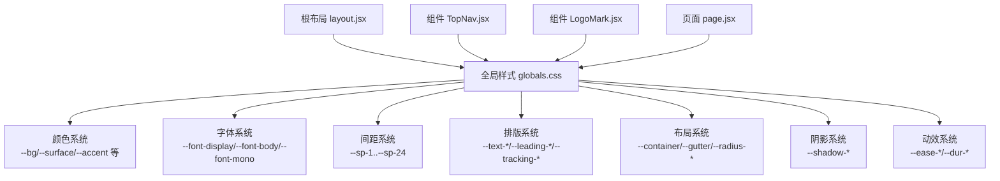
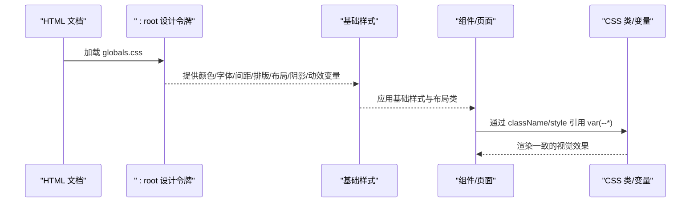
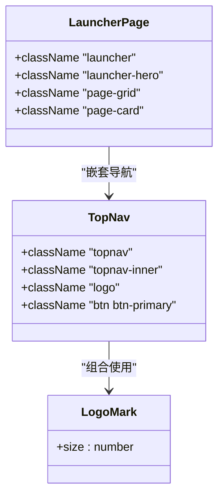
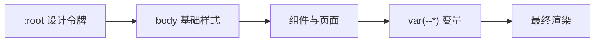

# 设计令牌系统

<cite>
**本文引用的文件**
- [globals.css](file://src/app/globals.css)
- [layout.jsx](file://src/app/layout.jsx)
- [TopNav.jsx](file://src/components/TopNav.jsx)
- [LogoMark.jsx](file://src/components/LogoMark.jsx)
- [page.jsx](file://src/app/page.jsx)
- [package.json](file://package.json)
- [next.config.mjs](file://next.config.mjs)
- [README.md](file://README.md)
</cite>

## 目录
1. [简介](#简介)
2. [项目结构](#项目结构)
3. [核心组件](#核心组件)
4. [架构总览](#架构总览)
5. [详细组件分析](#详细组件分析)
6. [依赖关系分析](#依赖关系分析)
7. [性能考量](#性能考量)
8. [故障排除指南](#故障排除指南)
9. [结论](#结论)
10. [附录](#附录)

## 简介
本文件系统性梳理 InsightMesh 的设计令牌体系，围绕 CSS 自定义属性（--*）展开，覆盖颜色系统、字体系统、间距系统、排版系统、布局系统、阴影系统与动效系统，并给出命名规范、组合策略、使用示例与扩展建议。目标是帮助设计师与开发者在统一的视觉语言下高效协作。

## 项目结构
- 全局样式集中于 src/app/globals.css，包含设计令牌定义与大量共享样式类。
- 根布局 src/app/layout.jsx 引入全局样式，使令牌在整个应用范围内生效。
- 组件如 TopNav.jsx、LogoMark.jsx 在 JSX 中通过 className 或内联 style 使用令牌变量，体现“变量驱动”的设计思想。
- 页面入口 page.jsx 展示了令牌在容器、卡片、网格等布局中的实际应用。

图表来源
- [layout.jsx:1-21](file://src/app/layout.jsx#L1-L21)
- [globals.css:12-134](file://src/app/globals.css#L12-L134)

章节来源
- [layout.jsx:1-21](file://src/app/layout.jsx#L1-L21)
- [globals.css:12-134](file://src/app/globals.css#L12-L134)
- [README.md:8-11](file://README.md#L8-L11)

## 核心组件
- 设计令牌容器：:root 块内集中声明所有 --* 变量，确保作用域全局且可复用。
- 基础样式与重置：body 默认使用 --bg、--fg、--font-body、--text-base、--leading-base 等，形成一致的基线。
- 布局辅助类：container、container-narrow、section、stack、row、gap-*、grid-* 等，均通过 var(--*) 统一尺寸与间距。
- 排版类：h-display、h-section、lead、text-sm/text-base、text-muted、text-accent、mono、font-medium/semibold/bold、tracking-wide、uppercase 等，统一字号、字重、行高与字距。
- 组件与页面：TopNav.jsx、LogoMark.jsx、page.jsx 等通过 className 或内联 style 引用令牌，保证风格一致。

章节来源
- [globals.css:12-134](file://src/app/globals.css#L12-L134)
- [globals.css:139-159](file://src/app/globals.css#L139-L159)
- [globals.css:160-189](file://src/app/globals.css#L160-L189)
- [globals.css:190-233](file://src/app/globals.css#L190-L233)
- [TopNav.jsx:1-45](file://src/components/TopNav.jsx#L1-L45)
- [LogoMark.jsx:1-19](file://src/components/LogoMark.jsx#L1-L19)
- [page.jsx:1-78](file://src/app/page.jsx#L1-L78)

## 架构总览
设计令牌的运行链路如下：
- 在 :root 定义 --* 变量
- 在基础样式与组件类中通过 var(--*) 引用
- 在组件与页面中以 className/style 的形式使用
- 在媒体查询与动画中复用同一变量，保持一致性

图表来源
- [globals.css:12-134](file://src/app/globals.css#L12-L134)
- [globals.css:139-159](file://src/app/globals.css#L139-L159)
- [TopNav.jsx:20-43](file://src/components/TopNav.jsx#L20-L43)
- [page.jsx:27-77](file://src/app/page.jsx#L27-L77)

## 详细组件分析

### 颜色系统（--bg、--surface、--accent 等）
- 背景色与表面色：--bg、--surface、--surface-2、--surface-3，用于页面背景与卡片表面。
- 前景色与次级前景：--fg、--fg-2、--muted、--muted-2，用于文字与弱化信息。
- 边框与分隔：--border、--border-soft，用于边框与分割线。
- 强调色与语义色：--accent、--accent-hover、--accent-active、--accent-soft、--accent-2、--accent-2-hover、--accent-2-active、--accent-2-soft，以及 success/warn/danger/info 及其 soft 变体。
- 分类色：cat-violet、cat-amber、cat-rose、cat-warn-chart 及其 soft 变体，用于节点与图表。
- 使用示例路径：
  - [按钮主色与悬停阴影:316-335](file://src/app/globals.css#L316-L335)
  - [卡片与玻璃卡片背景:373-391](file://src/app/globals.css#L373-L391)
  - [标签与徽章色彩:399-436](file://src/app/globals.css#L399-L436)

命名规范与分类逻辑
- 基础语义：--bg/--surface/--fg/--border 对应“背景/表面/前景/边框”四元组。
- 强调色：--accent 为主强调色，--accent-2 为第二强调色，均配套 hover/active/soft 变体。
- 语义状态：success/warn/danger/info 与 soft 变体用于状态提示。
- 分类：cat-* 用于 Agent 节点与图表段落，便于可视化一致性。

章节来源
- [globals.css:12-60](file://src/app/globals.css#L12-L60)

### 字体系统（--font-display、--font-body、--font-mono）
- 字体族：--font-display、--font-body、--font-mono，分别用于标题、正文与等宽文本。
- 排版类：h-display、h-section、lead、mono、font-medium/semibold/bold、tracking-wide、uppercase 等，统一字号、字重、行高与字距。
- 使用示例路径：
  - [标题与段落排版:190-233](file://src/app/globals.css#L190-L233)
  - [导航与按钮排版:245-296](file://src/app/globals.css#L245-L296)

章节来源
- [globals.css:61-87](file://src/app/globals.css#L61-L87)
- [globals.css:190-233](file://src/app/globals.css#L190-L233)
- [globals.css:245-296](file://src/app/globals.css#L245-L296)

### 间距系统（--sp-1 到 --sp-24）
- 间距刻度：--sp-1=4px、--sp-2=8px、--sp-3=12px、--sp-4=16px、--sp-5=20px、--sp-6=24px、--sp-8=32px、--sp-10=40px、--sp-12=48px、--sp-16=64px、--sp-20=80px、--sp-24=96px。
- 布局类：stack-2/3/4/6/8、gap-2/3/4/6/8、grid-2/3/4/5 等，统一列与行间距。
- 使用示例路径：
  - [容器与间距类:160-189](file://src/app/globals.css#L160-L189)
  - [页面卡片与网格:572-593](file://src/app/globals.css#L572-L593)

章节来源
- [globals.css:88-101](file://src/app/globals.css#L88-L101)
- [globals.css:160-189](file://src/app/globals.css#L160-L189)
- [globals.css:572-593](file://src/app/globals.css#L572-L593)

### 排版系统（--text-*、--leading-*、--tracking-*）
- 字号：--text-xs 到 --text-6xl，覆盖从细小到超大标题的全范围。
- 行高：--leading-tight、--leading-snug、--leading-base、--leading-relaxed。
- 字距：--tracking-tight、--tracking-normal、--tracking-wide、--tracking-wider。
- 使用示例路径：
  - [标题层级与段落:190-233](file://src/app/globals.css#L190-L233)
  - [导航与徽标:235-243](file://src/app/globals.css#L235-L243)

章节来源
- [globals.css:66-87](file://src/app/globals.css#L66-L87)
- [globals.css:190-233](file://src/app/globals.css#L190-L233)

### 布局系统（--container、--gutter、--radius-*）
- 容器与边距：--container、--container-narrow、--gutter，控制页面最大宽度与内边距。
- 圆角：--radius-xs、--radius-sm、--radius、--radius-lg、--radius-xl、--radius-2xl、--radius-pill。
- 使用示例路径：
  - [容器与栅格:160-189](file://src/app/globals.css#L160-L189)
  - [卡片圆角与阴影:373-391](file://src/app/globals.css#L373-L391)

章节来源
- [globals.css:102-113](file://src/app/globals.css#L102-L113)
- [globals.css:160-189](file://src/app/globals.css#L160-L189)
- [globals.css:373-391](file://src/app/globals.css#L373-L391)

### 阴影系统（--shadow-*）
- 阴影层级：--shadow-xs、--shadow-sm、--shadow-md、--shadow-lg、--shadow-xl，配合卡片与浮层使用。
- 使用示例路径：
  - [卡片悬浮阴影:373-391](file://src/app/globals.css#L373-L391)
  - [页面卡片阴影:580-593](file://src/app/globals.css#L580-L593)

章节来源
- [globals.css:114-120](file://src/app/globals.css#L114-L120)
- [globals.css:373-391](file://src/app/globals.css#L373-L391)
- [globals.css:580-593](file://src/app/globals.css#L580-L593)

### 动效系统（--ease-*、--dur-*）
- 缓动曲线：--ease-standard、--ease-out、--ease-in-out。
- 动画时长：--dur-fast、--dur、--dur-slow、--dur-slower。
- 使用示例路径：
  - [按钮过渡与导航高亮:298-371](file://src/app/globals.css#L298-L371)
  - [导航链接过渡:285-291](file://src/app/globals.css#L285-L291)
  - [动画关键帧与类:518-543](file://src/app/globals.css#L518-L543)

章节来源
- [globals.css:126-134](file://src/app/globals.css#L126-L134)
- [globals.css:298-371](file://src/app/globals.css#L298-L371)
- [globals.css:518-543](file://src/app/globals.css#L518-L543)

### 组件与页面中的令牌使用
- 顶部导航 TopNav.jsx：通过 className 引用 --glass-bg、--glass-blur、--border-soft、--radius-* 等，实现粘性导航与毛玻璃效果。
- LogoMark.jsx：作为品牌标识，配合 --accent 与 --accent-2 渐变，统一视觉焦点。
- 页面 page.jsx：Launcher 页面使用 --bg、--surface、--accent-soft、--radius-*、--shadow-* 构建卡片与网格布局。

图表来源
- [TopNav.jsx:20-43](file://src/components/TopNav.jsx#L20-L43)
- [LogoMark.jsx:2-18](file://src/components/LogoMark.jsx#L2-L18)
- [page.jsx:27-77](file://src/app/page.jsx#L27-L77)

章节来源
- [TopNav.jsx:1-45](file://src/components/TopNav.jsx#L1-L45)
- [LogoMark.jsx:1-19](file://src/components/LogoMark.jsx#L1-L19)
- [page.jsx:1-78](file://src/app/page.jsx#L1-L78)

## 依赖关系分析
- 全局样式依赖：:root 的设计令牌为所有组件与页面提供一致的视觉基线。
- 组件依赖：TopNav.jsx、LogoMark.jsx、page.jsx 通过 className/style 引用令牌，形成“变量驱动”的样式体系。
- 构建与运行：Next.js 14 与 React 18 提供运行环境，全局样式在根布局中一次性引入。

图表来源
- [globals.css:12-134](file://src/app/globals.css#L12-L134)
- [globals.css:139-159](file://src/app/globals.css#L139-L159)
- [layout.jsx:1-21](file://src/app/layout.jsx#L1-L21)

章节来源
- [package.json:12-16](file://package.json#L12-L16)
- [next.config.mjs:1-7](file://next.config.mjs#L1-L7)
- [layout.jsx:1-21](file://src/app/layout.jsx#L1-L21)

## 性能考量
- 变量复用：通过 var(--*) 统一样式，减少重复计算与规则体积。
- 布局与栅格：使用 container、grid-*、gap-* 等类，避免复杂选择器带来的重绘成本。
- 动画与过渡：合理使用 --dur-* 与 --ease-*，在保证体验的同时控制动画开销。
- 媒体查询：在关键断点处使用 --sp-* 与 --container-*，提升响应式效率。

## 故障排除指南
- 样式未生效
  - 确认根布局已引入 globals.css。
  - 检查组件是否正确使用 className 或内联 style 引用 --* 变量。
- 颜色不一致
  - 统一使用 --accent、--accent-2、--success、--warn、--danger 等语义变量，避免硬编码颜色。
- 间距错乱
  - 优先使用 stack-*、gap-*、grid-* 等类，或直接引用 --sp-* 变量。
- 排版不统一
  - 使用 h-*、lead、mono、tracking-* 等类，确保字号、行高与字距一致。
- 动画卡顿
  - 控制 --dur-* 与 --ease-*，避免过度复杂的阴影与模糊。

章节来源
- [layout.jsx:1-21](file://src/app/layout.jsx#L1-L21)
- [globals.css:139-159](file://src/app/globals.css#L139-L159)
- [globals.css:160-189](file://src/app/globals.css#L160-L189)
- [globals.css:190-233](file://src/app/globals.css#L190-L233)
- [globals.css:518-543](file://src/app/globals.css#L518-L543)

## 结论
InsightMesh 的设计令牌体系以 :root 为中心，将颜色、字体、间距、排版、布局、阴影与动效统一抽象为可复用的 CSS 变量。通过基础样式与组件类的协同，实现了跨页面的一致性与可维护性。遵循本文的命名规范与组合策略，可在满足设计师视觉需求的同时，兼顾开发者的实现效率与性能表现。

## 附录

### 设计令牌清单与使用路径
- 颜色系统
  - --bg/--surface/--surface-2/--surface-3：[背景与表面:12-18](file://src/app/globals.css#L12-L18)
  - --fg/--fg-2/--muted/--muted-2：[前景与弱化:19-24](file://src/app/globals.css#L19-L24)
  - --border/--border-soft：[边框与分隔:25-28](file://src/app/globals.css#L25-L28)
  - --accent/--accent-hover/--accent-active/--accent-soft：[强调色:29-35](file://src/app/globals.css#L29-L35)
  - --accent-2/--accent-2-hover/--accent-2-active/--accent-2-soft：[第二强调色:36-41](file://src/app/globals.css#L36-L41)
  - success/warn/danger/info 及 soft：[语义状态:42-51](file://src/app/globals.css#L42-L51)
  - cat-violet/cat-amber/cat-rose/cat-warn-chart 及 soft：[分类色:52-60](file://src/app/globals.css#L52-L60)
- 字体系统
  - --font-display/--font-body/--font-mono：[字体族:61-64](file://src/app/globals.css#L61-L64)
  - 排版类：[标题与段落:190-233](file://src/app/globals.css#L190-L233)
- 间距系统
  - --sp-1..--sp-24：[间距刻度:88-101](file://src/app/globals.css#L88-L101)
  - 布局类：[容器与栅格:160-189](file://src/app/globals.css#L160-L189)
- 排版系统
  - --text-*、--leading-*、--tracking-*：[字号/行高/字距:66-87](file://src/app/globals.css#L66-L87)
- 布局系统
  - --container/--container-narrow/--gutter：[容器与边距:102-105](file://src/app/globals.css#L102-L105)
  - --radius-*：[圆角:106-113](file://src/app/globals.css#L106-L113)
- 阴影系统
  - --shadow-*：[阴影层级:114-120](file://src/app/globals.css#L114-L120)
- 动效系统
  - --ease-*、--dur-*：[缓动与时长:126-134](file://src/app/globals.css#L126-L134)

### 最佳实践
- 命名规范
  - 语义化：优先使用语义变量（--accent、--success、--danger），避免硬编码颜色。
  - 组合性：通过组合 --radius-*、--shadow-*、--spacing-* 形成一致的组件外观。
- 使用示例
  - 组件：TopNav.jsx 使用 --glass-bg、--glass-blur、--border-soft、--radius-*。
  - 页面：page.jsx 使用 --bg、--surface、--accent-soft、--radius-*、--shadow-*。
- 扩展策略
  - 新增变量：在 :root 下按类别补充 --* 变量，保持命名前缀一致。
  - 新增类：在 globals.css 中新增类，统一引用现有变量，避免重复定义。
  - 动画：通过 --ease-* 与 --dur-* 控制过渡与关键帧，确保性能与体验平衡。

章节来源
- [globals.css:12-134](file://src/app/globals.css#L12-L134)
- [globals.css:160-189](file://src/app/globals.css#L160-L189)
- [globals.css:190-233](file://src/app/globals.css#L190-L233)
- [TopNav.jsx:20-43](file://src/components/TopNav.jsx#L20-L43)
- [page.jsx:27-77](file://src/app/page.jsx#L27-L77)