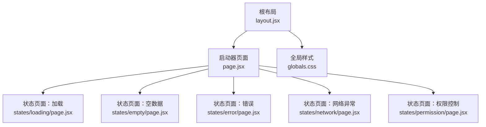
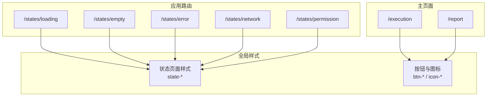
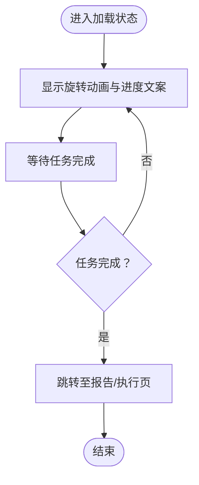
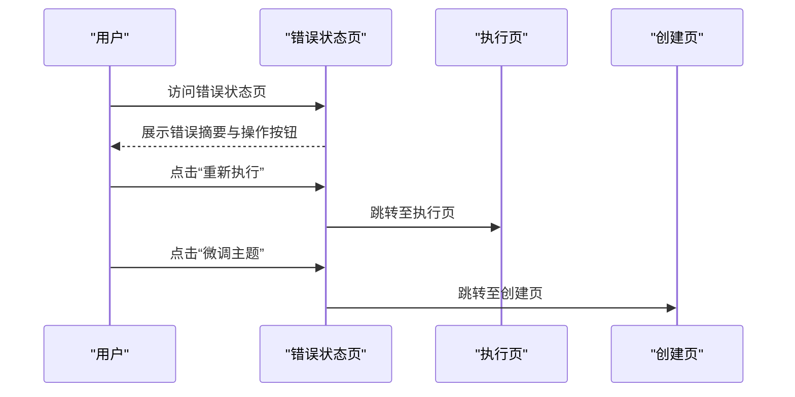
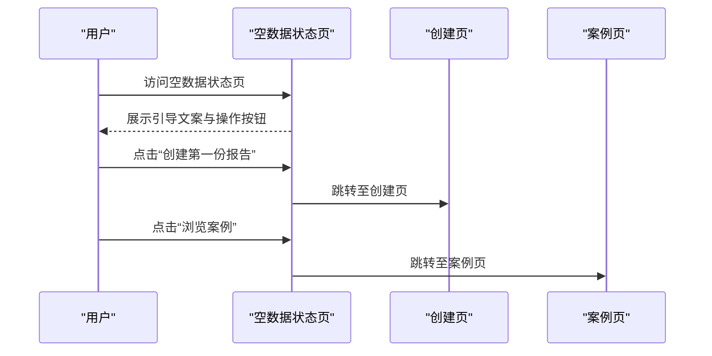
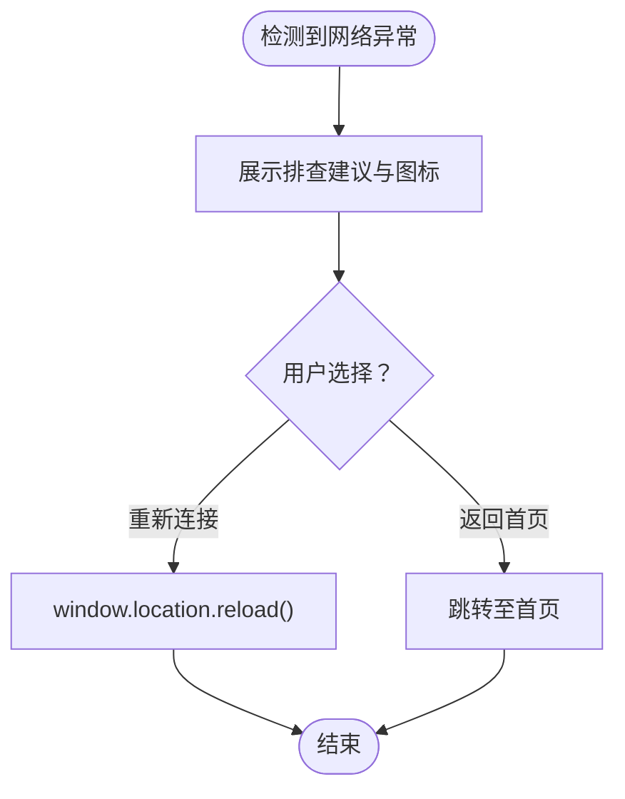
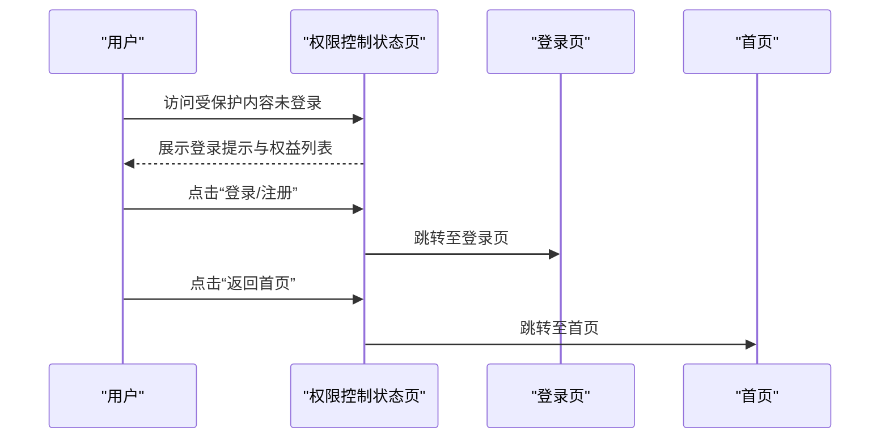
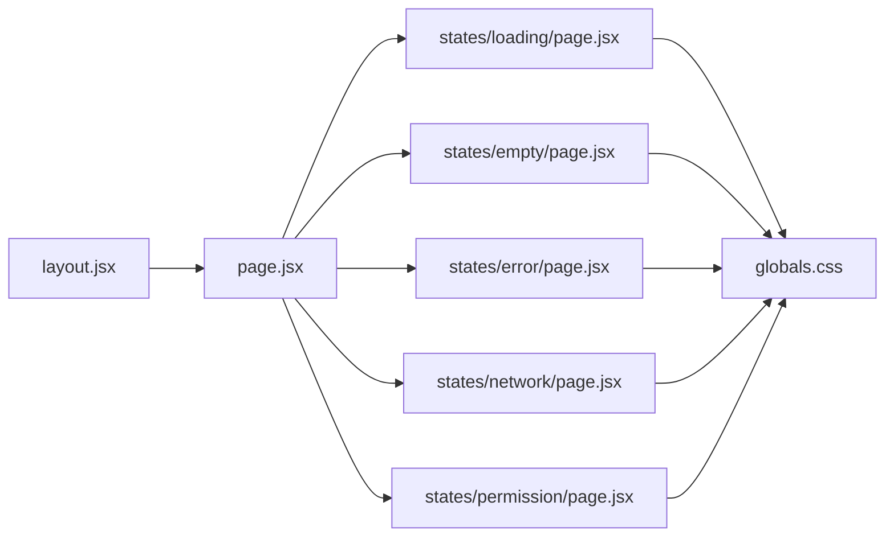

# 状态页面

<cite>
**本文引用的文件**
- [src/app/states/loading/page.jsx](file://src/app/states/loading/page.jsx)
- [src/app/states/error/page.jsx](file://src/app/states/error/page.jsx)
- [src/app/states/empty/page.jsx](file://src/app/states/empty/page.jsx)
- [src/app/states/network/page.jsx](file://src/app/states/network/page.jsx)
- [src/app/states/permission/page.jsx](file://src/app/states/permission/page.jsx)
- [src/app/globals.css](file://src/app/globals.css)
- [src/app/layout.jsx](file://src/app/layout.jsx)
- [src/app/page.jsx](file://src/app/page.jsx)
- [src/app/execution/page.jsx](file://src/app/execution/page.jsx)
- [src/app/report/page.jsx](file://src/app/report/page.jsx)
</cite>

## 目录
1. [简介](#简介)
2. [项目结构](#项目结构)
3. [核心组件](#核心组件)
4. [架构总览](#架构总览)
5. [详细组件分析](#详细组件分析)
6. [依赖关系分析](#依赖关系分析)
7. [性能考量](#性能考量)
8. [故障排查指南](#故障排查指南)
9. [结论](#结论)
10. [附录](#附录)

## 简介
本文件系统化梳理 InsightMesh 的“状态页面”体系，围绕五种特殊状态页面进行设计目的、实现方式与使用场景的深入解析：加载状态、错误处理、空数据提示、网络异常、权限控制。文档不仅解释各页面的触发条件、用户交互与恢复机制，还总结其在整个应用中的作用与重要性，并提供可访问性与国际化支持建议、定制化与扩展方法，以及最佳实践与调试技巧，帮助开发者快速理解并实现类似的状态页面功能。

## 项目结构
状态页面位于应用路由的 states 子目录下，每个页面都是独立的 Next.js App Router 路由组件，采用语义化的路径命名与清晰的页面结构，配合全局样式实现一致的视觉与交互风格。

图表来源
- [src/app/layout.jsx:14-20](file://src/app/layout.jsx#L14-L20)
- [src/app/page.jsx:19-25](file://src/app/page.jsx#L19-L25)
- [src/app/states/loading/page.jsx:1-12](file://src/app/states/loading/page.jsx#L1-L12)
- [src/app/states/empty/page.jsx:1-25](file://src/app/states/empty/page.jsx#L1-L25)
- [src/app/states/error/page.jsx:1-21](file://src/app/states/error/page.jsx#L1-L21)
- [src/app/states/network/page.jsx:1-33](file://src/app/states/network/page.jsx#L1-L33)
- [src/app/states/permission/page.jsx:1-28](file://src/app/states/permission/page.jsx#L1-L28)
- [src/app/globals.css:2558-2611](file://src/app/globals.css#L2558-L2611)

章节来源
- [src/app/layout.jsx:14-20](file://src/app/layout.jsx#L14-L20)
- [src/app/page.jsx:19-25](file://src/app/page.jsx#L19-L25)

## 核心组件
五种状态页面均采用简洁的卡片式布局，统一的视觉层级与交互元素，辅以语义化图标与文案，确保在不同状态下为用户提供明确的指引与操作入口。它们共同构成了 InsightMesh 在“数据缺失、网络异常、权限不足、执行中、失败”等典型场景下的用户体验闭环。

- 加载状态：用于展示长时间任务执行过程中的进度与预期剩余时间，避免用户误以为页面卡死。
- 错误处理：在调研失败时提供错误摘要、重试与微调主题的操作路径，减少用户困惑。
- 空数据提示：在无历史报告或目标资源为空时，引导用户创建首个报告或浏览案例。
- 网络异常：在网络断连或超时时，给出排查建议与一键重连按钮，提升可恢复性。
- 权限控制：在访问受保护内容前，提示登录并展示权益，促进转化与留存。

章节来源
- [src/app/states/loading/page.jsx:1-12](file://src/app/states/loading/page.jsx#L1-L12)
- [src/app/states/error/page.jsx:1-21](file://src/app/states/error/page.jsx#L1-L21)
- [src/app/states/empty/page.jsx:1-25](file://src/app/states/empty/page.jsx#L1-L25)
- [src/app/states/network/page.jsx:1-33](file://src/app/states/network/page.jsx#L1-L33)
- [src/app/states/permission/page.jsx:1-28](file://src/app/states/permission/page.jsx#L1-L28)

## 架构总览
状态页面作为应用路由的一部分，与主页面、执行页、报告页等页面协同工作，形成完整的用户旅程。它们通过统一的全局样式与组件库，保证在不同页面间的一致性与可维护性。

图表来源
- [src/app/states/loading/page.jsx:1-12](file://src/app/states/loading/page.jsx#L1-L12)
- [src/app/states/empty/page.jsx:1-25](file://src/app/states/empty/page.jsx#L1-L25)
- [src/app/states/error/page.jsx:1-21](file://src/app/states/error/page.jsx#L1-L21)
- [src/app/states/network/page.jsx:1-33](file://src/app/states/network/page.jsx#L1-L33)
- [src/app/states/permission/page.jsx:1-28](file://src/app/states/permission/page.jsx#L1-L28)
- [src/app/execution/page.jsx:55-168](file://src/app/execution/page.jsx#L55-L168)
- [src/app/report/page.jsx:37-249](file://src/app/report/page.jsx#L37-L249)
- [src/app/globals.css:2558-2611](file://src/app/globals.css#L2558-L2611)

## 详细组件分析

### 加载状态页面
- 设计目的：在长时间任务执行期间，向用户传达“正在处理中”的信息，减少焦虑与误关页面的行为。
- 触发条件：当进入执行页或需要等待异步数据加载时，展示加载状态页面。
- 用户交互：提供旋转动画与进度文案，保持页面静默等待。
- 恢复机制：任务完成后自动跳转至报告页或执行页的后续步骤。
- 样式与图标：使用统一的“state-spinner”旋转动画与“state-card”卡片布局，确保视觉一致性。

图表来源
- [src/app/states/loading/page.jsx:1-12](file://src/app/states/loading/page.jsx#L1-L12)
- [src/app/execution/page.jsx:55-63](file://src/app/execution/page.jsx#L55-L63)

章节来源
- [src/app/states/loading/page.jsx:1-12](file://src/app/states/loading/page.jsx#L1-L12)
- [src/app/execution/page.jsx:55-63](file://src/app/execution/page.jsx#L55-L63)

### 错误处理页面
- 设计目的：在调研失败时，清晰展示错误摘要与可操作的恢复路径，降低用户挫败感。
- 触发条件：当数据源超时或生成中断时，展示错误状态页面。
- 用户交互：提供“重新执行”和“微调主题”两个主要操作按钮，便于快速恢复。
- 恢复机制：点击按钮后分别回到执行页或创建页，允许用户调整参数后重试。
- 样式与图标：使用“state-error-detail”展示错误码与状态信息，增强可诊断性。

图表来源
- [src/app/states/error/page.jsx:1-21](file://src/app/states/error/page.jsx#L1-L21)
- [src/app/execution/page.jsx:55-168](file://src/app/execution/page.jsx#L55-L168)
- [src/app/report/page.jsx:37-249](file://src/app/report/page.jsx#L37-L249)

章节来源
- [src/app/states/error/page.jsx:1-21](file://src/app/states/error/page.jsx#L1-L21)

### 空数据提示页面
- 设计目的：在用户首次进入或无历史记录时，引导其创建第一个报告或浏览案例。
- 触发条件：当报告列表为空或目标资源不存在时，展示空数据状态页面。
- 用户交互：提供“创建第一份报告”和“浏览案例”两个入口，降低首次使用门槛。
- 恢复机制：点击按钮后分别跳转至创建页或案例页，推动用户完成关键动作。
- 样式与图标：使用“empty-ico”与“state-card”布局，营造友好、鼓励性的氛围。

图表来源
- [src/app/states/empty/page.jsx:1-25](file://src/app/states/empty/page.jsx#L1-L25)
- [src/app/page.jsx:19-25](file://src/app/page.jsx#L19-L25)

章节来源
- [src/app/states/empty/page.jsx:1-25](file://src/app/states/empty/page.jsx#L1-L25)

### 网络异常页面
- 设计目的：在网络断连或超时发生时，提供清晰的排查建议与一键重连能力，提升可恢复性。
- 触发条件：当网络请求失败或连接异常时，展示网络异常状态页面。
- 用户交互：提供“重新连接”按钮与“返回首页”链接，满足不同恢复需求。
- 恢复机制：“重新连接”通过刷新页面尝试恢复；“返回首页”回到稳定入口。
- 样式与图标：使用“state-tips”与“state-perks”等容器，组织排查要点与权益说明。

图表来源
- [src/app/states/network/page.jsx:1-33](file://src/app/states/network/page.jsx#L1-L33)

章节来源
- [src/app/states/network/page.jsx:1-33](file://src/app/states/network/page.jsx#L1-L33)

### 权限控制页面
- 设计目的：在访问受保护内容前，提示用户登录并展示权益，促进转化与留存。
- 触发条件：当用户未登录或权限不足时，展示权限控制状态页面。
- 用户交互：提供“登录/注册”与“返回首页”两个入口，兼顾转化与体验。
- 恢复机制：登录成功后应能回到受保护内容；否则返回首页继续浏览。
- 样式与图标：使用“state-perks”展示权益列表，增强登录动机。

图表来源
- [src/app/states/permission/page.jsx:1-28](file://src/app/states/permission/page.jsx#L1-L28)
- [src/app/page.jsx:19-25](file://src/app/page.jsx#L19-L25)

章节来源
- [src/app/states/permission/page.jsx:1-28](file://src/app/states/permission/page.jsx#L1-L28)

## 依赖关系分析
状态页面与全局样式之间存在强耦合关系，样式类名如“state-body”、“state-card”、“state-spinner”等在各状态页中重复出现，形成统一的视觉与交互规范。同时，状态页通过 Next.js 的 Link 组件与其他页面建立导航关系，构成完整的用户旅程。

图表来源
- [src/app/layout.jsx:14-20](file://src/app/layout.jsx#L14-L20)
- [src/app/page.jsx:19-25](file://src/app/page.jsx#L19-L25)
- [src/app/states/loading/page.jsx:1-12](file://src/app/states/loading/page.jsx#L1-L12)
- [src/app/states/empty/page.jsx:1-25](file://src/app/states/empty/page.jsx#L1-L25)
- [src/app/states/error/page.jsx:1-21](file://src/app/states/error/page.jsx#L1-L21)
- [src/app/states/network/page.jsx:1-33](file://src/app/states/network/page.jsx#L1-L33)
- [src/app/states/permission/page.jsx:1-28](file://src/app/states/permission/page.jsx#L1-L28)
- [src/app/globals.css:2558-2611](file://src/app/globals.css#L2558-L2611)

章节来源
- [src/app/globals.css:2558-2611](file://src/app/globals.css#L2558-L2611)

## 性能考量
- 静态预渲染：根据项目说明，所有路由均为静态预渲染，状态页面作为独立路由同样受益于首屏性能优化。
- 样式体积：全局样式集中管理，避免重复定义，有利于缓存与传输效率。
- 交互最小化：状态页面以展示与引导为主，尽量减少不必要的副作用与状态更新，降低内存占用。

## 故障排查指南
- 网络异常页面：若“重新连接”无效，检查浏览器网络面板与服务端可达性；必要时引导用户切换网络或稍后再试。
- 错误处理页面：关注“state-error-detail”中的错误码与数据源状态，结合执行页的日志定位问题。
- 权限控制页面：确认登录状态与权限策略；若权限变更，需确保前端路由守卫与后端鉴权一致。
- 加载状态页面：若长时间无响应，检查任务队列与数据源可用性；适当增加超时与重试逻辑。
- 空数据提示页面：确认数据初始化与过滤条件，避免误判为空。

章节来源
- [src/app/states/network/page.jsx:1-33](file://src/app/states/network/page.jsx#L1-L33)
- [src/app/states/error/page.jsx:1-21](file://src/app/states/error/page.jsx#L1-L21)
- [src/app/states/permission/page.jsx:1-28](file://src/app/states/permission/page.jsx#L1-L28)
- [src/app/states/loading/page.jsx:1-12](file://src/app/states/loading/page.jsx#L1-L12)
- [src/app/states/empty/page.jsx:1-25](file://src/app/states/empty/page.jsx#L1-L25)

## 结论
InsightMesh 的五种状态页面通过统一的视觉与交互规范，有效提升了用户在“加载、错误、空数据、网络异常、权限不足”等关键场景下的体验。它们不仅是用户旅程中的“缓冲带”，更是产品可诊断性与可恢复性的关键支点。遵循本文的实现思路、可访问性与国际化建议，以及最佳实践与调试技巧，开发者可以高效地构建并维护高质量的状态页面体系。

## 附录

### 可访问性设计建议
- 文本对比度：确保标题与正文在深浅主题下均满足对比度要求。
- 键盘导航：为按钮与链接提供可聚焦与可激活的键盘交互。
- 屏幕阅读器：为图标与状态信息提供语义化标签或隐藏文本。
- 动画偏好：尊重“减少动态效果”的系统设置，避免强制播放旋转动画。

### 国际化支持建议
- 文案本地化：将所有文案提取为可替换的键值对，支持多语言切换。
- 数字与日期格式：根据区域设置格式化时间与进度信息。
- 文字方向：确保 RTL 语言的布局与对齐正确。

### 定制化与扩展方法
- 新增状态页：参考现有状态页的结构与样式类名，统一命名与图标风格。
- 组件化复用：将公共的“状态卡片”“图标”“按钮”抽象为共享组件，提高一致性与可维护性。
- 动态文案：通过查询参数或上下文动态注入文案与操作按钮，增强灵活性。

### 最佳实践与调试技巧
- 明确触发条件：为每种状态定义清晰的触发条件与边界，避免状态漂移。
- 一致的交互：统一按钮尺寸、间距与颜色语义，减少认知负担。
- 可观测性：在错误与网络异常页面中保留必要的诊断信息，便于定位问题。
- A/B 测试：对引导文案与按钮位置进行小范围测试，持续优化转化率。