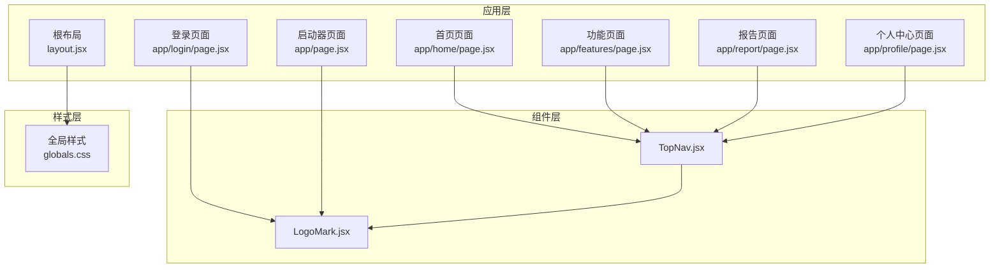
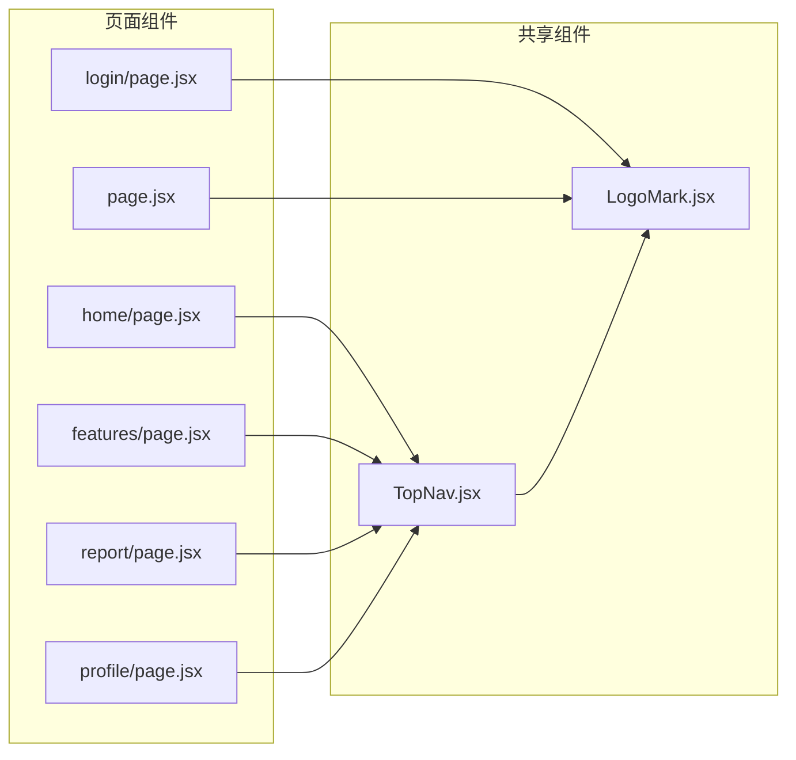
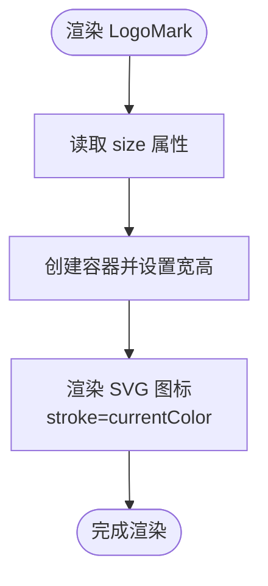
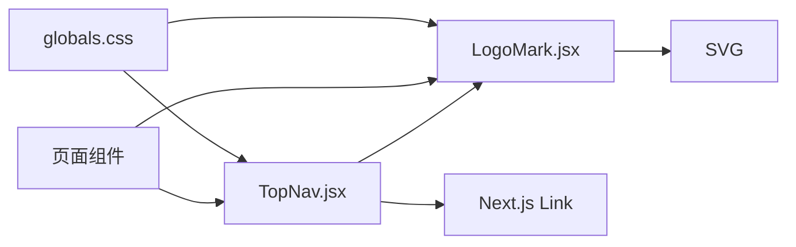

# 组件系统

<cite>
**本文引用的文件**
- [README.md](file://README.md)
- [package.json](file://package.json)
- [src/app/layout.jsx](file://src/app/layout.jsx)
- [src/app/globals.css](file://src/app/globals.css)
- [src/components/TopNav.jsx](file://src/components/TopNav.jsx)
- [src/components/LogoMark.jsx](file://src/components/LogoMark.jsx)
- [src/app/home/page.jsx](file://src/app/home/page.jsx)
- [src/app/features/page.jsx](file://src/app/features/page.jsx)
- [src/app/report/page.jsx](file://src/app/report/page.jsx)
- [src/app/profile/page.jsx](file://src/app/profile/page.jsx)
- [src/app/login/page.jsx](file://src/app/login/page.jsx)
- [src/app/page.jsx](file://src/app/page.jsx)
</cite>

## 目录
1. [简介](#简介)
2. [项目结构](#项目结构)
3. [核心组件](#核心组件)
4. [架构总览](#架构总览)
5. [组件详解](#组件详解)
6. [依赖关系分析](#依赖关系分析)
7. [性能考量](#性能考量)
8. [故障排查指南](#故障排查指南)
9. [结论](#结论)
10. [附录](#附录)

## 简介
本文件面向 InsightMesh 的组件系统，聚焦于共享组件的设计理念与实现细节，重点解析 TopNav 顶部导航栏与 LogoMark 品牌标识两个组件的功能、属性接口、事件处理与状态管理方式，以及它们在应用中的使用范式。同时给出组件间通信模式、数据流向、可复用性设计原则、扩展机制、样式定制与主题适配方案，并提供组件开发指南（命名规范、代码结构、测试策略），帮助初学者快速上手，也为有经验的开发者提供深入的技术细节。

## 项目结构
InsightMesh 采用 Next.js App Router 的页面级组织方式，全局样式集中于根布局引入的全局样式文件，组件位于 src/components 下，页面组件位于 src/app 下。组件系统以“共享组件 + 页面组件”的分层方式组织，TopNav 与 LogoMark 作为共享组件被多个页面复用。



图表来源
- [src/app/layout.jsx:1-21](file://src/app/layout.jsx#L1-L21)
- [src/app/globals.css:1-134](file://src/app/globals.css#L1-L134)
- [src/components/TopNav.jsx:1-45](file://src/components/TopNav.jsx#L1-L45)
- [src/components/LogoMark.jsx:1-19](file://src/components/LogoMark.jsx#L1-L19)
- [src/app/home/page.jsx:1-212](file://src/app/home/page.jsx#L1-L212)
- [src/app/features/page.jsx](file://src/app/features/page.jsx)
- [src/app/report/page.jsx](file://src/app/report/page.jsx)
- [src/app/profile/page.jsx](file://src/app/profile/page.jsx)
- [src/app/login/page.jsx](file://src/app/login/page.jsx)
- [src/app/page.jsx](file://src/app/page.jsx)

章节来源
- [README.md:13-39](file://README.md#L13-L39)
- [src/app/layout.jsx:1-21](file://src/app/layout.jsx#L1-L21)
- [src/app/globals.css:1-134](file://src/app/globals.css#L1-L134)

## 核心组件
- TopNav：共享顶部导航组件，负责主导航链接高亮与右侧操作区（登录/注册、CTA）渲染。支持通过 active 参数高亮当前页面导航项，支持通过 ctaHref 与 ctaLabel 自定义右上角主要行动按钮。
- LogoMark：品牌标识组件，提供统一的星芒/星形矢量图标，支持通过 size 属性控制尺寸。

章节来源
- [src/components/TopNav.jsx:4-7](file://src/components/TopNav.jsx#L4-L7)
- [src/components/TopNav.jsx:20-43](file://src/components/TopNav.jsx#L20-L43)
- [src/components/LogoMark.jsx:1-2](file://src/components/LogoMark.jsx#L1-L2)
- [src/components/LogoMark.jsx:2-5](file://src/components/LogoMark.jsx#L2-L5)

## 架构总览
组件系统遵循“页面驱动 + 共享组件复用”的架构。页面组件通过导入 TopNav 与 LogoMark，实现一致的品牌视觉与导航体验。样式系统通过全局 CSS 变量与工具类，统一颜色、排版、间距与交互反馈。



图表来源
- [src/app/home/page.jsx:54-57](file://src/app/home/page.jsx#L54-L57)
- [src/app/features/page.jsx](file://src/app/features/page.jsx)
- [src/app/report/page.jsx:1-8](file://src/app/report/page.jsx#L1-L8)
- [src/app/profile/page.jsx:1-13](file://src/app/profile/page.jsx#L1-L13)
- [src/app/login/page.jsx:1-14](file://src/app/login/page.jsx#L1-L14)
- [src/app/page.jsx:1-17](file://src/app/page.jsx#L1-L17)
- [src/components/TopNav.jsx:23-24](file://src/components/TopNav.jsx#L23-L24)
- [src/components/LogoMark.jsx:2-4](file://src/components/LogoMark.jsx#L2-L4)

## 组件详解

### TopNav 顶部导航
- 设计理念
  - 保持跨页面一致的品牌与导航体验，通过 active 参数实现“当前页面”高亮，提升用户定位感。
  - 将 CTA（如“免费开始”）作为可配置项，便于不同页面灵活调整行动号召。
- 属性接口
  - active: string | null
    - 可选值："features" | "how" | "cases" | "profile" | null
    - 默认值: null
    - 作用: 匹配对应导航项时进行高亮
  - ctaHref: string
    - 默认值: "/create"
    - 作用: 右侧主要按钮的跳转地址
  - ctaLabel: string
    - 默认值: "免费开始"
    - 作用: 右侧主要按钮的文案
- 事件处理与状态管理
  - TopNav 内部不维护状态，仅根据 props 渲染。导航高亮通过比较 active 与导航键值决定样式。
  - 登录/注册与 CTA 按钮使用 Next.js Link 组件进行客户端导航，避免整页刷新。
- 使用示例（路径）
  - 在首页使用：[src/app/home/page.jsx:54-57](file://src/app/home/page.jsx#L54-L57)
  - 在功能页使用：[src/app/features/page.jsx](file://src/app/features/page.jsx)
  - 在报告页使用：[src/app/report/page.jsx:1-8](file://src/app/report/page.jsx#L1-L8)
  - 在个人中心页使用：[src/app/profile/page.jsx:1-13](file://src/app/profile/page.jsx#L1-L13)
- 组件间通信与数据流
  - TopNav 不接收外部回调或状态，属于“展示型组件”。页面通过传入 active 与 CTA 参数驱动其渲染。
  - 导航点击由 Next.js Link 处理，无额外事件处理逻辑。
- 样式与主题适配
  - 使用 CSS 变量与工具类实现主题一致性，高亮通过内联样式覆盖文本色。
  - 全局样式定义了导航容器、链接、按钮等类名与变量，保证跨页面风格统一。
- 扩展机制
  - 可新增导航项：在组件内部增加 navLink 调用与匹配键值，并在页面传入对应的 active。
  - 可扩展操作区：在现有 Actions 区域追加更多 Link 或 Button。
- 最佳实践
  - 页面在挂载时传入与当前路由匹配的 active 键值，确保高亮准确。
  - CTA 的 href 与 label 应与业务目标对齐，避免跨页面频繁变更导致维护成本上升。

```mermaid
sequenceDiagram
participant Page as "页面组件"
participant TopNav as "TopNav"
participant Link as "Next.js Link"
participant Router as "路由"
Page->>TopNav : 传入 {active, ctaHref, ctaLabel}
TopNav->>TopNav : 根据 active 决定链接高亮
TopNav->>Link : 渲染导航链接与 CTA
Link->>Router : 客户端导航
Router-->>Page : 更新视图无整页刷新
```

图表来源
- [src/components/TopNav.jsx:7-18](file://src/components/TopNav.jsx#L7-L18)
- [src/components/TopNav.jsx:20-43](file://src/components/TopNav.jsx#L20-L43)
- [src/app/home/page.jsx:54-57](file://src/app/home/page.jsx#L54-L57)

章节来源
- [src/components/TopNav.jsx:4-7](file://src/components/TopNav.jsx#L4-L7)
- [src/components/TopNav.jsx:11-18](file://src/components/TopNav.jsx#L11-L18)
- [src/components/TopNav.jsx:20-43](file://src/components/TopNav.jsx#L20-L43)
- [src/app/home/page.jsx:54-57](file://src/app/home/page.jsx#L54-L57)

### LogoMark 品牌标识
- 设计理念
  - 提供统一的星芒矢量图标，作为品牌识别的核心元素，贯穿页面与导航。
- 属性接口
  - size: number
    - 默认值: 28
    - 作用: 控制图标宽度与高度（px）
- 事件处理与状态管理
  - 无状态组件，纯展示。
- 使用示例（路径）
  - 在 TopNav 中使用：[src/components/TopNav.jsx:23-24](file://src/components/TopNav.jsx#L23-L24)
  - 在登录页使用：[src/app/login/page.jsx:1-14](file://src/app/login/page.jsx#L1-L14)
  - 在启动器页使用：[src/app/page.jsx:1-17](file://src/app/page.jsx#L1-L17)
- 样式与主题适配
  - 图标使用 currentColor 与 CSS 变量，随父元素文本色变化，天然适配深浅主题。
  - 容器使用圆角与渐变背景，突出品牌识别度。
- 扩展机制
  - 可通过外部容器类名或内联样式进一步定制尺寸与颜色。
  - 如需多形态图标，可在组件外层封装以支持不同变体。
- 最佳实践
  - 保持 size 与排版层级一致，避免视觉跳跃。
  - 与文字组合时注意对齐与间距，优先使用工具类保证一致性。



图表来源
- [src/components/LogoMark.jsx:2-5](file://src/components/LogoMark.jsx#L2-L5)
- [src/components/TopNav.jsx:23-24](file://src/components/TopNav.jsx#L23-L24)

章节来源
- [src/components/LogoMark.jsx:1-2](file://src/components/LogoMark.jsx#L1-L2)
- [src/components/LogoMark.jsx:2-5](file://src/components/LogoMark.jsx#L2-L5)
- [src/components/TopNav.jsx:23-24](file://src/components/TopNav.jsx#L23-L24)

## 依赖关系分析
- 组件依赖
  - TopNav 依赖 Next.js Link 与 LogoMark。
  - LogoMark 依赖 SVG 渲染与 CSS 变量。
- 页面依赖
  - 多个页面导入 TopNav，部分页面导入 LogoMark。
- 样式依赖
  - 全局样式提供导航、按钮、卡片、工具类等通用样式，TopNav 与 LogoMark 的类名与变量均来自该文件。



图表来源
- [src/components/TopNav.jsx:1-2](file://src/components/TopNav.jsx#L1-L2)
- [src/components/TopNav.jsx:23-24](file://src/components/TopNav.jsx#L23-L24)
- [src/components/LogoMark.jsx:4-15](file://src/components/LogoMark.jsx#L4-L15)
- [src/app/globals.css:245-371](file://src/app/globals.css#L245-L371)

章节来源
- [src/components/TopNav.jsx:1-2](file://src/components/TopNav.jsx#L1-L2)
- [src/components/LogoMark.jsx:4-15](file://src/components/LogoMark.jsx#L4-L15)
- [src/app/globals.css:245-371](file://src/app/globals.css#L245-L371)

## 性能考量
- 静态预渲染与体积
  - 项目采用静态预渲染，构建后所有路由均为静态，首屏 JS 体积较小，有利于首屏性能与 SEO。
- 组件渲染
  - TopNav 与 LogoMark 均为轻量组件，无副作用，渲染开销低。
- 样式体积
  - 全局样式集中管理，避免重复样式注入，减少 CSS 体积。
- 导航性能
  - 使用 Next.js Link 进行客户端导航，避免整页刷新，提升交互流畅度。

章节来源
- [README.md:80-86](file://README.md#L80-L86)
- [src/components/TopNav.jsx:20-43](file://src/components/TopNav.jsx#L20-L43)
- [src/components/LogoMark.jsx:2-5](file://src/components/LogoMark.jsx#L2-L5)

## 故障排查指南
- 导航高亮不生效
  - 检查页面传入的 active 是否与 TopNav 内部导航键值一致。
  - 确认页面路由与导航链接的 href 对应关系。
- CTA 按钮不符合预期
  - 检查 ctaHref 与 ctaLabel 的传入是否正确。
  - 确认页面中 Link 组件的 href 是否指向期望路径。
- 图标颜色异常
  - 确认父元素文本色是否符合预期，LogoMark 使用 currentColor。
  - 检查全局样式中相关变量是否被覆盖。
- 样式错乱
  - 确认全局样式是否正确引入。
  - 检查是否存在局部样式覆盖导致的冲突。

章节来源
- [src/components/TopNav.jsx:7-18](file://src/components/TopNav.jsx#L7-L18)
- [src/components/TopNav.jsx:20-43](file://src/components/TopNav.jsx#L20-L43)
- [src/components/LogoMark.jsx:4-15](file://src/components/LogoMark.jsx#L4-L15)
- [src/app/globals.css:245-371](file://src/app/globals.css#L245-L371)

## 结论
TopNav 与 LogoMark 作为 InsightMesh 的共享组件，通过简洁的属性接口与稳定的样式体系，实现了跨页面的一致性体验。TopNav 以“高亮 + CTA”为核心能力，LogoMark 以“统一图标”为核心价值。二者配合全局样式与 Next.js Link，形成清晰的数据流与良好的可维护性。建议在扩展时遵循“单一职责、最小暴露、样式变量化”的原则，确保组件的可复用性与可演进性。

## 附录

### 组件开发指南
- 命名规范
  - 组件文件使用 PascalCase，如 TopNav.jsx、LogoMark.jsx。
  - 属性命名使用 camelCase，如 ctaHref、ctaLabel、size。
- 代码结构
  - 展示型组件尽量无状态，通过 props 驱动渲染。
  - 将样式与逻辑分离，优先使用工具类与 CSS 变量。
- 测试策略
  - 单元测试：验证 props 到 DOM 的映射（如 active 高亮、ctaHref/ctaLabel 渲染）。
  - 集成测试：验证页面中组件的组合使用与导航行为。
  - 可访问性测试：确保 SVG 的 aria-hidden 正确设置，链接具备可访问标签。
- 样式定制与主题适配
  - 使用 CSS 变量统一颜色、字号、间距与阴影，便于主题切换。
  - 通过工具类组合实现布局与对齐，减少特异化样式。
- 扩展建议
  - 新增导航项时，同步更新页面 active 与导航键值。
  - 通过容器类名或内联样式微调尺寸与颜色，避免破坏全局一致性。

章节来源
- [src/components/TopNav.jsx:4-7](file://src/components/TopNav.jsx#L4-L7)
- [src/components/TopNav.jsx:20-43](file://src/components/TopNav.jsx#L20-L43)
- [src/components/LogoMark.jsx:2-5](file://src/components/LogoMark.jsx#L2-L5)
- [src/app/globals.css:12-134](file://src/app/globals.css#L12-L134)