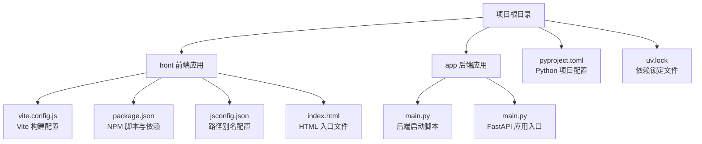
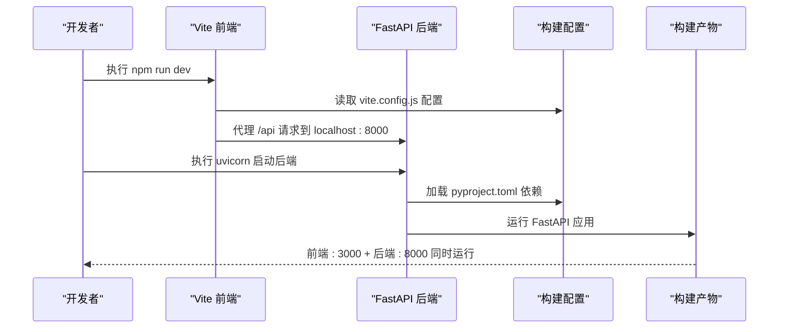
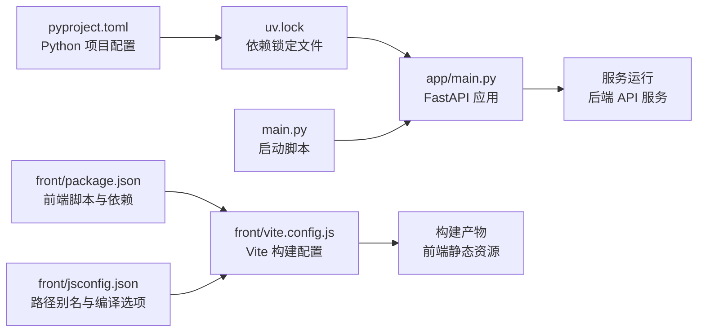

# 构建配置

<cite>
**本文引用的文件**
- [front/package.json](file://front/package.json)
- [front/vite.config.js](file://front/vite.config.js)
- [front/jsconfig.json](file://front/jsconfig.json)
- [pyproject.toml](file://pyproject.toml)
- [uv.lock](file://uv.lock)
- [main.py](file://main.py)
- [app/main.py](file://app/main.py)
- [front/index.html](file://front/index.html)
- [front/src/main.jsx](file://front/src/main.jsx)
</cite>

## 更新摘要
**所做更改**
- 完全重构前端构建系统：从 Next.js 迁移到 Vite + React
- 引入 Python 后端依赖管理：使用 uv.lock 替代传统 requirements.txt
- 移除所有 Next.js 相关配置文件和脚本
- 更新构建流程以支持前后端分离架构
- 重新设计开发服务器配置和代理设置

## 目录
1. [简介](#简介)
2. [项目结构](#项目结构)
3. [核心构建配置](#核心构建配置)
4. [架构总览](#架构总览)
5. [组件与配置详解](#组件与配置详解)
6. [依赖关系分析](#依赖关系分析)
7. [性能优化要点](#性能优化要点)
8. [故障排查指南](#故障排查指南)
9. [结论](#结论)
10. [附录](#附录)

## 简介
本文件面向 InsightMesh 项目的开发者，系统性梳理现代 Web 应用构建配置与工程化实践，覆盖以下方面：
- Vite 前端构建配置与 React 开发环境设置
- Python 后端依赖管理（uv.lock）与 FastAPI 服务配置
- 前后端分离架构的构建流程与开发工作流
- 路径别名、模块解析与 TypeScript/JSX 支持设置
- 构建优化最佳实践（代码分割、静态资源处理、缓存策略）
- 环境变量在构建时的处理方式
- 构建性能优化技巧与常见问题解决方案

## 项目结构
InsightMesh 采用前后端分离的现代 Web 应用架构，前端基于 Vite + React，后端基于 Python FastAPI。关键配置文件分布如下：
- front/vite.config.js：Vite 构建配置入口
- front/package.json：前端构建脚本与依赖声明
- front/jsconfig.json：路径别名与编译选项
- pyproject.toml：Python 项目配置与依赖声明
- uv.lock：Python 依赖锁定文件
- main.py：后端启动脚本
- app/main.py：FastAPI 应用主入口

**图表来源**
- [front/vite.config.js](file://front/vite.config.js)
- [front/package.json](file://front/package.json)
- [pyproject.toml](file://pyproject.toml)
- [uv.lock](file://uv.lock)
- [main.py](file://main.py)
- [app/main.py](file://app/main.py)

**章节来源**
- [front/package.json](file://front/package.json)
- [front/vite.config.js](file://front/vite.config.js)
- [pyproject.toml](file://pyproject.toml)
- [uv.lock](file://uv.lock)

## 核心构建配置
本节聚焦 Vite 前端构建配置、Python 后端依赖管理与脚本设置，帮助你理解项目如何被编译与打包。

### 前端构建配置（Vite）
- **React 插件支持**：通过 @vitejs/plugin-react 提供 JSX 支持和热重载
- **路径别名配置**：@/* 映射到 ./src/*，简化模块导入路径
- **开发服务器**：端口 3000，内置 API 代理到后端 8000 端口
- **构建优化**：自动代码分割、Tree Shaking、资源压缩

### 后端依赖管理（uv）
- **项目配置**：pyproject.toml 定义 Python 版本要求（>=3.12）和核心依赖
- **依赖锁定**：uv.lock 确保依赖版本一致性，支持跨平台部署
- **核心依赖**：FastAPI 0.139.0、Uvicorn 0.49.0、DeepAgents 0.6.12
- **开发脚本**：通过 project.scripts 定义 dev 命令启动 Uvicorn

### 构建脚本与依赖管理
- **前端脚本**：
  - dev：启动 Vite 开发服务器
  - build：生成生产构建产物
  - preview：预览生产构建结果
- **后端脚本**：
  - dev：通过 uvicorn 启动 FastAPI 服务
- **依赖分组**：
  - 前端：react、react-dom、react-router-dom 为运行时依赖
  - 后端：fastapi、uvicorn、deepagents 为核心依赖

**章节来源**
- [front/vite.config.js](file://front/vite.config.js)
- [front/package.json](file://front/package.json)
- [pyproject.toml](file://pyproject.toml)
- [uv.lock](file://uv.lock)

## 架构总览
下图展示了从开发到生产的典型流程，以及关键配置对构建的影响。

**图表来源**
- [front/vite.config.js](file://front/vite.config.js)
- [app/main.py](file://app/main.py)
- [main.py](file://main.py)

## 组件与配置详解

### Vite 构建配置（front/vite.config.js）
- **作用**：集中定义 Vite 构建期行为，包括插件、别名、服务器配置等
- **影响**：启用 React 插件提升开发体验，配置 API 代理简化前后端联调
- **扩展建议**：可在此添加图片优化、CSS 预处理器、TypeScript 支持等

**章节来源**
- [front/vite.config.js](file://front/vite.config.js)

### 前端包管理与构建脚本（front/package.json）
- **scripts**：
  - dev：启动 Vite 开发服务器
  - build：生成生产构建
  - preview：预览生产构建
- **dependencies**：
  - react、react-dom、react-router-dom 为运行时依赖
- **devDependencies**：
  - vite、@vitejs/plugin-react 为开发工具依赖

**章节来源**
- [front/package.json](file://front/package.json)

### 路径别名与编译选项（front/jsconfig.json）
- **路径别名**：
  - @/* -> ./src/*，用于简化导入路径，提升可维护性
- **编译选项**：
  - baseUrl、paths：与模块解析相关
  - jsx react-jsx：启用 React 17+ 的新 JSX 转换
  - module esnext、moduleResolution bundler：与现代打包器兼容
- **include/exclude**：
  - include 指定参与编译的源文件范围
  - exclude node_modules，避免不必要的编译

**章节来源**
- [front/jsconfig.json](file://front/jsconfig.json)

### Python 项目配置（pyproject.toml）
- **项目元数据**：名称、版本、描述、Python 版本要求
- **依赖声明**：使用 PEP 621 标准格式定义项目依赖
- **脚本定义**：通过 project.scripts 定义命令行工具
- **依赖组**：支持 development、test 等依赖分组

**章节来源**
- [pyproject.toml](file://pyproject.toml)

### Python 依赖锁定（uv.lock）
- **依赖锁定**：确保开发、测试、生产环境依赖版本一致性
- **哈希验证**：包含每个包的 SHA256 哈希值，防止依赖篡改
- **平台适配**：支持多平台二进制包选择
- **依赖树**：完整记录所有直接和间接依赖关系

**章节来源**
- [uv.lock](file://uv.lock)

### 后端应用入口（app/main.py）
- **FastAPI 应用**：定义 API 标题、描述、版本信息
- **生命周期管理**：使用 lifespan 上下文管理器处理启动/关闭钩子
- **CORS 中间件**：允许前端开发服务器访问后端 API
- **路由注册**：将 API 路由挂载到 /api 前缀下
- **健康检查**：提供 /health 端点用于服务监控

**章节来源**
- [app/main.py](file://app/main.py)

### 后端启动脚本（main.py）
- **Uvicorn 启动**：配置主机地址、端口、热重载等参数
- **应用入口**：指向 app.main:app 作为 ASGI 应用入口
- **开发模式**：默认启用 reload=True 便于开发调试

**章节来源**
- [main.py](file://main.py)

### HTML 入口文件（front/index.html）
- **页面元数据**：字符编码、视口设置、SEO 信息
- **应用容器**：id="root" 的 div 作为 React 应用挂载点
- **模块加载**：通过 type="module" 加载 ES6 模块

**章节来源**
- [front/index.html](file://front/index.html)

### React 应用入口（front/src/main.jsx）
- **React StrictMode**：启用严格模式，帮助发现潜在问题
- **应用渲染**：使用 ReactDOM.createRoot 渲染 React 应用
- **全局样式**：导入全局 CSS 样式文件

**章节来源**
- [front/src/main.jsx](file://front/src/main.jsx)

## 依赖关系分析
下图展示关键配置文件之间的依赖关系与影响范围。

**图表来源**
- [front/package.json](file://front/package.json)
- [front/vite.config.js](file://front/vite.config.js)
- [front/jsconfig.json](file://front/jsconfig.json)
- [pyproject.toml](file://pyproject.toml)
- [uv.lock](file://uv.lock)
- [app/main.py](file://app/main.py)
- [main.py](file://main.py)

**章节来源**
- [front/package.json](file://front/package.json)
- [front/vite.config.js](file://front/vite.config.js)
- [pyproject.toml](file://pyproject.toml)
- [uv.lock](file://uv.lock)

## 性能优化要点
以下为通用优化建议，适用于 InsightMesh 的 Vite + FastAPI 构建与部署场景。请根据项目实际情况选择性实施。

### 前端性能优化
- **代码分割**：
  - 利用 Vite 的按需加载特性，实现路由级代码分割
  - 使用动态导入拆分大型组件和第三方库
- **资源优化**：
  - 启用 Vite 内置的图片压缩和字体优化
  - 使用 CDN 托管静态资源，提升全球访问速度
- **缓存策略**：
  - 利用 Vite 的哈希文件名实现长期缓存
  - 配置 HTTP 缓存头，平衡新鲜度与性能

### 后端性能优化
- **依赖优化**：
  - 定期更新 uv.lock 中的依赖版本，获取性能改进
  - 使用轻量级依赖，减少内存占用
- **服务优化**：
  - 在生产环境禁用热重载，提升启动速度
  - 配置合适的 worker 数量和线程数

### 构建优化
- **并行构建**：
  - 利用 Vite 的多进程构建能力
  - 在后端使用 uvicorn 的多个 worker 进程
- **增量构建**：
  - 开发时利用 Vite 的 HMR（热模块替换）
  - 生产构建时启用增量编译

### 开发体验优化
- **开发服务器**：
  - 保持 API 代理配置，简化前后端联调
  - 启用浏览器源码映射，便于调试
- **错误处理**：
  - 配置详细的错误日志和堆栈跟踪
  - 使用 ESLint 和 Pylint 进行代码质量检查

## 故障排查指南
- **前端构建失败**
  - 检查 vite.config.js 是否存在语法错误或配置冲突
  - 确认 jsconfig.json 的路径别名是否与实际目录结构一致
  - 清理 node_modules 后重新安装依赖

- **后端依赖问题**
  - 检查 Python 版本是否满足 >=3.12 要求
  - 验证 uv.lock 文件的完整性，必要时重新生成
  - 确认虚拟环境激活状态

- **API 连接问题**
  - 检查 CORS 配置是否允许前端域名访问
  - 确认前后端端口配置正确（前端 3000，后端 8000）
  - 验证网络代理配置是否正确转发请求

- **性能问题**
  - 分析前端构建产物大小，识别大体积依赖
  - 检查后端依赖数量，移除未使用的包
  - 监控内存使用和 CPU 占用情况

- **开发环境问题**
  - 确认端口未被其他进程占用
  - 检查防火墙和网络设置
  - 验证 Node.js 和 Python 环境配置

**章节来源**
- [front/vite.config.js](file://front/vite.config.js)
- [front/jsconfig.json](file://front/jsconfig.json)
- [pyproject.toml](file://pyproject.toml)
- [uv.lock](file://uv.lock)
- [app/main.py](file://app/main.py)

## 结论
InsightMesh 的构建配置体现了现代 Web 应用的工程化实践：通过 Vite 提供快速的前端开发体验，借助 uv.lock 确保 Python 依赖的一致性，并以前后端分离的架构提升可维护性和扩展性。结合本文提供的优化建议与故障排查方法，可进一步提升构建稳定性与性能表现。

## 附录

### 环境变量处理（构建期）
- **前端环境变量**：
  - Vite 支持在构建时注入环境变量（如 VITE_ 前缀的公开变量）
  - 可通过 import.meta.env 在运行时访问
- **后端环境变量**：
  - FastAPI 应用通过 os.environ 或 python-dotenv 管理环境变量
  - 敏感配置应通过环境变量传递，避免硬编码
- **建议**：
  - 将公开配置置于 VITE_ 前缀下
  - 私有配置通过服务端环境变量传递，避免泄露
  - 在 CI/CD 中统一管理环境变量，确保本地与线上一致性

### 构建验证参考
- **前端构建**：
  - 执行 `npm run build` 生成 dist 目录
  - 使用 `npm run preview` 预览生产构建
- **后端构建**：
  - 执行 `uvicorn app.main:app --host 0.0.0.0 --port 8000` 启动服务
  - 访问 http://localhost:8000/health 验证服务状态

**章节来源**
- [front/package.json](file://front/package.json)
- [app/main.py](file://app/main.py)
- [main.py](file://main.py)