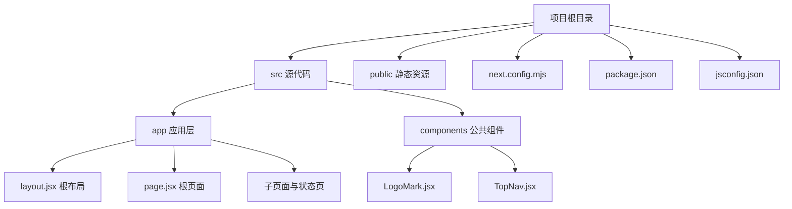
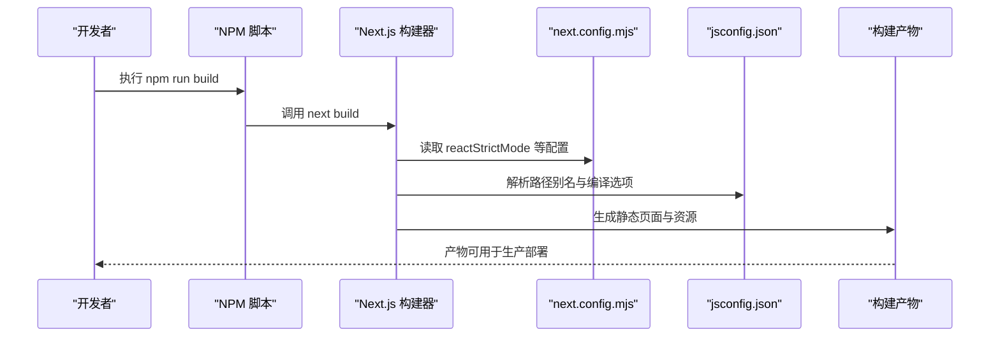
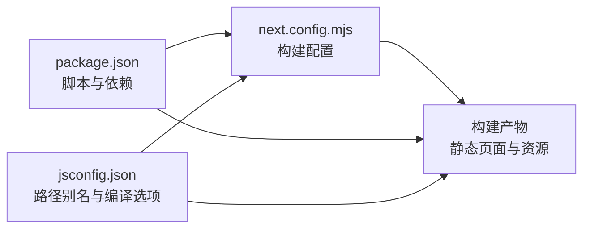

# 构建配置

<cite>
**本文引用的文件**
- [package.json](file://package.json)
- [next.config.mjs](file://next.config.mjs)
- [jsconfig.json](file://jsconfig.json)
- [README.md](file://README.md)
- [src/app/layout.jsx](file://src/app/layout.jsx)
- [src/app/page.jsx](file://src/app/page.jsx)
- [src/app/globals.css](file://src/app/globals.css)
</cite>

## 目录
1. [简介](#简介)
2. [项目结构](#项目结构)
3. [核心构建配置](#核心构建配置)
4. [架构总览](#架构总览)
5. [组件与配置详解](#组件与配置详解)
6. [依赖关系分析](#依赖关系分析)
7. [性能优化要点](#性能优化要点)
8. [故障排查指南](#故障排查指南)
9. [结论](#结论)
10. [附录](#附录)

## 简介
本文件面向 InsightMesh 项目的开发者，系统性梳理 Next.js 构建配置与工程化实践，覆盖以下方面：
- Next.js 核心构建配置项（如 reactStrictMode）的作用与影响
- package.json 中构建脚本与依赖管理策略（开发依赖 vs 生产依赖）
- jsconfig.json 的路径别名与 TypeScript/JSX 支持设置
- 构建优化最佳实践（代码分割、静态资源处理、缓存策略）
- 环境变量在构建期的处理方式
- 构建性能优化技巧与常见问题解决方案

## 项目结构
InsightMesh 采用 Next.js App Router 结构，根目录包含构建配置与运行脚本，源代码位于 src 目录，公共资源位于 public 目录。关键配置文件如下：
- next.config.mjs：Next.js 构建配置入口
- package.json：构建脚本与依赖声明
- jsconfig.json：路径别名与编译选项
- README.md：项目说明与构建验证信息

图表来源
- [package.json](file://package.json)
- [next.config.mjs](file://next.config.mjs)
- [jsconfig.json](file://jsconfig.json)
- [src/app/layout.jsx](file://src/app/layout.jsx)
- [src/app/page.jsx](file://src/app/page.jsx)

章节来源
- [README.md](file://README.md)
- [package.json](file://package.json)
- [next.config.mjs](file://next.config.mjs)
- [jsconfig.json](file://jsconfig.json)

## 核心构建配置
本节聚焦 Next.js 构建配置、脚本与路径别名设置，帮助你理解项目如何被编译与打包。

- Next.js 核心配置
  - reactStrictMode：启用 React 严格模式，有助于提前发现潜在问题（如副作用、不安全的生命周期等），对开发期更严格，生产构建也会受益于更稳健的代码质量。
  - 其他常用配置（如实验性功能、插件、图像优化等）可在 next.config.mjs 中扩展，当前仓库仅启用 reactStrictMode。

- 构建脚本与依赖管理
  - 开发脚本：dev（启动开发服务器）
  - 构建脚本：build（生成生产构建产物）
  - 启动脚本：start（以生产模式启动服务）
  - 代码检查：lint（运行 Next.js 内置 Lint 工具）
  - 依赖分组：dependencies 为生产依赖，当前包含 next、react、react-dom；未在 package.json 中声明开发依赖，通常由包管理器自动推断或通过其他工具管理。

- 路径别名与 JSX 设置
  - baseUrl：指向项目根目录
  - paths：@/* 映射到 ./src/*，便于在组件中使用相对路径别名导入
  - jsx：preserve（保留 JSX，交由 Next.js/Babel 处理）
  - module/moduleResolution：esnext 与 bundler，配合现代打包器进行模块解析与打包

章节来源
- [next.config.mjs](file://next.config.mjs)
- [package.json](file://package.json)
- [jsconfig.json](file://jsconfig.json)

## 架构总览
下图展示了从开发到生产的典型流程，以及关键配置对构建的影响。

图表来源
- [package.json](file://package.json)
- [next.config.mjs](file://next.config.mjs)
- [jsconfig.json](file://jsconfig.json)

## 组件与配置详解

### Next.js 构建配置（next.config.mjs）
- 作用：集中定义 Next.js 构建期行为，如严格模式、实验特性、插件等
- 影响：启用 reactStrictMode 提升开发期代码质量，减少运行期隐患；对生产构建也有积极意义
- 扩展建议：可在此添加图片优化、实验性功能、插件等，但需结合业务需求评估

章节来源
- [next.config.mjs](file://next.config.mjs)

### 包管理与构建脚本（package.json）
- scripts：
  - dev：启动开发服务器
  - build：生成生产构建
  - start：以生产模式启动
  - lint：运行代码检查
- dependencies：
  - next、react、react-dom 为生产依赖
  - 当前仓库未声明额外开发依赖，若需要 ESLint、TypeScript 类工具，可通过包管理器安装并加入 scripts

章节来源
- [package.json](file://package.json)

### 路径别名与编译选项（jsconfig.json）
- 路径别名：
  - @/* -> ./src/*，用于简化导入路径，提升可维护性
- 编译选项：
  - baseUrl、paths：与 TypeScript/JSX 解析相关
  - jsx preserve：保留 JSX，交由 Next.js 处理
  - module esnext、moduleResolution bundler：与现代打包器兼容
- include/exclude：
  - include 指定参与编译的源文件范围
  - 排除 node_modules，避免不必要的编译

章节来源
- [jsconfig.json](file://jsconfig.json)

### 根布局与全局样式（src/app/layout.jsx、src/app/globals.css）
- 根布局：
  - 设置站点元数据与 viewport
  - 引入全局样式文件
- 全局样式：
  - 定义设计令牌、排版、组件样式、动画等
  - 作为页面共享样式的基础

章节来源
- [src/app/layout.jsx](file://src/app/layout.jsx)
- [src/app/globals.css](file://src/app/globals.css)

### 根页面与导航（src/app/page.jsx）
- 根页面用于展示页面入口与状态页导航
- 使用 Link 组件实现客户端导航，配合 App Router 的路由体系

章节来源
- [src/app/page.jsx](file://src/app/page.jsx)

## 依赖关系分析
下图展示关键配置文件之间的依赖关系与影响范围。

图表来源
- [package.json](file://package.json)
- [next.config.mjs](file://next.config.mjs)
- [jsconfig.json](file://jsconfig.json)

章节来源
- [package.json](file://package.json)
- [next.config.mjs](file://next.config.mjs)
- [jsconfig.json](file://jsconfig.json)

## 性能优化要点
以下为通用优化建议，适用于 InsightMesh 的 Next.js 构建与部署场景。请根据项目实际情况选择性实施。

- 代码分割
  - 利用 App Router 的路由级分割，确保每个页面独立打包，减少首屏体积
  - 将第三方库与业务代码分离，优先加载核心页面资源

- 静态资源处理
  - 图片与媒体资源尽量使用 Next.js 内置优化（如自动压缩、响应式尺寸）
  - 对于字体与图标，合理控制加载策略，避免阻塞关键渲染

- 缓存策略
  - 静态页面与构建产物可长期缓存（如静态资源版本化）
  - 动态接口与 API 资源应设置合理的缓存头，平衡新鲜度与性能

- 构建期优化
  - 在 next.config.mjs 中启用必要的优化开关（如实验性功能需谨慎评估）
  - 使用路径别名与模块解析优化，减少打包体积与解析时间

- 开发体验
  - 保持 reactStrictMode 开启，尽早暴露问题
  - 使用 lint 脚本统一代码风格，降低维护成本

## 故障排查指南
- 构建失败或页面空白
  - 检查 next.config.mjs 是否存在语法错误或不兼容的配置
  - 确认 jsconfig.json 的路径别名是否与实际目录结构一致
  - 验证 package.json 中的脚本是否正确

- 路径导入报错
  - 确认 @/* 别名映射是否正确
  - 检查 ts/jsx 编译选项与模块解析设置

- 首屏性能不佳
  - 分析构建产物大小，识别大体积依赖与未使用的资源
  - 优化全局样式与动画，减少阻塞渲染的资源

- 开发服务器无法启动
  - 确认端口占用与网络环境
  - 清理缓存后重新安装依赖并启动

章节来源
- [next.config.mjs](file://next.config.mjs)
- [jsconfig.json](file://jsconfig.json)
- [package.json](file://package.json)

## 结论
InsightMesh 的构建配置简洁而实用：通过 next.config.mjs 启用 reactStrictMode，借助 jsconfig.json 的路径别名与编译选项提升开发效率，并以 package.json 的脚本驱动开发与生产流程。结合本文提供的优化建议与故障排查方法，可进一步提升构建稳定性与性能表现。

## 附录

### 环境变量处理（构建期）
- Next.js 默认支持在构建期注入环境变量（如 NEXT_PUBLIC_ 前缀的公开变量），可在构建时读取并注入到客户端代码中
- 建议：
  - 将公开配置置于 NEXT_PUBLIC_ 前缀下
  - 私有配置通过服务端环境变量传递，避免泄露
  - 在 CI/CD 中统一管理环境变量，确保本地与线上一致性

### 构建验证参考
- README 中提供了构建与预览路由说明，可据此验证构建产物与页面渲染效果

章节来源
- [README.md](file://README.md)