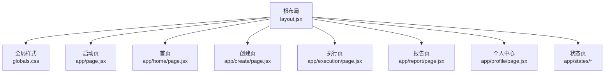
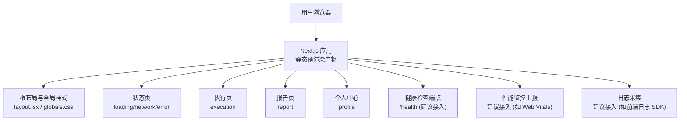
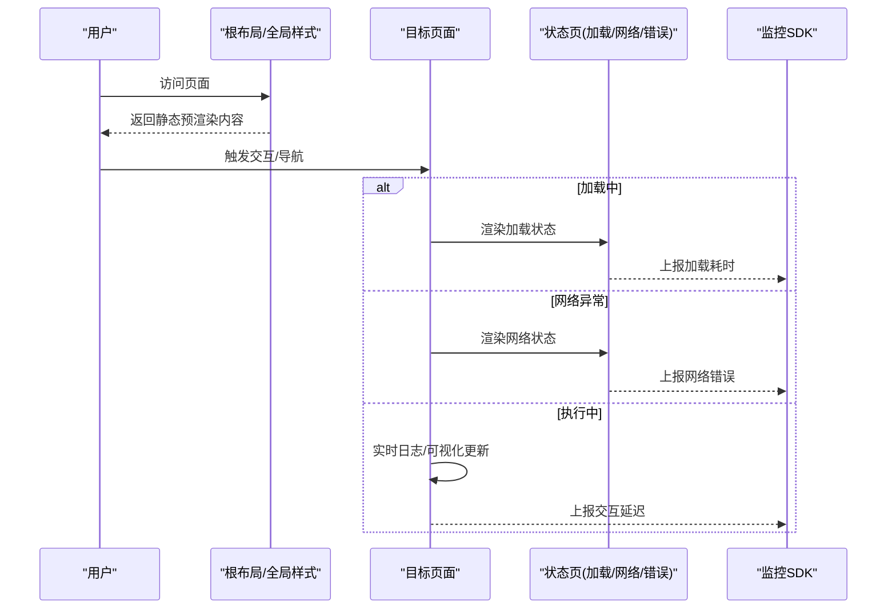
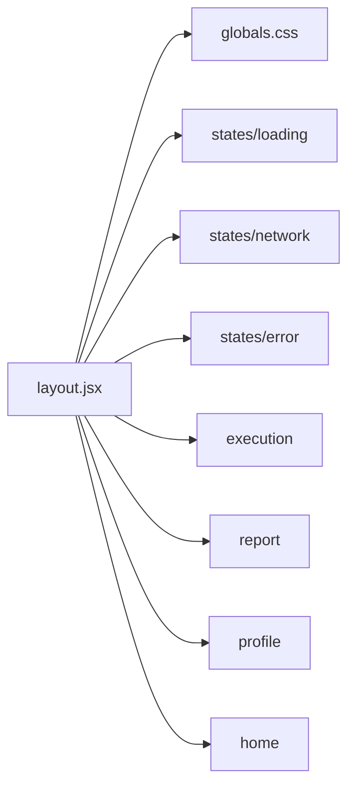

# 监控与维护

<cite>
**本文引用的文件**   
- [package.json](file://package.json)
- [next.config.mjs](file://next.config.mjs)
- [README.md](file://README.md)
- [layout.jsx](file://src/app/layout.jsx)
- [globals.css](file://src/app/globals.css)
- [loading 状态页](file://src/app/states/loading/page.jsx)
- [network 状态页](file://src/app/states/network/page.jsx)
- [error 状态页](file://src/app/states/error/page.jsx)
- [execution 执行页](file://src/app/execution/page.jsx)
- [report 报告页](file://src/app/report/page.jsx)
- [profile 个人中心页](file://src/app/profile/page.jsx)
- [home 首页](file://src/app/home/page.jsx)
</cite>

## 目录
1. [简介](#简介)
2. [项目结构](#项目结构)
3. [核心组件](#核心组件)
4. [架构总览](#架构总览)
5. [详细组件分析](#详细组件分析)
6. [依赖关系分析](#依赖关系分析)
7. [性能考量](#性能考量)
8. [故障排查指南](#故障排查指南)
9. [结论](#结论)
10. [附录](#附录)

## 简介
本文件面向 InsightMesh 的运维与平台工程团队，围绕应用性能监控、日志与行为追踪、健康检查、缓存策略、安全更新与漏洞修复、备份策略、容量规划与瓶颈识别、以及标准化操作手册与应急响应流程，提供可落地的实践建议。由于当前仓库为前端原型项目，本文以“前端可观测性”和“基础设施侧配套方案”为主线，给出可扩展至生产环境的实施路径。

## 项目结构
InsightMesh 采用 Next.js App Router 结构，页面均以静态预渲染方式构建，具备良好的首屏性能与可预测的运行时行为。根布局负责注入全局样式与元信息，各业务页面与状态页分别承担不同职责，便于分层观测与定位问题。

图表来源
- [layout.jsx:1-21](file://src/app/layout.jsx#L1-L21)
- [globals.css:1-200](file://src/app/globals.css#L1-L200)

章节来源
- [README.md:13-39](file://README.md#L13-L39)
- [layout.jsx:1-21](file://src/app/layout.jsx#L1-L21)

## 核心组件
- 根布局与元信息：统一注入全局样式与站点元数据，是性能指标采集与 SEO/缓存策略的关键入口。
- 全局样式：集中定义设计令牌、排版、组件样式与动画，影响首屏渲染与交互反馈。
- 状态页：提供加载、网络异常、权限不足、错误等场景的用户引导，是用户体验与可观测性的交汇点。
- 执行页：包含实时日志面板与可视化指标，是前端性能与交互响应的直接观测窗口。
- 报告页：承载最终结果的可视化与交互，是页面级性能与资源加载的综合体现。
- 个人中心页：包含统计数据与设置项，可用于用户行为与偏好追踪。

章节来源
- [layout.jsx:1-21](file://src/app/layout.jsx#L1-L21)
- [globals.css:1-2611](file://src/app/globals.css#L1-L2611)
- [loading 状态页:1-11](file://src/app/states/loading/page.jsx#L1-L11)
- [network 状态页:1-32](file://src/app/states/network/page.jsx#L1-L32)
- [error 状态页:1-20](file://src/app/states/error/page.jsx#L1-L20)
- [execution 执行页:30-168](file://src/app/execution/page.jsx#L30-L168)
- [report 报告页:1-185](file://src/app/report/page.jsx#L1-L185)
- [profile 个人中心页:15-283](file://src/app/profile/page.jsx#L15-L283)

## 架构总览
下图展示了前端原型的典型请求链路与可观测性落点，便于后续接入外部监控系统与日志平台。

图表来源
- [layout.jsx:1-21](file://src/app/layout.jsx#L1-L21)
- [globals.css:1-2611](file://src/app/globals.css#L1-L2611)
- [loading 状态页:1-11](file://src/app/states/loading/page.jsx#L1-L11)
- [network 状态页:1-32](file://src/app/states/network/page.jsx#L1-L32)
- [error 状态页:1-20](file://src/app/states/error/page.jsx#L1-L20)
- [execution 执行页:30-168](file://src/app/execution/page.jsx#L30-L168)
- [report 报告页:1-185](file://src/app/report/page.jsx#L1-L185)
- [profile 个人中心页:15-283](file://src/app/profile/page.jsx#L15-L283)

## 详细组件分析

### 性能监控：页面加载时间、用户交互响应与错误率
- 页面加载时间（TTI/FCP/LCP）：利用 Web Vitals 或第三方前端监控 SDK，在根布局或应用入口处采集首屏关键指标，并结合静态预渲染特性进行对比分析。
- 用户交互响应：对关键交互（如点击、滚动、输入）增加延迟采样与事件埋点，结合状态页的加载/网络/错误场景，形成完整的交互可观测性。
- 错误率监控：在状态页与执行页中，对异常路径（超时、网络断开、权限不足）进行打点与聚合，建立错误率阈值与告警。

图表来源
- [layout.jsx:1-21](file://src/app/layout.jsx#L1-L21)
- [loading 状态页:1-11](file://src/app/states/loading/page.jsx#L1-L11)
- [network 状态页:1-32](file://src/app/states/network/page.jsx#L1-L32)
- [error 状态页:1-20](file://src/app/states/error/page.jsx#L1-L20)
- [execution 执行页:30-168](file://src/app/execution/page.jsx#L30-L168)

章节来源
- [README.md:86-86](file://README.md#L86-L86)
- [execution 执行页:141-163](file://src/app/execution/page.jsx#L141-L163)

### 日志记录：配置与管理策略
- 行为追踪：在关键页面（如执行页、报告页、个人中心）对用户行为（点击、切换、导出、设置变更）进行结构化打点，避免记录敏感信息。
- 异常日志：在网络异常、执行失败等状态页中，记录上下文参数（如错误码、阶段、耗时），并与监控指标联动。
- 日志采集：建议接入前端日志 SDK，统一收集与上报，配合标签（环境、版本、用户标识）进行检索与聚合。

章节来源
- [network 状态页:1-32](file://src/app/states/network/page.jsx#L1-L32)
- [error 状态页:1-20](file://src/app/states/error/page.jsx#L1-L20)
- [execution 执行页:141-163](file://src/app/execution/page.jsx#L141-L163)
- [report 报告页:1-185](file://src/app/report/page.jsx#L1-L185)
- [profile 个人中心页:15-283](file://src/app/profile/page.jsx#L15-L283)

### 健康检查端点与定期检查流程
- 健康检查端点：建议新增 /health 端点，返回应用可用性、静态资源可达性、关键依赖状态等信息。
- 定期检查：结合 CI/CD 在构建后自动触发探活检查；在生产环境通过外部探针（如云监控/自建探针）定时探测，异常时触发告警与回滚。
- 与状态页联动：当检测到网络异常或不可用时，引导用户进入对应状态页，提升可诊断性与可恢复性。

章节来源
- [network 状态页:1-32](file://src/app/states/network/page.jsx#L1-L32)

### 缓存策略：浏览器缓存与服务器缓存
- 浏览器缓存：利用静态预渲染产物与合理的 Cache-Control 策略，减少重复下载；对全局样式与公共资源设置长缓存，版本化文件名以实现失效控制。
- 服务器缓存：在 CDN/边缘节点启用静态资源缓存；对动态接口（如有）设置合适的缓存策略与失效机制。
- 清理机制：版本升级时清理旧资源；对异常缓存命中（如样式错乱）提供强制刷新入口与诊断提示。

章节来源
- [README.md:86-86](file://README.md#L86-L86)
- [layout.jsx:1-21](file://src/app/layout.jsx#L1-L21)
- [globals.css:1-2611](file://src/app/globals.css#L1-L2611)

### 安全更新与漏洞修复流程
- 依赖审计：定期扫描依赖漏洞，优先修复高危风险；对关键依赖采用锁定版本策略。
- 自动化流程：在 CI 中集成安全扫描与依赖更新检查，失败时阻断发布。
- 应急响应：建立漏洞分级与处置时限，快速发布补丁并验证；对用户透明沟通。

### 备份策略：数据库与静态资源
- 静态资源：对构建产物与公共资源进行版本化存储与异地备份，确保可回滚与灾备。
- 数据库：若存在用户数据或会话数据，需制定数据库备份计划（增量/全量）、恢复演练与验证流程。
- 备份验证：定期抽样恢复测试，确保备份可用性。

### 容量规划与性能瓶颈识别
- 容量规划：基于页面访问量、峰值并发、静态资源体积与缓存命中率，评估带宽、CDN 节点与服务器资源需求。
- 瓶颈识别：关注首屏渲染时间、关键资源加载时间、交互延迟与错误率；结合状态页的加载/网络/错误场景定位问题根因。

## 依赖关系分析
- 组件耦合：根布局与全局样式为所有页面提供基础，状态页作为异常与过渡场景的统一出口，降低页面间耦合。
- 外部依赖：Next.js 与 React 版本固定，建议在升级前进行性能回归测试与兼容性验证。

图表来源
- [layout.jsx:1-21](file://src/app/layout.jsx#L1-L21)
- [loading 状态页:1-11](file://src/app/states/loading/page.jsx#L1-L11)
- [network 状态页:1-32](file://src/app/states/network/page.jsx#L1-L32)
- [error 状态页:1-20](file://src/app/states/error/page.jsx#L1-L20)
- [execution 执行页:30-168](file://src/app/execution/page.jsx#L30-L168)
- [report 报告页:1-185](file://src/app/report/page.jsx#L1-L185)
- [profile 个人中心页:15-283](file://src/app/profile/page.jsx#L15-L283)
- [home 首页:148-165](file://src/app/home/page.jsx#L148-L165)

章节来源
- [package.json:12-16](file://package.json#L12-L16)
- [next.config.mjs:1-7](file://next.config.mjs#L1-L7)

## 性能考量
- 首屏性能：得益于静态预渲染，建议结合 Web Vitals 与缓存策略优化关键渲染路径。
- 交互体验：在状态页中明确加载与错误提示，减少用户困惑；对高频交互增加节流与去抖策略。
- 资源体积：控制全局样式与组件体积，避免不必要的动画与资源加载。

## 故障排查指南
- 网络异常：检查网络状态页的提示与重试逻辑，确认代理/防火墙与 DNS 解析；必要时引导用户刷新页面。
- 加载卡顿：核对状态页加载时间与资源加载顺序，排查关键资源与缓存命中情况。
- 执行失败：查看执行页的日志面板与可视化指标，定位 Agent 执行阶段与数据源响应情况。
- 权限问题：引导用户进入权限状态页，确认登录状态与授权范围。

章节来源
- [network 状态页:1-32](file://src/app/states/network/page.jsx#L1-L32)
- [loading 状态页:1-11](file://src/app/states/loading/page.jsx#L1-L11)
- [error 状态页:1-20](file://src/app/states/error/page.jsx#L1-L20)
- [execution 执行页:141-163](file://src/app/execution/page.jsx#L141-L163)

## 结论
InsightMesh 原型具备良好的静态预渲染基础与清晰的状态页体系，适合在此基础上逐步引入前端监控、日志与健康检查机制。通过标准化的运维流程与应急响应预案，可在保障用户体验的同时，持续提升系统的稳定性与可维护性。

## 附录
- 运维脚本与命令参考：开发、构建、预览与代码检查命令见项目说明。
- 版本与依赖：Next.js 与 React 版本信息见依赖清单。

章节来源
- [README.md:52-84](file://README.md#L52-L84)
- [package.json:12-16](file://package.json#L12-L16)