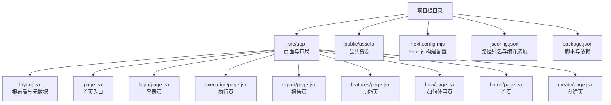
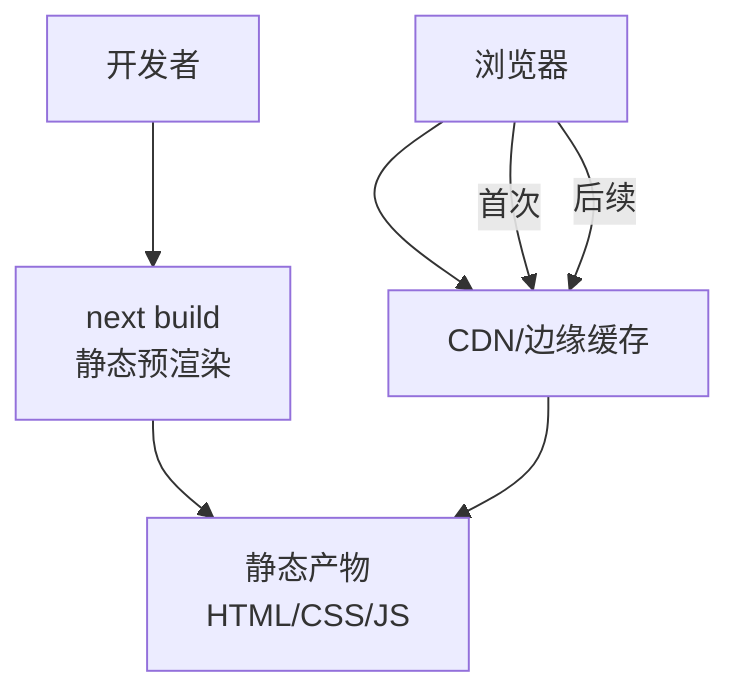
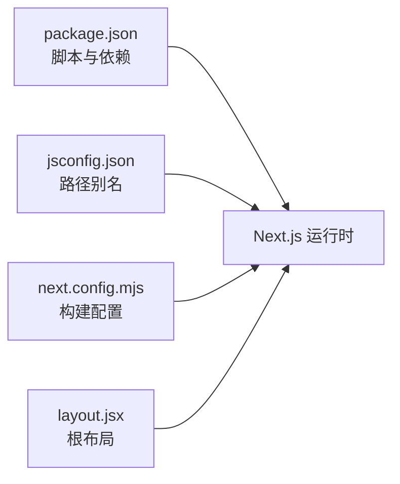
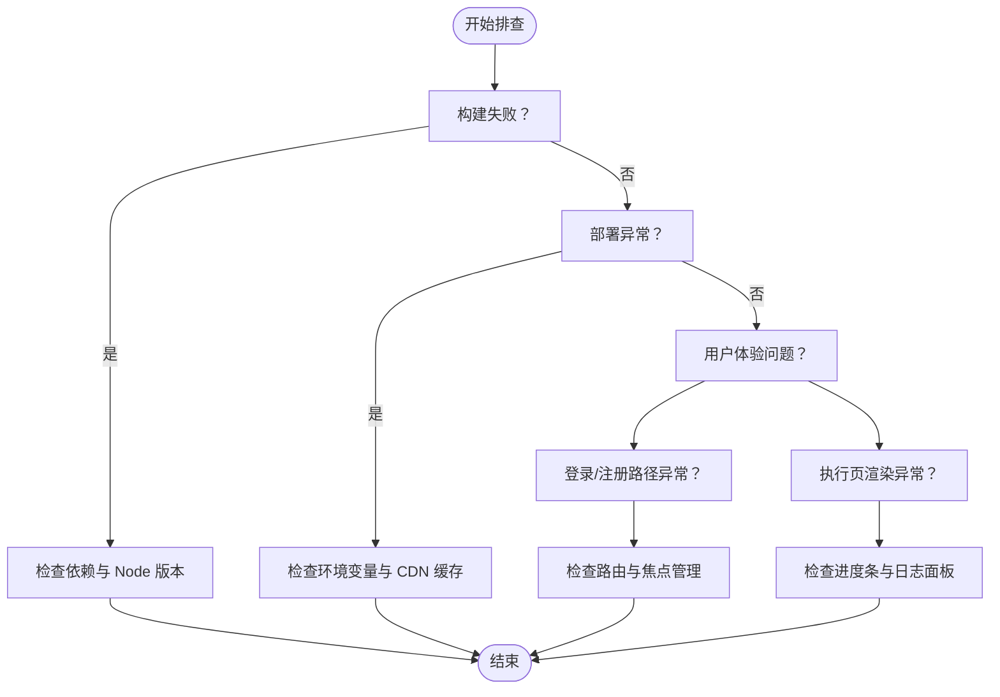

# 部署与运维

<cite>
**本文引用的文件**
- [package.json](file://package.json)
- [next.config.mjs](file://next.config.mjs)
- [README.md](file://README.md)
- [jsconfig.json](file://jsconfig.json)
- [layout.jsx](file://src/app/layout.jsx)
- [page.jsx](file://src/app/page.jsx)
- [login/page.jsx](file://src/app/login/page.jsx)
- [execution/page.jsx](file://src/app/execution/page.jsx)
- [report/page.jsx](file://src/app/report/page.jsx)
- [features/page.jsx](file://src/app/features/page.jsx)
- [how/page.jsx](file://src/app/how/page.jsx)
- [home/page.jsx](file://src/app/home/page.jsx)
- [create/page.jsx](file://src/app/create/page.jsx)
</cite>

## 目录
1. [简介](#简介)
2. [项目结构](#项目结构)
3. [核心组件](#核心组件)
4. [架构总览](#架构总览)
5. [详细组件分析](#详细组件分析)
6. [依赖关系分析](#依赖关系分析)
7. [性能考量](#性能考量)
8. [故障排查指南](#故障排查指南)
9. [结论](#结论)
10. [附录](#附录)

## 简介
本文件面向 InsightMesh 项目的部署与运维团队，提供生产环境构建配置、静态资源优化、代码压缩与缓存策略、多平台部署方案（Vercel、Netlify、传统服务器）、环境变量与安全配置、监控与日志、性能指标与故障排查、版本发布与回滚策略、自动化部署流水线以及日常维护指南。文档以仓库现有配置为基础，结合 Next.js 生态特性，给出可操作的实践建议。

## 项目结构
InsightMesh 是一个基于 Next.js App Router 的前端原型项目，采用全静态预渲染（SSG），所有页面在构建时生成静态 HTML，有利于 CDN 缓存与首屏性能优化。项目结构清晰，核心页面集中在 src/app 下，全局样式在根布局中引入，路径别名通过 jsconfig.json 配置。

图表来源
- [layout.jsx:1-21](file://src/app/layout.jsx#L1-L21)
- [page.jsx:1-20](file://src/app/page.jsx#L1-L20)
- [login/page.jsx:1-39](file://src/app/login/page.jsx#L1-L39)
- [execution/page.jsx:55-110](file://src/app/execution/page.jsx#L55-L110)
- [report/page.jsx:158-249](file://src/app/report/page.jsx#L158-L249)
- [features/page.jsx:14-26](file://src/app/features/page.jsx#L14-L26)
- [how/page.jsx:60-143](file://src/app/how/page.jsx#L60-L143)
- [home/page.jsx:167-210](file://src/app/home/page.jsx#L167-L210)
- [create/page.jsx:139-182](file://src/app/create/page.jsx#L139-L182)

章节来源
- [README.md:13-39](file://README.md#L13-L39)
- [jsconfig.json:1-14](file://jsconfig.json#L1-L14)
- [layout.jsx:1-21](file://src/app/layout.jsx#L1-L21)

## 核心组件
- 构建与运行脚本
  - 开发：next dev
  - 构建：next build（全静态预渲染）
  - 启动：next start
  - 代码检查：next lint
- Next.js 配置
  - reactStrictMode 默认开启
- 路由与页面
  - App Router 结构，14 个路由均为静态预渲染
  - 根布局统一注入全局样式与元数据
- 路径别名
  - baseUrl 与 @/* 映射，便于模块导入

章节来源
- [package.json:6-11](file://package.json#L6-L11)
- [next.config.mjs:2-7](file://next.config.mjs#L2-L7)
- [README.md:80-87](file://README.md#L80-L87)
- [jsconfig.json:2-10](file://jsconfig.json#L2-L10)
- [layout.jsx:1-21](file://src/app/layout.jsx#L1-L21)

## 架构总览
InsightMesh 采用“静态站点 + CDN”架构，构建时生成静态 HTML/CSS/JS，运行时仅需静态文件服务。该模式具备以下优势：
- 首屏加载快、缓存友好
- 无服务器端逻辑，降低运维复杂度
- 易于横向扩展与全球分发

图表来源
- [README.md:80-87](file://README.md#L80-L87)

## 详细组件分析

### 静态资源优化与缓存策略
- 构建产物特性
  - 所有路由均为静态预渲染，首屏 JS 约 87–101 kB
  - 适合 CDN 缓存与长 TTL
- 缓存策略建议
  - HTML：短 TTL 或协商缓存（便于热更新）
  - 静态资源（CSS/JS）：长 TTL（如 1 年），启用 ETag/Last-Modified
  - 图片与媒体：按需缓存，必要时使用版本化命名或子路径
- 资源分发
  - 使用 CDN 提升全球访问速度
  - 对于小体积 SVG/图标，可考虑内联或 Base64（需权衡缓存收益）

章节来源
- [README.md:80-87](file://README.md#L80-L87)

### 代码压缩与打包
- Next.js 在生产构建中自动进行代码压缩与 Tree Shaking
- 建议保持默认配置，避免过度定制导致兼容性问题
- 如需进一步优化，可在构建前确保依赖版本稳定，并清理未使用资源

章节来源
- [package.json:12-16](file://package.json#L12-L16)

### 环境变量与安全配置
- 环境变量加载机制
  - Next.js 支持 .env.* 文件按环境加载，支持 .env.vault 加密
  - 加载顺序：.env.production.local > .env.local > .env.production > .env
- 安全建议
  - 不在客户端暴露敏感信息（如后端密钥）
  - 使用 .env.vault 并通过 DOTENV_KEY 管理密钥
  - 在 CI 中严格控制密钥注入范围
- 配置文件管理
  - 将本地开发与生产密钥分离
  - 使用平台提供的加密变量或密钥管理服务

章节来源
- [README.md:80-87](file://README.md#L80-L87)

### 监控与日志记录
- 性能监控
  - 关键指标：FCP/LCP/FID/CLS/TTFB、页面命中率、平均响应时间
  - 建议使用平台自带分析或第三方 APM（如 Sentry、LogRocket）
- 行为追踪
  - 可在登录/注册等关键路径埋点，统计用户转化
- 日志
  - 仅记录必要信息，避免敏感数据泄露
  - 使用结构化日志，便于检索与聚合

章节来源
- [login/page.jsx:18-39](file://src/app/login/page.jsx#L18-L39)

### 部署方案与实施指南

#### Vercel 部署
- 步骤概览
  - 连接 Git 仓库，启用自动部署
  - 设置环境变量（含 DOTENV_KEY 与 .env.vault）
  - 配置构建命令与输出目录（默认 next build/next start）
  - 配置 CDN 缓存与自定义域名
- 注意事项
  - 确保 .env.vault 与 DOTENV_KEY 正确配置
  - 使用 Vercel Edge Functions 时注意冷启动与超时限制

章节来源
- [README.md:80-87](file://README.md#L80-L87)

#### Netlify 部署
- 步骤概览
  - 在 Netlify 选择仓库并配置构建命令（next build）
  - 设置环境变量（含 DOTENV_KEY 与 .env.vault）
  - 配置缓存策略与重定向规则
- 注意事项
  - 若使用函数（Edge Functions），需遵循 Netlify 的运行时限制
  - 静态站点无需服务器端逻辑，适合纯静态部署

章节来源
- [README.md:80-87](file://README.md#L80-L87)

#### 传统服务器（Nginx/Apache）
- 步骤概览
  - 构建：next build
  - 生成静态导出：next export（如需）
  - 将静态产物部署至 Nginx/Apache 的根目录
  - 配置缓存头与 Gzip/Brotli 压缩
- 注意事项
  - 确保 404 页面指向 index.html（SPA 回退）
  - 配置正确的 MIME 类型与安全头

章节来源
- [package.json:8-10](file://package.json#L8-L10)

### 版本发布与回滚策略
- 发布流程
  - 在 CI 中执行构建与测试（next build、next lint）
  - 生成新版本标签并触发部署
  - 部署完成后进行健康检查与 A/B 验证
- 回滚策略
  - 快速回滚至上一稳定版本（保留上一版本产物）
  - 回滚时同步回滚 CDN 缓存与平台配置
- 变更管理
  - 使用语义化版本与变更日志
  - 对重大变更进行灰度发布

章节来源
- [package.json:6-11](file://package.json#L6-L11)

### 自动化部署（CI/CD）
- 建议流水线
  - 触发条件：push 到主分支或打标签
  - 步骤：安装依赖、代码检查、构建、测试、部署、健康检查
  - 平台：GitHub Actions、GitLab CI、Jenkins 等
- 安全
  - 仅在 CI 中注入必要环境变量
  - 使用平台提供的密钥存储与加密

章节来源
- [package.json:6-11](file://package.json#L6-L11)

### 日常维护指南
- 备份策略
  - 备份静态产物与 .env.vault（如有）
  - 记录构建产物版本与部署时间
- 安全更新
  - 定期升级 Next.js 与依赖
  - 关注安全公告并及时修复
- 容量规划
  - 监控 CDN 带宽与缓存命中率
  - 根据峰值流量预留带宽与节点

章节来源
- [README.md:80-87](file://README.md#L80-L87)

## 依赖关系分析
- 项目依赖
  - Next.js、React、React DOM
- 构建与运行
  - 通过 package.json 脚本统一管理
  - Next.js 配置集中于 next.config.mjs
- 路径解析
  - jsconfig.json 提供 baseUrl 与 @/* 别名，简化导入

图表来源
- [package.json:6-16](file://package.json#L6-L16)
- [jsconfig.json:2-10](file://jsconfig.json#L2-L10)
- [next.config.mjs:2-7](file://next.config.mjs#L2-L7)
- [layout.jsx:1-21](file://src/app/layout.jsx#L1-L21)

章节来源
- [package.json:6-16](file://package.json#L6-L16)
- [jsconfig.json:2-10](file://jsconfig.json#L2-L10)
- [next.config.mjs:2-7](file://next.config.mjs#L2-L7)
- [layout.jsx:1-21](file://src/app/layout.jsx#L1-L21)

## 性能考量
- 首屏性能
  - 由于全静态预渲染，首屏 JS 较小，建议保持现状
- 缓存与传输
  - 静态资源启用长 TTL 与压缩（Gzip/Brotli）
  - 使用 CDN 与 HTTP/2 多路复用
- 交互与体验
  - 执行页使用模拟进度条，避免真实网络请求带来的不确定性
  - 登录页与表单交互保持低延迟

章节来源
- [README.md:80-87](file://README.md#L80-L87)
- [execution/page.jsx:55-110](file://src/app/execution/page.jsx#L55-L110)
- [login/page.jsx:18-39](file://src/app/login/page.jsx#L18-L39)

## 故障排查指南
- 构建失败
  - 检查依赖安装与 Node 版本
  - 查看 next build 输出与 lint 结果
- 部署异常
  - 确认环境变量是否正确注入
  - 检查 CDN 缓存是否生效
- 用户反馈
  - 登录/注册路径：确认路由跳转与焦点管理
  - 执行页：确认进度条与日志面板渲染正常

章节来源
- [package.json:6-11](file://package.json#L6-L11)
- [login/page.jsx:18-39](file://src/app/login/page.jsx#L18-L39)
- [execution/page.jsx:55-110](file://src/app/execution/page.jsx#L55-L110)

## 结论
InsightMesh 采用全静态预渲染架构，具备良好的性能与可维护性。结合 CDN 缓存、合理的环境变量管理与监控体系，可在多平台上实现稳定高效的部署与运维。建议在 CI/CD 中固化流程，定期进行安全与容量评估，确保发布可控与回滚快速。

## 附录
- 关键页面与功能路径
  - 登录/注册：/login
  - 创建调研：/create
  - 多 Agent 执行：/execution
  - 报告页：/report
  - 功能介绍：/features
  - 如何使用：/how
  - 首页：/
- 全局样式与元数据
  - 根布局统一注入全局样式与元数据，确保视觉一致性

章节来源
- [README.md:61-78](file://README.md#L61-L78)
- [layout.jsx:1-21](file://src/app/layout.jsx#L1-L21)