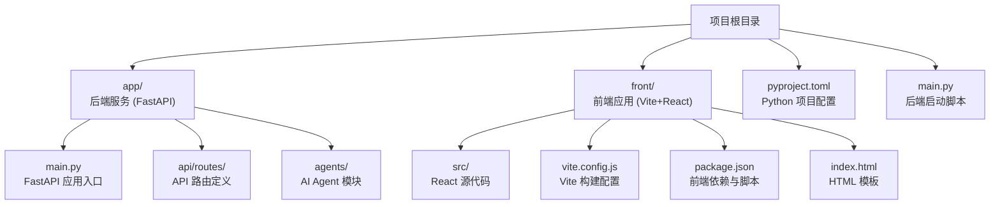
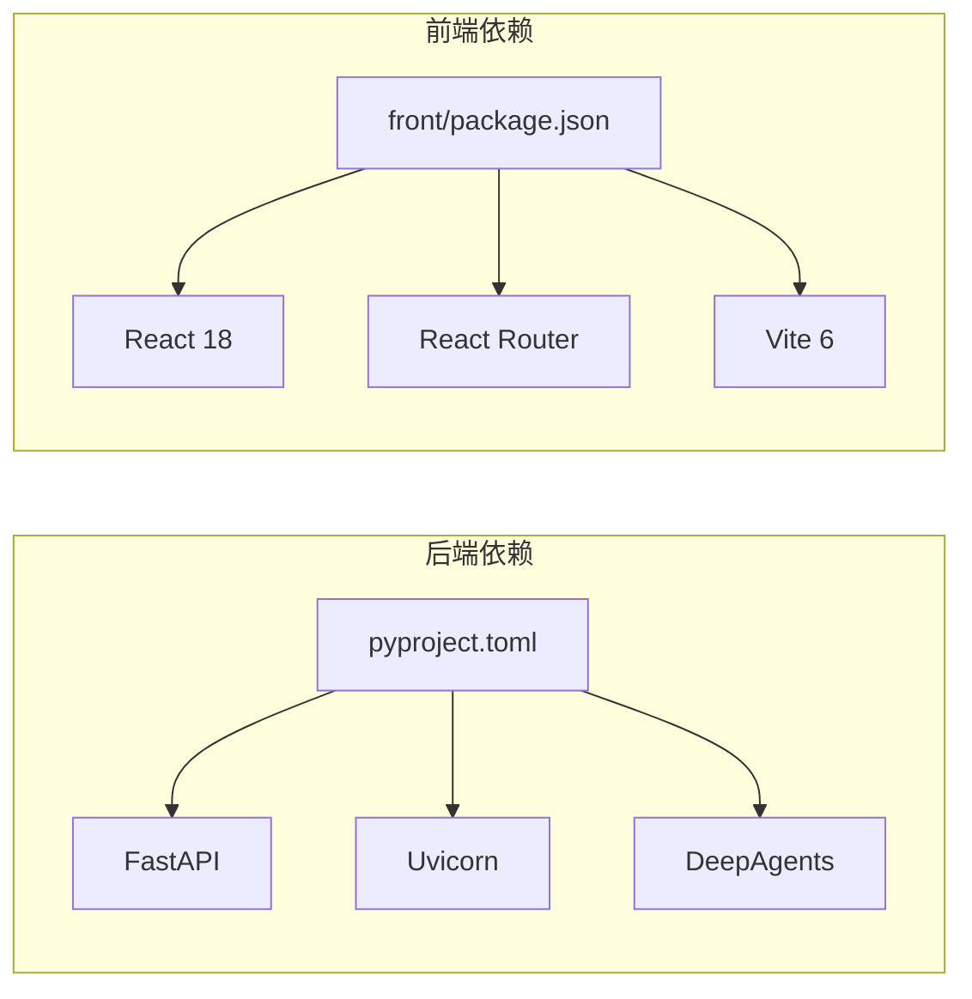

# 部署平台

<cite>
**本文引用的文件**
- [pyproject.toml](file://pyproject.toml)
- [app/main.py](file://app/main.py)
- [main.py](file://main.py)
- [front/package.json](file://front/package.json)
- [front/vite.config.js](file://front/vite.config.js)
- [front/index.html](file://front/index.html)
- [front/src/App.jsx](file://front/src/App.jsx)
- [front/src/router.jsx](file://front/src/router.jsx)
- [front/src/pages/HomePage.jsx](file://front/src/pages/HomePage.jsx)
- [app/api/routes/research.py](file://app/api/routes/research.py)
- [app/api/__init__.py](file://app/api/__init__.py)
</cite>

## 更新摘要
**变更内容**
- 从单一 Next.js 应用更新为全栈架构（FastAPI 后端 + Vite 前端）
- 新增后端服务部署指南（FastAPI/Uvicorn）
- 更新前端部署策略（Vite 静态构建）
- 添加前后端分离部署方案
- 更新架构图和部署流程图

## 目录
1. [简介](#简介)
2. [项目结构](#项目结构)
3. [核心组件](#核心组件)
4. [架构总览](#架构总览)
5. [详细组件分析](#详细组件分析)
6. [依赖分析](#依赖分析)
7. [性能考虑](#性能考虑)
8. [故障排查指南](#故障排查指南)
9. [结论](#结论)
10. [附录](#附录)

## 简介
本指南面向 InsightMesh 项目提供多平台部署路径，覆盖前后端分离的完整部署方案。InsightMesh 是一个全栈 AI Agent 智能调研平台，采用 FastAPI + Uvicorn 作为后端服务，Vite + React 作为前端应用。项目支持多种部署策略，包括云平台托管、传统服务器部署、Docker 容器化以及混合部署方案。

## 项目结构
InsightMesh 采用前后端分离的全栈架构：
- **后端服务**：位于 `app/` 目录，基于 FastAPI 框架，提供 RESTful API 接口
- **前端应用**：位于 `front/` 目录，基于 Vite + React 构建，生成静态资源
- **根目录配置**：包含 Python 项目配置和启动脚本



**图表来源**
- [pyproject.toml:1-18](file://pyproject.toml#L1-L18)
- [app/main.py:1-39](file://app/main.py#L1-L39)
- [front/package.json:1-21](file://front/package.json#L1-L21)
- [front/vite.config.js:1-22](file://front/vite.config.js#L1-L22)

**章节来源**
- [pyproject.toml:1-18](file://pyproject.toml#L1-L18)
- [app/main.py:1-39](file://app/main.py#L1-L39)
- [front/package.json:1-21](file://front/package.json#L1-L21)
- [front/vite.config.js:1-22](file://front/vite.config.js#L1-L22)

## 核心组件
- **后端服务**：FastAPI 应用提供 RESTful API，支持 CORS 跨域请求，包含健康检查端点和研究任务管理接口
- **前端应用**：React SPA 应用，使用 React Router 进行客户端路由，支持动态页面加载
- **API 路由**：模块化路由设计，按功能领域组织 API 端点
- **开发环境**：Vite 开发服务器自动代理 API 请求到后端服务

**章节来源**
- [app/main.py:17-33](file://app/main.py#L17-L33)
- [app/api/routes/research.py:8-17](file://app/api/routes/research.py#L8-L17)
- [front/src/App.jsx:24-43](file://front/src/App.jsx#L24-L43)
- [front/vite.config.js:12-20](file://front/vite.config.js#L12-L20)

## 架构总览
下图展示了 InsightMesh 全栈应用的典型部署架构：前端静态资源由 CDN 托管，后端 API 服务独立部署，通过反向代理统一对外提供服务。

```mermaid
graph TB
subgraph "客户端"
U["浏览器/移动应用"]
end
subgraph "CDN 层"
F["前端静态资源<br/>Vite 构建产物"]
O["全球 CDN 缓存"]
end
subgraph "应用层"
R["反向代理<br/>Nginx/Traefik"]
B["后端服务<br/>FastAPI + Uvicorn"]
S["数据库/外部服务"]
end
U --> |HTTP(S)| R
R --> F
R --> B
B --> S
```

## 详细组件分析

### 后端服务部署（FastAPI + Uvicorn）

#### 本地开发环境
- **依赖安装**：使用 `pip install -e .` 或 `uv sync` 安装 Python 依赖
- **启动服务**：运行 `python main.py` 或 `uvicorn app.main:app --host 0.0.0.0 --port 8000`
- **API 文档**：访问 `/docs` 查看 Swagger UI 文档

#### 生产环境部署

##### Docker 容器化部署
创建 `Dockerfile`：
```dockerfile
FROM python:3.12-slim

WORKDIR /app

COPY pyproject.toml uv.lock ./
RUN pip install --no-cache-dir .

COPY app/ ./app/
COPY main.py ./

EXPOSE 8000

CMD ["uvicorn", "app.main:app", "--host", "0.0.0.0", "--port", "8000"]
```

##### Kubernetes 部署
创建 `deployment.yaml`：
```yaml
apiVersion: apps/v1
kind: Deployment
metadata:
  name: insightmesh-backend
spec:
  replicas: 3
  selector:
    matchLabels:
      app: insightmesh-backend
  template:
    metadata:
      labels:
        app: insightmesh-backend
    spec:
      containers:
      - name: backend
        image: insightmesh-backend:latest
        ports:
        - containerPort: 8000
        resources:
          requests:
            memory: "256Mi"
            cpu: "250m"
          limits:
            memory: "512Mi"
            cpu: "500m"
---
apiVersion: v1
kind: Service
metadata:
  name: insightmesh-backend
spec:
  selector:
    app: insightmesh-backend
  ports:
  - port: 80
    targetPort: 8000
  type: ClusterIP
```

**章节来源**
- [pyproject.toml:7-11](file://pyproject.toml#L7-L11)
- [main.py:5-6](file://main.py#L5-L6)
- [app/main.py:17-33](file://app/main.py#L17-L33)

### 前端应用部署（Vite + React）

#### 构建与预览
- **开发模式**：`npm run dev` 启动开发服务器（端口 3000）
- **生产构建**：`npm run build` 生成优化后的静态资源
- **预览构建**：`npm run preview` 预览生产构建结果

#### 云平台部署

##### Vercel 部署
创建 `vercel.json`：
```json
{
  "buildCommand": "cd front && npm install && npm run build",
  "outputDirectory": "front/dist",
  "routes": [
    { "src": "/api/(.*)", "dest": "https://your-backend-api.com/api/$1" },
    { "src": "/(.*)", "dest": "/$1" }
  ]
}
```

##### Netlify 部署
创建 `netlify.toml`：
```toml
[build]
  command = "cd front && npm install && npm run build"
  publish = "front/dist"

[[redirects]]
  from = "/api/*"
  to = "https://your-backend-api.com/api/:splat"
  status = 200
```

##### GitHub Pages 部署
创建 `.github/workflows/deploy.yml`：
```yaml
name: Deploy to GitHub Pages
on:
  push:
    branches: [main]

jobs:
  deploy:
    runs-on: ubuntu-latest
    steps:
    - uses: actions/checkout@v3
    - uses: actions/setup-node@v3
      with:
        node-version: '18'
    - run: cd front && npm install && npm run build
    - uses: peaceiris/actions-gh-pages@v3
      with:
        github_token: ${{ secrets.GITHUB_TOKEN }}
        publish_dir: ./front/dist
```

**章节来源**
- [front/package.json:7-11](file://front/package.json#L7-L11)
- [front/vite.config.js:12-20](file://front/vite.config.js#L12-L20)
- [front/index.html:1-14](file://front/index.html#L1-14)

### 传统服务器部署（Nginx + PM2）

#### 服务器准备
- **后端环境**：Python 3.12+，虚拟环境管理
- **前端环境**：Node.js 18+，Nginx 反向代理
- **进程管理**：PM2 用于进程守护和负载均衡

#### Nginx 配置
```nginx
server {
    listen 80;
    server_name your-domain.com;

    # 前端静态资源
    location / {
        root /var/www/insightmesh/front/dist;
        try_files $uri $uri/ /index.html;
        
        # 缓存策略
        location ~* \.(js|css|png|jpg|jpeg|gif|ico|svg)$ {
            expires 1y;
            add_header Cache-Control "public, immutable";
        }
    }

    # 后端 API 代理
    location /api {
        proxy_pass http://localhost:8000;
        proxy_set_header Host $host;
        proxy_set_header X-Real-IP $remote_addr;
        proxy_set_header X-Forwarded-For $proxy_add_x_forwarded_for;
        proxy_set_header X-Forwarded-Proto $scheme;
        
        # WebSocket 支持（如果需要）
        proxy_http_version 1.1;
        proxy_set_header Upgrade $http_upgrade;
        proxy_set_header Connection "upgrade";
    }

    # SSL 配置（建议使用 Let's Encrypt）
    listen 443 ssl;
    ssl_certificate /etc/letsencrypt/live/your-domain.com/fullchain.pem;
    ssl_certificate_key /etc/letsencrypt/live/your-domain.com/privkey.pem;
}
```

#### PM2 进程管理
创建 `ecosystem.config.js`：
```javascript
module.exports = {
  apps: [{
    name: 'insightmesh-backend',
    script: 'main.py',
    instances: 2,
    exec_mode: 'cluster',
    env: {
      NODE_ENV: 'production',
      PORT: 8000
    },
    max_memory_restart: '1G',
    error_file: './logs/error.log',
    out_file: './logs/out.log',
    merge_logs: true
  }]
};
```

**章节来源**
- [app/main.py:25-31](file://app/main.py#L25-L31)
- [main.py:5-6](file://main.py#L5-L6)

### Docker Compose 编排部署

创建 `docker-compose.yml`：
```yaml
version: '3.8'

services:
  frontend:
    build:
      context: ./front
      dockerfile: Dockerfile.frontend
    ports:
      - "80:80"
    depends_on:
      - backend
    environment:
      - VITE_API_URL=http://backend:8000

  backend:
    build:
      context: .
      dockerfile: Dockerfile.backend
    ports:
      - "8000:8000"
    environment:
      - PYTHONUNBUFFERED=1
    volumes:
      - ./app:/app/app
      - ./logs:/app/logs

  nginx:
    image: nginx:alpine
    ports:
      - "443:443"
    volumes:
      - ./nginx.conf:/etc/nginx/nginx.conf
      - ./ssl:/etc/nginx/ssl
    depends_on:
      - frontend
      - backend
```

**章节来源**
- [pyproject.toml:1-18](file://pyproject.toml#L1-L18)
- [front/package.json:1-21](file://front/package.json#L1-L21)

### 各平台优缺点与选择建议

#### 云平台托管
- **Vercel**
  - 优点：零配置、自动 SSL、全球 CDN、边缘函数、一键域名绑定
  - 缺点：对非边缘场景的自定义可能受限
  - 适合：追求快速上线与高可用的前端项目

- **Netlify**
  - 优点：功能丰富、Edge Functions、表单与 CMS 集成
  - 缺点：部分高级特性需付费计划
  - 适合：中小型前端项目与需要边缘函数的场景

#### 传统服务器部署
- **Nginx + PM2**
  - 优点：完全可控、成本低、可扩展性强
  - 缺点：运维复杂、需自行维护 SSL、备份与监控
  - 适合：有稳定运维团队或对基础设施有强管控需求的企业

#### 容器化部署
- **Docker + Kubernetes**
  - 优点：环境一致、易于迁移、便于 CI/CD
  - 缺点：镜像体积与安全策略需关注
  - 适合：需要标准化交付与多环境复用的团队

#### 静态托管
- **GitHub Pages**
  - 优点：免费、与仓库一体化、适合文档与简单站点
  - 缺点：不支持服务端逻辑、路由与重写有限制
  - 适合：静态文档、原型演示与轻量站点

## 依赖分析

### 后端依赖
- **FastAPI 0.139.0+**：高性能异步 Web 框架
- **Uvicorn 0.49.0+**：ASGI 服务器
- **DeepAgents 0.6.12+**：AI Agent 框架
- **Python 3.12+**：运行时环境

### 前端依赖
- **React 18.3.1**：用户界面框架
- **React Router DOM 6.28.0**：客户端路由
- **Vite 6.0.0**：现代前端构建工具
- **@vitejs/plugin-react 4.3.4**：React 支持插件



**图表来源**
- [pyproject.toml:7-11](file://pyproject.toml#L7-L11)
- [front/package.json:12-20](file://front/package.json#L12-L20)

**章节来源**
- [pyproject.toml:7-11](file://pyproject.toml#L7-L11)
- [front/package.json:12-20](file://front/package.json#L12-L20)

## 性能考虑

### 后端优化
- **异步处理**：利用 FastAPI 的异步特性提高并发处理能力
- **连接池**：数据库连接池配置，避免频繁建立连接
- **缓存策略**：Redis 缓存热点数据，减少数据库压力
- **限流保护**：API 限流防止恶意请求

### 前端优化
- **代码分割**：Vite 自动代码分割，按需加载
- **资源压缩**：启用 Gzip/Brotli 压缩
- **图片优化**：使用 WebP/AVIF 格式，懒加载
- **CDN 加速**：静态资源 CDN 分发

### 部署优化
- **水平扩展**：多实例部署，负载均衡
- **容器编排**：Kubernetes 自动扩缩容
- **监控告警**：APM 监控和性能指标收集

## 故障排查指南

### 后端问题排查
- **启动失败**：检查 Python 版本和依赖安装，查看日志输出
- **API 错误**：访问 `/docs` 测试 API 端点，检查 CORS 配置
- **性能问题**：使用 APM 工具分析慢查询和资源占用

### 前端问题排查
- **构建失败**：检查 Node.js 版本和依赖安装，清理缓存重试
- **路由 404**：确认 Nginx 配置中的 try_files 规则
- **API 调用失败**：检查网络请求和跨域配置

### 部署问题排查
- **SSL 证书**：确认证书有效期和域名解析正确
- **端口冲突**：检查系统端口占用情况
- **权限问题**：确认文件读写权限和服务账户权限

## 结论
InsightMesh 作为全栈 AI Agent 智能调研平台，具备灵活的多平台部署能力。根据团队技术栈与运维能力选择合适的部署方案：追求极致易用可选云平台托管；需要强控制与传统架构可选 Nginx + PM2；需要标准化交付可选 Docker 容器化。部署前后应完善域名、SSL 与 CDN 设置，并进行端到端验证与性能优化。

## 附录

### 部署前准备清单
- **域名与 SSL**：域名注册与解析、SSL 证书申请与续期
- **环境变量**：后端 API 地址、第三方服务密钥等配置
- **监控配置**：日志收集、性能监控、告警规则
- **备份策略**：数据库备份、配置文件备份、灾难恢复

### 不同技术层级的部署路径
- **新手入门**：推荐 Vercel + 云数据库，零配置快速上线
- **进阶部署**：Docker 化 + 传统服务器，结合 Nginx 与 PM2 实现可控部署
- **企业级架构**：结合 CI/CD 与多环境策略，容器编排与微服务架构

### 开发环境配置
- **后端开发**：`python main.py` 启动后端服务（端口 8000）
- **前端开发**：`cd front && npm run dev` 启动前端服务（端口 3000）
- **开发代理**：Vite 自动代理 `/api` 请求到后端服务