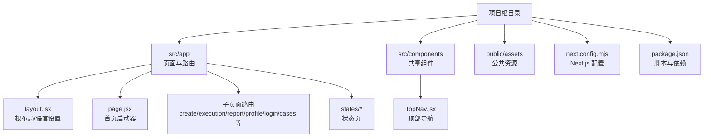
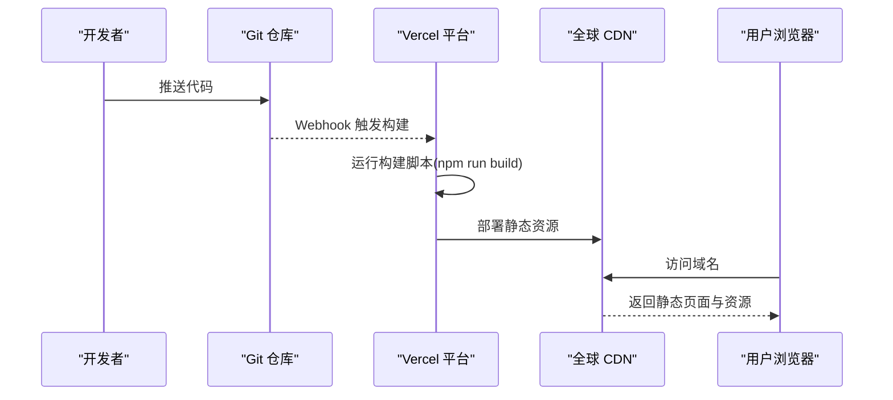
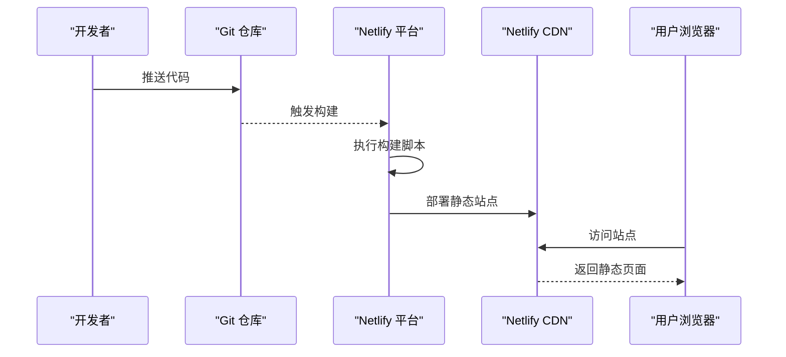
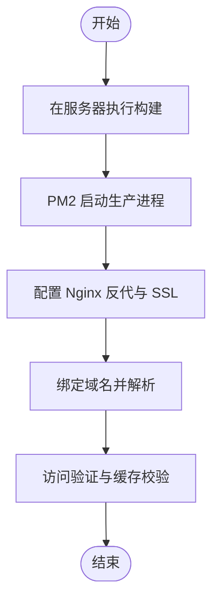
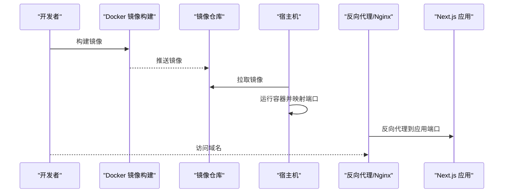
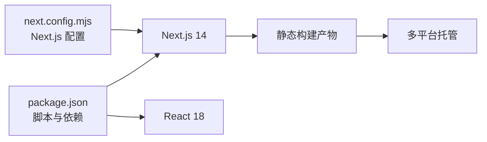

# 部署平台

<cite>
**本文引用的文件**
- [package.json](file://package.json)
- [next.config.mjs](file://next.config.mjs)
- [README.md](file://README.md)
- [src/app/layout.jsx](file://src/app/layout.jsx)
- [src/app/page.jsx](file://src/app/page.jsx)
- [src/components/TopNav.jsx](file://src/components/TopNav.jsx)
</cite>

## 目录
1. [简介](#简介)
2. [项目结构](#项目结构)
3. [核心组件](#核心组件)
4. [架构总览](#架构总览)
5. [详细组件分析](#详细组件分析)
6. [依赖分析](#依赖分析)
7. [性能考虑](#性能考虑)
8. [故障排查指南](#故障排查指南)
9. [结论](#结论)
10. [附录](#附录)

## 简介
本指南面向 InsightMesh 项目提供多平台部署路径，覆盖 Vercel、Netlify、传统服务器（Nginx + PM2）、Docker 容器化以及 GitHub Pages 等静态托管平台。项目基于 Next.js App Router 构建，采用 React 18，具备完全静态预渲染能力，适合在多种平台上进行高效部署与分发。

## 项目结构
InsightMesh 为 Next.js App Router 应用，页面组织于 src/app 下，采用约定式路由与静态预渲染。全局样式位于 src/app/globals.css，根布局与语言设置在 src/app/layout.jsx 中定义。项目脚本与依赖见 package.json，Next.js 核心配置见 next.config.mjs。



图表来源
- [README.md:13-39](file://README.md#L13-L39)
- [src/app/layout.jsx:1-50](file://src/app/layout.jsx#L1-L50)
- [src/app/page.jsx:1-50](file://src/app/page.jsx#L1-L50)
- [src/components/TopNav.jsx:1-50](file://src/components/TopNav.jsx#L1-L50)

章节来源
- [README.md:13-39](file://README.md#L13-L39)
- [package.json:1-18](file://package.json#L1-L18)
- [next.config.mjs:1-7](file://next.config.mjs#L1-L7)

## 核心组件
- 根布局与语言设置：根布局负责设置 html lang、全局样式注入与通用结构，确保页面统一的国际化与视觉基础。
- 页面路由：包含首页、创建任务、执行页、报告页、个人中心、登录注册、案例展示及五种状态页，均以静态预渲染方式构建。
- 共享组件：顶部导航等跨页面组件，便于统一风格与交互。
- 构建与运行：通过 npm scripts 执行开发、构建与生产启动，Next.js 自动完成静态导出与优化。

章节来源
- [src/app/layout.jsx:1-50](file://src/app/layout.jsx#L1-L50)
- [src/app/page.jsx:1-50](file://src/app/page.jsx#L1-L50)
- [src/components/TopNav.jsx:1-50](file://src/components/TopNav.jsx#L1-L50)
- [package.json:6-11](file://package.json#L6-L11)
- [README.md:79-87](file://README.md#L79-L87)

## 架构总览
下图展示了 InsightMesh 在不同部署平台上的典型架构：前端静态资源由平台托管，客户端通过浏览器访问；若需要服务端功能（如 API），可在平台提供的边缘函数或后端环境中实现。

```mermaid
graph TB
subgraph "客户端"
U["浏览器/移动应用"]
end
subgraph "静态托管平台"
V["Vercel/Netlify/GitHub Pages"]
O["CDN 缓存"]
end
subgraph "可选后端"
E["边缘函数/无服务器函数"]
S["数据库/外部服务"]
end
U --> |HTTP(S)| V
V --> O
U -. 可选 .-> E
E --> S
```

## 详细组件分析

### Vercel 部署指南
- 项目连接与导入
  - 将仓库导入 Vercel 控制台，选择自动检测框架（Next.js）。
  - 确认构建命令与输出目录符合 Next.js 默认规则（无需额外配置）。
- 环境变量配置
  - 在 Vercel 项目设置中添加环境变量（如 NEXT_PUBLIC_* 前缀的公共变量）。
  - 对于私有变量，使用 Vercel 的加密环境变量功能。
- 域名绑定
  - 在域名设置中添加自定义域名并完成 DNS 配置。
  - 使用 Vercel 的 SSL 自动签发与 HTTPS 强制跳转。
- 部署流程时序



图表来源
- [package.json:6-11](file://package.json#L6-L11)
- [next.config.mjs:1-7](file://next.config.mjs#L1-L7)

章节来源
- [package.json:6-11](file://package.json#L6-L11)
- [next.config.mjs:1-7](file://next.config.mjs#L1-L7)

### Netlify 部署指南
- 构建设置
  - 选择“手动构建”或启用自动触发，设置构建命令为 npm run build，发布目录为 .next 或 out（取决于 Next.js 导出模式）。
  - 若使用 Next.js 静态导出，请确认已启用 export 功能（通常由 Next.js 默认行为满足）。
- 功能配置
  - 在 Netlify 上配置重写/代理规则，确保客户端路由（App Router）正确返回 index.html。
  - 如需 API，可使用 Netlify Functions 或 Edge Functions。
- 部署流程时序



图表来源
- [package.json:6-11](file://package.json#L6-L11)

章节来源
- [package.json:6-11](file://package.json#L6-L11)

### 传统服务器部署（Nginx + PM2）
- 服务器准备
  - 安装 Node.js 与 PM2，准备 Nginx。
- 构建与启动
  - 在服务器上拉取代码并执行构建脚本，然后使用 PM2 启动生产进程。
- Nginx 配置要点
  - 反向代理到本地端口（如 3000）。
  - 配置静态资源缓存与 gzip 压缩。
  - 配置 SSL（建议使用 Let’s Encrypt 自动续期）。
- 流程图



章节来源
- [package.json:6-11](file://package.json#L6-L11)

### Docker 容器化部署
- Dockerfile（示例思路）
  - 基于官方 Node.js 镜像，设置工作目录，复制依赖与源码，安装依赖，执行构建，暴露端口，设置启动命令。
- docker-compose（可选）
  - 使用 compose 管理容器编排，挂载静态资源卷，配置环境变量与端口映射。
- 部署流程时序



图表来源
- [package.json:6-11](file://package.json#L6-L11)

章节来源
- [package.json:6-11](file://package.json#L6-L11)

### GitHub Pages 部署指南
- 静态导出
  - 使用 Next.js 的静态导出能力，将构建产物输出至 out 目录。
- 工作流（示例思路）
  - 在 GitHub Actions 中配置构建与部署步骤，将 out 目录推送到 gh-pages 分支或使用 gh-pages 工具。
- 注意事项
  - App Router 客户端路由需配合重写策略，确保刷新不出现 404。
  - 子路径部署时需配置 basePath 与相关链接。

章节来源
- [README.md:79-87](file://README.md#L79-L87)

### 各平台优缺点与选择建议
- Vercel
  - 优点：零配置、自动 SSL、全球 CDN、边缘函数、一键域名绑定。
  - 缺点：对非边缘场景的自定义可能受限。
  - 适合：追求快速上线与高可用的前端项目。
- Netlify
  - 优点：功能丰富、Edge Functions、表单与 CMS 集成。
  - 缺点：部分高级特性需付费计划。
  - 适合：中小型前端项目与需要边缘函数的场景。
- 传统服务器（Nginx + PM2）
  - 优点：完全可控、成本低、可扩展性强。
  - 缺点：运维复杂、需自行维护 SSL、备份与监控。
  - 适合：有稳定运维团队或对基础设施有强管控需求的企业。
- Docker
  - 优点：环境一致、易于迁移、便于 CI/CD。
  - 缺点：镜像体积与安全策略需关注。
  - 适合：需要标准化交付与多环境复用的团队。
- GitHub Pages
  - 优点：免费、与仓库一体化、适合文档与简单站点。
  - 缺点：不支持服务端逻辑、路由与重写有限制。
  - 适合：静态文档、原型演示与轻量站点。

## 依赖分析
- 项目依赖
  - Next.js 14、React 18 为核心运行时。
  - 构建脚本通过 npm run build 与 npm run start。
- 配置依赖
  - next.config.mjs 提供 React 严格模式等基础配置。
- 产物依赖
  - 项目具备完全静态预渲染能力，适合静态托管平台。



图表来源
- [package.json:12-16](file://package.json#L12-L16)
- [next.config.mjs:1-7](file://next.config.mjs#L1-L7)

章节来源
- [package.json:12-16](file://package.json#L12-L16)
- [next.config.mjs:1-7](file://next.config.mjs#L1-L7)

## 性能考虑
- 静态预渲染：所有路由均为静态预渲染，首屏 JS 较小，利于 CDN 加速与全球分发。
- 资源优化：建议开启 Gzip/Brotli 压缩与缓存策略，合理设置缓存头。
- 图片与字体：优先使用现代格式（WebP/AVIF）与字体子集化，减少首屏阻塞。
- CDN 与边缘：利用平台自带 CDN 与边缘函数就近响应请求，降低延迟。

章节来源
- [README.md:86](file://README.md#L86)

## 故障排查指南
- 构建失败
  - 检查 Node.js 版本与依赖安装是否成功，确认构建脚本与输出目录配置。
- 路由 404（客户端路由）
  - 在静态托管平台配置重写规则，确保所有未匹配路径返回 index.html。
- 域名与 SSL
  - 确认 DNS 解析与 CNAME/记录类型正确；如使用自定义证书，注意有效期与链路完整性。
- CDN 缓存问题
  - 清除缓存或调整缓存策略，核对缓存头与版本号。
- 性能问题
  - 分析首屏 JS 体积与关键资源加载顺序，优化图片与字体加载策略。

章节来源
- [package.json:6-11](file://package.json#L6-L11)
- [README.md:79-87](file://README.md#L79-L87)

## 结论
InsightMesh 作为完全静态化的 Next.js 应用，具备在多平台高效部署的天然优势。根据团队技术栈与运维能力选择合适平台：追求极致易用与全球加速可选 Vercel/Netlify；需要强控制与低成本可选传统服务器或 Docker；仅需静态展示可选 GitHub Pages。部署前后应完善域名、SSL 与 CDN 设置，并进行端到端验证与性能优化。

## 附录
- 部署前准备清单
  - 域名注册与解析、SSL 证书申请与续期、CDN 启用与缓存策略。
  - 环境变量梳理（NEXT_PUBLIC_* 与私有变量）。
  - 构建产物验证（静态导出与客户端路由测试）。
- 不同技术层级的部署路径
  - 新手：推荐 Vercel/Netlify，零配置快速上线。
  - 进阶：Docker 化 + 传统服务器，结合 Nginx 与 PM2 实现可控部署。
  - 企业级：结合 CI/CD 与多环境策略，统一镜像与配置管理。