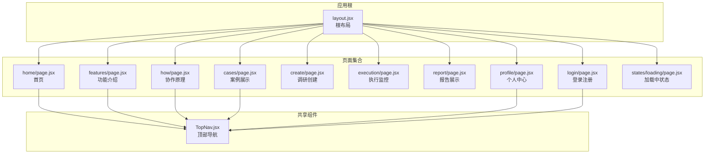
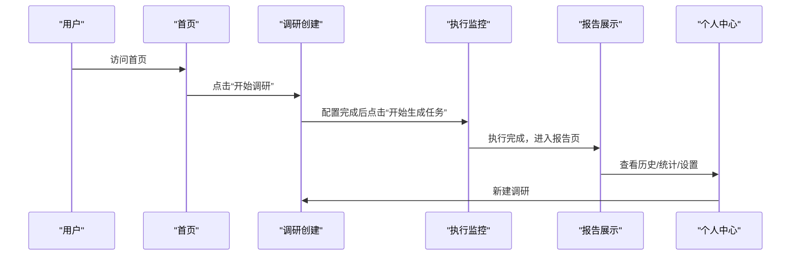
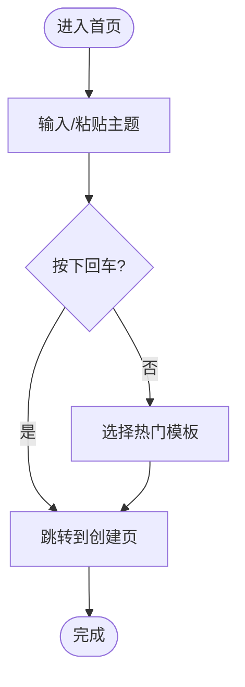
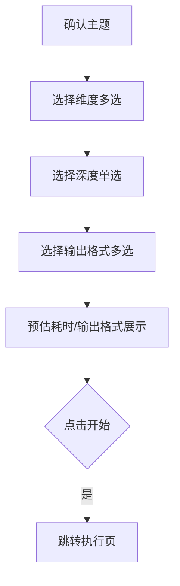
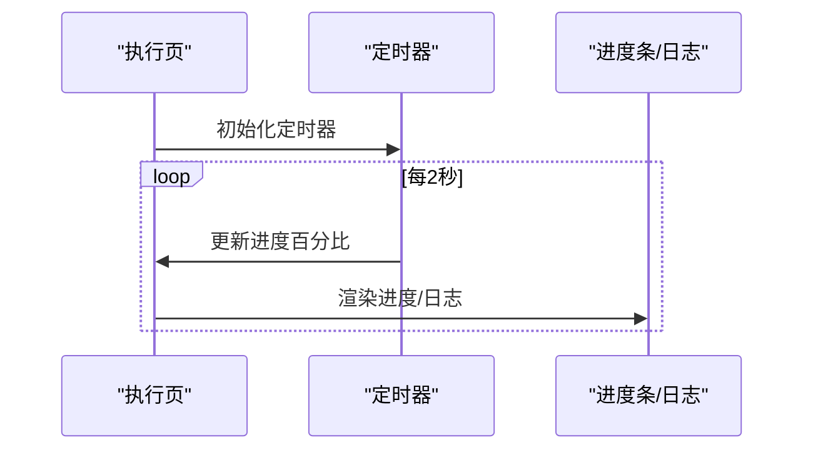
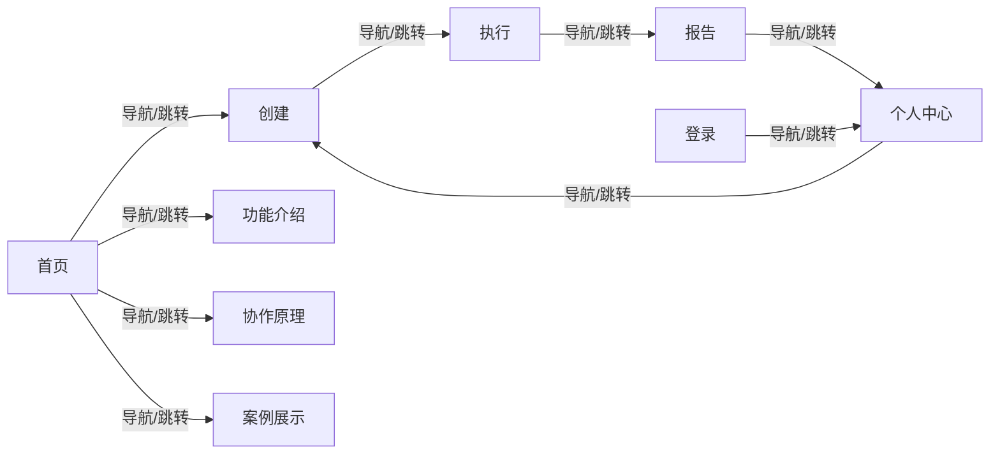

# 页面导航

<cite>
**本文引用的文件**
- [src/app/layout.jsx](file://src/app/layout.jsx)
- [src/app/page.jsx](file://src/app/page.jsx)
- [src/app/home/page.jsx](file://src/app/home/page.jsx)
- [src/app/features/page.jsx](file://src/app/features/page.jsx)
- [src/app/how/page.jsx](file://src/app/how/page.jsx)
- [src/app/cases/page.jsx](file://src/app/cases/page.jsx)
- [src/app/create/page.jsx](file://src/app/create/page.jsx)
- [src/app/execution/page.jsx](file://src/app/execution/page.jsx)
- [src/app/report/page.jsx](file://src/app/report/page.jsx)
- [src/app/profile/page.jsx](file://src/app/profile/page.jsx)
- [src/app/login/page.jsx](file://src/app/login/page.jsx)
- [src/app/states/loading/page.jsx](file://src/app/states/loading/page.jsx)
- [src/components/TopNav.jsx](file://src/components/TopNav.jsx)
- [package.json](file://package.json)
- [next.config.mjs](file://next.config.mjs)
</cite>

## 目录
1. [简介](#简介)
2. [项目结构](#项目结构)
3. [核心组件](#核心组件)
4. [架构总览](#架构总览)
5. [详细组件分析](#详细组件分析)
6. [依赖分析](#依赖分析)
7. [性能考虑](#性能考虑)
8. [故障排查指南](#故障排查指南)
9. [结论](#结论)
10. [附录](#附录)

## 简介
本文件系统性梳理 InsightMesh 的页面系统，覆盖首页、功能介绍、协作原理、案例展示、调研创建、执行监控、报告展示、个人中心、登录注册以及若干状态页。文档从架构、导航与路由、状态管理、交互模式、响应式与移动端适配、性能优化与用户体验等方面进行深入解析，并提供扩展与定制指导。

## 项目结构
- Next.js App Router 结构，页面位于 src/app 下，采用“按文件系统路由”的约定式路由。
- 根布局负责全局样式与 viewport 配置。
- 页面均采用客户端组件（除部分状态页外），便于状态管理与交互。
- 顶层导航 TopNav 作为跨页面共享组件，贯穿各页面。

**图表来源**
- [src/app/layout.jsx:1-21](file://src/app/layout.jsx#L1-L21)
- [src/app/home/page.jsx:1-212](file://src/app/home/page.jsx#L1-L212)
- [src/app/features/page.jsx:1-96](file://src/app/features/page.jsx#L1-L96)
- [src/app/how/page.jsx:1-144](file://src/app/how/page.jsx#L1-L144)
- [src/app/cases/page.jsx:1-161](file://src/app/cases/page.jsx#L1-L161)
- [src/app/create/page.jsx:1-183](file://src/app/create/page.jsx#L1-L183)
- [src/app/execution/page.jsx:1-169](file://src/app/execution/page.jsx#L1-L169)
- [src/app/report/page.jsx:1-250](file://src/app/report/page.jsx#L1-L250)
- [src/app/profile/page.jsx:1-284](file://src/app/profile/page.jsx#L1-L284)
- [src/app/login/page.jsx:1-185](file://src/app/login/page.jsx#L1-L185)
- [src/app/states/loading/page.jsx:1-12](file://src/app/states/loading/page.jsx#L1-L12)
- [src/components/TopNav.jsx:1-45](file://src/components/TopNav.jsx#L1-L45)

**章节来源**
- [src/app/layout.jsx:1-21](file://src/app/layout.jsx#L1-L21)
- [src/components/TopNav.jsx:1-45](file://src/components/TopNav.jsx#L1-L45)

## 核心组件
- 根布局：设置站点元数据与 viewport，包裹所有页面内容。
- 顶部导航：提供跨页面一致的导航入口与登录/注册入口，支持活动态高亮与右侧按钮定制。
- 页面卡片入口：首页聚合主页面与状态页面，提供高保真可交互原型入口。

**章节来源**
- [src/app/layout.jsx:1-21](file://src/app/layout.jsx#L1-L21)
- [src/components/TopNav.jsx:1-45](file://src/components/TopNav.jsx#L1-L45)
- [src/app/page.jsx:1-78](file://src/app/page.jsx#L1-L78)

## 架构总览
- 路由策略：基于文件系统约定式路由，页面路径即访问路径。
- 导航策略：TopNav 在多数页面中提供统一导航；登录页与状态页采用简洁导航。
- 状态管理：页面内部使用 React 状态（useState、useEffect）管理交互与模拟数据；Next Router 提供页面跳转。
- 响应式与移动端：通过 CSS 变量与网格布局适配桌面端；移动端通过 viewport 设置与相对单位保证可读性。

**图表来源**
- [src/app/home/page.jsx:30-52](file://src/app/home/page.jsx#L30-L52)
- [src/app/create/page.jsx:45-183](file://src/app/create/page.jsx#L45-L183)
- [src/app/execution/page.jsx:55-169](file://src/app/execution/page.jsx#L55-L169)
- [src/app/report/page.jsx:37-250](file://src/app/report/page.jsx#L37-L250)
- [src/app/profile/page.jsx:42-284](file://src/app/profile/page.jsx#L42-L284)

## 详细组件分析

### 首页（home）
- 功能定位：产品 landing 页，承接流量入口与转化。
- 用户流程：输入主题 -> 热门模板选择 -> 进入功能介绍/协作原理 -> 创建调研。
- 关键交互：
  - 主题输入框与回车提交。
  - 热门模板芯片选择，隐藏字段同步。
  - 场景卡片与统计数据展示。
- 状态管理：本地输入状态与模板状态；无外部持久化。
- 导航：顶部导航高亮“功能介绍”，右上角“免费开始”。

**图表来源**
- [src/app/home/page.jsx:30-52](file://src/app/home/page.jsx#L30-L52)
- [src/app/home/page.jsx:193-212](file://src/app/home/page.jsx#L193-L212)

**章节来源**
- [src/app/home/page.jsx:1-212](file://src/app/home/page.jsx#L1-L212)
- [src/components/TopNav.jsx:1-45](file://src/components/TopNav.jsx#L1-L45)

### 功能介绍（features）
- 功能定位：展示核心能力清单，强化用户认知。
- 用户流程：浏览功能卡片 -> “开始调研”CTA。
- 交互要点：图标与描述对应，CTA 跳转创建页。

**章节来源**
- [src/app/features/page.jsx:1-96](file://src/app/features/page.jsx#L1-L96)

### 协作原理（how）
- 功能定位：解释多 Agent 工作闭环，建立信任。
- 用户流程：阅读 Agent 分工 -> 查看可视化 -> “看一次实时执行演示”。
- 交互要点：Agent 可视化环形图与说明列表。

**章节来源**
- [src/app/how/page.jsx:1-144](file://src/app/how/page.jsx#L1-L144)

### 案例展示（cases）
- 功能定位：以真实案例佐证能力，促进转化。
- 用户流程：筛选分类 -> 浏览案例卡片 -> 点击查看报告。
- 交互要点：分类筛选、卡片点击跳转报告页。

**章节来源**
- [src/app/cases/page.jsx:1-161](file://src/app/cases/page.jsx#L1-L161)

### 调研创建（create）
- 功能定位：配置调研主题、维度、深度与输出格式。
- 用户流程：确认主题 -> 选择维度 -> 选择深度 -> 选择输出格式 -> 开始任务。
- 状态管理：维度与格式的多选状态、深度单选状态；计算预估耗时与输出格式列表。
- 交互要点：维度卡片点击切换、格式卡片点击切换、底部汇总信息与提交按钮。

**图表来源**
- [src/app/create/page.jsx:45-183](file://src/app/create/page.jsx#L45-L183)

**章节来源**
- [src/app/create/page.jsx:1-183](file://src/app/create/page.jsx#L1-L183)

### 执行监控（execution）
- 功能定位：实时展示 Agent 执行状态、日志与进度。
- 用户流程：查看整体进度 -> 实时日志滚动 -> Agent 工作看板 -> 导出日志/取消任务。
- 状态管理：整体进度百分比定时动画；Agent 状态数组（完成/运行中/待执行）。
- 交互要点：Live 标签、进度条、日志流、数据可视化指标。

**图表来源**
- [src/app/execution/page.jsx:55-64](file://src/app/execution/page.jsx#L55-L64)
- [src/app/execution/page.jsx:93-110](file://src/app/execution/page.jsx#L93-L110)

**章节来源**
- [src/app/execution/page.jsx:1-169](file://src/app/execution/page.jsx#L1-L169)

### 报告展示（report）
- 功能定位：结构化展示调研结果，支持导出、分享、复制与重新调研。
- 用户流程：查看报告标题/元信息 -> 目录导航 -> 各章节内容 -> 溯源与图表 -> 导出/分享/重新调研。
- 交互要点：目录锚点跳转、图表可视化、引用溯源列表。

**章节来源**
- [src/app/report/page.jsx:1-250](file://src/app/report/page.jsx#L1-L250)

### 个人中心（profile）
- 功能定位：管理报告历史、收藏、统计与账户设置。
- 用户流程：侧边栏切换“我的报告/收藏/统计/设置” -> 报告列表筛选与搜索 -> 操作收藏/分享/删除/查看进度 -> 查看统计与设置。
- 状态管理：侧边栏活动项、筛选器、搜索词；报告列表根据条件过滤。
- 交互要点：搜索输入、状态标签、操作按钮（收藏/分享/删除/查看进度）。

**章节来源**
- [src/app/profile/page.jsx:1-284](file://src/app/profile/page.jsx#L1-L284)

### 登录注册（login）
- 功能定位：用户身份认证与第三方登录入口。
- 用户流程：登录/注册标签切换 -> 填写表单 -> 提交 -> 跳转个人中心。
- 状态管理：标签切换、密码可见性切换、表单字段聚焦管理。
- 交互要点：Tab 键盘导航、第三方社交登录按钮。

**章节来源**
- [src/app/login/page.jsx:1-185](file://src/app/login/page.jsx#L1-L185)

### 状态页（states）
- 加载中（loading）：展示加载动画与提示文案。
- 空数据（empty）：引导创建新调研。
- 调研失败重试（error）：错误详情 + 重试/微调主题。
- 网络异常（network）：排查建议 + 重连按钮。
- 权限提示（permission）：登录引导 + 权益列表。

**章节来源**
- [src/app/states/loading/page.jsx:1-12](file://src/app/states/loading/page.jsx#L1-L12)
- [src/app/page.jsx:19-25](file://src/app/page.jsx#L19-L25)

## 依赖分析
- 依赖关系：页面之间通过 Next.js 路由连接；TopNav 作为共享组件被多个页面复用。
- 外部依赖：Next.js（App Router、Navigation）、React（客户端组件）。
- 配置：Next.js 严格模式开启；viewport 与元数据在根布局中集中管理。

**图表来源**
- [src/app/home/page.jsx:1-212](file://src/app/home/page.jsx#L1-L212)
- [src/app/features/page.jsx:1-96](file://src/app/features/page.jsx#L1-L96)
- [src/app/how/page.jsx:1-144](file://src/app/how/page.jsx#L1-L144)
- [src/app/cases/page.jsx:1-161](file://src/app/cases/page.jsx#L1-L161)
- [src/app/create/page.jsx:1-183](file://src/app/create/page.jsx#L1-L183)
- [src/app/execution/page.jsx:1-169](file://src/app/execution/page.jsx#L1-L169)
- [src/app/report/page.jsx:1-250](file://src/app/report/page.jsx#L1-L250)
- [src/app/profile/page.jsx:1-284](file://src/app/profile/page.jsx#L1-L284)
- [src/app/login/page.jsx:1-185](file://src/app/login/page.jsx#L1-L185)

**章节来源**
- [package.json:1-18](file://package.json#L1-L18)
- [next.config.mjs:1-7](file://next.config.mjs#L1-L7)

## 性能考虑
- 路由与渲染
  - 使用客户端组件（如 create、execution、profile、login）以提升交互体验；注意避免在首屏渲染中引入重型计算。
  - 对高频更新的状态（如执行页进度）采用节流/定时器策略，减少重渲染频率。
- 数据与资源
  - 静态内容（如功能列表、Agent 列表）在组件内声明，避免不必要的外部请求。
  - 图表与可视化元素尽量使用轻量 SVG 或 CSS 实现，减少额外依赖。
- 交互与可访问性
  - Tab 键盘导航与焦点管理（登录页）有助于提升可访问性与移动端可用性。
- CSS 与响应式
  - 使用 CSS 变量与相对单位，配合 viewport 设置，保证在不同设备上的可读性与一致性。

## 故障排查指南
- 路由跳转异常
  - 检查页面间链接是否与文件系统路由一致；确认 Next Navigation API 使用正确。
- 状态不更新
  - 确认 React 状态更新函数调用与依赖；检查定时器清理（执行页）。
- 表单与键盘交互
  - 登录页 Tab 与回车事件需确保在切换标签后正确聚焦目标输入框。
- 导航高亮
  - TopNav 的 active 参数需与当前页面匹配，避免导航错位。

**章节来源**
- [src/app/execution/page.jsx:55-64](file://src/app/execution/page.jsx#L55-L64)
- [src/app/login/page.jsx:27-34](file://src/app/login/page.jsx#L27-L34)
- [src/components/TopNav.jsx:7-18](file://src/components/TopNav.jsx#L7-L18)

## 结论
InsightMesh 的页面系统以清晰的用户旅程为主线，围绕“主题输入—配置—执行—报告—管理”的闭环展开。通过共享导航组件与一致的视觉语言，系统在原型阶段实现了高保真交互与良好的可访问性。后续可在状态持久化、数据缓存与离线策略、图表库集成与性能监控方面进一步增强。

## 附录

### 页面与导航关系速览
- 首页：功能介绍、协作原理、案例展示、创建调研
- 创建：执行监控
- 执行：报告展示
- 报告：个人中心（历史/统计/设置）、创建新调研
- 个人中心：创建、登录（登出）
- 登录：个人中心
- 状态页：加载中、空数据、错误、网络异常、权限提示

**章节来源**
- [src/app/page.jsx:10-25](file://src/app/page.jsx#L10-L25)
- [src/app/home/page.jsx:96-126](file://src/app/home/page.jsx#L96-L126)
- [src/app/features/page.jsx:60-69](file://src/app/features/page.jsx#L60-L69)
- [src/app/how/page.jsx:65-75](file://src/app/how/page.jsx#L65-L75)
- [src/app/cases/page.jsx:149-157](file://src/app/cases/page.jsx#L149-L157)
- [src/app/report/page.jsx:42-57](file://src/app/report/page.jsx#L42-L57)
- [src/app/profile/page.jsx:92-96](file://src/app/profile/page.jsx#L92-L96)

### 新增页面开发流程与最佳实践
- 新增页面
  - 在 src/app 下创建页面目录与 page.jsx 文件，遵循文件系统路由。
  - 如需共享导航，引入 TopNav 并传入 active 与 ctaHref/ctaLabel。
- 状态管理
  - 将静态数据内聚在组件内；仅在必要时引入外部状态存储。
  - 对高频更新状态使用定时器或事件监听，注意清理副作用。
- 交互与可访问性
  - 为表单控件提供标签与占位符；为键盘用户提供 Tab 导航与快捷键。
- 性能
  - 避免在首屏渲染中执行重型计算；对图表与动画使用轻量实现。
- 路由与导航
  - 使用 Next Navigation API 进行程序化跳转；保持页面间链接一致。
- 设计与响应式
  - 使用 CSS 变量与网格布局；在移动端测试关键交互路径。