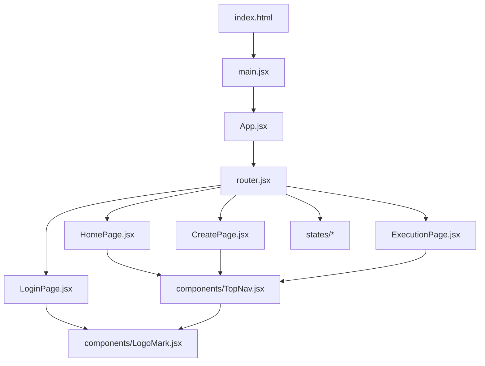
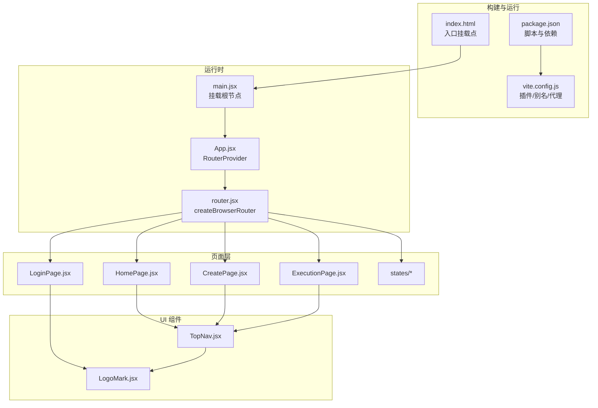
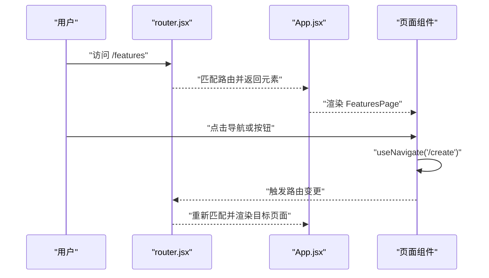
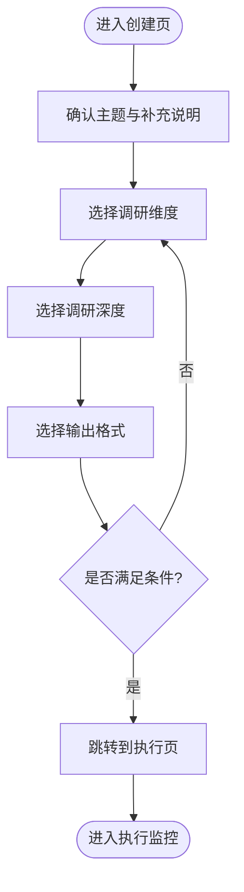
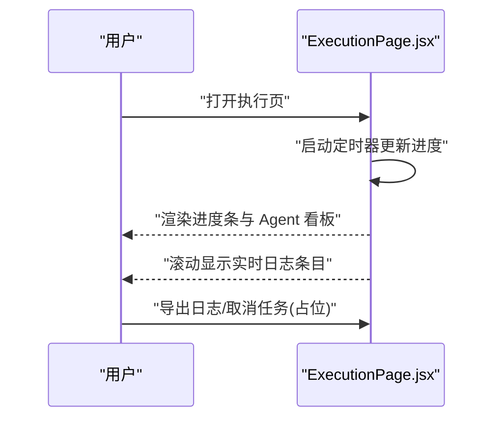
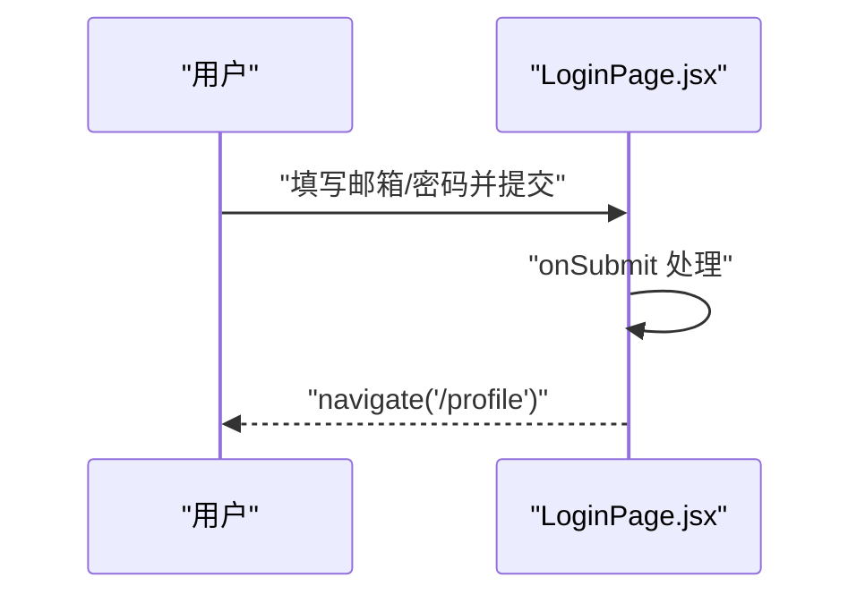
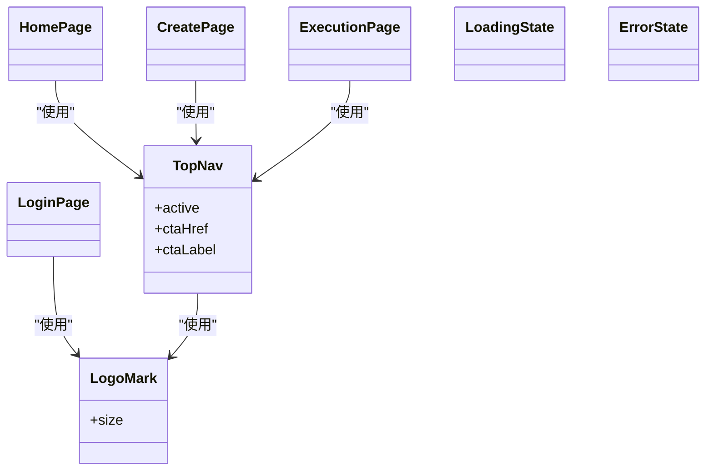
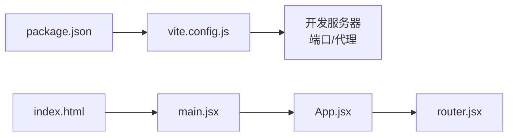

# React Vite前端架构

<cite>
**本文引用的文件**   
- [front/package.json](file://front/package.json)
- [front/vite.config.js](file://front/vite.config.js)
- [front/index.html](file://front/index.html)
- [front/src/main.jsx](file://front/src/main.jsx)
- [front/src/App.jsx](file://front/src/App.jsx)
- [front/src/router.jsx](file://front/src/router.jsx)
- [front/src/components/TopNav.jsx](file://front/src/components/TopNav.jsx)
- [front/src/components/LogoMark.jsx](file://front/src/components/LogoMark.jsx)
- [front/src/pages/HomePage.jsx](file://front/src/pages/HomePage.jsx)
- [front/src/pages/CreatePage.jsx](file://front/src/pages/CreatePage.jsx)
- [front/src/pages/ExecutionPage.jsx](file://front/src/pages/ExecutionPage.jsx)
- [front/src/pages/LoginPage.jsx](file://front/src/pages/LoginPage.jsx)
- [front/src/pages/states/LoadingState.jsx](file://front/src/pages/states/LoadingState.jsx)
- [front/src/pages/states/ErrorState.jsx](file://front/src/pages/states/ErrorState.jsx)
</cite>

## 目录
1. [简介](#简介)
2. [项目结构](#项目结构)
3. [核心组件](#核心组件)
4. [架构总览](#架构总览)
5. [详细组件分析](#详细组件分析)
6. [依赖关系分析](#依赖关系分析)
7. [性能与构建优化](#性能与构建优化)
8. [故障排查指南](#故障排查指南)
9. [结论](#结论)

## 简介
本项目是一个基于 React 与 Vite 的前端应用，面向“多 AI Agent 智能调研平台”的客户端体验。整体采用函数式组件、React Router v6 的浏览器路由模式进行页面导航，Vite 提供开发服务器与构建能力，并通过别名与代理简化本地开发与跨域访问。应用包含首页、任务创建、执行监控、登录注册以及若干通用状态页（加载中、错误等），并复用顶部导航与品牌标识等基础组件。

## 项目结构
前端代码位于 front 目录，入口为 index.html，由 main.jsx 挂载 React 根节点，App 作为顶层容器负责路由配置与渲染。页面按功能划分在 pages 目录下，公共 UI 元素集中在 components 目录，样式通过全局 CSS 引入。

图表来源
- [front/index.html:1-14](file://front/index.html#L1-L14)
- [front/src/main.jsx:1-11](file://front/src/main.jsx#L1-L11)
- [front/src/App.jsx:1-44](file://front/src/App.jsx#L1-L44)
- [front/src/router.jsx:1-36](file://front/src/router.jsx#L1-L36)
- [front/src/pages/HomePage.jsx:1-177](file://front/src/pages/HomePage.jsx#L1-L177)
- [front/src/pages/CreatePage.jsx:1-181](file://front/src/pages/CreatePage.jsx#L1-L181)
- [front/src/pages/ExecutionPage.jsx:1-167](file://front/src/pages/ExecutionPage.jsx#L1-L167)
- [front/src/pages/LoginPage.jsx:1-182](file://front/src/pages/LoginPage.jsx#L1-L182)
- [front/src/components/TopNav.jsx:1-45](file://front/src/components/TopNav.jsx#L1-L45)
- [front/src/components/LogoMark.jsx:1-19](file://front/src/components/LogoMark.jsx#L1-L19)

章节来源
- [front/index.html:1-14](file://front/index.html#L1-L14)
- [front/src/main.jsx:1-11](file://front/src/main.jsx#L1-L11)
- [front/src/App.jsx:1-44](file://front/src/App.jsx#L1-L44)
- [front/src/router.jsx:1-36](file://front/src/router.jsx#L1-L36)

## 核心组件
- 应用壳与路由
  - App 作为顶层容器，使用 RouterProvider 注入 router 实例，实现声明式路由渲染。
  - router.jsx 集中定义所有页面路由映射，便于统一管理与权限控制扩展。
- 全局布局与品牌
  - TopNav 提供统一的顶部导航、高亮当前项与右侧操作按钮，支持传入 active、ctaHref、ctaLabel 等参数。
  - LogoMark 是品牌图标组件，尺寸可配，多处复用。
- 关键页面
  - HomePage：营销落地页，包含主题输入区、模板选择、场景卡片、统计与 CTA。
  - CreatePage：任务配置页，支持维度勾选、深度选择、输出格式多选与提交跳转。
  - ExecutionPage：执行监控页，展示总体进度、Agent 看板与实时日志流。
  - LoginPage：登录/注册切换表单，支持密码显隐、社交登录占位与导航跳转。
  - 状态页：LoadingState、ErrorState 等用于加载与异常提示。

章节来源
- [front/src/App.jsx:1-44](file://front/src/App.jsx#L1-L44)
- [front/src/router.jsx:1-36](file://front/src/router.jsx#L1-L36)
- [front/src/components/TopNav.jsx:1-45](file://front/src/components/TopNav.jsx#L1-L45)
- [front/src/components/LogoMark.jsx:1-19](file://front/src/components/LogoMark.jsx#L1-L19)
- [front/src/pages/HomePage.jsx:1-177](file://front/src/pages/HomePage.jsx#L1-L177)
- [front/src/pages/CreatePage.jsx:1-181](file://front/src/pages/CreatePage.jsx#L1-L181)
- [front/src/pages/ExecutionPage.jsx:1-167](file://front/src/pages/ExecutionPage.jsx#L1-L167)
- [front/src/pages/LoginPage.jsx:1-182](file://front/src/pages/LoginPage.jsx#L1-L182)
- [front/src/pages/states/LoadingState.jsx:1-12](file://front/src/pages/states/LoadingState.jsx#L1-L12)
- [front/src/pages/states/ErrorState.jsx:1-21](file://front/src/pages/states/ErrorState.jsx#L1-L21)

## 架构总览
应用采用“单入口 + 声明式路由 + 组件化页面”的结构。Vite 提供开发服务器与构建产物；React Router v6 以 createBrowserRouter 管理路由；页面组件内部通过 useNavigate 与 Link 完成导航；TopNav 与 LogoMark 作为共享 UI 被多个页面复用。

图表来源
- [front/package.json:1-22](file://front/package.json#L1-L22)
- [front/vite.config.js:1-22](file://front/vite.config.js#L1-L22)
- [front/index.html:1-14](file://front/index.html#L1-L14)
- [front/src/main.jsx:1-11](file://front/src/main.jsx#L1-L11)
- [front/src/App.jsx:1-44](file://front/src/App.jsx#L1-L44)
- [front/src/router.jsx:1-36](file://front/src/router.jsx#L1-L36)
- [front/src/pages/HomePage.jsx:1-177](file://front/src/pages/HomePage.jsx#L1-L177)
- [front/src/pages/CreatePage.jsx:1-181](file://front/src/pages/CreatePage.jsx#L1-L181)
- [front/src/pages/ExecutionPage.jsx:1-167](file://front/src/pages/ExecutionPage.jsx#L1-L167)
- [front/src/pages/LoginPage.jsx:1-182](file://front/src/pages/LoginPage.jsx#L1-L182)
- [front/src/pages/states/LoadingState.jsx:1-12](file://front/src/pages/states/LoadingState.jsx#L1-L12)
- [front/src/pages/states/ErrorState.jsx:1-21](file://front/src/pages/states/ErrorState.jsx#L1-L21)
- [front/src/components/TopNav.jsx:1-45](file://front/src/components/TopNav.jsx#L1-L45)
- [front/src/components/LogoMark.jsx:1-19](file://front/src/components/LogoMark.jsx#L1-L19)

## 详细组件分析

### 路由与导航流程
- 路由定义集中在 router.jsx，使用 createBrowserRouter 声明式配置各路径与对应页面组件。
- App.jsx 通过 RouterProvider 注入 router，使整个应用具备路由能力。
- 页面内导航主要使用 react-router-dom 提供的 useNavigate 与 Link，避免整页刷新。

图表来源
- [front/src/router.jsx:1-36](file://front/src/router.jsx#L1-L36)
- [front/src/App.jsx:1-44](file://front/src/App.jsx#L1-L44)
- [front/src/pages/HomePage.jsx:1-177](file://front/src/pages/HomePage.jsx#L1-L177)
- [front/src/pages/CreatePage.jsx:1-181](file://front/src/pages/CreatePage.jsx#L1-L181)
- [front/src/pages/ExecutionPage.jsx:1-167](file://front/src/pages/ExecutionPage.jsx#L1-L167)
- [front/src/pages/LoginPage.jsx:1-182](file://front/src/pages/LoginPage.jsx#L1-L182)

章节来源
- [front/src/router.jsx:1-36](file://front/src/router.jsx#L1-L36)
- [front/src/App.jsx:1-44](file://front/src/App.jsx#L1-L44)

### 任务创建流程（CreatePage）
- 用户在 CreatePage 中确认主题、选择维度、深度与输出格式。
- 提交后通过 useNavigate 跳转到 ExecutionPage 开始生成任务。

图表来源
- [front/src/pages/CreatePage.jsx:1-181](file://front/src/pages/CreatePage.jsx#L1-L181)
- [front/src/pages/ExecutionPage.jsx:1-167](file://front/src/pages/ExecutionPage.jsx#L1-L167)

章节来源
- [front/src/pages/CreatePage.jsx:1-181](file://front/src/pages/CreatePage.jsx#L1-L181)

### 执行监控流程（ExecutionPage）
- 页面维护一个模拟的整体进度百分比，周期性递增以驱动进度条动画。
- 展示 Agent 工作看板与实时日志流，体现多 Agent 协作的执行过程。

图表来源
- [front/src/pages/ExecutionPage.jsx:1-167](file://front/src/pages/ExecutionPage.jsx#L1-L167)

章节来源
- [front/src/pages/ExecutionPage.jsx:1-167](file://front/src/pages/ExecutionPage.jsx#L1-L167)

### 登录流程（LoginPage）
- 支持登录与注册两种模式切换，表单提交后直接跳转到 Profile 页面（演示用途）。
- 提供密码显隐切换与社交登录按钮占位。

图表来源
- [front/src/pages/LoginPage.jsx:1-182](file://front/src/pages/LoginPage.jsx#L1-L182)

章节来源
- [front/src/pages/LoginPage.jsx:1-182](file://front/src/pages/LoginPage.jsx#L1-L182)

### 组件关系图

图表来源
- [front/src/components/TopNav.jsx:1-45](file://front/src/components/TopNav.jsx#L1-L45)
- [front/src/components/LogoMark.jsx:1-19](file://front/src/components/LogoMark.jsx#L1-L19)
- [front/src/pages/HomePage.jsx:1-177](file://front/src/pages/HomePage.jsx#L1-L177)
- [front/src/pages/CreatePage.jsx:1-181](file://front/src/pages/CreatePage.jsx#L1-L181)
- [front/src/pages/ExecutionPage.jsx:1-167](file://front/src/pages/ExecutionPage.jsx#L1-L167)
- [front/src/pages/LoginPage.jsx:1-182](file://front/src/pages/LoginPage.jsx#L1-L182)
- [front/src/pages/states/LoadingState.jsx:1-12](file://front/src/pages/states/LoadingState.jsx#L1-L12)
- [front/src/pages/states/ErrorState.jsx:1-21](file://front/src/pages/states/ErrorState.jsx#L1-L21)

## 依赖关系分析
- 构建与脚本
  - package.json 定义了 dev/build/preview 脚本，依赖 React 18、react-router-dom 与 Vite 生态插件。
- 开发服务器与代理
  - vite.config.js 启用 @vitejs/plugin-react，设置 @ 别名指向 src，并在开发服务器中配置 /api 代理到后端服务地址，解决本地跨域问题。
- 入口与挂载
  - index.html 提供 #root 挂载点，main.jsx 使用 ReactDOM.createRoot 渲染 App，并引入全局样式。

图表来源
- [front/package.json:1-22](file://front/package.json#L1-L22)
- [front/vite.config.js:1-22](file://front/vite.config.js#L1-L22)
- [front/index.html:1-14](file://front/index.html#L1-L14)
- [front/src/main.jsx:1-11](file://front/src/main.jsx#L1-L11)
- [front/src/App.jsx:1-44](file://front/src/App.jsx#L1-L44)
- [front/src/router.jsx:1-36](file://front/src/router.jsx#L1-L36)

章节来源
- [front/package.json:1-22](file://front/package.json#L1-L22)
- [front/vite.config.js:1-22](file://front/vite.config.js#L1-L22)
- [front/index.html:1-14](file://front/index.html#L1-L14)
- [front/src/main.jsx:1-11](file://front/src/main.jsx#L1-L11)

## 性能与构建优化
- 构建工具链
  - 使用 Vite 5 与官方 React 插件，获得快速的冷启动与热更新体验。
- 模块解析
  - 通过 @ 别名减少相对路径复杂度，提升可读性与引用稳定性。
- 开发代理
  - 将 /api 请求代理至后端服务，避免本地开发时的跨域问题，提高联调效率。
- 建议
  - 按需拆分大组件与懒加载页面，结合路由级代码分割降低首屏体积。
  - 对静态资源与图片进行压缩与懒加载，减少网络开销。
  - 在生产环境开启 Vite 的 gzip/brotli 压缩与缓存策略。

[本节为通用指导，不直接分析具体文件]

## 故障排查指南
- 路由未生效
  - 检查 router.jsx 是否正确导入页面组件，并确保 App.jsx 使用 RouterProvider 注入 router。
- 页面空白或报错
  - 确认 main.jsx 已正确挂载到 index.html 的 root 节点，且全局样式已引入。
- 代理无效
  - 核对 vite.config.js 中的 server.proxy 配置，确保目标地址与端口正确，且请求路径以 /api 开头。
- 登录跳转异常
  - 检查 LoginPage 的 onSubmit 逻辑与 useNavigate 的目标路径是否存在对应路由。

章节来源
- [front/src/App.jsx:1-44](file://front/src/App.jsx#L1-L44)
- [front/src/router.jsx:1-36](file://front/src/router.jsx#L1-L36)
- [front/src/main.jsx:1-11](file://front/src/main.jsx#L1-L11)
- [front/vite.config.js:1-22](file://front/vite.config.js#L1-L22)
- [front/src/pages/LoginPage.jsx:1-182](file://front/src/pages/LoginPage.jsx#L1-L182)

## 结论
该前端项目采用清晰的 React + Vite 技术栈，配合 React Router v6 的浏览器路由模式，实现了从首页到任务创建、执行监控与登录注册的完整用户旅程。通过 TopNav 与 LogoMark 等共享组件提升了界面一致性，借助 Vite 的别名与代理机制简化了本地开发体验。后续可在路由级懒加载、状态管理与 API 集成方面进一步演进，以满足更复杂的业务需求。