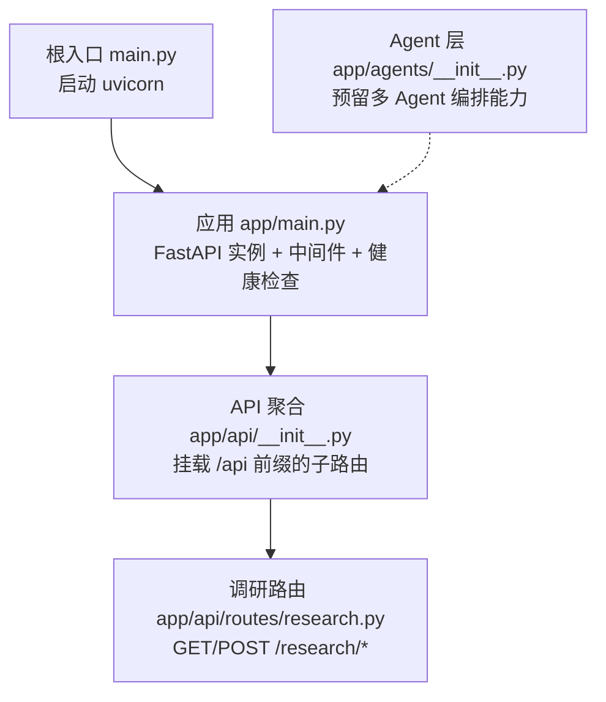
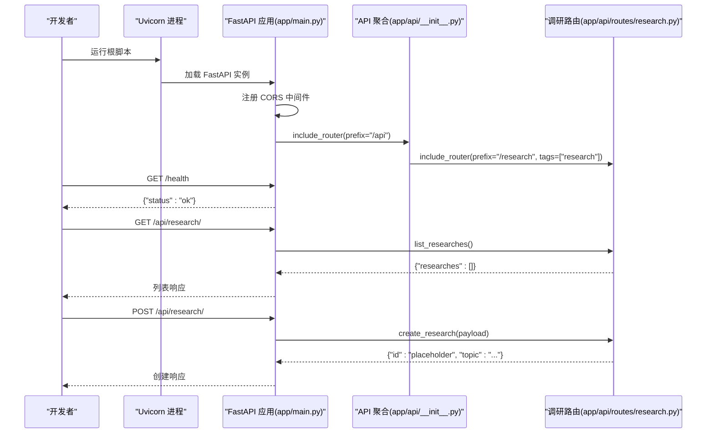
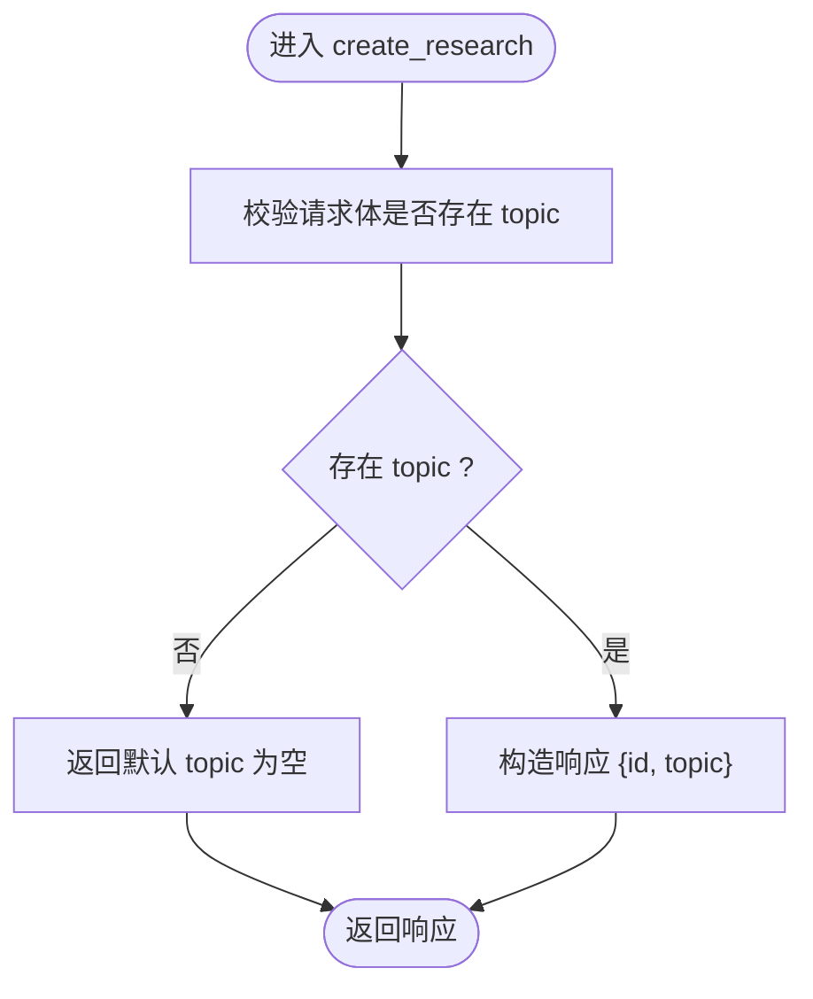
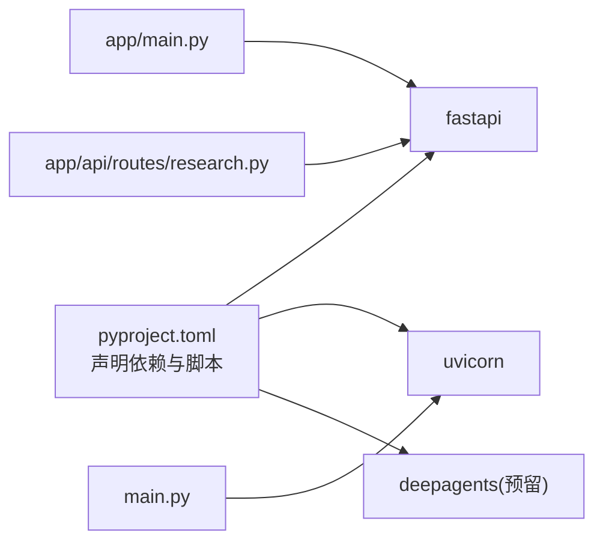

# 后端API系统

<cite>
**本文引用的文件**   
- [main.py](file://main.py)
- [app/main.py](file://app/main.py)
- [app/api/__init__.py](file://app/api/__init__.py)
- [app/api/routes/research.py](file://app/api/routes/research.py)
- [app/api/routes/__init__.py](file://app/api/routes/__init__.py)
- [app/agents/__init__.py](file://app/agents/__init__.py)
- [app/__init__.py](file://app/__init__.py)
- [pyproject.toml](file://pyproject.toml)
</cite>

## 目录
1. [简介](#简介)
2. [项目结构](#项目结构)
3. [核心组件](#核心组件)
4. [架构总览](#架构总览)
5. [详细组件分析](#详细组件分析)
6. [依赖关系分析](#依赖关系分析)
7. [性能考虑](#性能考虑)
8. [故障排查指南](#故障排查指南)
9. [结论](#结论)
10. [附录](#附录)

## 简介
本仓库为 InsightMesh 多 AI Agent 智能调研平台的后端 API 服务。基于 FastAPI 构建，提供 RESTful 接口，并通过 CORS 中间件与前端开发服务器进行跨域通信。当前实现了“调研”相关的基础路由（列出、创建），并预留了生命周期钩子用于后续启动/关闭逻辑扩展。

## 项目结构
后端采用分层组织：应用入口、API 路由聚合、具体业务路由模块以及预留的 Agent 层。

图表来源
- [main.py:1-13](file://main.py#L1-L13)
- [app/main.py:1-39](file://app/main.py#L1-L39)
- [app/api/__init__.py:1-9](file://app/api/__init__.py#L1-L9)
- [app/api/routes/research.py:1-19](file://app/api/routes/research.py#L1-L19)
- [app/agents/__init__.py:1-2](file://app/agents/__init__.py#L1-L2)

章节来源
- [main.py:1-13](file://main.py#L1-L13)
- [app/main.py:1-39](file://app/main.py#L1-L39)
- [app/api/__init__.py:1-9](file://app/api/__init__.py#L1-L9)
- [app/api/routes/research.py:1-19](file://app/api/routes/research.py#L1-L19)
- [app/agents/__init__.py:1-2](file://app/agents/__init__.py#L1-L2)

## 核心组件
- 应用入口与进程管理
  - 根脚本通过 uvicorn 启动 FastAPI 应用，监听 0.0.0.0:8000，并开启热重载以便开发调试。
- FastAPI 应用与中间件
  - 定义应用元信息（标题、描述、版本）与生命周期钩子；注册 CORS 中间件允许来自本地前端开发服务器的请求；挂载 /api 前缀的路由组；暴露 /health 健康检查端点。
- API 路由聚合
  - 在 API 包中统一聚合各功能路由，并以 /api/research 前缀挂载调研路由，同时设置 OpenAPI tags。
- 调研路由
  - 提供 GET /api/research/ 列出调研任务（占位实现）与 POST /api/research/ 创建调研任务（返回占位数据）。
- Agent 层
  - 预留多 Agent 编排能力的包位置，当前为空壳，便于后续接入 DeepAgents。

章节来源
- [main.py:1-13](file://main.py#L1-L13)
- [app/main.py:1-39](file://app/main.py#L1-L39)
- [app/api/__init__.py:1-9](file://app/api/__init__.py#L1-L9)
- [app/api/routes/research.py:1-19](file://app/api/routes/research.py#L1-L19)
- [app/agents/__init__.py:1-2](file://app/agents/__init__.py#L1-L2)

## 架构总览
下图展示了从进程启动到请求处理的整体流程，包括中间件、路由挂载与端点响应。

图表来源
- [main.py:1-13](file://main.py#L1-L13)
- [app/main.py:1-39](file://app/main.py#L1-L39)
- [app/api/__init__.py:1-9](file://app/api/__init__.py#L1-L9)
- [app/api/routes/research.py:1-19](file://app/api/routes/research.py#L1-L19)

## 详细组件分析

### 应用入口与进程管理
- 职责
  - 使用 uvicorn 启动 FastAPI 应用，配置监听地址与端口，启用开发模式的热重载。
- 关键点
  - 启动命令指向 app.main:app，确保应用对象被正确加载。
  - 提供命令行入口以支持快速启动。

章节来源
- [main.py:1-13](file://main.py#L1-L13)

### FastAPI 应用与中间件
- 职责
  - 初始化 FastAPI 实例，设置应用元信息，注册生命周期钩子，添加 CORS 中间件，挂载路由组，暴露健康检查端点。
- 关键点
  - lifespan 钩子可用于数据库连接池、缓存初始化等启动/关闭逻辑。
  - CORS 允许来自 http://localhost:3000 的前端访问，方法头均放行。
  - /health 端点用于容器健康检查或外部监控。

章节来源
- [app/main.py:1-39](file://app/main.py#L1-L39)

### API 路由聚合
- 职责
  - 将各功能路由集中挂载到 /api 前缀下，并为调研路由设置 OpenAPI tags。
- 关键点
  - 通过 include_router 组合子路由，保持模块化与可扩展性。

章节来源
- [app/api/__init__.py:1-9](file://app/api/__init__.py#L1-L9)

### 调研路由（Research）
- 职责
  - 提供调研任务的查询与创建接口。
- 端点说明
  - GET /api/research/：列出所有调研任务（当前返回空列表）。
  - POST /api/research/：创建新的调研任务（接收 JSON body，包含 topic 字段，返回占位 id 与 topic）。
- 数据结构
  - 请求体（POST）：包含 topic 字符串字段。
  - 响应体（GET）：包含 researches 数组字段。
  - 响应体（POST）：包含 id 与 topic 字段。

图表来源
- [app/api/routes/research.py:1-19](file://app/api/routes/research.py#L1-L19)

章节来源
- [app/api/routes/research.py:1-19](file://app/api/routes/research.py#L1-L19)

### Agent 层（预留）
- 职责
  - 作为多 Agent 编排层的包入口，当前为空壳，便于后续集成 DeepAgents。
- 建议
  - 在此目录下实现 Agent 调度、任务编排、状态管理与结果聚合等能力。

章节来源
- [app/agents/__init__.py:1-2](file://app/agents/__init__.py#L1-L2)

## 依赖关系分析
- 运行时依赖
  - fastapi：Web 框架，提供路由、中间件、OpenAPI 文档等能力。
  - uvicorn：ASGI 服务器，负责进程启动与请求处理。
  - deepagents：多 Agent 编排库（已声明依赖，当前未直接使用）。
- 脚本命令
  - dev：通过 uvicorn 启动开发服务器。

图表来源
- [pyproject.toml:1-18](file://pyproject.toml#L1-L18)
- [main.py:1-13](file://main.py#L1-L13)
- [app/main.py:1-39](file://app/main.py#L1-L39)
- [app/api/routes/research.py:1-19](file://app/api/routes/research.py#L1-L19)

章节来源
- [pyproject.toml:1-18](file://pyproject.toml#L1-L18)
- [main.py:1-13](file://main.py#L1-L13)
- [app/main.py:1-39](file://app/main.py#L1-L39)
- [app/api/routes/research.py:1-19](file://app/api/routes/research.py#L1-L19)

## 性能考虑
- 异步处理
  - 路由处理器均为异步函数，有利于在高并发场景下提升吞吐。
- 中间件开销
  - CORS 中间件会在每个请求上执行，生产环境建议根据实际域名精确配置 allow_origins，减少不必要的跨域处理。
- 生命周期钩子
  - 建议在 lifespan 中完成资源初始化（如连接池、缓存客户端），避免在请求路径中进行昂贵操作。
- 序列化与验证
  - 后续可引入 Pydantic 模型对请求/响应进行强类型校验，减少错误分支与额外判断。

[本节为通用指导，不直接分析具体文件]

## 故障排查指南
- 无法访问 /health
  - 确认 uvicorn 进程是否成功启动且监听 8000 端口。
  - 检查防火墙与安全组是否放行该端口。
- 前端跨域失败
  - 确认前端开发服务器地址是否为 http://localhost:3000，并与 CORS 配置一致。
  - 若前端部署在不同域名，需更新 allow_origins 列表。
- 路由未生效
  - 确认路由挂载顺序与 prefix 是否正确，尤其是 /api 与 /research 的组合。
- 启动报错
  - 检查 Python 版本是否满足 >=3.12，依赖是否安装完整。

章节来源
- [app/main.py:1-39](file://app/main.py#L1-39)
- [main.py:1-13](file://main.py#L1-13)
- [pyproject.toml:1-18](file://pyproject.toml#L1-18)

## 结论
当前后端提供了清晰的 FastAPI 应用骨架与基础调研接口，具备跨域支持与健康检查能力，结构清晰、易于扩展。下一步可在 lifespan 中接入持久化存储与缓存，完善调研任务的状态机与队列处理，并在 Agent 层实现多 Agent 协作与任务编排，逐步补齐业务闭环。

[本节为总结性内容，不直接分析具体文件]

## 附录
- 常用命令
  - 启动开发服务器：参考 pyproject.toml 中的 dev 脚本。
- 环境变量与配置
  - 当前未引入配置文件，CORS 与端口等参数位于代码中，后续可迁移至环境变量或配置文件管理。

章节来源
- [pyproject.toml:1-18](file://pyproject.toml#L1-18)