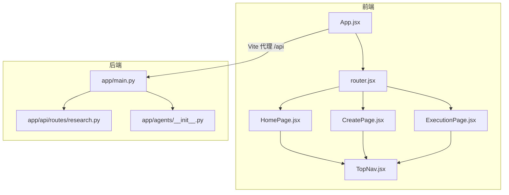
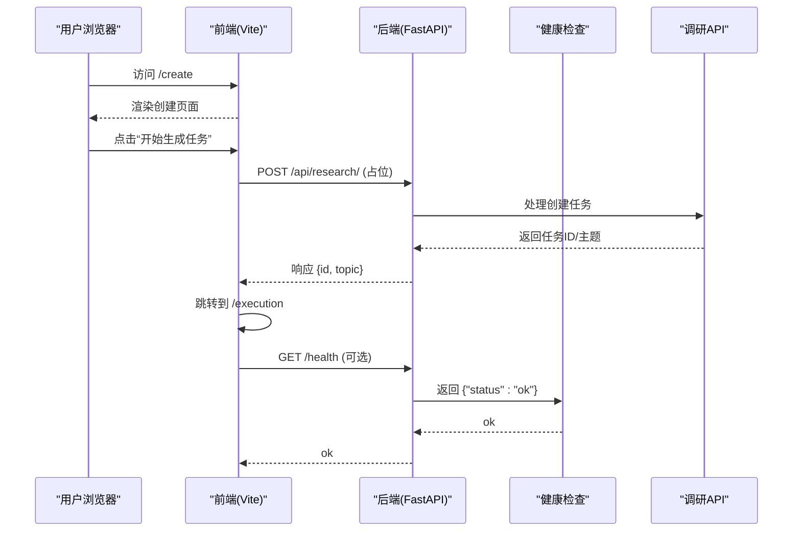
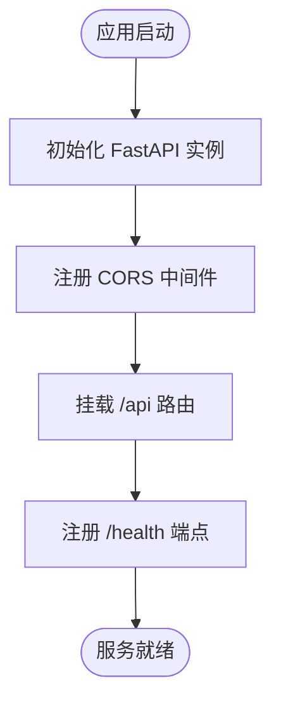
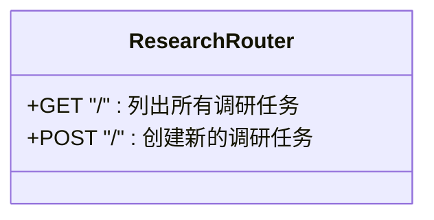
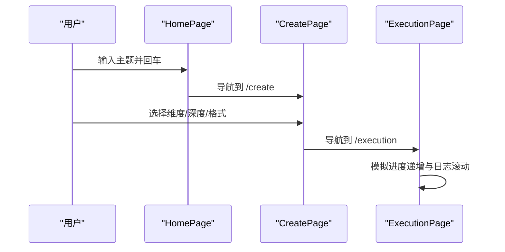
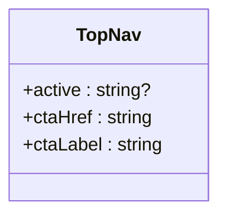
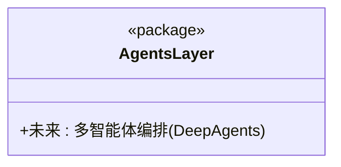
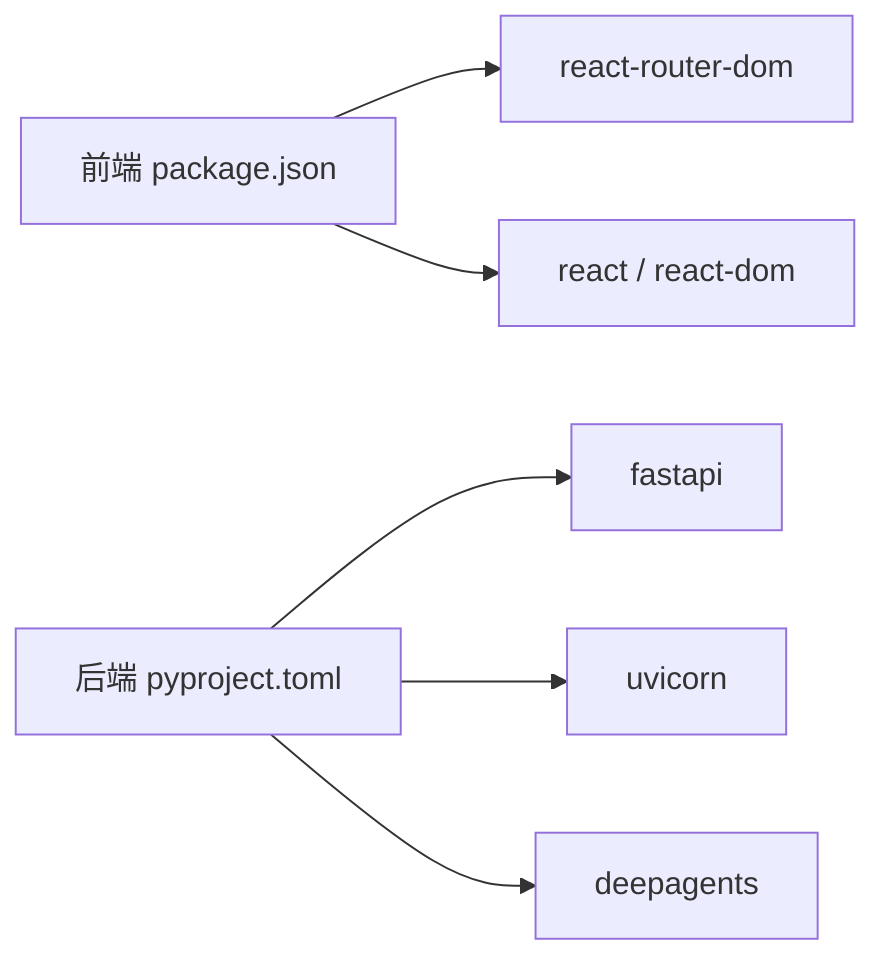

# 多智能体协作系统

<cite>
**本文引用的文件**   
- [main.py](file://main.py)
- [app/main.py](file://app/main.py)
- [pyproject.toml](file://pyproject.toml)
- [app/api/routes/research.py](file://app/api/routes/research.py)
- [app/agents/__init__.py](file://app/agents/__init__.py)
- [front/src/App.jsx](file://front/src/App.jsx)
- [front/src/router.jsx](file://front/src/router.jsx)
- [front/src/pages/HomePage.jsx](file://front/src/pages/HomePage.jsx)
- [front/src/pages/CreatePage.jsx](file://front/src/pages/CreatePage.jsx)
- [front/src/pages/ExecutionPage.jsx](file://front/src/pages/ExecutionPage.jsx)
- [front/src/components/TopNav.jsx](file://front/src/components/TopNav.jsx)
- [front/src/pages/states/LoadingState.jsx](file://front/src/pages/states/LoadingState.jsx)
- [front/package.json](file://front/package.json)
- [front/vite.config.js](file://front/vite.config.js)
</cite>

## 目录
1. [简介](#简介)
2. [项目结构](#项目结构)
3. [核心组件](#核心组件)
4. [架构总览](#架构总览)
5. [详细组件分析](#详细组件分析)
6. [依赖关系分析](#依赖关系分析)
7. [性能与可扩展性](#性能与可扩展性)
8. [故障排查指南](#故障排查指南)
9. [结论](#结论)
10. [附录](#附录)

## 简介
本仓库是一个“多 AI Agent 智能调研平台”的前后端原型：前端基于 React + Vite，提供任务创建、执行监控与报告展示等页面；后端基于 FastAPI，提供健康检查与调研任务相关的 API 占位接口。当前阶段以交互保真与流程演示为主，Agent 编排层预留了 DeepAgents 的集成入口。

## 项目结构
- 后端（Python）
  - 应用入口与中间件配置位于 app/main.py
  - API 路由按功能拆分，示例为 research 模块
  - agents 包用于承载多智能体编排逻辑（当前为空壳）
- 前端（React + Vite）
  - 路由定义在 router.jsx，App.jsx 作为根组件
  - 页面集中在 pages 目录，包含首页、创建、执行、报告、个人中心及多种状态页
  - 顶部导航 TopNav 为共享组件
  - 开发服务器通过 vite.config.js 代理 /api 到后端

图表来源
- [front/src/App.jsx:1-44](file://front/src/App.jsx#L1-L44)
- [front/src/router.jsx:1-36](file://front/src/router.jsx#L1-L36)
- [front/src/pages/HomePage.jsx:1-177](file://front/src/pages/HomePage.jsx#L1-L177)
- [front/src/pages/CreatePage.jsx:1-181](file://front/src/pages/CreatePage.jsx#L1-L181)
- [front/src/pages/ExecutionPage.jsx:1-167](file://front/src/pages/ExecutionPage.jsx#L1-L167)
- [front/src/components/TopNav.jsx:1-45](file://front/src/components/TopNav.jsx#L1-L45)
- [app/main.py:1-39](file://app/main.py#L1-L39)
- [app/api/routes/research.py:1-19](file://app/api/routes/research.py#L1-L19)
- [app/agents/__init__.py:1-2](file://app/agents/__init__.py#L1-L2)

章节来源
- [front/src/App.jsx:1-44](file://front/src/App.jsx#L1-L44)
- [front/src/router.jsx:1-36](file://front/src/router.jsx#L1-L36)
- [app/main.py:1-39](file://app/main.py#L1-L39)
- [app/api/routes/research.py:1-19](file://app/api/routes/research.py#L1-L19)
- [app/agents/__init__.py:1-2](file://app/agents/__init__.py#L1-L2)

## 核心组件
- 后端应用
  - FastAPI 应用初始化、生命周期钩子、CORS 中间件、健康检查端点、路由挂载
- API 路由
  - 调研任务列表与创建占位接口，便于前后端联调
- 前端路由与页面
  - 使用 react-router-dom 进行客户端路由
  - 首页引导输入主题并跳转创建页
  - 创建页完成维度、深度、输出格式选择
  - 执行页模拟多 Agent 并行执行进度与日志
- 共享组件
  - 顶部导航统一入口与 CTA 按钮

章节来源
- [app/main.py:1-39](file://app/main.py#L1-L39)
- [app/api/routes/research.py:1-19](file://app/api/routes/research.py#L1-L19)
- [front/src/router.jsx:1-36](file://front/src/router.jsx#L1-L36)
- [front/src/pages/HomePage.jsx:1-177](file://front/src/pages/HomePage.jsx#L1-L177)
- [front/src/pages/CreatePage.jsx:1-181](file://front/src/pages/CreatePage.jsx#L1-L181)
- [front/src/pages/ExecutionPage.jsx:1-167](file://front/src/pages/ExecutionPage.jsx#L1-L167)
- [front/src/components/TopNav.jsx:1-45](file://front/src/components/TopNav.jsx#L1-L45)

## 架构总览
整体采用前后端分离架构：前端通过 Vite 开发服务器启动并提供静态资源与页面渲染；后端由 Uvicorn 驱动 FastAPI 服务。开发环境下，前端将 /api 请求代理至后端，避免跨域问题。

图表来源
- [front/src/pages/CreatePage.jsx:168-176](file://front/src/pages/CreatePage.jsx#L168-L176)
- [app/api/routes/research.py:14-17](file://app/api/routes/research.py#L14-L17)
- [app/main.py:36-38](file://app/main.py#L36-L38)
- [front/vite.config.js:14-19](file://front/vite.config.js#L14-L19)

## 详细组件分析

### 后端应用与中间件
- 应用初始化
  - 标题、描述、版本信息
  - 生命周期钩子（启动/关闭）
- CORS 中间件
  - 允许来自本地前端的跨域请求
- 路由挂载
  - 将 /api 下的路由集中挂载
- 健康检查
  - 提供 /health 端点用于存活探测

图表来源
- [app/main.py:17-33](file://app/main.py#L17-L33)
- [app/main.py:36-38](file://app/main.py#L36-L38)

章节来源
- [app/main.py:1-39](file://app/main.py#L1-L39)

### 调研 API 路由
- 列出调研任务
  - 返回空列表占位
- 创建调研任务
  - 接收 JSON payload，返回占位的任务 ID 与主题

图表来源
- [app/api/routes/research.py:8-17](file://app/api/routes/research.py#L8-L17)

章节来源
- [app/api/routes/research.py:1-19](file://app/api/routes/research.py#L1-L19)

### 前端路由与页面流
- 路由定义
  - 使用 createBrowserRouter 声明式路由
- 页面职责
  - HomePage：主题输入与模板引导
  - CreatePage：维度、深度、输出格式配置
  - ExecutionPage：模拟多 Agent 执行进度与实时日志
  - LoadingState：加载态提示

图表来源
- [front/src/pages/HomePage.jsx:27-49](file://front/src/pages/HomePage.jsx#L27-L49)
- [front/src/pages/CreatePage.jsx:168-176](file://front/src/pages/CreatePage.jsx#L168-L176)
- [front/src/pages/ExecutionPage.jsx:53-61](file://front/src/pages/ExecutionPage.jsx#L53-L61)
- [front/src/router.jsx:18-33](file://front/src/router.jsx#L18-L33)

章节来源
- [front/src/App.jsx:1-44](file://front/src/App.jsx#L1-L44)
- [front/src/router.jsx:1-36](file://front/src/router.jsx#L1-L36)
- [front/src/pages/HomePage.jsx:1-177](file://front/src/pages/HomePage.jsx#L1-L177)
- [front/src/pages/CreatePage.jsx:1-181](file://front/src/pages/CreatePage.jsx#L1-L181)
- [front/src/pages/ExecutionPage.jsx:1-167](file://front/src/pages/ExecutionPage.jsx#L1-L167)
- [front/src/pages/states/LoadingState.jsx:1-12](file://front/src/pages/states/LoadingState.jsx#L1-L12)

### 共享顶部导航
- 功能
  - 品牌标识与主导航链接
  - 登录与 CTA 按钮
  - 支持高亮当前激活项

图表来源
- [front/src/components/TopNav.jsx:7-44](file://front/src/components/TopNav.jsx#L7-L44)

章节来源
- [front/src/components/TopNav.jsx:1-45](file://front/src/components/TopNav.jsx#L1-L45)

### 多智能体编排层（预留）
- 说明
  - agents 包已存在，注释表明将基于 DeepAgents 实现多智能体编排
  - 当前未暴露具体类或方法，后续可在该包内实现 Agent 工厂、工作流编排与状态同步

图表来源
- [app/agents/__init__.py:1-2](file://app/agents/__init__.py#L1-L2)

章节来源
- [app/agents/__init__.py:1-2](file://app/agents/__init__.py#L1-L2)

## 依赖关系分析
- 后端依赖
  - fastapi、uvicorn、deepagents（已声明）
- 前端依赖
  - react、react-dom、react-router-dom
  - 构建工具：vite、@vitejs/plugin-react

图表来源
- [front/package.json:12-20](file://front/package.json#L12-L20)
- [pyproject.toml:7-11](file://pyproject.toml#L7-L11)

章节来源
- [front/package.json:1-22](file://front/package.json#L1-L22)
- [pyproject.toml:1-18](file://pyproject.toml#L1-L18)

## 性能与可扩展性
- 前端
  - 使用 Vite 快速热更新与按需打包，适合原型迭代
  - 路由为客户端渲染，首屏体积较小，利于快速交互
- 后端
  - FastAPI 异步模型可支撑高并发 I/O
  - 建议后续引入消息队列与持久化存储，以支撑真实的多 Agent 任务调度与结果落盘
- 网络
  - 开发环境通过 Vite 代理解决跨域；生产环境建议使用反向代理统一域名与 HTTPS

[本节为通用指导，不直接分析具体文件]

## 故障排查指南
- 前端无法调用后端 API
  - 确认 Vite 代理是否开启且目标地址正确
  - 检查后端是否运行在指定端口
- 跨域错误
  - 确认后端已启用 CORS 并允许前端来源
- 健康检查失败
  - 访问 /health 验证后端可用性
- 页面跳转异常
  - 检查路由定义与 Link/Navigation 使用是否正确

章节来源
- [front/vite.config.js:12-20](file://front/vite.config.js#L12-L20)
- [app/main.py:24-31](file://app/main.py#L24-L31)
- [app/main.py:36-38](file://app/main.py#L36-L38)

## 结论
当前仓库提供了完整的前端交互流程与后端基础能力，适合作为多智能体调研平台的原型与演示。下一步建议：
- 在后端实现真实的调研任务创建、查询与状态管理
- 在 agents 包中落地多智能体编排与工作流
- 引入数据库与对象存储，持久化任务与报告
- 完善鉴权、限流与审计日志

[本节为总结性内容，不直接分析具体文件]

## 附录
- 启动方式
  - 后端：使用 uvicorn 启动 FastAPI 应用
  - 前端：npm install 后 npm run dev，默认 3000 端口
- 关键路径
  - 健康检查：/health
  - 调研 API：/api/research/

章节来源
- [main.py:5-6](file://main.py#L5-L6)
- [front/package.json:7-10](file://front/package.json#L7-L10)
- [front/vite.config.js:12-19](file://front/vite.config.js#L12-L19)
- [app/main.py:36-38](file://app/main.py#L36-L38)
- [app/api/routes/research.py:8-17](file://app/api/routes/research.py#L8-L17)