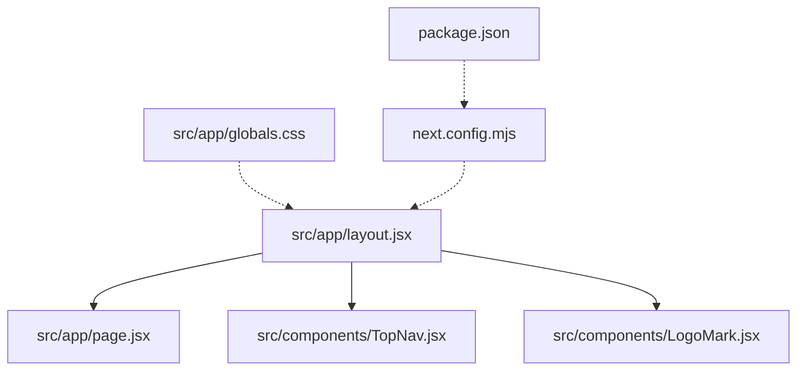
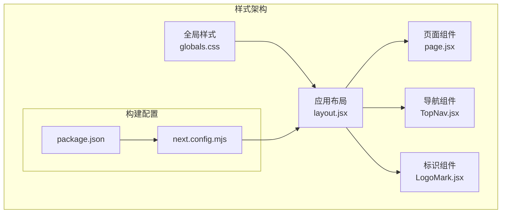
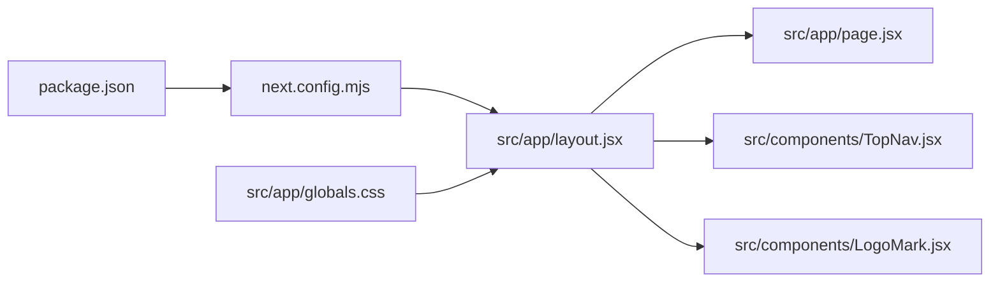

# 样式系统

<cite>
**本文引用的文件**
- [src/app/layout.jsx](file://src/app/layout.jsx)
- [src/app/page.jsx](file://src/app/page.jsx)
- [src/components/TopNav.jsx](file://src/components/TopNav.jsx)
- [src/components/LogoMark.jsx](file://src/components/LogoMark.jsx)
- [src/app/globals.css](file://src/app/globals.css)
- [next.config.mjs](file://next.config.mjs)
- [package.json](file://package.json)
</cite>

## 目录
1. [引言](#引言)
2. [项目结构](#项目结构)
3. [核心组件](#核心组件)
4. [架构总览](#架构总览)
5. [详细组件分析](#详细组件分析)
6. [依赖分析](#依赖分析)
7. [性能考虑](#性能考虑)
8. [故障排查指南](#故障排查指南)
9. [结论](#结论)
10. [附录](#附录)

## 引言
本文件系统化梳理 InsightMesh 的样式体系，聚焦以下目标：CSS Modules 与全局样式的使用策略（样式隔离与作用域管理）、设计令牌与主题变量、响应式设计与断点、动画与过渡机制、样式组织最佳实践与命名规范、主题定制与品牌色应用、性能优化与浏览器兼容性。由于当前仓库未包含样式模块文件与主题配置文件，本文基于现有结构与 Next.js 默认行为进行推导与建议，并提供可落地的实施路径。

## 项目结构
InsightMesh 采用 Next.js App Router 结构，样式相关的关键位置如下：
- 全局样式入口：src/app/globals.css
- 应用布局：src/app/layout.jsx
- 首页页面：src/app/page.jsx
- 可复用组件：src/components/TopNav.jsx、src/components/LogoMark.jsx

图表来源
- [src/app/layout.jsx](file://src/app/layout.jsx)
- [src/app/page.jsx](file://src/app/page.jsx)
- [src/components/TopNav.jsx](file://src/components/TopNav.jsx)
- [src/components/LogoMark.jsx](file://src/components/LogoMark.jsx)
- [src/app/globals.css](file://src/app/globals.css)
- [next.config.mjs](file://next.config.mjs)
- [package.json](file://package.json)

章节来源
- [src/app/layout.jsx](file://src/app/layout.jsx)
- [src/app/page.jsx](file://src/app/page.jsx)
- [src/components/TopNav.jsx](file://src/components/TopNav.jsx)
- [src/components/LogoMark.jsx](file://src/components/LogoMark.jsx)
- [src/app/globals.css](file://src/app/globals.css)
- [next.config.mjs](file://next.config.mjs)
- [package.json](file://package.json)

## 核心组件
- 布局层：通过 layout.jsx 注入全局样式与根节点结构，作为样式作用域的顶层容器。
- 页面层：page.jsx 定义首页内容与基础排版，可结合全局样式实现一致的视觉基线。
- 组件层：TopNav.jsx 与 LogoMark.jsx 提供导航与标识元素，建议以 CSS Modules 实现局部样式隔离，避免跨组件污染。

章节来源
- [src/app/layout.jsx](file://src/app/layout.jsx)
- [src/app/page.jsx](file://src/app/page.jsx)
- [src/components/TopNav.jsx](file://src/components/TopNav.jsx)
- [src/components/LogoMark.jsx](file://src/components/LogoMark.jsx)

## 架构总览
Next.js 默认不启用 CSS Modules，但可通过构建配置开启。InsightMesh 当前未见显式 CSS Modules 文件，建议在组件目录下按需引入 CSS 模块，以实现样式隔离与可维护性提升。

图表来源
- [src/app/layout.jsx](file://src/app/layout.jsx)
- [src/app/page.jsx](file://src/app/page.jsx)
- [src/components/TopNav.jsx](file://src/components/TopNav.jsx)
- [src/components/LogoMark.jsx](file://src/components/LogoMark.jsx)
- [src/app/globals.css](file://src/app/globals.css)
- [next.config.mjs](file://next.config.mjs)
- [package.json](file://package.json)

## 详细组件分析

### 全局样式策略（globals.css）
- 作用：统一字体、颜色、间距、基础排版等全局基线；为页面与组件提供一致的视觉环境。
- 管理：建议将品牌主色、辅助色、语义色与尺寸令牌集中定义，便于主题切换与一致性维护。
- 使用：在 layout.jsx 中引入，确保所有子路由共享同一全局样式上下文。

章节来源
- [src/app/globals.css](file://src/app/globals.css)
- [src/app/layout.jsx](file://src/app/layout.jsx)

### 导航组件 TopNav（样式隔离与作用域）
- 建议：为 TopNav 创建同名 CSS 模块文件（如 TopNav.module.css），在组件中通过模块类名引用，实现样式局部化，避免与其它组件冲突。
- 作用域：模块类名经编译后具备唯一性，仅影响当前组件树，天然支持样式隔离。
- 交互：结合全局样式中的过渡与动画变量，实现平滑的悬停、展开/收起等状态变化。

章节来源
- [src/components/TopNav.jsx](file://src/components/TopNav.jsx)

### 标识组件 LogoMark（样式隔离与作用域）
- 建议：为 LogoMark 创建同名 CSS 模块文件（如 LogoMark.module.css），在组件中通过模块类名引用，确保图标与文字的排版、颜色与尺寸在不同页面中保持一致。
- 一致性：通过全局样式中的字号、行高、颜色变量，保证品牌标识在各场景下的统一呈现。

章节来源
- [src/components/LogoMark.jsx](file://src/components/LogoMark.jsx)

### 页面级样式（page.jsx）
- 建议：在 page.jsx 中按需引入局部样式或使用全局样式中的布局类，避免在页面内编写大量内联样式。
- 组织：将页面特有样式拆分为独立模块，便于测试与复用。

章节来源
- [src/app/page.jsx](file://src/app/page.jsx)

### 设计令牌与主题变量（建议实现）
- 字段建议：主色、辅色、语义色（成功/警告/错误/信息）、明暗模式映射、字号、行高、间距、圆角、阴影、边框宽度、Z-index 层级、动画时长与缓动曲线。
- 存放：可在 globals.css 中以 CSS 自定义属性形式集中声明，或在 JS 中以常量对象维护，供组件与样式共同消费。
- 切换：通过根元素类名或 CSS 变量覆盖实现明暗模式切换，确保全局生效。

章节来源
- [src/app/globals.css](file://src/app/globals.css)

### 响应式设计与断点（建议实现）
- 断点建议：移动端（小屏）、平板（中屏）、桌面（大屏）三档，结合业务内容确定具体阈值。
- 实施：在全局样式中定义媒体查询断点变量，组件内通过断点变量控制布局与排版。
- 优先：移动优先策略，先写基础样式，再在断点处增量增强。

章节来源
- [src/app/globals.css](file://src/app/globals.css)

### 动画与过渡（建议实现）
- 时机：按钮悬停、模态弹出/关闭、导航切换、加载状态等。
- 变量：统一定义过渡时长、缓动函数与位移/透明度变化，减少重复代码。
- 实现：在 CSS 模块中为交互状态添加过渡类，或在全局样式中提供通用动画类。

章节来源
- [src/app/globals.css](file://src/app/globals.css)

### 样式组织最佳实践与命名规范（建议）
- 目录：按功能域划分（如 components、pages、utilities），每个功能域内包含对应的样式文件。
- 命名：采用 BEM 或类似体系，保证类名语义清晰、层级明确。
- 分层：基础层（reset/base）、组件层（components）、工具层（utilities），避免样式层间耦合。
- 文档：为关键变量与断点建立文档，便于团队协作与维护。

章节来源
- [src/app/globals.css](file://src/app/globals.css)

### 主题定制与品牌色应用（建议）
- 品牌色：定义主色、强调色、背景色、边框色等，形成完整的品牌色板。
- 明暗模式：为每种色值提供明/暗两套映射，通过 CSS 变量或根元素类名切换。
- 一致性：在组件中仅消费设计令牌，不直接硬编码颜色值，确保风格统一。

章节来源
- [src/app/globals.css](file://src/app/globals.css)

### CSS Modules 启用与作用域管理（建议）
- 启用：在构建配置中开启 CSS Modules 支持，使组件具备天然作用域隔离能力。
- 管理：为每个组件配套同名 CSS 模块文件，通过模块类名引用，避免全局污染。
- 迁移：对现有全局样式进行梳理，逐步将页面级样式迁移至组件模块，提升可维护性。

章节来源
- [next.config.mjs](file://next.config.mjs)
- [package.json](file://package.json)

## 依赖分析
- 构建链路：package.json 决定依赖与脚本；next.config.mjs 影响构建行为（含 CSS Modules 开关）；layout.jsx 负责注入全局样式。
- 耦合关系：组件样式与全局样式存在依赖，但通过 CSS Modules 可降低跨组件耦合风险。

图表来源
- [package.json](file://package.json)
- [next.config.mjs](file://next.config.mjs)
- [src/app/layout.jsx](file://src/app/layout.jsx)
- [src/app/page.jsx](file://src/app/page.jsx)
- [src/components/TopNav.jsx](file://src/components/TopNav.jsx)
- [src/components/LogoMark.jsx](file://src/components/LogoMark.jsx)
- [src/app/globals.css](file://src/app/globals.css)

章节来源
- [package.json](file://package.json)
- [next.config.mjs](file://next.config.mjs)
- [src/app/layout.jsx](file://src/app/layout.jsx)
- [src/app/page.jsx](file://src/app/page.jsx)
- [src/components/TopNav.jsx](file://src/components/TopNav.jsx)
- [src/components/LogoMark.jsx](file://src/components/LogoMark.jsx)
- [src/app/globals.css](file://src/app/globals.css)

## 性能考虑
- 样式体积：合并与压缩全局样式，避免重复定义；按需加载页面级样式，减少首屏负担。
- 选择器复杂度：简化选择器层级，避免深层嵌套导致的匹配开销。
- 动画性能：优先使用 transform 与 opacity；避免频繁触发重排的属性（如 width、height）。
- 缓存策略：利用浏览器缓存与 CDN 加速静态资源；合理设置缓存头。
- 渲染优化：在组件层面使用 CSS Modules，避免全局样式引发的全站重绘。

## 故障排查指南
- 样式未生效
  - 检查是否正确在 layout.jsx 中引入全局样式。
  - 若启用 CSS Modules，请确认组件已正确导入模块类名。
- 样式冲突
  - 使用 CSS Modules 将样式限定在组件作用域内。
  - 避免在组件内使用全局选择器覆盖外部样式。
- 主题切换异常
  - 检查根元素类名或 CSS 变量是否正确切换。
  - 确认设计令牌变量已在全局样式中定义并覆盖。
- 响应式失效
  - 检查媒体查询断点是否正确；确保断点变量在全局样式中定义。
- 动画卡顿
  - 检查动画属性是否为高性能属性；减少强制同步布局操作。

## 结论
InsightMesh 当前以全局样式为主，建议尽快引入 CSS Modules 与设计令牌体系，配合统一的主题变量与响应式断点，形成可扩展、可维护的样式架构。通过明确的命名规范与组织策略，可显著降低样式耦合与维护成本，并提升开发体验与性能表现。

## 附录
- 快速实施清单
  - 在构建配置中启用 CSS Modules。
  - 在 globals.css 中集中定义设计令牌与主题变量。
  - 为 TopNav 与 LogoMark 等组件创建同名 CSS 模块文件。
  - 建立响应式断点变量并在组件中统一使用。
  - 为常用动画与过渡定义变量并在组件中复用。
  - 对现有全局样式进行梳理与模块化迁移。