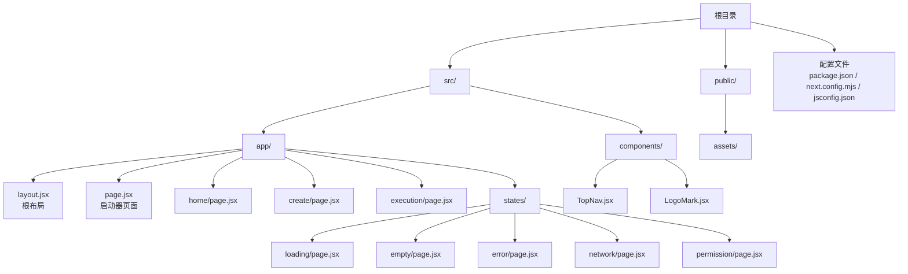
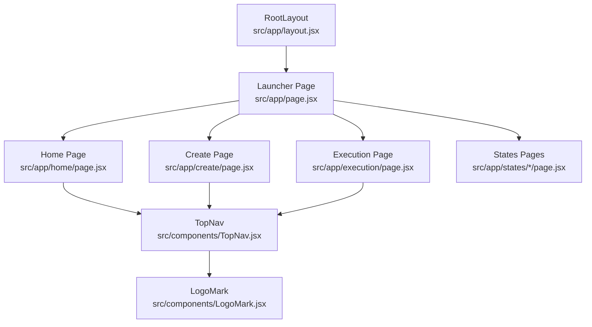
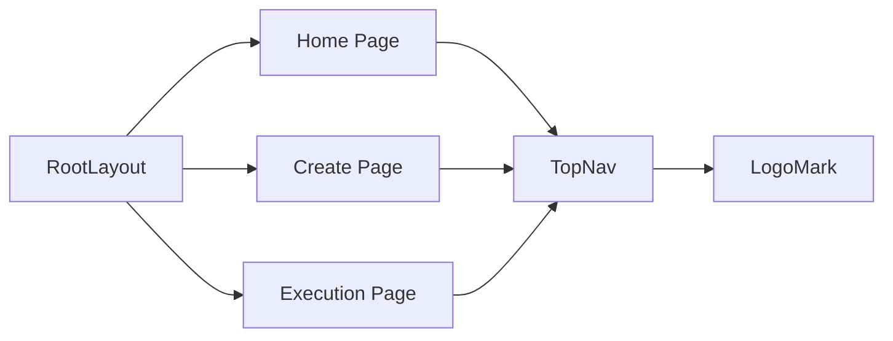

# 目录结构

<cite>
**本文引用的文件**
- [package.json](file://package.json)
- [next.config.mjs](file://next.config.mjs)
- [jsconfig.json](file://jsconfig.json)
- [README.md](file://README.md)
- [src/app/layout.jsx](file://src/app/layout.jsx)
- [src/app/page.jsx](file://src/app/page.jsx)
- [src/app/globals.css](file://src/app/globals.css)
- [src/app/home/page.jsx](file://src/app/home/page.jsx)
- [src/app/create/page.jsx](file://src/app/create/page.jsx)
- [src/app/execution/page.jsx](file://src/app/execution/page.jsx)
- [src/app/states/loading/page.jsx](file://src/app/states/loading/page.jsx)
- [src/components/TopNav.jsx](file://src/components/TopNav.jsx)
- [src/components/LogoMark.jsx](file://src/components/LogoMark.jsx)
- [.gitignore](file://.gitignore)
- [public/assets/mr36p9kw-image.png](file://public/assets/mr36p9kw-image.png)
- [public/assets/mr36sj5p-image.png](file://public/assets/mr36sj5p-image.png)
</cite>

## 目录
1. [简介](#简介)
2. [项目结构](#项目结构)
3. [核心组件](#核心组件)
4. [架构总览](#架构总览)
5. [详细组件分析](#详细组件分析)
6. [依赖关系分析](#依赖关系分析)
7. [性能考量](#性能考量)
8. [故障排查指南](#故障排查指南)
9. [结论](#结论)
10. [附录](#附录)

## 简介
本文件面向 InsightMesh 项目，系统性阐述其目录结构设计原则、命名规范与职责划分，重点解析以下方面：
- src/app 与 src/components 的职责边界与协作方式
- public 静态资源与 assets 子目录的使用方式
- 配置文件 next.config.mjs 与 jsconfig.json 的作用与配置项说明
- TypeScript/路径别名与模块解析策略
- 目录结构的设计理念、扩展指导与最佳实践

## 项目结构
InsightMesh 采用 Next.js App Router 的约定式路由与分层目录组织，遵循“页面即路由”的模式，同时通过共享组件与全局样式实现高复用与一致性。

**图表来源**
- [src/app/layout.jsx:1-21](file://src/app/layout.jsx#L1-L21)
- [src/app/page.jsx:1-78](file://src/app/page.jsx#L1-L78)
- [src/app/home/page.jsx:1-212](file://src/app/home/page.jsx#L1-L212)
- [src/app/create/page.jsx:1-183](file://src/app/create/page.jsx#L1-L183)
- [src/app/execution/page.jsx:1-169](file://src/app/execution/page.jsx#L1-L169)
- [src/app/states/loading/page.jsx:1-12](file://src/app/states/loading/page.jsx#L1-L12)
- [src/components/TopNav.jsx:1-45](file://src/components/TopNav.jsx#L1-L45)
- [src/components/LogoMark.jsx:1-19](file://src/components/LogoMark.jsx#L1-L19)

**章节来源**
- [README.md:13-39](file://README.md#L13-L39)

## 核心组件
- 根布局与全局样式
  - 根布局负责注入全局样式与站点元数据，确保所有页面共享一致的视觉与语义环境。
  - 全局样式集中定义设计令牌、排版、组件基线与页面级样式，减少重复与不一致。
- 页面级组件
  - 启动器页面用于聚合所有主页面与状态页面的入口卡片，便于原型演示与导航。
  - 各业务页面（如首页、创建、执行等）承担具体交互逻辑与状态管理。
- 共享组件
  - 顶部导航组件提供统一的导航结构与活动态高亮，支持右侧主按钮的动态配置。
  - 品牌标识组件提供可复用的星芒图标，保证品牌元素的一致性。

**章节来源**
- [src/app/layout.jsx:1-21](file://src/app/layout.jsx#L1-L21)
- [src/app/globals.css:1-134](file://src/app/globals.css#L1-L134)
- [src/app/page.jsx:1-78](file://src/app/page.jsx#L1-L78)
- [src/app/home/page.jsx:1-212](file://src/app/home/page.jsx#L1-L212)
- [src/app/create/page.jsx:1-183](file://src/app/create/page.jsx#L1-L183)
- [src/app/execution/page.jsx:1-169](file://src/app/execution/page.jsx#L1-L169)
- [src/components/TopNav.jsx:1-45](file://src/components/TopNav.jsx#L1-L45)
- [src/components/LogoMark.jsx:1-19](file://src/components/LogoMark.jsx#L1-L19)

## 架构总览
下图展示了页面与组件之间的依赖关系与数据流，体现 App Router 的层级结构与共享组件的复用模式。

**图表来源**
- [src/app/layout.jsx:1-21](file://src/app/layout.jsx#L1-L21)
- [src/app/page.jsx:1-78](file://src/app/page.jsx#L1-L78)
- [src/app/home/page.jsx:1-212](file://src/app/home/page.jsx#L1-L212)
- [src/app/create/page.jsx:1-183](file://src/app/create/page.jsx#L1-L183)
- [src/app/execution/page.jsx:1-169](file://src/app/execution/page.jsx#L1-L169)
- [src/app/states/loading/page.jsx:1-12](file://src/app/states/loading/page.jsx#L1-L12)
- [src/components/TopNav.jsx:1-45](file://src/components/TopNav.jsx#L1-L45)
- [src/components/LogoMark.jsx:1-19](file://src/components/LogoMark.jsx#L1-L19)

## 详细组件分析

### 目录职责划分与命名规范
- src/app
  - 职责：承载所有页面组件与根布局，遵循 App Router 的约定式路由规则。
  - 命名：页面以 page.jsx 命名，状态页面置于 states 子目录，便于按功能域组织。
  - 示例：home、create、execution、report、profile、login、cases 等页面；states 下的 loading、empty、error、network、permission。
- src/components
  - 职责：存放可复用的 UI 组件，如 TopNav、LogoMark 等，强调跨页面复用与低耦合。
  - 命名：组件文件采用 PascalCase，与页面保持一致的可读性与一致性。
- public
  - 职责：存放静态资源，如图片、媒体等，这些资源可通过绝对路径直接访问。
  - 子目录：assets 用于放置原型素材，便于在页面中直接引用。

**章节来源**
- [README.md:13-39](file://README.md#L13-L39)
- [src/app/page.jsx:1-78](file://src/app/page.jsx#L1-L78)
- [src/app/states/loading/page.jsx:1-12](file://src/app/states/loading/page.jsx#L1-L12)
- [src/components/TopNav.jsx:1-45](file://src/components/TopNav.jsx#L1-L45)
- [src/components/LogoMark.jsx:1-19](file://src/components/LogoMark.jsx#L1-L19)

### 静态资源与 assets 使用方式
- public/assets
  - 用途：放置可在浏览器直接访问的静态资源，适合图片、图标等。
  - 访问方式：通过绝对路径在页面中引用，避免打包体积膨胀与构建时的复杂处理。
  - 示例：仓库中包含两张示例图片，可直接在页面中使用。

**章节来源**
- [README.md:37-38](file://README.md#L37-L38)
- [public/assets/mr36p9kw-image.png](file://public/assets/mr36p9kw-image.png)
- [public/assets/mr36sj5p-image.png](file://public/assets/mr36sj5p-image.png)

### 配置文件说明与作用
- package.json
  - 作用：声明项目名称、版本、描述与脚本命令；声明 Next.js、React 等依赖。
  - 关键点：提供开发、构建、启动与代码检查的标准化命令。
- next.config.mjs
  - 作用：Next.js 的构建与运行配置入口，当前启用严格模式。
  - 影响：有助于在开发期发现潜在问题，提升代码质量。
- jsconfig.json
  - 作用：TypeScript/JSX 配置与路径别名设置，确保编辑器与编译器正确解析模块路径。
  - 关键点：baseUrl 与 paths 配置使导入路径更简洁，提升可维护性。

**章节来源**
- [package.json:1-18](file://package.json#L1-L18)
- [next.config.mjs:1-7](file://next.config.mjs#L1-L7)
- [jsconfig.json:1-14](file://jsconfig.json#L1-L14)

### TypeScript 配置与路径别名
- 路径别名
  - 配置：通过 baseUrl 与 paths 将 @/* 映射到 ./src/*，简化导入路径。
  - 优点：避免深层相对路径，提升可读性与迁移成本。
- 模块解析
  - 配置：moduleResolution 使用 bundler，配合现代打包器进行模块解析。
  - 影响：与 Next.js 的 App Router 与实验性特性协同工作，减少兼容性问题。
- JSX 处理
  - 配置：jsx 选项 preserve，保留 JSX 语法交由 Next.js 处理，确保与框架集成顺畅。

**章节来源**
- [jsconfig.json:1-14](file://jsconfig.json#L1-L14)

### 目录结构设计理念与扩展指导
- 设计理念
  - 页面即路由：每个页面组件对应一个路由，便于快速迭代与测试。
  - 组件复用：共享组件集中在 components 目录，降低重复与维护成本。
  - 全局一致性：通过全局样式与根布局统一风格，保证视觉与交互一致性。
- 扩展指导
  - 新页面：在 src/app 下新增目录并添加 page.jsx，即可自动生成路由。
  - 新组件：在 src/components 下新增组件文件，按需导出并在页面中引入。
  - 静态资源：将图片等资源放入 public/assets，按需在页面中引用。
  - 配置变更：next.config.mjs 与 jsconfig.json 作为集中配置入口，避免分散设置。

**章节来源**
- [README.md:13-39](file://README.md#L13-L39)
- [src/app/page.jsx:1-78](file://src/app/page.jsx#L1-L78)
- [src/components/TopNav.jsx:1-45](file://src/components/TopNav.jsx#L1-L45)

## 依赖关系分析
- 页面与布局
  - 所有页面均受根布局控制，共享全局样式与元数据。
- 页面与组件
  - 页面通过导入共享组件实现复用，如 TopNav 在多个页面中出现。
- 组件与资产
  - LogoMark 作为 SVG 图标组件，可直接在页面中渲染，无需额外资源。

**图表来源**
- [src/app/layout.jsx:1-21](file://src/app/layout.jsx#L1-L21)
- [src/app/home/page.jsx:1-212](file://src/app/home/page.jsx#L1-L212)
- [src/app/create/page.jsx:1-183](file://src/app/create/page.jsx#L1-L183)
- [src/app/execution/page.jsx:1-169](file://src/app/execution/page.jsx#L1-L169)
- [src/components/TopNav.jsx:1-45](file://src/components/TopNav.jsx#L1-L45)
- [src/components/LogoMark.jsx:1-19](file://src/components/LogoMark.jsx#L1-L19)

## 性能考量
- 静态预渲染
  - 项目已实现 14 个路由的静态预渲染，有利于首屏性能与 SEO。
- 资源优化
  - 将图片等静态资源放入 public/assets，避免不必要的打包与缓存失效。
- 样式组织
  - 全局样式集中管理，减少重复样式与重绘开销。

**章节来源**
- [README.md:86-94](file://README.md#L86-L94)

## 故障排查指南
- 路由无法访问
  - 检查页面文件是否位于 src/app 下且命名为 page.jsx。
  - 确认页面文件导出默认组件。
- 组件导入失败
  - 检查 jsconfig.json 中的路径别名配置是否正确。
  - 确认组件文件名大小写与导入路径一致。
- 样式不生效
  - 确认全局样式已在根布局中正确引入。
  - 检查组件是否使用了正确的类名与样式作用域。
- 静态资源 404
  - 确认资源位于 public/assets 下，使用绝对路径访问。
  - 检查文件名拼写与大小写。

**章节来源**
- [jsconfig.json:1-14](file://jsconfig.json#L1-L14)
- [src/app/layout.jsx:1-21](file://src/app/layout.jsx#L1-L21)

## 结论
InsightMesh 的目录结构清晰地体现了“页面即路由”与“组件复用”的设计思想，结合全局样式与根布局实现了高度一致的用户体验。通过合理的配置与路径别名，项目在可维护性与扩展性上具备良好基础。建议在后续迭代中持续遵循现有规范，保持目录结构与命名的一致性，以降低维护成本并提升团队协作效率。

## 附录
- 最佳实践
  - 页面与状态页面分离：将业务页面与状态页面分别组织，便于查找与维护。
  - 组件命名与导出：采用 PascalCase，明确导出默认组件，避免歧义。
  - 资源管理：静态资源统一放入 public/assets，避免混杂在 src 中。
  - 配置集中：next.config.mjs 与 jsconfig.json 作为唯一配置源，避免分散设置。
- 维护建议
  - 新增页面时同步更新启动器页面的导航卡片，保持原型完整性。
  - 对共享组件进行小步重构，避免一次性大规模改动。
  - 定期清理未使用的静态资源，保持仓库整洁。