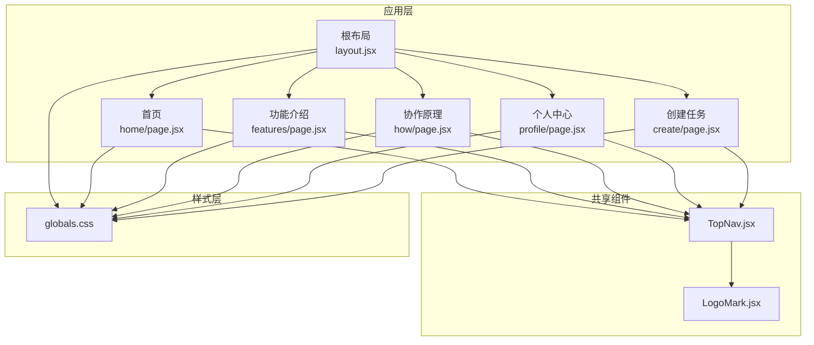
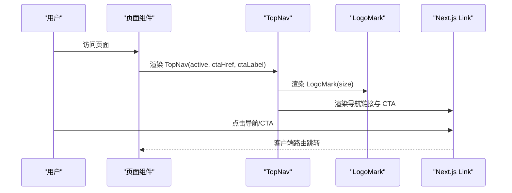
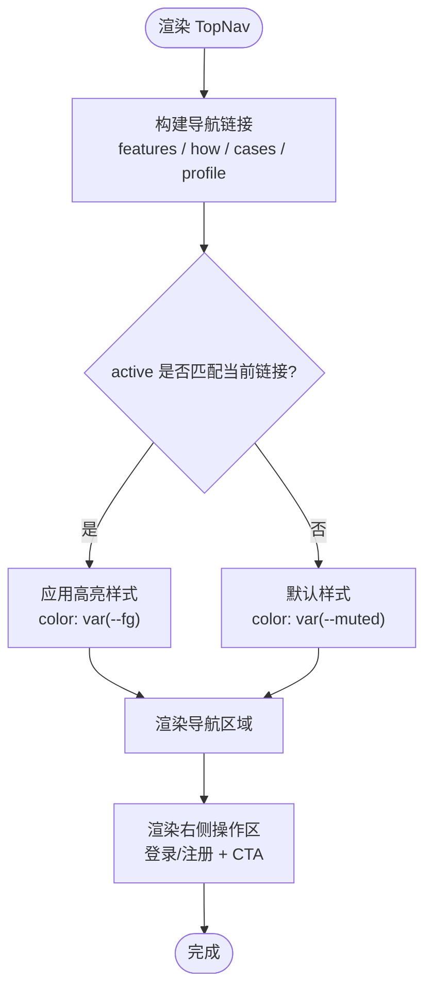
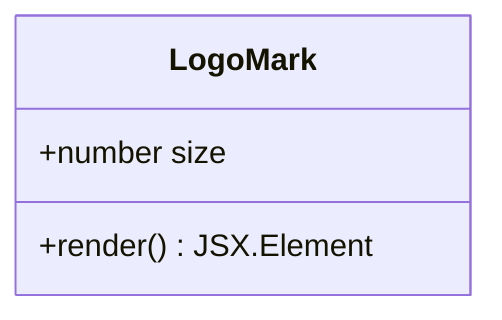
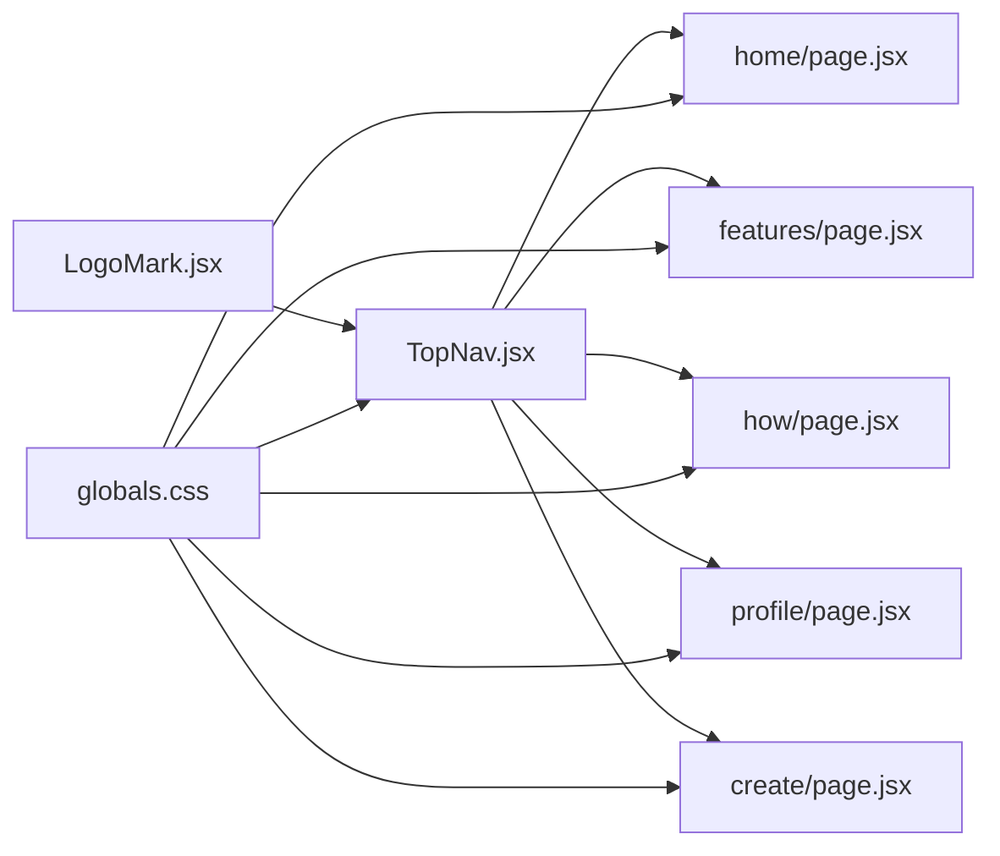

# 组件系统

<cite>
**本文档引用的文件**
- [TopNav.jsx](file://src/components/TopNav.jsx)
- [LogoMark.jsx](file://src/components/LogoMark.jsx)
- [layout.jsx](file://src/app/layout.jsx)
- [globals.css](file://src/app/globals.css)
- [home/page.jsx](file://src/app/home/page.jsx)
- [create/page.jsx](file://src/app/create/page.jsx)
- [profile/page.jsx](file://src/app/profile/page.jsx)
- [features/page.jsx](file://src/app/features/page.jsx)
- [how/page.jsx](file://src/app/how/page.jsx)
- [package.json](file://package.json)
- [README.md](file://README.md)
</cite>

## 目录
1. [简介](#简介)
2. [项目结构](#项目结构)
3. [核心组件](#核心组件)
4. [架构总览](#架构总览)
5. [组件详解](#组件详解)
6. [依赖关系分析](#依赖关系分析)
7. [性能考量](#性能考量)
8. [故障排查指南](#故障排查指南)
9. [结论](#结论)
10. [附录](#附录)

## 简介
本项目采用基于 Next.js App Router 的 React 组件化架构，围绕“共享组件”理念设计，强调组件的高内聚、低耦合与跨页面复用。组件系统的核心是两个共享组件：TopNav 顶部导航与 LogoMark 品牌标识。它们通过统一的样式体系与一致的交互语义，贯穿首页、功能介绍、协作原理、个人中心等多个页面，保证视觉与交互的一致性。

本组件系统文档将深入解析：
- 共享组件的设计原则与使用规范
- TopNav 与 LogoMark 的实现细节与属性配置
- 组件组合模式与复用策略
- 组件间数据传递与事件处理机制
- 组件开发最佳实践与代码规范
- 组件测试策略与调试技巧
- 可访问性设计与响应式适配方案

## 项目结构
项目采用“页面路由 + 共享组件”的组织方式：
- 页面组件位于 src/app 下，每个页面是一个独立路由
- 共享组件位于 src/components 下，供多个页面复用
- 全局样式位于 src/app/globals.css，定义设计令牌与通用样式
- 根布局与元数据位于 src/app/layout.jsx

**图表来源**
- [layout.jsx:14-20](file://src/app/layout.jsx#L14-L20)
- [home/page.jsx:54-57](file://src/app/home/page.jsx#L54-L57)
- [features/page.jsx:23-26](file://src/app/features/page.jsx#L23-L26)
- [how/page.jsx:13-16](file://src/app/how/page.jsx#L13-L16)
- [profile/page.jsx:42-62](file://src/app/profile/page.jsx#L42-L62)
- [TopNav.jsx:1-45](file://src/components/TopNav.jsx#L1-L45)
- [LogoMark.jsx:1-19](file://src/components/LogoMark.jsx#L1-L19)
- [globals.css:1-134](file://src/app/globals.css#L1-L134)

**章节来源**
- [README.md:13-39](file://README.md#L13-L39)
- [layout.jsx:14-20](file://src/app/layout.jsx#L14-L20)
- [globals.css:1-134](file://src/app/globals.css#L1-L134)

## 核心组件
- TopNav：共享顶部导航，负责页面级主导航与行动按钮（CTA）。支持通过 active 属性高亮当前页面链接，支持通过 ctaHref/ctaLabel 自定义右侧主要按钮。
- LogoMark：品牌标识组件，用于在导航与页面各处统一展示品牌星芒图标。

这两个组件共同构成页面的“头部骨架”，确保品牌一致性与导航连贯性。

**章节来源**
- [TopNav.jsx:4-7](file://src/components/TopNav.jsx#L4-L7)
- [LogoMark.jsx:1-2](file://src/components/LogoMark.jsx#L1-L2)

## 架构总览
组件系统遵循“页面即容器 + 共享组件即基础层”的模式：
- 页面组件负责业务逻辑与状态管理（如首页的 HeroInputZone、个人中心的侧边栏切换）
- 共享组件负责呈现与交互基元（TopNav、LogoMark）
- 样式层通过设计令牌与通用类名提供一致的视觉与交互体验

**图表来源**
- [home/page.jsx:54-57](file://src/app/home/page.jsx#L54-L57)
- [TopNav.jsx:20-42](file://src/components/TopNav.jsx#L20-L42)
- [LogoMark.jsx:2-18](file://src/components/LogoMark.jsx#L2-L18)

## 组件详解

### TopNav 顶部导航组件
- 设计定位：页面级共享导航，承载品牌标识、主导航菜单与右上角操作区（登录/注册与 CTA）。
- 关键属性
  - active：高亮当前页面链接（取值："features" | "how" | "cases" | "profile" | null）
  - ctaHref：右侧主按钮的跳转地址
  - ctaLabel：右侧主按钮的文本
- 内部实现要点
  - 使用函数式组件与内联样式实现高亮态（根据 active 与 key 的匹配决定颜色）
  - 导航链接使用 Next.js Link，保持客户端导航与 SSR/SSG 友好
  - LogoMark 作为品牌标识嵌入导航左侧
  - 登录与 CTA 按钮使用统一的按钮类名，风格与全局样式一致

**图表来源**
- [TopNav.jsx:7-18](file://src/components/TopNav.jsx#L7-L18)
- [TopNav.jsx:20-42](file://src/components/TopNav.jsx#L20-L42)

**章节来源**
- [TopNav.jsx:4-7](file://src/components/TopNav.jsx#L4-L7)
- [TopNav.jsx:11-18](file://src/components/TopNav.jsx#L11-L18)
- [TopNav.jsx:20-42](file://src/components/TopNav.jsx#L20-L42)

### LogoMark 品牌标识组件
- 设计定位：品牌星芒/星形图案，作为导航与页面各处的品牌标识元素。
- 关键属性
  - size：控制 SVG 尺寸（宽高相等），用于不同场景下的缩放
- 内部实现要点
  - 使用 SVG 渲染星芒几何图形，stroke 与颜色由当前主题色控制
  - 通过 aria-hidden="true" 提升可访问性，避免重复读屏
  - 外层容器提供尺寸与背景渐变，形成品牌色块

**图表来源**
- [LogoMark.jsx:2-18](file://src/components/LogoMark.jsx#L2-L18)

**章节来源**
- [LogoMark.jsx:1-2](file://src/components/LogoMark.jsx#L1-L2)
- [LogoMark.jsx:2-18](file://src/components/LogoMark.jsx#L2-L18)

### 页面集成与使用模式
- 首页：渲染 TopNav 并传入 active="features" 与自定义 CTA 文案
- 功能介绍：渲染 TopNav 并传入 active="features"
- 协作原理：渲染 TopNav 并传入 active="how"
- 个人中心：渲染 TopNav 并传入 active="profile" 与自定义 CTA 文案/地址
- 创建任务：渲染 TopNav 并传入自定义 CTA 文案

这些模式体现了“参数化配置 + 统一样式”的复用策略，降低页面间的重复代码与维护成本。

**章节来源**
- [home/page.jsx:54-57](file://src/app/home/page.jsx#L54-L57)
- [features/page.jsx:23-26](file://src/app/features/page.jsx#L23-L26)
- [how/page.jsx:13-16](file://src/app/how/page.jsx#L13-L16)
- [profile/page.jsx:42-62](file://src/app/profile/page.jsx#L42-L62)
- [create/page.jsx:45-59](file://src/app/create/page.jsx#L45-L59)

## 依赖关系分析
- TopNav 依赖 LogoMark 作为品牌标识
- 所有页面均依赖 TopNav，形成“页面 -> 共享组件”的单向依赖
- 样式层通过全局 CSS 提供设计令牌与通用类名，页面与共享组件共同消费

**图表来源**
- [TopNav.jsx:1-2](file://src/components/TopNav.jsx#L1-L2)
- [LogoMark.jsx:1-19](file://src/components/LogoMark.jsx#L1-L19)
- [home/page.jsx:54-57](file://src/app/home/page.jsx#L54-L57)
- [features/page.jsx:23-26](file://src/app/features/page.jsx#L23-L26)
- [how/page.jsx:13-16](file://src/app/how/page.jsx#L13-L16)
- [profile/page.jsx:42-62](file://src/app/profile/page.jsx#L42-L62)
- [create/page.jsx:45-59](file://src/app/create/page.jsx#L45-L59)
- [globals.css:245-296](file://src/app/globals.css#L245-L296)

**章节来源**
- [TopNav.jsx:1-2](file://src/components/TopNav.jsx#L1-L2)
- [globals.css:245-296](file://src/app/globals.css#L245-L296)

## 性能考量
- 组件体积与渲染
  - TopNav 与 LogoMark 均为轻量纯展示组件，无复杂状态，渲染开销低
  - 使用 Next.js Link 进行客户端导航，避免整页刷新
- 样式与主题
  - 通过 CSS 变量统一管理颜色与间距，减少重复样式定义
  - 顶部导航采用玻璃模糊效果，需注意在低端设备上的性能影响
- 资源加载
  - 项目采用静态预渲染，所有路由均为静态生成，首屏 JS 体积较小，利于首屏性能

[本节为通用性能指导，不直接分析具体文件]

## 故障排查指南
- 导航高亮不生效
  - 检查 active 参数是否与导航项的 key 匹配（"features" | "how" | "cases" | "profile" | null）
  - 确认内联样式的 color 值是否被覆盖
- CTA 按钮文本或链接错误
  - 检查 ctaLabel 与 ctaHref 的传入值
  - 确认 Next.js Link 的 href 正确指向目标路由
- Logo 显示异常
  - 检查 size 属性是否合理（过大/过小都会影响视觉比例）
  - 确认 SVG 的 stroke 与颜色是否受主题变量影响
- 样式错位
  - 检查全局 CSS 中的 topnav、按钮、容器类名是否正确应用
  - 确认浏览器兼容性与 CSS 变量是否生效

**章节来源**
- [TopNav.jsx:4-7](file://src/components/TopNav.jsx#L4-L7)
- [TopNav.jsx:11-18](file://src/components/TopNav.jsx#L11-L18)
- [LogoMark.jsx:2-18](file://src/components/LogoMark.jsx#L2-L18)
- [globals.css:245-296](file://src/app/globals.css#L245-L296)

## 结论
本组件系统以 TopNav 与 LogoMark 为核心，结合全局设计令牌与通用样式，实现了跨页面的一致性与高复用性。通过参数化配置与统一的交互语义，组件在多个页面中保持稳定表现。建议在后续迭代中继续坚持“共享组件优先”的原则，完善组件的可访问性与响应式能力，并建立配套的测试与文档流程，以保障组件系统的长期演进与团队协作效率。

[本节为总结性内容，不直接分析具体文件]

## 附录

### 组件属性与配置清单
- TopNav
  - active：高亮当前页面链接（可选）
  - ctaHref：右侧主按钮跳转地址（可选）
  - ctaLabel：右侧主按钮文本（可选）
- LogoMark
  - size：SVG 尺寸（可选）

**章节来源**
- [TopNav.jsx:4-7](file://src/components/TopNav.jsx#L4-L7)
- [LogoMark.jsx:2](file://src/components/LogoMark.jsx#L2)

### 组件开发最佳实践与代码规范
- 设计原则
  - 单一职责：组件只负责单一功能域（如导航、品牌标识）
  - 可配置性：通过 props 控制外观与行为，避免硬编码
  - 可复用性：尽量减少对页面上下文的依赖，提升跨页面复用能力
- 代码规范
  - 使用函数式组件与 Hooks，避免不必要的类组件
  - 使用 Next.js Link 进行导航，保持客户端路由一致性
  - 使用 CSS 变量与通用类名，统一风格与主题
  - 为可交互元素提供可访问性属性（如 aria-hidden）
- 样式规范
  - 在 globals.css 中集中管理设计令牌与通用样式
  - 为导航与按钮提供 hover/focus 状态，增强交互反馈
  - 控制动画与过渡的性能，避免低端设备卡顿

**章节来源**
- [TopNav.jsx:11-18](file://src/components/TopNav.jsx#L11-L18)
- [LogoMark.jsx:12](file://src/components/LogoMark.jsx#L12)
- [globals.css:245-296](file://src/app/globals.css#L245-L296)

### 组件测试策略与调试技巧
- 单元测试
  - 对 TopNav 的 active 高亮逻辑进行断言，验证不同 key 的样式分支
  - 对 LogoMark 的 size 属性进行断言，验证 SVG 尺寸与容器尺寸
- 集成测试
  - 在页面中渲染 TopNav，模拟点击导航项，验证 Link 的跳转行为
  - 验证 CTA 按钮的文本与链接是否符合预期
- 调试技巧
  - 使用浏览器开发者工具检查 DOM 结构与 CSS 类名
  - 临时在组件中添加 console.log 或使用 React DevTools 的 Profiler
  - 通过切换 active 值快速验证高亮逻辑

[本节为通用测试与调试指导，不直接分析具体文件]

### 可访问性设计与响应式适配
- 可访问性
  - LogoMark 使用 aria-hidden="true"，避免重复读屏
  - 导航链接具备键盘可达性与焦点可见性
  - 按钮具备 hover/focus 状态，便于键盘与鼠标用户操作
- 响应式适配
  - 使用容器类名与网格系统，确保在不同屏幕宽度下布局稳定
  - 顶部导航采用粘滞定位与玻璃模糊，兼顾美观与可用性
  - 字体与字号通过 CSS 变量统一管理，便于在移动端优化

**章节来源**
- [LogoMark.jsx:12](file://src/components/LogoMark.jsx#L12)
- [globals.css:245-296](file://src/app/globals.css#L245-L296)