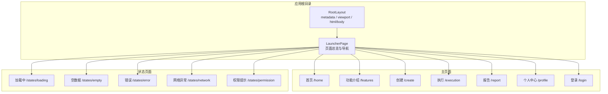
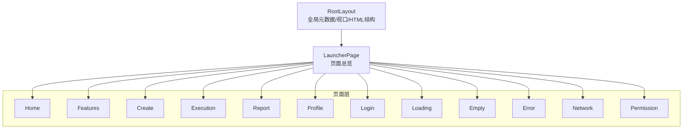
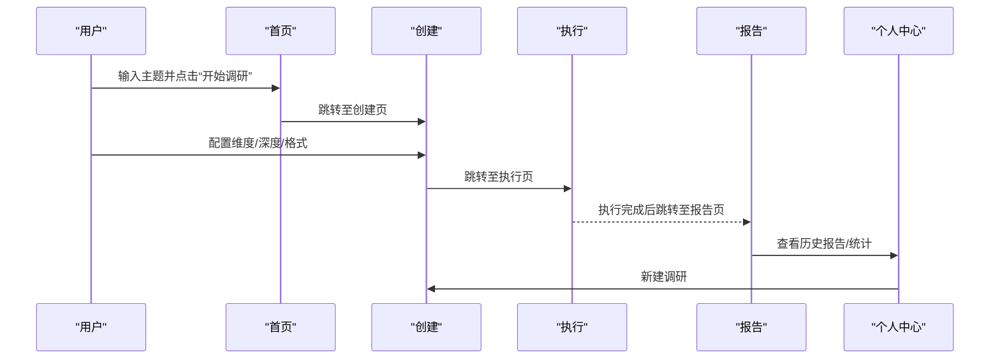
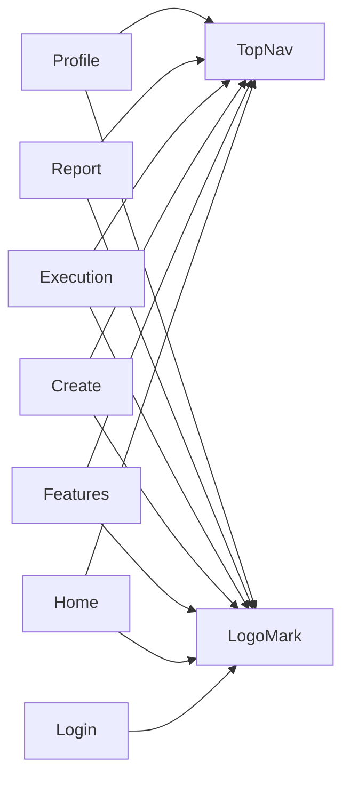

# 页面架构

<cite>
**本文引用的文件**
- [layout.jsx](file://src/app/layout.jsx)
- [page.jsx](file://src/app/page.jsx)
- [home/page.jsx](file://src/app/home/page.jsx)
- [features/page.jsx](file://src/app/features/page.jsx)
- [create/page.jsx](file://src/app/create/page.jsx)
- [execution/page.jsx](file://src/app/execution/page.jsx)
- [report/page.jsx](file://src/app/report/page.jsx)
- [profile/page.jsx](file://src/app/profile/page.jsx)
- [login/page.jsx](file://src/app/login/page.jsx)
- [states/loading/page.jsx](file://src/app/states/loading/page.jsx)
- [states/empty/page.jsx](file://src/app/states/empty/page.jsx)
- [states/error/page.jsx](file://src/app/states/error/page.jsx)
- [states/network/page.jsx](file://src/app/states/network/page.jsx)
- [states/permission/page.jsx](file://src/app/states/permission/page.jsx)
- [TopNav.jsx](file://src/components/TopNav.jsx)
- [LogoMark.jsx](file://src/components/LogoMark.jsx)
- [next.config.mjs](file://next.config.mjs)
</cite>

## 目录
1. [引言](#引言)
2. [项目结构](#项目结构)
3. [核心组件](#核心组件)
4. [架构总览](#架构总览)
5. [详细组件分析](#详细组件分析)
6. [依赖分析](#依赖分析)
7. [性能考虑](#性能考虑)
8. [故障排除指南](#故障排除指南)
9. [结论](#结论)
10. [附录](#附录)

## 引言
本文件系统性梳理 InsightMesh 在 Next.js 14 App Router 下的页面架构与组织方式，重点覆盖根布局 RootLayout 的职责与配置、各页面的功能定位与职责边界、页面间导航关系与数据流转、组件生命周期与状态传递、路由与嵌套路由实现细节，以及性能优化与 SEO 配置建议。文档面向不同技术背景读者，既提供高层概览也给出代码级参考。

## 项目结构
InsightMesh 采用 Next.js 14 App Router 的 App 目录结构，页面位于 src/app 下，采用“约定式路由 + 文件系统即路由”的方式组织。根布局负责全局元数据与 HTML 结构，顶层页面作为“启动器”展示所有页面卡片，其余页面分别对应产品主流程与状态页。

**图表来源**
- [layout.jsx:1-21](file://src/app/layout.jsx#L1-L21)
- [page.jsx:1-78](file://src/app/page.jsx#L1-L78)
- [home/page.jsx:1-212](file://src/app/home/page.jsx#L1-L212)
- [features/page.jsx:1-96](file://src/app/features/page.jsx#L1-L96)
- [create/page.jsx:1-183](file://src/app/create/page.jsx#L1-L183)
- [execution/page.jsx:1-169](file://src/app/execution/page.jsx#L1-L169)
- [report/page.jsx:1-250](file://src/app/report/page.jsx#L1-L250)
- [profile/page.jsx:1-284](file://src/app/profile/page.jsx#L1-L284)
- [login/page.jsx:1-185](file://src/app/login/page.jsx#L1-L185)
- [states/loading/page.jsx:1-12](file://src/app/states/loading/page.jsx#L1-L12)
- [states/empty/page.jsx:1-25](file://src/app/states/empty/page.jsx#L1-L25)
- [states/error/page.jsx:1-21](file://src/app/states/error/page.jsx#L1-L21)
- [states/network/page.jsx:1-33](file://src/app/states/network/page.jsx#L1-L33)
- [states/permission/page.jsx:1-28](file://src/app/states/permission/page.jsx#L1-L28)

**章节来源**
- [layout.jsx:1-21](file://src/app/layout.jsx#L1-L21)
- [page.jsx:1-78](file://src/app/page.jsx#L1-L78)

## 核心组件
- 根布局 RootLayout
  - 职责：定义全局元数据（标题、描述）、视口配置、HTML 语言属性，包裹所有页面的 body 内容。
  - 关键点：使用 metadata 与 viewport 提升 SEO 与移动端体验；通过 children 透传页面内容。
- 顶层启动器页面
  - 职责：集中展示主页面与状态页面的卡片入口，便于原型演示与快速跳转。
  - 关键点：使用 Link 组件进行页面跳转；分组展示主流程与状态页。
- 通用顶部导航 TopNav
  - 职责：跨页面共享的导航栏，支持高亮当前页面、右侧操作按钮与品牌 Logo。
  - 关键点：通过 active 参数高亮匹配的导航项；支持右侧“免费开始”等 CTA。

**章节来源**
- [layout.jsx:3-20](file://src/app/layout.jsx#L3-L20)
- [page.jsx:10-25](file://src/app/page.jsx#L10-L25)
- [TopNav.jsx:7-44](file://src/components/TopNav.jsx#L7-L44)

## 架构总览
Next.js 14 App Router 以“文件系统即路由”，页面通过 export default 函数组件暴露 UI。根布局负责全局结构与元数据，各页面通过 Link 或客户端路由（如 next/navigation）进行导航。状态页面用于处理加载、空数据、错误、网络异常与权限等场景。

**图表来源**
- [layout.jsx:1-21](file://src/app/layout.jsx#L1-L21)
- [page.jsx:1-78](file://src/app/page.jsx#L1-L78)
- [home/page.jsx:1-212](file://src/app/home/page.jsx#L1-L212)
- [features/page.jsx:1-96](file://src/app/features/page.jsx#L1-L96)
- [create/page.jsx:1-183](file://src/app/create/page.jsx#L1-L183)
- [execution/page.jsx:1-169](file://src/app/execution/page.jsx#L1-L169)
- [report/page.jsx:1-250](file://src/app/report/page.jsx#L1-L250)
- [profile/page.jsx:1-284](file://src/app/profile/page.jsx#L1-L284)
- [login/page.jsx:1-185](file://src/app/login/page.jsx#L1-L185)
- [states/loading/page.jsx:1-12](file://src/app/states/loading/page.jsx#L1-L12)
- [states/empty/page.jsx:1-25](file://src/app/states/empty/page.jsx#L1-L25)
- [states/error/page.jsx:1-21](file://src/app/states/error/page.jsx#L1-L21)
- [states/network/page.jsx:1-33](file://src/app/states/network/page.jsx#L1-L33)
- [states/permission/page.jsx:1-28](file://src/app/states/permission/page.jsx#L1-L28)

## 详细组件分析

### 根布局 RootLayout
- 元数据与视口
  - metadata.title/description：为搜索引擎与社交分享提供默认标题与描述。
  - viewport：声明设备宽度与初始缩放，保障移动端体验。
- 结构与渲染
  - 以 html/lang 包裹 body，children 透传页面内容，保证全局样式与脚本注入位置正确。

**章节来源**
- [layout.jsx:3-20](file://src/app/layout.jsx#L3-L20)

### 启动器页面 LauncherPage
- 功能定位
  - 展示主页面与状态页面的卡片入口，便于原型演示与快速跳转。
- 数据与行为
  - mainPages/statePages：集中定义页面标题、描述与跳转链接。
  - 使用 Link 组件进行页面跳转，支持图标与标签展示。

**章节来源**
- [page.jsx:10-25](file://src/app/page.jsx#L10-L25)
- [page.jsx:42-74](file://src/app/page.jsx#L42-L74)

### 首页 Home
- 功能定位
  - 产品首屏 Landing Page，承载主题输入、模板推荐、场景介绍、统计数据与 CTA。
- 生命周期与状态
  - 使用客户端状态管理主题输入与模板选择，通过 next/navigation 的 useRouter 进行页面跳转。
- 组件复用
  - 顶部导航 TopNav 通过 active/ctaLabel 控制高亮与按钮文案。

**章节来源**
- [home/page.jsx:54-190](file://src/app/home/page.jsx#L54-L190)
- [TopNav.jsx:7-44](file://src/components/TopNav.jsx#L7-L44)

### 功能介绍 Features
- 功能定位
  - 展示产品六大核心能力，配合图标与描述，强化用户认知。
- 交互设计
  - 通过 Link 组件跳转至创建页，形成“认知—行动”的闭环。

**章节来源**
- [features/page.jsx:23-95](file://src/app/features/page.jsx#L23-L95)

### 调研创建 Create
- 功能定位
  - 配置调研任务：主题确认、维度选择、深度档位、输出格式与预估耗时。
- 状态管理
  - 使用 useState 管理维度开关、深度档位与输出格式勾选，计算预估耗时与输出格式列表。
- 导航与数据流转
  - 通过 next/navigation 的 useRouter 进入执行页，形成“配置—执行”的流程。

**章节来源**
- [create/page.jsx:45-182](file://src/app/create/page.jsx#L45-L182)

### 多 Agent 执行 Execution
- 功能定位
  - 实时展示多 Agent 工作看板、整体进度、剩余时间与日志流。
- 生命周期与动画
  - 使用 useEffect 与定时器模拟整体进度条动画，体现“执行中”的动态感。
- 组件复用
  - 顶部导航 TopNav 控制 CTA 为“新建调研”。

**章节来源**
- [execution/page.jsx:55-168](file://src/app/execution/page.jsx#L55-L168)
- [TopNav.jsx:7-44](file://src/components/TopNav.jsx#L7-L44)

### 报告展示 Report
- 功能定位
  - 展示完整调研报告，包含目录、图表、观点对比、趋势预判、问题与建议及参考资料。
- 交互设计
  - 提供返回执行页、导出 PDF、复制文本、分享与重新调研等操作。
- 导航与数据流转
  - 通过 Link 与 next/navigation 在执行与创建之间回溯。

**章节来源**
- [report/page.jsx:37-249](file://src/app/report/page.jsx#L37-L249)

### 个人中心 Profile
- 功能定位
  - 用户中心：我的报告、收藏夹、使用统计、账户设置与登出。
- 状态管理
  - 使用 useState 管理侧边栏分区、筛选条件与搜索关键词，实现本地筛选与分页占位。
- 组件复用
  - 顶部导航 TopNav 高亮“我的报告”，CTA 为“新建调研”。

**章节来源**
- [profile/page.jsx:42-283](file://src/app/profile/page.jsx#L42-L283)
- [TopNav.jsx:7-44](file://src/components/TopNav.jsx#L7-L44)

### 登录 Login
- 功能定位
  - 登录/注册表单，支持第三方登录入口与 Tab 交互。
- 交互设计
  - 使用 useState 切换登录/注册 Tab，聚焦管理与密码可见性切换。
- 导航与数据流转
  - 提交后跳转至个人中心，形成“认证—使用”的闭环。

**章节来源**
- [login/page.jsx:18-184](file://src/app/login/page.jsx#L18-L184)

### 状态页面（States）
- 加载中 Loading
  - 展示加载动画与提示文案，避免用户误关页面。
- 空数据 Empty
  - 引导用户创建第一份报告，提供“创建第一份报告”与“浏览案例”入口。
- 错误 Error
  - 展示错误原因与重试/微调主题入口，保留已采集数据。
- 网络异常 Network
  - 提供网络排查建议与“重新连接”按钮，增强容错体验。
- 权限提示 Permission
  - 引导登录/注册，展示权益列表，推动转化。

**章节来源**
- [states/loading/page.jsx:1-12](file://src/app/states/loading/page.jsx#L1-L12)
- [states/empty/page.jsx:5-24](file://src/app/states/empty/page.jsx#L5-L24)
- [states/error/page.jsx:3-20](file://src/app/states/error/page.jsx#L3-L20)
- [states/network/page.jsx:8-32](file://src/app/states/network/page.jsx#L8-L32)
- [states/permission/page.jsx:6-27](file://src/app/states/permission/page.jsx#L6-L27)

### 导航关系与数据流转

**图表来源**
- [home/page.jsx:30-52](file://src/app/home/page.jsx#L30-L52)
- [create/page.jsx:174-177](file://src/app/create/page.jsx#L174-L177)
- [execution/page.jsx:55-168](file://src/app/execution/page.jsx#L55-L168)
- [report/page.jsx:37-249](file://src/app/report/page.jsx#L37-L249)
- [profile/page.jsx:42-283](file://src/app/profile/page.jsx#L42-L283)

### 路由与嵌套路由
- 约定式路由
  - src/app 下的文件名即路由路径，如 /home、/create、/execution、/report、/profile、/login。
  - 状态页面位于 src/app/states 下，形成清晰的嵌套命名空间。
- 根布局与页面层级
  - RootLayout 作为根容器，所有页面共享其元数据与结构。
- 导航组件
  - 使用 next/link 进行页面跳转，保持 SPA 导航体验。

**章节来源**
- [layout.jsx:14-20](file://src/app/layout.jsx#L14-L20)
- [page.jsx:42-74](file://src/app/page.jsx#L42-L74)
- [TopNav.jsx:7-44](file://src/components/TopNav.jsx#L7-L44)

### 组件生命周期与状态传递
- 客户端组件
  - 多数页面使用“use client”声明为客户端组件，以便使用 useState/useEffect/useRouter 等。
- 状态管理
  - 首页与创建页使用 useState 管理输入与配置；执行页使用定时器模拟进度；个人中心使用本地筛选与搜索。
- 路由参数与状态
  - 当前实现通过页面跳转传递简单状态（如主题、配置），未见复杂路由参数或服务端状态持久化。

**章节来源**
- [home/page.jsx:3-4](file://src/app/home/page.jsx#L3-L4)
- [create/page.jsx:3-4](file://src/app/create/page.jsx#L3-L4)
- [execution/page.jsx:3-3](file://src/app/execution/page.jsx#L3-L3)
- [profile/page.jsx:3-3](file://src/app/profile/page.jsx#L3-L3)

## 依赖分析
- 组件依赖
  - 各页面均依赖 TopNav 与 LogoMark，形成一致的品牌与导航体验。
- 外部依赖
  - next/link、next/navigation（useRouter）用于页面跳转；React hooks 用于状态管理。
- 配置依赖
  - next.config.mjs 中启用 reactStrictMode，有助于开发期发现潜在问题。

**图表来源**
- [home/page.jsx](file://src/app/home/page.jsx#L6)
- [features/page.jsx](file://src/app/features/page.jsx#L3)
- [create/page.jsx](file://src/app/create/page.jsx#L5)
- [execution/page.jsx](file://src/app/execution/page.jsx#L4)
- [report/page.jsx](file://src/app/report/page.jsx#L2)
- [profile/page.jsx](file://src/app/profile/page.jsx#L5)
- [login/page.jsx](file://src/app/login/page.jsx#L6)
- [TopNav.jsx:1-44](file://src/components/TopNav.jsx#L1-L44)
- [LogoMark.jsx:1-19](file://src/components/LogoMark.jsx#L1-L19)

**章节来源**
- [next.config.mjs:1-7](file://next.config.mjs#L1-L7)

## 性能考虑
- 客户端渲染与懒加载
  - 页面均为客户端组件，建议对大型图表与富文本模块进行按需加载，减少首屏负担。
- 路由与导航
  - 使用 next/link 进行预取与缓存，提升页面切换流畅度。
- 动画与定时器
  - 执行页的进度动画使用定时器，注意在组件卸载时清理，避免内存泄漏。
- 图标与资源
  - LogoMark 与各页面图标为内联 SVG，体积小、加载快；建议统一管理图标资源，避免重复引入。
- SEO 与元数据
  - RootLayout 已配置 metadata 与 viewport，建议在各页面补充页面级元数据（如 Open Graph、Twitter Card）以提升分享体验。

[本节为通用指导，不直接分析具体文件]

## 故障排除指南
- 网络异常
  - 症状：无法连接服务器。
  - 处理：检查网络连通性、代理与防火墙；使用“重新连接”按钮刷新。
- 权限不足
  - 症状：访问受保护内容需登录。
  - 处理：引导登录/注册，展示权益列表。
- 调研失败
  - 症状：部分数据源超时导致报告中断。
  - 处理：提供“重新执行”与“微调主题”入口，保留已采集数据。
- 空数据
  - 症状：首次无报告记录。
  - 处理：引导创建第一份报告或浏览案例。
- 加载中
  - 症状：报告生成中。
  - 处理：提示用户耐心等待，不要关闭页面。

**章节来源**
- [states/network/page.jsx:8-32](file://src/app/states/network/page.jsx#L8-L32)
- [states/permission/page.jsx:6-27](file://src/app/states/permission/page.jsx#L6-L27)
- [states/error/page.jsx:3-20](file://src/app/states/error/page.jsx#L3-L20)
- [states/empty/page.jsx:5-24](file://src/app/states/empty/page.jsx#L5-L24)
- [states/loading/page.jsx:1-12](file://src/app/states/loading/page.jsx#L1-L12)

## 结论
InsightMesh 的页面架构遵循 Next.js 14 App Router 的约定式路由与客户端组件模式，RootLayout 提供统一的元数据与结构，各页面围绕“主题输入—配置—执行—报告—个人中心”的主流程展开，并通过状态页面完善异常与引导场景。通过 Link 与 next/navigation 实现平滑导航，组件复用（TopNav、LogoMark）保障品牌一致性。建议后续在性能与 SEO 方面进一步细化，以提升用户体验与可发现性。

## 附录
- 项目配置
  - next.config.mjs：启用 reactStrictMode，有助于开发期发现潜在问题。
- 组件清单
  - TopNav：跨页面导航与品牌展示。
  - LogoMark：品牌星芒图标，内联 SVG。

**章节来源**
- [next.config.mjs:1-7](file://next.config.mjs#L1-L7)
- [TopNav.jsx:1-44](file://src/components/TopNav.jsx#L1-L44)
- [LogoMark.jsx:1-19](file://src/components/LogoMark.jsx#L1-L19)