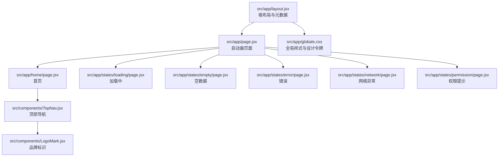
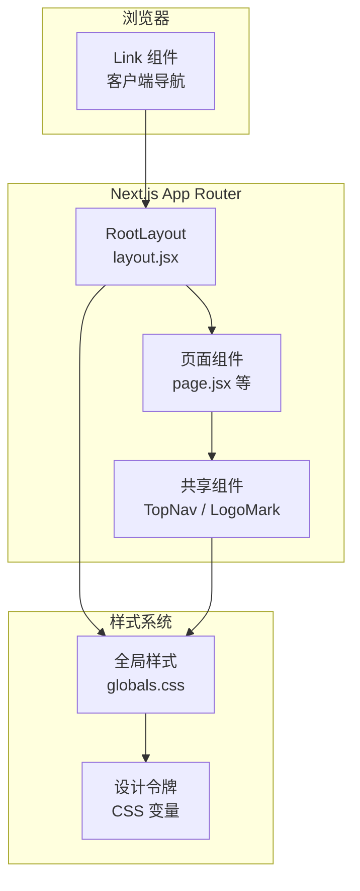
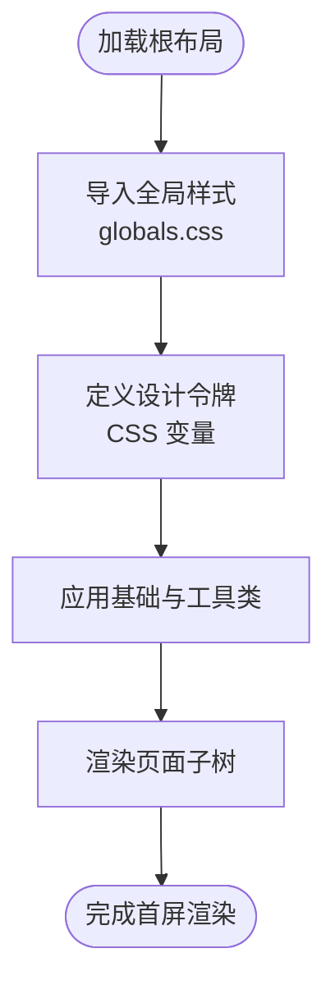
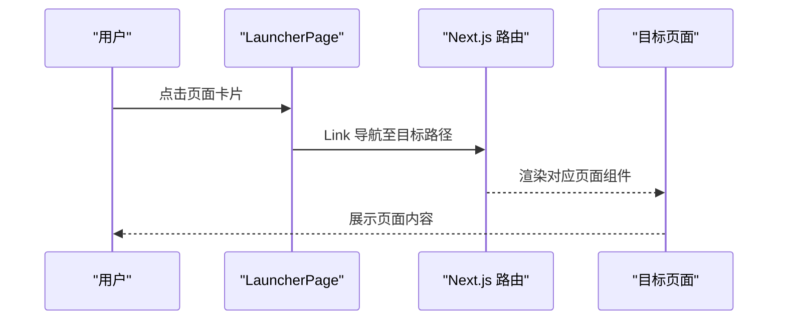
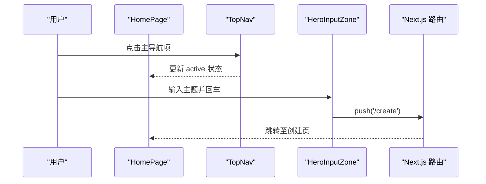
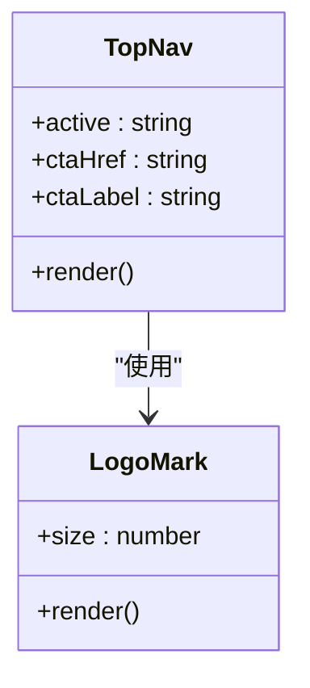
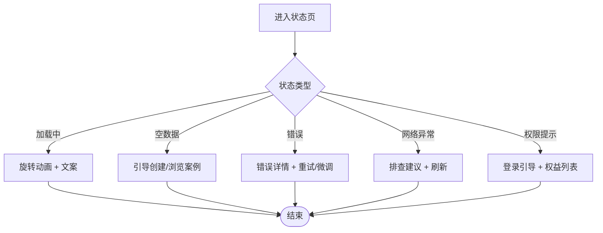
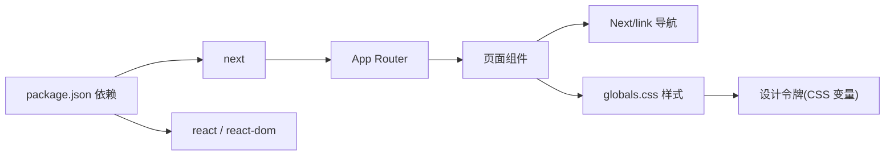

# 项目架构

<cite>
**本文引用的文件**
- [README.md](file://README.md)
- [package.json](file://package.json)
- [next.config.mjs](file://next.config.mjs)
- [src/app/layout.jsx](file://src/app/layout.jsx)
- [src/app/page.jsx](file://src/app/page.jsx)
- [src/app/globals.css](file://src/app/globals.css)
- [src/app/home/page.jsx](file://src/app/home/page.jsx)
- [src/app/states/loading/page.jsx](file://src/app/states/loading/page.jsx)
- [src/app/states/empty/page.jsx](file://src/app/states/empty/page.jsx)
- [src/app/states/error/page.jsx](file://src/app/states/error/page.jsx)
- [src/app/states/network/page.jsx](file://src/app/states/network/page.jsx)
- [src/app/states/permission/page.jsx](file://src/app/states/permission/page.jsx)
- [src/components/TopNav.jsx](file://src/components/TopNav.jsx)
- [src/components/LogoMark.jsx](file://src/components/LogoMark.jsx)
</cite>

## 目录
1. [简介](#简介)
2. [项目结构](#项目结构)
3. [核心组件](#核心组件)
4. [架构总览](#架构总览)
5. [详细组件分析](#详细组件分析)
6. [依赖分析](#依赖分析)
7. [性能考量](#性能考量)
8. [故障排查指南](#故障排查指南)
9. [结论](#结论)
10. [附录](#附录)

## 简介
本项目是一个基于 Next.js 14 App Router 的高保真原型应用，面向“多 AI Agent 智能调研平台”。项目采用全静态生成（SSG）与客户端渲染相结合的混合架构，强调可维护的组件化设计、统一的设计令牌体系与全局样式组织。核心目标是通过最小改动将 Open Design 原型转换为可交互的 Next.js 应用，同时保持视觉、文案、布局与动画的一致性。

## 项目结构
项目遵循 Next.js 14 App Router 的约定式路由与目录结构，核心目录与职责如下：
- src/app
  - 根布局与全局样式：layout.jsx、globals.css
  - 页面级路由：home、create、execution、report、profile、login、cases 等
  - 状态页：states/loading、states/empty、states/error、states/network、states/permission
  - 启动器页面：app/page.jsx，作为 14 个路由的入口索引
- src/components
  - 共享组件：TopNav、LogoMark
- public/assets
  - 原型 PNG 素材资源

图表来源
- [src/app/layout.jsx:1-21](file://src/app/layout.jsx#L1-L21)
- [src/app/page.jsx:1-78](file://src/app/page.jsx#L1-L78)
- [src/app/globals.css:1-800](file://src/app/globals.css#L1-L800)
- [src/app/home/page.jsx:1-212](file://src/app/home/page.jsx#L1-L212)
- [src/app/states/loading/page.jsx:1-12](file://src/app/states/loading/page.jsx#L1-L12)
- [src/app/states/empty/page.jsx:1-25](file://src/app/states/empty/page.jsx#L1-L25)
- [src/app/states/error/page.jsx:1-21](file://src/app/states/error/page.jsx#L1-L21)
- [src/app/states/network/page.jsx:1-33](file://src/app/states/network/page.jsx#L1-L33)
- [src/app/states/permission/page.jsx:1-28](file://src/app/states/permission/page.jsx#L1-L28)
- [src/components/TopNav.jsx:1-45](file://src/components/TopNav.jsx#L1-L45)
- [src/components/LogoMark.jsx:1-19](file://src/components/LogoMark.jsx#L1-L19)

章节来源
- [README.md:13-39](file://README.md#L13-L39)
- [src/app/layout.jsx:1-21](file://src/app/layout.jsx#L1-L21)
- [src/app/page.jsx:1-78](file://src/app/page.jsx#L1-L78)
- [src/app/globals.css:1-800](file://src/app/globals.css#L1-L800)

## 核心组件
- 根布局与元数据
  - 在根布局中引入全局样式并设置站点元信息与视口参数，确保所有页面共享一致的样式与语义。
- 启动器页面
  - 提供 6 个主页面与 5 个状态页的卡片入口，使用 Link 组件进行客户端导航。
- 共享组件
  - TopNav：提供品牌标识、主导航链接与右侧操作按钮，支持 active 高亮与 CTA 配置。
  - LogoMark：品牌星芒标识，支持尺寸定制。
- 状态页
  - 加载中、空数据、错误、网络异常、权限提示等专用页面，统一使用全局样式与设计令牌。

章节来源
- [src/app/layout.jsx:1-21](file://src/app/layout.jsx#L1-L21)
- [src/app/page.jsx:1-78](file://src/app/page.jsx#L1-L78)
- [src/components/TopNav.jsx:1-45](file://src/components/TopNav.jsx#L1-L45)
- [src/components/LogoMark.jsx:1-19](file://src/components/LogoMark.jsx#L1-L19)
- [src/app/states/loading/page.jsx:1-12](file://src/app/states/loading/page.jsx#L1-L12)
- [src/app/states/empty/page.jsx:1-25](file://src/app/states/empty/page.jsx#L1-L25)
- [src/app/states/error/page.jsx:1-21](file://src/app/states/error/page.jsx#L1-L21)
- [src/app/states/network/page.jsx:1-33](file://src/app/states/network/page.jsx#L1-L33)
- [src/app/states/permission/page.jsx:1-28](file://src/app/states/permission/page.jsx#L1-L28)

## 架构总览
系统采用“根布局 + 页面路由 + 共享组件 + 全局样式”的分层架构：
- 控制流
  - 根布局负责注入全局样式与元数据，页面组件通过 Next.js 路由系统渲染。
  - 启动器页面聚合所有路由入口，其他页面通过 Link 或客户端路由跳转。
- 样式流
  - 全局样式集中于 globals.css，包含设计令牌、基础重置、工具类与页面特定样式。
  - 组件通过类名与 CSS 变量共享主题，避免重复定义。
- 数据流
  - 部分页面（如首页）使用客户端状态与路由跳转，其余页面为静态内容。

图表来源
- [src/app/layout.jsx:1-21](file://src/app/layout.jsx#L1-L21)
- [src/app/page.jsx:1-78](file://src/app/page.jsx#L1-L78)
- [src/app/globals.css:1-800](file://src/app/globals.css#L1-L800)
- [src/components/TopNav.jsx:1-45](file://src/components/TopNav.jsx#L1-L45)
- [src/components/LogoMark.jsx:1-19](file://src/components/LogoMark.jsx#L1-L19)

## 详细组件分析

### 根布局与全局样式
- 根布局
  - 设置语言、视口与元信息，包裹 body 子节点，保证全局样式与无障碍属性一致。
- 全局样式
  - 设计令牌：集中定义颜色、字体、间距、圆角、阴影、玻璃效果与动效曲线。
  - 基础与工具类：重置、容器、栅格、排版、按钮、卡片、表单、分割线、页脚等。
  - 页面样式：启动器、首页等页面的专属样式，通过类名隔离作用域。

图表来源
- [src/app/layout.jsx:1-21](file://src/app/layout.jsx#L1-L21)
- [src/app/globals.css:1-800](file://src/app/globals.css#L1-L800)

章节来源
- [src/app/layout.jsx:1-21](file://src/app/layout.jsx#L1-L21)
- [src/app/globals.css:1-800](file://src/app/globals.css#L1-L800)

### 启动器页面与路由组织
- 启动器页面
  - 使用 Link 组件组织 6 个主页面与 5 个状态页的入口卡片，统一风格与交互。
- 路由组织
  - App Router 将每个 page.jsx 视为独立路由，支持静态预渲染与客户端导航。
  - 预览路由与构建验证表明所有 14 个路由均为静态预渲染。

图表来源
- [src/app/page.jsx:1-78](file://src/app/page.jsx#L1-L78)
- [src/app/home/page.jsx:1-212](file://src/app/home/page.jsx#L1-L212)

章节来源
- [src/app/page.jsx:1-78](file://src/app/page.jsx#L1-L78)
- [README.md:61-78](file://README.md#L61-L78)

### 首页组件与客户端逻辑
- 组件职责
  - TopNav：提供主导航与登录/注册入口，支持 active 高亮与 CTA 配置。
  - HeroInputZone：受控输入与键盘事件处理，回车触发路由跳转。
  - TemplateChips：点击模板填充主题输入，隐藏字段存储值。
- 客户端渲染
  - 使用 “use client” 与 useState、useRouter 实现交互逻辑，提升用户体验。

图表来源
- [src/app/home/page.jsx:1-212](file://src/app/home/page.jsx#L1-L212)
- [src/components/TopNav.jsx:1-45](file://src/components/TopNav.jsx#L1-L45)

章节来源
- [src/app/home/page.jsx:1-212](file://src/app/home/page.jsx#L1-L212)
- [src/components/TopNav.jsx:1-45](file://src/components/TopNav.jsx#L1-L45)

### 共享组件：顶部导航与品牌标识
- TopNav
  - 接收 active、ctaHref、ctaLabel 参数，动态高亮当前导航项，右侧提供登录/注册与主要 CTA。
- LogoMark
  - 品牌星芒标识，支持 size 自定义，用于导航与页脚。

图表来源
- [src/components/TopNav.jsx:1-45](file://src/components/TopNav.jsx#L1-L45)
- [src/components/LogoMark.jsx:1-19](file://src/components/LogoMark.jsx#L1-L19)

章节来源
- [src/components/TopNav.jsx:1-45](file://src/components/TopNav.jsx#L1-L45)
- [src/components/LogoMark.jsx:1-19](file://src/components/LogoMark.jsx#L1-L19)

### 状态页组件族
- 加载中
  - 展示旋转动画与进度文案，提示用户等待。
- 空数据
  - 引导用户创建首份报告或浏览案例。
- 错误
  - 显示错误详情与重试/微调主题按钮。
- 网络异常
  - 提供网络排查建议与刷新按钮。
- 权限提示
  - 登录引导与权益列表，促进转化。

图表来源
- [src/app/states/loading/page.jsx:1-12](file://src/app/states/loading/page.jsx#L1-L12)
- [src/app/states/empty/page.jsx:1-25](file://src/app/states/empty/page.jsx#L1-L25)
- [src/app/states/error/page.jsx:1-21](file://src/app/states/error/page.jsx#L1-L21)
- [src/app/states/network/page.jsx:1-33](file://src/app/states/network/page.jsx#L1-L33)
- [src/app/states/permission/page.jsx:1-28](file://src/app/states/permission/page.jsx#L1-L28)

章节来源
- [src/app/states/loading/page.jsx:1-12](file://src/app/states/loading/page.jsx#L1-L12)
- [src/app/states/empty/page.jsx:1-25](file://src/app/states/empty/page.jsx#L1-L25)
- [src/app/states/error/page.jsx:1-21](file://src/app/states/error/page.jsx#L1-L21)
- [src/app/states/network/page.jsx:1-33](file://src/app/states/network/page.jsx#L1-L33)
- [src/app/states/permission/page.jsx:1-28](file://src/app/states/permission/page.jsx#L1-L28)

## 依赖分析
- 运行时依赖
  - Next.js 14、React 18、react-dom
- 构建与开发
  - next.config.mjs 启用严格模式，确保更严格的 React 检查。
- 路由与导航
  - 使用 Next/link 进行客户端导航，结合 App Router 的约定式路由。
- 样式与主题
  - 全局样式集中管理，设计令牌通过 CSS 变量统一，组件通过类名复用。

图表来源
- [package.json:1-18](file://package.json#L1-L18)
- [next.config.mjs:1-7](file://next.config.mjs#L1-L7)
- [src/app/page.jsx:1-78](file://src/app/page.jsx#L1-L78)
- [src/app/globals.css:1-800](file://src/app/globals.css#L1-L800)

章节来源
- [package.json:1-18](file://package.json#L1-L18)
- [next.config.mjs:1-7](file://next.config.mjs#L1-L7)
- [src/app/page.jsx:1-78](file://src/app/page.jsx#L1-L78)
- [src/app/globals.css:1-800](file://src/app/globals.css#L1-L800)

## 性能考量
- 静态生成优先
  - 所有 14 个路由均采用静态预渲染，首屏 JS 体积约 87–101 kB，有利于首屏性能与 SEO。
- 组件化与样式复用
  - 共享组件与设计令牌减少重复样式与运行时计算，降低内存占用。
- 客户端渲染的边界
  - 仅在需要交互的页面（如首页）启用客户端逻辑，避免过度使用 “use client”，保持 SSR/SSG 优势。
- 图标与资源
  - 使用 SVG 图标与公共资源，减少额外请求与体积。

章节来源
- [README.md:82-86](file://README.md#L82-L86)
- [src/app/home/page.jsx:1-212](file://src/app/home/page.jsx#L1-L212)
- [src/app/globals.css:1-800](file://src/app/globals.css#L1-L800)

## 故障排查指南
- 路由与导航
  - 若点击卡片无反应，检查 Link 组件的 href 是否正确，以及页面是否存在对应路由。
- 样式不生效
  - 确认根布局已导入 globals.css，且类名拼写正确；检查设计令牌变量是否在当前页面可用。
- 客户端逻辑无效
  - 确认页面顶部包含 “use client”，并正确使用 useState、useRouter 等客户端 API。
- 状态页显示异常
  - 检查对应页面组件是否正确渲染，按钮与链接是否指向预期路径。

章节来源
- [src/app/layout.jsx:1-21](file://src/app/layout.jsx#L1-L21)
- [src/app/page.jsx:1-78](file://src/app/page.jsx#L1-L78)
- [src/app/home/page.jsx:1-212](file://src/app/home/page.jsx#L1-L212)
- [src/app/states/loading/page.jsx:1-12](file://src/app/states/loading/page.jsx#L1-L12)
- [src/app/states/empty/page.jsx:1-25](file://src/app/states/empty/page.jsx#L1-L25)
- [src/app/states/error/page.jsx:1-21](file://src/app/states/error/page.jsx#L1-L21)
- [src/app/states/network/page.jsx:1-33](file://src/app/states/network/page.jsx#L1-L33)
- [src/app/states/permission/page.jsx:1-28](file://src/app/states/permission/page.jsx#L1-L28)

## 结论
本项目通过 Next.js 14 App Router 实现了清晰的页面组织与路由系统，结合全局样式与设计令牌，形成了统一的主题与视觉语言。组件化架构使得共享导航与品牌标识得以高效复用，启动器页面提供了直观的路由入口。静态生成与有限的客户端渲染组合，在保证性能的同时兼顾了交互体验。整体设计在可维护性、一致性与性能之间取得良好平衡。

## 附录
- 技术决策与权衡
  - 使用 App Router 的约定式路由简化页面组织，避免手动配置复杂路由。
  - 全局样式集中管理，减少样式碎片化，但需注意命名冲突与作用域隔离。
  - 仅在必要页面启用客户端逻辑，控制首屏 JS 体积与交互复杂度。
- 约束条件
  - 项目为原型性质，后续可扩展服务端数据获取与认证流程。
  - 样式系统依赖 CSS 变量，需确保浏览器兼容性与 SSR 渲染一致性。