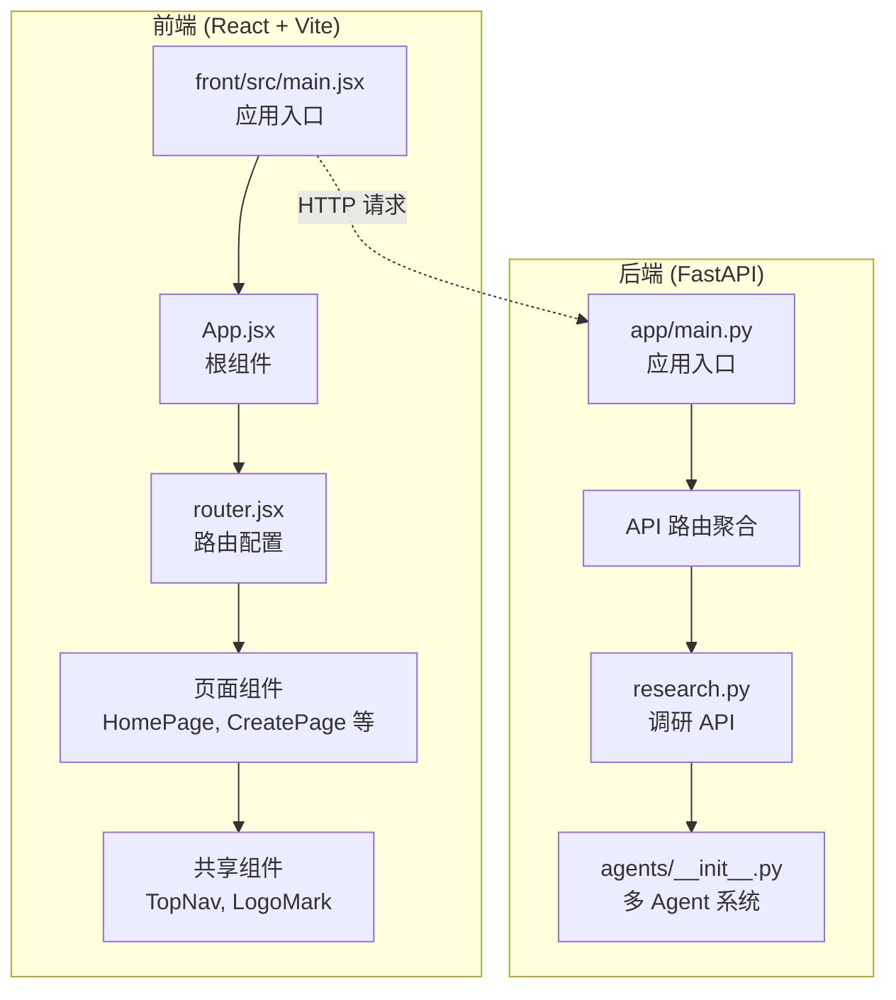
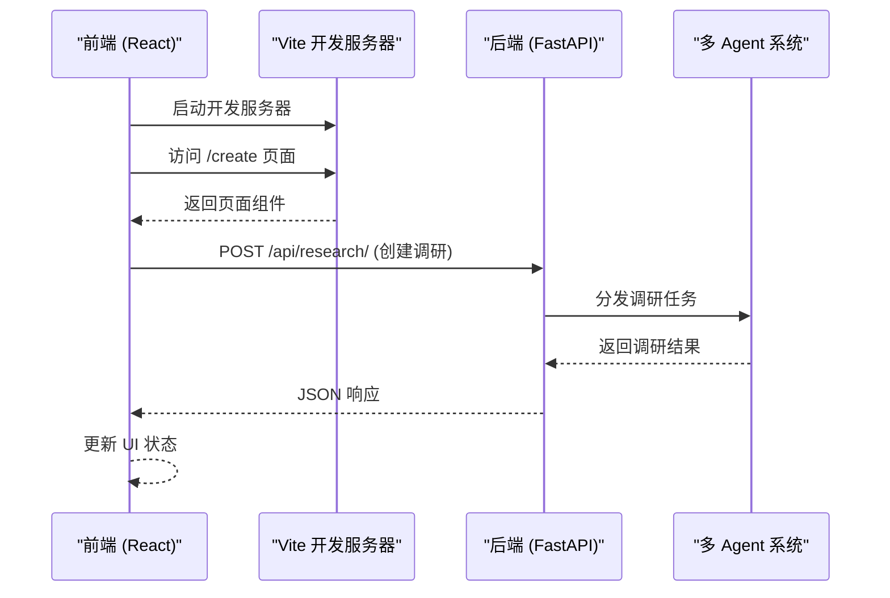
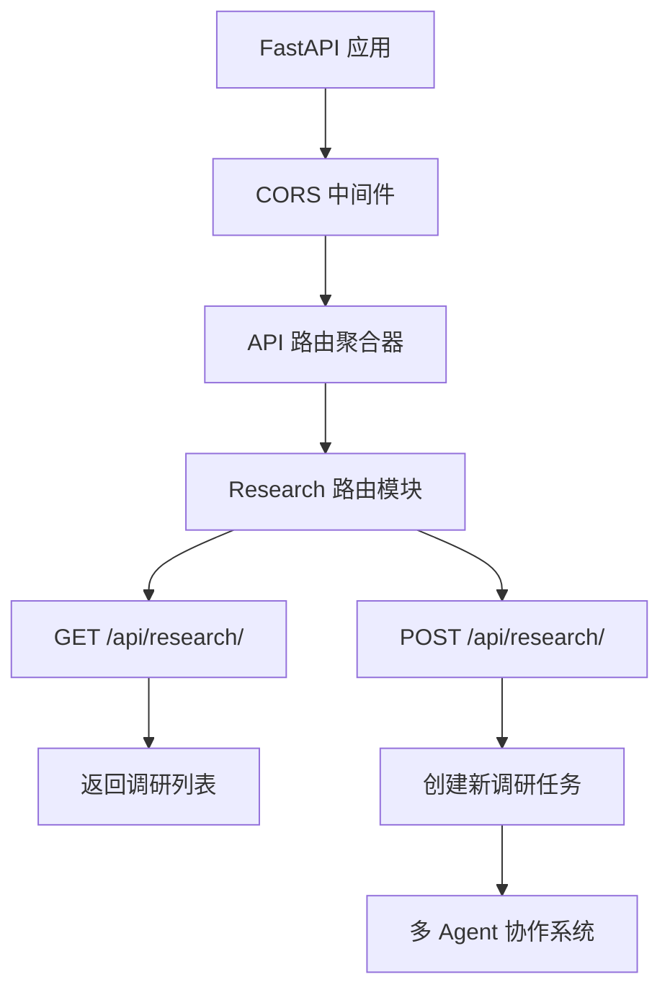
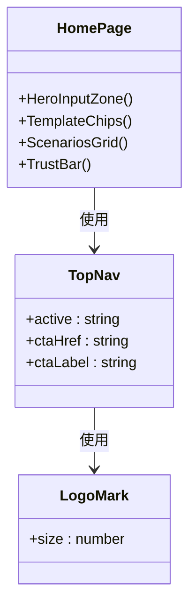
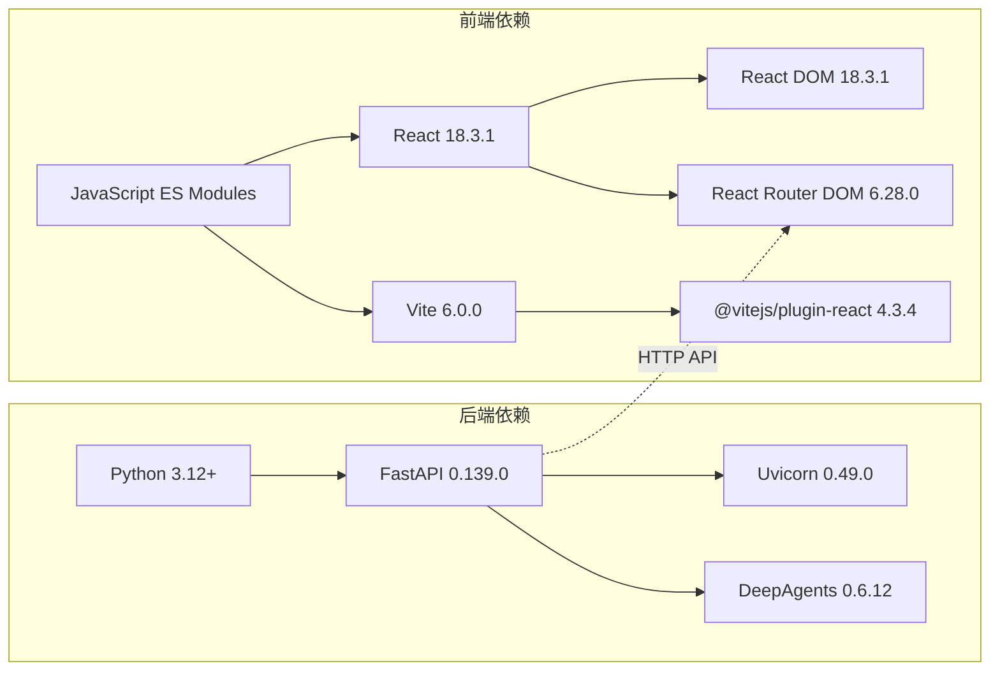

# 项目架构

<cite>
**本文引用的文件**
- [main.py](file://main.py)
- [app/main.py](file://app/main.py)
- [pyproject.toml](file://pyproject.toml)
- [front/package.json](file://front/package.json)
- [front/vite.config.js](file://front/vite.config.js)
- [front/index.html](file://front/index.html)
- [front/src/App.jsx](file://front/src/App.jsx)
- [front/src/router.jsx](file://front/src/router.jsx)
- [front/src/main.jsx](file://front/src/main.jsx)
- [front/src/pages/HomePage.jsx](file://front/src/pages/HomePage.jsx)
- [front/src/components/TopNav.jsx](file://front/src/components/TopNav.jsx)
- [front/src/components/LogoMark.jsx](file://front/src/components/LogoMark.jsx)
- [app/api/__init__.py](file://app/api/__init__.py)
- [app/api/routes/research.py](file://app/api/routes/research.py)
- [app/agents/__init__.py](file://app/agents/__init__.py)
</cite>

## 更新摘要
**变更内容**
- 完全重构后端架构：从 Next.js 全栈应用迁移到 FastAPI + React/Vite 前后端分离架构
- 新增模块化 API 路由系统，支持多 AI Agent 智能调研平台
- 前端从 Next.js 14 App Router 迁移到 React + Vite + React Router
- 引入多 Agent 协作系统架构，基于 DeepAgents 框架
- 重新设计开发服务器配置与代理机制

## 目录
1. [简介](#简介)
2. [项目结构](#项目结构)
3. [核心组件](#核心组件)
4. [架构总览](#架构总览)
5. [详细组件分析](#详细组件分析)
6. [依赖分析](#依赖分析)
7. [性能考量](#性能考量)
8. [故障排查指南](#故障排查指南)
9. [结论](#结论)
10. [附录](#附录)

## 简介
本项目是一个基于 FastAPI 后端和 React/Vite 前端的现代化多 AI Agent 智能调研平台。项目采用前后端分离的分布式架构，后端使用 FastAPI 提供高性能 RESTful API，前端使用 React 18 + Vite 构建现代化的用户界面。核心目标是通过多专业 AI Agent 并行协作，在几分钟内产出高质量的结构化调研报告。

**更新** 项目已从 Next.js 全栈架构完全重构为前后端分离架构，引入了模块化 API 路由和多 Agent 协作系统。

## 项目结构
项目采用前后端分离的现代化架构模式，核心目录与职责如下：

### 后端架构 (Python/FastAPI)
- `app/` - FastAPI 应用主目录
  - `main.py` - 应用入口点，配置 CORS、中间件和路由
  - `api/` - API 路由模块
    - `routes/` - 功能模块化的 API 路由
      - `research.py` - 调研相关 API 接口
  - `agents/` - 多 Agent 协作系统层

### 前端架构 (React/Vite)
- `front/` - React 前端应用
  - `src/` - 源代码目录
    - `pages/` - 页面组件
      - `states/` - 状态展示组件（加载中、空数据、错误等）
    - `components/` - 共享组件
      - `TopNav.jsx` - 顶部导航组件
      - `LogoMark.jsx` - 品牌标识组件
    - `App.jsx` - 应用根组件
    - `router.jsx` - React Router 配置
    - `main.jsx` - 应用入口点
  - `vite.config.js` - Vite 构建配置
  - `package.json` - 项目依赖管理

**图表来源**
- [front/src/main.jsx:1-11](file://front/src/main.jsx#L1-L11)
- [front/src/App.jsx:1-44](file://front/src/App.jsx#L1-L44)
- [front/src/router.jsx:1-36](file://front/src/router.jsx#L1-L36)
- [app/main.py:1-39](file://app/main.py#L1-L39)
- [app/api/__init__.py:1-9](file://app/api/__init__.py#L1-L9)
- [app/api/routes/research.py:1-19](file://app/api/routes/research.py#L1-L19)
- [app/agents/__init__.py:1-2](file://app/agents/__init__.py#L1-L2)

**章节来源**
- [main.py:1-13](file://main.py#L1-L13)
- [app/main.py:1-39](file://app/main.py#L1-L39)
- [pyproject.toml:1-18](file://pyproject.toml#L1-L18)
- [front/package.json:1-39](file://front/package.json#L1-39)

## 核心组件

### 后端核心组件
- **FastAPI 应用入口**
  - 配置应用元信息、CORS 中间件和生命周期钩子
  - 集成模块化 API 路由系统
  - 提供健康检查接口 `/health`

- **API 路由系统**
  - 模块化路由组织，按功能域划分
  - 统一的 API 前缀 `/api`
  - 支持标签分组和文档生成

- **多 Agent 协作系统**
  - 基于 DeepAgents 框架构建
  - 支持多个专业 AI Agent 并行协作
  - 提供任务编排和结果聚合能力

### 前端核心组件
- **React 应用架构**
  - 使用 React Router v6 进行客户端路由管理
  - Vite 作为现代构建工具，提供快速开发和热重载
  - 组件化架构，支持代码分割和懒加载

- **页面组件体系**
  - HomePage：营销落地页，包含 Hero 区域、模板选择、场景展示
  - 状态页面：LoadingState、EmptyState、ErrorState、NetworkState、PermissionState
  - 业务页面：CreatePage、ExecutionPage、ReportPage、ProfilePage、LoginPage

- **共享组件**
  - TopNav：响应式顶部导航，支持活动状态高亮和 CTA 按钮
  - LogoMark：品牌星芒标识，支持尺寸定制

**章节来源**
- [app/main.py:17-39](file://app/main.py#L17-L39)
- [app/api/__init__.py:1-9](file://app/api/__init__.py#L1-L9)
- [app/api/routes/research.py:1-19](file://app/api/routes/research.py#L1-L19)
- [front/src/App.jsx:1-44](file://front/src/App.jsx#L1-L44)
- [front/src/router.jsx:1-36](file://front/src/router.jsx#L1-L36)
- [front/src/pages/HomePage.jsx:1-177](file://front/src/pages/HomePage.jsx#L1-L177)
- [front/src/components/TopNav.jsx:1-45](file://front/src/components/TopNav.jsx#L1-L45)
- [front/src/components/LogoMark.jsx:1-19](file://front/src/components/LogoMark.jsx#L1-L19)

## 架构总览
系统采用前后端分离的微服务架构模式：

### 控制流
- **前端渲染**：Vite 开发服务器提供静态资源服务和热重载
- **路由管理**：React Router 处理客户端路由和页面切换
- **API 通信**：通过 HTTP 请求与 FastAPI 后端进行数据交互
- **代理配置**：Vite 开发服务器代理 `/api` 请求到后端服务

### 数据流
- **前端状态**：React useState 管理组件本地状态
- **API 调用**：组件通过 fetch 或 axios 调用后端 API
- **后端处理**：FastAPI 路由处理器执行业务逻辑
- **Agent 协作**：多 Agent 系统并行处理调研任务

**图表来源**
- [front/vite.config.js:12-21](file://front/vite.config.js#L12-L21)
- [front/src/router.jsx:18-33](file://front/src/router.jsx#L18-L33)
- [app/main.py:24-33](file://app/main.py#L24-L33)
- [app/api/routes/research.py:14-17](file://app/api/routes/research.py#L14-L17)

## 详细组件分析

### 后端应用架构

#### FastAPI 应用入口
- **应用配置**：设置标题、描述、版本信息和生命周期钩子
- **CORS 中间件**：允许前端开发服务器跨域访问
- **路由注册**：统一挂载所有 API 路由到 `/api` 前缀
- **健康检查**：提供 `/health` 接口用于服务监控

#### 模块化 API 路由
- **路由聚合**：`app/api/__init__.py` 统一管理所有功能模块路由
- **功能隔离**：每个业务领域独立的路由文件，便于维护和扩展
- **标签分组**：支持 OpenAPI 文档自动生成和分类显示

**图表来源**
- [app/main.py:17-33](file://app/main.py#L17-L33)
- [app/api/__init__.py:5-8](file://app/api/__init__.py#L5-L8)
- [app/api/routes/research.py:8-17](file://app/api/routes/research.py#L8-L17)

**章节来源**
- [app/main.py:11-39](file://app/main.py#L11-L39)
- [app/api/__init__.py:1-9](file://app/api/__init__.py#L1-L9)
- [app/api/routes/research.py:1-19](file://app/api/routes/research.py#L1-L19)

### 前端应用架构

#### React 应用结构
- **应用入口**：`main.jsx` 初始化 React 根节点和严格模式
- **根组件**：`App.jsx` 提供路由上下文和全局状态
- **路由配置**：`router.jsx` 定义所有页面路由映射
- **页面组件**：按功能划分的页面级组件

#### 首页组件详解
- **HeroInputZone**：受控输入组件，支持回车键触发调研
- **TemplateChips**：模板选择器，点击填充主题输入
- **场景展示**：四大适用场景卡片布局
- **信任指标**：用户统计数据和品牌合作展示

**图表来源**
- [front/src/pages/HomePage.jsx:27-49](file://front/src/pages/HomePage.jsx#L27-L49)
- [front/src/components/TopNav.jsx:7-44](file://front/src/components/TopNav.jsx#L7-L44)
- [front/src/components/LogoMark.jsx:2-18](file://front/src/components/LogoMark.jsx#L2-L18)

**章节来源**
- [front/src/main.jsx:1-11](file://front/src/main.jsx#L1-L11)
- [front/src/App.jsx:1-44](file://front/src/App.jsx#L1-L44)
- [front/src/router.jsx:1-36](file://front/src/router.jsx#L1-L36)
- [front/src/pages/HomePage.jsx:1-177](file://front/src/pages/HomePage.jsx#L1-L177)
- [front/src/components/TopNav.jsx:1-45](file://front/src/components/TopNav.jsx#L1-L45)
- [front/src/components/LogoMark.jsx:1-19](file://front/src/components/LogoMark.jsx#L1-L19)

### 开发服务器配置

#### Vite 开发环境
- **端口配置**：前端开发服务器运行在 3000 端口
- **路径别名**：配置 `@` 指向 `./src` 目录
- **API 代理**：将 `/api` 请求代理到后端 8000 端口
- **热重载**：支持代码修改后的自动刷新

#### 后端启动脚本
- **Uvicorn 服务器**：使用 uvicorn 运行 FastAPI 应用
- **热重载**：开发模式下支持代码修改自动重启
- **主机绑定**：监听 0.0.0.0 地址，支持容器部署

**章节来源**
- [front/vite.config.js:1-22](file://front/vite.config.js#L1-22)
- [main.py:1-13](file://main.py#L1-L13)
- [pyproject.toml:13-14](file://pyproject.toml#L13-L14)

## 依赖分析

### 后端依赖
- **FastAPI 0.139.0**：高性能异步 Web 框架
- **Uvicorn 0.49.0**：ASGI 服务器，提供生产级性能
- **DeepAgents 0.6.12**：多 Agent 协作框架
- **Python 3.12+**：现代 Python 运行时

### 前端依赖
- **React 18.3.1**：UI 框架，支持并发特性
- **React DOM 18.3.1**：DOM 渲染适配器
- **React Router DOM 6.28.0**：声明式路由解决方案
- **Vite 6.0.0**：现代前端构建工具
- **@vitejs/plugin-react 4.3.4**：React 支持插件

**图表来源**
- [pyproject.toml:7-11](file://pyproject.toml#L7-L11)
- [front/package.json:12-20](file://front/package.json#L12-L20)

**章节来源**
- [pyproject.toml:1-18](file://pyproject.toml#L1-18)
- [front/package.json:1-39](file://front/package.json#L1-39)

## 性能考量

### 后端性能优化
- **异步架构**：FastAPI 基于 Starlette，原生支持异步操作
- **类型提示**：Pydantic 模型验证提升数据处理效率
- **连接池**：数据库连接复用减少连接开销
- **缓存策略**：Redis 缓存热点数据，降低数据库压力

### 前端性能优化
- **代码分割**：React.lazy 实现路由级别的代码分割
- **懒加载**：组件按需加载，减少首屏体积
- **静态资源优化**：Vite 自动优化图片和静态资源
- **浏览器缓存**：利用 HTTP 缓存头优化重复访问

### 开发体验优化
- **热模块替换**：Vite HMR 实现秒级热重载
- **ESM 支持**：原生 ES Modules 支持，无需转译
- **TypeScript 友好**：完整的类型提示和编译时检查

## 故障排查指南

### 后端问题排查
- **服务启动失败**：检查 Python 版本是否 >= 3.12，依赖是否正确安装
- **CORS 错误**：确认前端域名是否在 allow_origins 列表中
- **路由 404**：检查 API 路由是否正确注册到主应用
- **Agent 执行异常**：查看 DeepAgents 日志，确认 Agent 配置正确

### 前端问题排查
- **开发服务器无法启动**：检查 3000 端口是否被占用
- **API 请求失败**：确认 Vite 代理配置和目标后端地址
- **路由不生效**：检查 React Router 配置和组件导入路径
- **样式不生效**：确认 CSS 文件导入路径和类名拼写

### 联调问题排查
- **跨域问题**：检查后端 CORS 配置和前端请求头
- **端口冲突**：确认前后端开发服务器端口未冲突
- **代理失效**：检查 vite.config.js 中的 proxy 配置

**章节来源**
- [app/main.py:24-31](file://app/main.py#L24-L31)
- [front/vite.config.js:12-21](file://front/vite.config.js#L12-L21)
- [main.py:5-6](file://main.py#L5-L6)

## 结论
InsightMesh 项目通过完整的前后端分离架构重构，实现了现代化的多 AI Agent 智能调研平台。FastAPI 后端提供了高性能的 API 服务，React + Vite 前端构建了流畅的用户体验。模块化 API 路由和多 Agent 协作系统为平台的可扩展性奠定了坚实基础。新的架构在保证性能的同时，显著提升了开发效率和可维护性。

## 附录

### 技术决策与权衡
- **前后端分离**：提高团队分工效率，支持独立部署和扩展
- **FastAPI 选择**：相比 Django Flask，提供更好的异步支持和类型安全
- **React + Vite**：相比 Next.js，提供更灵活的构建配置和更快的开发体验
- **模块化路由**：按功能域组织代码，便于团队协作和维护

### 约束条件
- **Python 版本要求**：需要 Python 3.12+ 以支持最新语法特性
- **浏览器兼容性**：现代浏览器支持，不支持 IE11 及以下版本
- **内存限制**：多 Agent 并行执行对服务器内存有一定要求
- **网络延迟**：AI Agent 调用外部 API 可能产生较高延迟

### 未来规划
- **微服务拆分**：将不同 Agent 功能拆分为独立服务
- **消息队列**：引入 Redis/RabbitMQ 处理异步任务
- **数据库优化**：根据业务需求选择合适的数据库方案
- **监控告警**：集成 APM 工具和日志收集系统