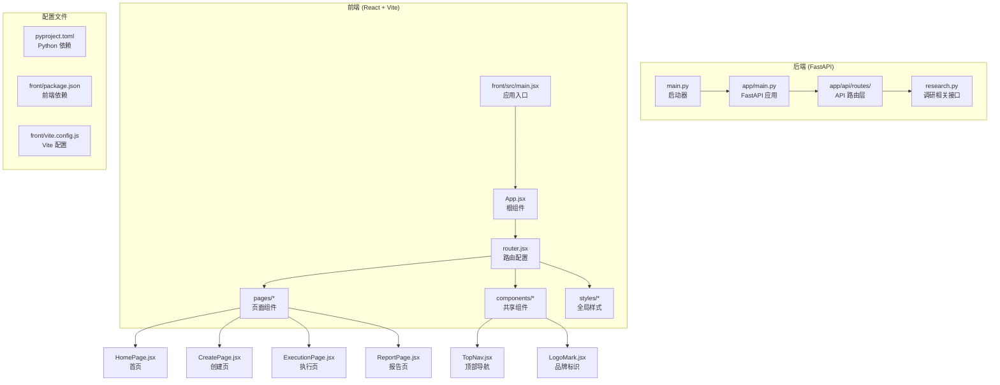
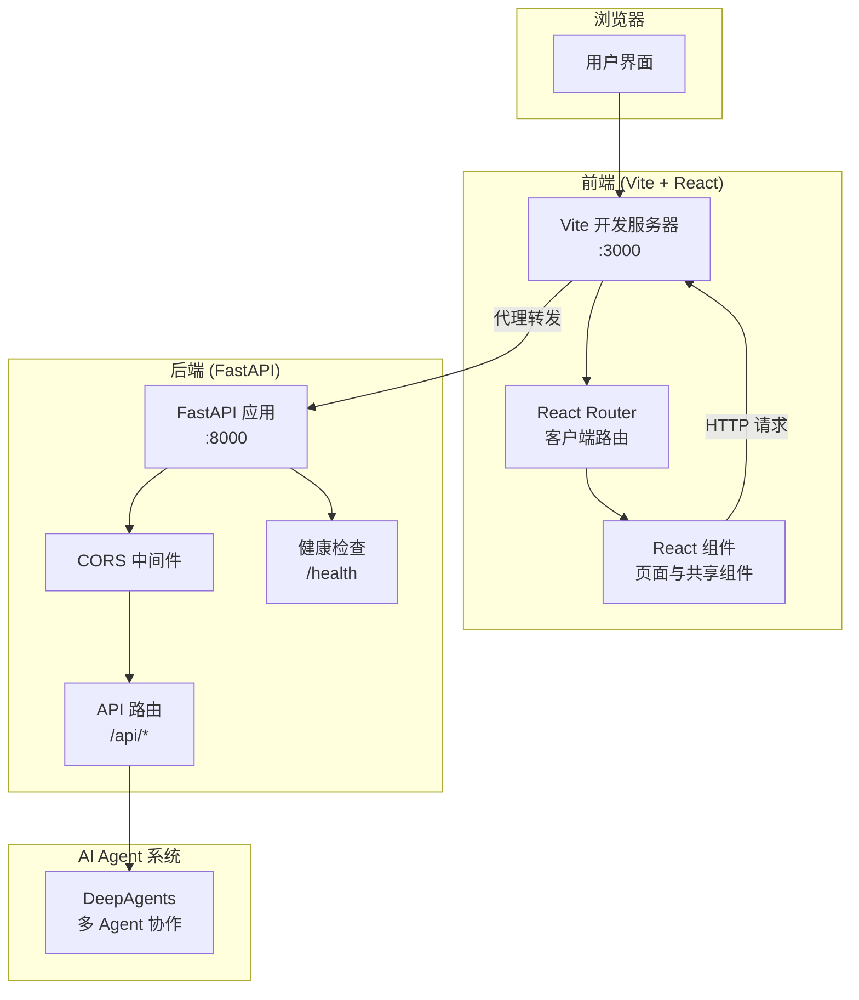
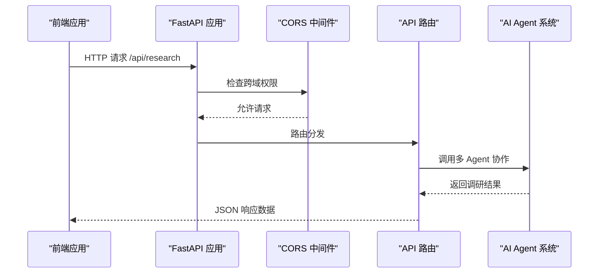
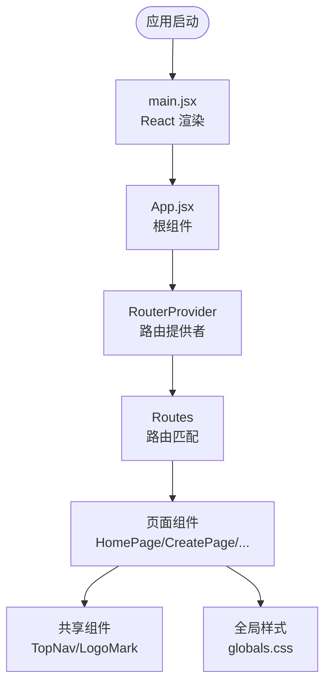
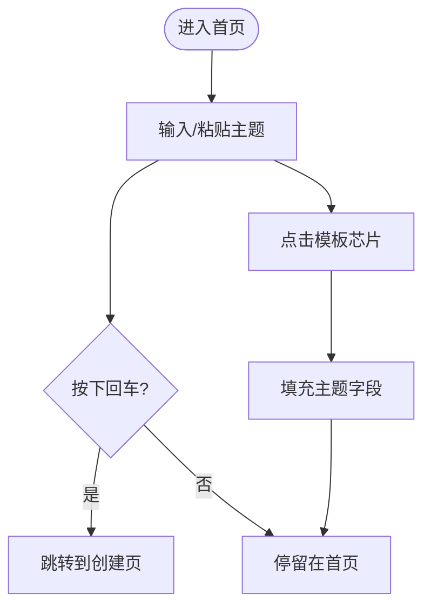
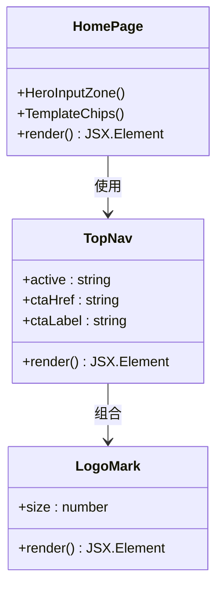
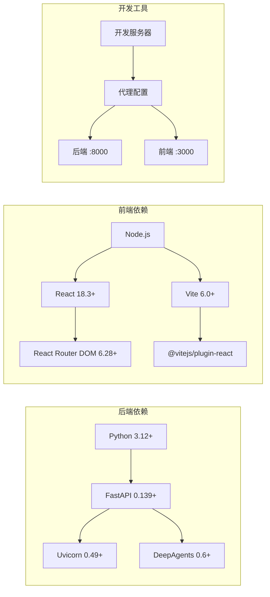

# 项目概述

<cite>
**本文引用的文件**
- [main.py](file://main.py)
- [app/main.py](file://app/main.py)
- [pyproject.toml](file://pyproject.toml)
- [front/package.json](file://front/package.json)
- [front/vite.config.js](file://front/vite.config.js)
- [app/api/routes/research.py](file://app/api/routes/research.py)
- [front/src/App.jsx](file://front/src/App.jsx)
- [front/src/router.jsx](file://front/src/router.jsx)
- [front/src/main.jsx](file://front/src/main.jsx)
- [front/src/pages/HomePage.jsx](file://front/src/pages/HomePage.jsx)
- [front/src/components/TopNav.jsx](file://front/src/components/TopNav.jsx)
- [front/src/components/LogoMark.jsx](file://front/src/components/LogoMark.jsx)
- [front/src/styles/globals.css](file://front/src/styles/globals.css)
</cite>

## 更新摘要
**所做更改**
- 从 Next.js 前端原型迁移到全栈 FastAPI + React/Vite 架构
- 新增后端 API 层，提供多 AI Agent 调研平台的核心接口
- 重构前端为 Vite + React Router 架构，保持原有页面组件结构
- 更新技术栈说明和架构图表以反映新的全栈架构

## 目录
1. [简介](#简介)
2. [项目结构](#项目结构)
3. [核心组件](#核心组件)
4. [架构总览](#架构总览)
5. [详细组件分析](#详细组件分析)
6. [依赖关系分析](#依赖关系分析)
7. [性能考量](#性能考量)
8. [故障排除指南](#故障排除指南)
9. [结论](#结论)
10. [附录](#附录)

## 简介
InsightMesh 是一个"多 AI Agent 智能调研平台"的全栈应用，采用 FastAPI 后端与 React/Vite 前端的现代化架构。项目基于 Open Design 原型（"调研报告"项目）重构而来，保留了原有的极简科技风格视觉、布局、交互与素材。项目以"在五分钟内自动生成结构化行业调研报告"为目标，通过五个专业 AI Agent 并行协作，实现从全网信息采集、交叉核验、观点提炼到报告生成的自动化闭环。

- **价值主张**：以极简科技风格的 SaaS 交互，将复杂的多 Agent 协作过程可视化，让用户在 5 分钟内获得可直接使用的深度报告。
- **技术理念**：从单一前端原型到全栈应用的演进，强调前后端分离架构与微服务化设计，使用 FastAPI 高性能异步框架、React 组件化架构与 Vite 快速构建工具，确保开发效率与用户体验双优。
- **设计哲学**：极简科技风格贯穿视觉、交互与体验，强调信息密度与操作效率，通过清晰的步骤引导、状态页与可视化反馈，降低用户认知负担。

**章节来源**
- [app/main.py:17-22](file://app/main.py#L17-L22)
- [front/package.json:3-6](file://front/package.json#L3-L6)

## 项目结构
项目采用前后端分离的全栈架构，后端基于 FastAPI 提供 RESTful API 接口，前端使用 React + Vite 构建现代化的单页应用。核心目录结构包括后端应用模块、API 路由层、前端页面组件、共享组件与全局样式系统。

**图表来源**
- [main.py:1-13](file://main.py#L1-L13)
- [app/main.py:1-39](file://app/main.py#L1-L39)
- [app/api/routes/research.py:1-19](file://app/api/routes/research.py#L1-L19)
- [front/src/main.jsx:1-11](file://front/src/main.jsx#L1-L11)
- [front/src/App.jsx:1-44](file://front/src/App.jsx#L1-L44)
- [front/src/router.jsx:1-36](file://front/src/router.jsx#L1-L36)

**章节来源**
- [pyproject.toml:1-18](file://pyproject.toml#L1-L18)
- [front/package.json:1-39](file://front/package.json#L1-L39)

## 核心组件
- **后端应用入口**：FastAPI 应用实例，配置 CORS 中间件、生命周期钩子与 API 路由挂载点。
- **API 路由层**：按功能模块划分的 RESTful 接口，当前包含调研任务相关的 CRUD 操作。
- **前端应用入口**：React 应用初始化，集成 React Router 进行客户端路由管理。
- **路由配置**：集中式路由定义，映射 URL 路径到对应的页面组件。
- **共享组件**：TopNav 顶部导航组件与 LogoMark 品牌标识组件，提供统一的 UI 规范。

这些组件共同构成全栈应用的基础骨架，保证前后端分离架构下的清晰职责划分与高效协作。

**章节来源**
- [app/main.py:17-33](file://app/main.py#L17-L33)
- [app/api/routes/research.py:5-17](file://app/api/routes/research.py#L5-L17)
- [front/src/main.jsx:6-10](file://front/src/main.jsx#L6-L10)
- [front/src/router.jsx:18-33](file://front/src/router.jsx#L18-L33)
- [front/src/components/TopNav.jsx:7-43](file://front/src/components/TopNav.jsx#L7-L43)
- [front/src/components/LogoMark.jsx:2-17](file://front/src/components/LogoMark.jsx#L2-L17)

## 架构总览
项目采用前后端分离的现代化全栈架构，后端基于 FastAPI 提供高性能异步 API 服务，前端使用 React + Vite 构建响应式单页应用。通过 Vite 开发服务器的代理配置实现前后端无缝联调，CORS 中间件确保跨域请求的安全性。

**图表来源**
- [front/vite.config.js:12-21](file://front/vite.config.js#L12-L21)
- [app/main.py:25-31](file://app/main.py#L25-L31)
- [app/main.py:36-38](file://app/main.py#L36-L38)
- [pyproject.toml:7-11](file://pyproject.toml#L7-L11)

**章节来源**
- [front/vite.config.js:1-22](file://front/vite.config.js#L1-L22)
- [app/main.py:1-39](file://app/main.py#L1-L39)

## 详细组件分析

### 后端 API 层
- **功能要点**：FastAPI 应用实例化、CORS 配置、API 路由挂载、健康检查端点。
- **架构特性**：异步上下文管理器支持启动/关闭钩子，模块化路由设计便于扩展。
- **安全考虑**：严格的 CORS 策略限制允许的源，支持凭证传递与完整 HTTP 方法。

**图表来源**
- [app/main.py:25-33](file://app/main.py#L25-L33)
- [app/api/routes/research.py:8-17](file://app/api/routes/research.py#L8-L17)

**章节来源**
- [app/main.py:11-33](file://app/main.py#L11-L33)
- [app/api/routes/research.py:1-19](file://app/api/routes/research.py#L1-L19)

### 前端应用架构
- **功能要点**：React 应用初始化、路由配置、组件树组织、全局样式引入。
- **架构特性**：基于 createBrowserRouter 的声明式路由配置，支持嵌套路由与懒加载。
- **开发体验**：Vite 热重载、ESM 模块支持、TypeScript 兼容性与插件生态系统。

**图表来源**
- [front/src/main.jsx:6-10](file://front/src/main.jsx#L6-L10)
- [front/src/App.jsx:4-6](file://front/src/App.jsx#L4-L6)
- [front/src/router.jsx:18-33](file://front/src/router.jsx#L18-L33)

**章节来源**
- [front/src/main.jsx:1-11](file://front/src/main.jsx#L1-L11)
- [front/src/App.jsx:1-44](file://front/src/App.jsx#L1-L44)
- [front/src/router.jsx:1-36](file://front/src/router.jsx#L1-L36)

### 首页组件（HomePage）
- **功能要点**：主题输入区、模板芯片、信任徽标、场景卡片、统计数据与 CTA。
- **交互特性**：输入框支持回车跳转；模板芯片点击填充主题；场景卡片与统计区块增强信任感与转化。
- **设计价值**：通过"极简科技风"强化专业感，配合渐入动画与视觉层次，提升首屏体验。

**图表来源**
- [front/src/pages/HomePage.jsx:27-49](file://front/src/pages/HomePage.jsx#L27-L49)
- [front/src/pages/HomePage.jsx:158-175](file://front/src/pages/HomePage.jsx#L158-L175)

**章节来源**
- [front/src/pages/HomePage.jsx:1-177](file://front/src/pages/HomePage.jsx#L1-L177)

### 共享组件系统
- **顶部导航（TopNav）**：提供统一的导航与 CTA 控制，支持活动状态高亮与右侧按钮配置。
- **品牌标识（LogoMark）**：SVG 星形标志，用于页面头部与品牌区域的一致性展示。
- **设计价值**：通过组件复用确保视觉一致性，减少重复代码，提升维护效率。

**图表来源**
- [front/src/components/TopNav.jsx:7-43](file://front/src/components/TopNav.jsx#L7-L43)
- [front/src/components/LogoMark.jsx:2-17](file://front/src/components/LogoMark.jsx#L2-L17)
- [front/src/pages/HomePage.jsx:51-156](file://front/src/pages/HomePage.jsx#L51-L156)

**章节来源**
- [front/src/components/TopNav.jsx:1-45](file://front/src/components/TopNav.jsx#L1-L45)
- [front/src/components/LogoMark.jsx:1-19](file://front/src/components/LogoMark.jsx#L1-L19)

### 状态页面系统
- **功能要点**：加载中、空数据、失败重试、网络异常、权限提示五种状态，分别对应不同用户情境下的引导与操作。
- **交互特性**：加载中显示旋转动画与倒计时提示；失败/网络异常提供重试与引导；权限提示引导登录。
- **设计价值**：通过明确的状态反馈与操作按钮，减少用户困惑，提升系统可用性。

**章节来源**
- [front/src/pages/states/LoadingState.jsx:1-12](file://front/src/pages/states/LoadingState.jsx#L1-L12)

## 依赖关系分析
- **后端技术栈**：FastAPI 0.139+（高性能异步 Web 框架）、Uvicorn 0.49+（ASGI 服务器）、DeepAgents 0.6+（多 Agent 协作框架）。
- **前端技术栈**：React 18.3+（UI 框架）、React Router DOM 6.28+（客户端路由）、Vite 6.0+（现代构建工具）。
- **开发环境**：Python >= 3.12、Node.js 环境、Vite 开发服务器与代理配置。
- **构建与运行**：后端通过 uvicorn 启动，前端通过 vite dev 启动，支持热重载与实时预览。

**图表来源**
- [pyproject.toml:7-11](file://pyproject.toml#L7-L11)
- [front/package.json:12-20](file://front/package.json#L12-L20)
- [front/vite.config.js:12-21](file://front/vite.config.js#L12-L21)

**章节来源**
- [pyproject.toml:1-18](file://pyproject.toml#L1-L18)
- [front/package.json:1-39](file://front/package.json#L1-L39)

## 性能考量
- **后端性能**：FastAPI 基于 Starlette 的高性能异步框架，支持并发请求处理；Uvicorn ASGI 服务器提供高效的 WSGI 兼容性。
- **前端性能**：Vite 基于 ESBuild 的快速构建工具，支持按需编译与热模块替换；React 18 的并发特性提升渲染性能。
- **网络优化**：开发环境通过 Vite 代理避免跨域问题；生产环境可配置 CDN 与缓存策略。
- **资源优化**：CSS 变量系统减少样式重复；SVG 图标内联避免额外请求；组件懒加载优化首屏性能。

**章节来源**
- [front/vite.config.js:12-21](file://front/vite.config.js#L12-L21)
- [front/src/styles/globals.css:12-134](file://front/src/styles/globals.css#L12-L134)

## 故障排除指南
- **后端启动失败**：检查 Python 版本是否 >= 3.12，确认依赖安装完整，验证端口 8000 未被占用。
- **前端无法访问**：确认 Vite 开发服务器运行在 3000 端口，检查代理配置是否正确转发到后端。
- **跨域错误**：检查 FastAPI CORS 配置中的 allow_origins 列表，确保包含前端开发服务器地址。
- **路由无法访问**：确认 React Router 配置与页面组件路径匹配，检查 import 语句是否正确。
- **样式异常**：确认 globals.css 正确引入，检查 CSS 变量定义与类名使用是否符合规范。

**章节来源**
- [main.py:5-6](file://main.py#L5-L6)
- [front/vite.config.js:12-21](file://front/vite.config.js#L12-L21)
- [app/main.py:25-31](file://app/main.py#L25-L31)

## 结论
InsightMesh 成功从 Next.js 前端原型迁移到基于 FastAPI + React/Vite 的全栈应用架构，既保留了极简科技风格的视觉与交互，又通过前后端分离与微服务化设计提升了系统的可扩展性与可维护性。项目以"五个专业 AI Agent 并行协作"为核心，围绕"五分钟生成结构化行业调研报告"的目标，提供了从任务创建、执行监控到报告展示与个人管理的完整业务流程，适合初学者理解现代全栈开发模式，也为有经验的开发者提供了高性能异步架构的工程实践参考。

## 附录
- **开发环境搭建**：后端使用 `uv run dev` 启动，前端使用 `npm run dev` 启动，两者协同工作于不同端口。
- **架构迁移对比**：从 Next.js 全栈框架迁移到 FastAPI + React/Vite 前后端分离架构，提升了系统的灵活性与团队协作效率。
- **API 文档**：FastAPI 自动生成的交互式 API 文档可通过 `/docs` 端点访问，支持在线测试与调试。

**章节来源**
- [pyproject.toml:13-14](file://pyproject.toml#L13-L14)
- [front/package.json:7-11](file://front/package.json#L7-L11)
- [app/main.py:36-38](file://app/main.py#L36-L38)