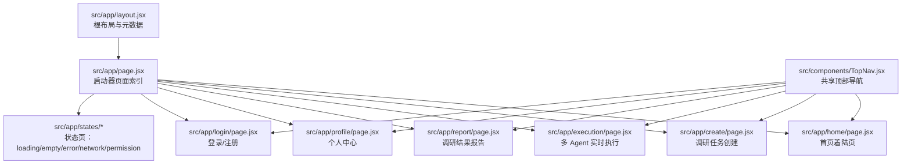
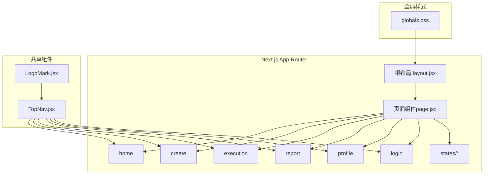
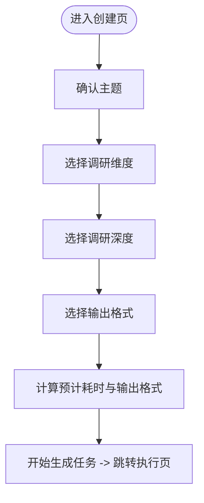
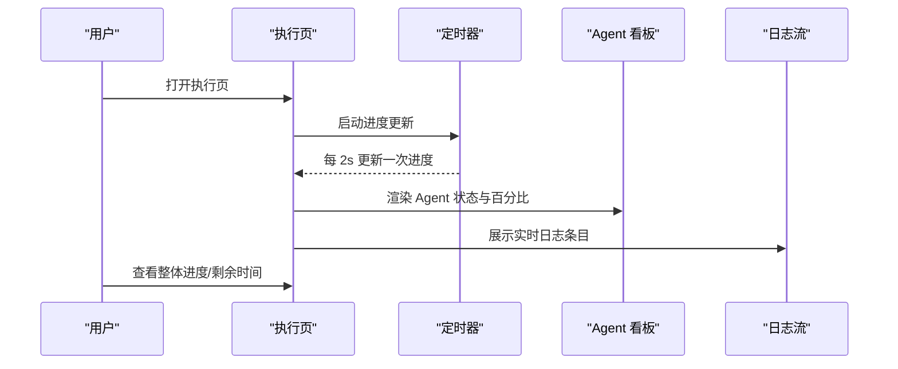
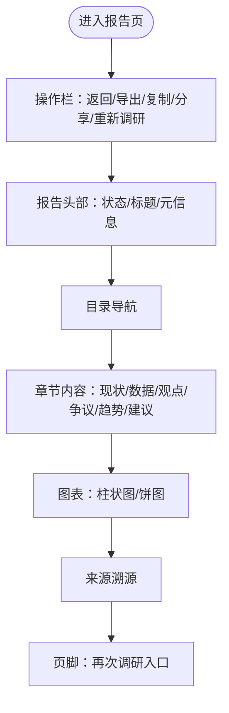
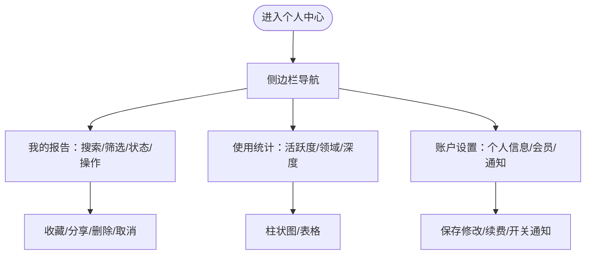
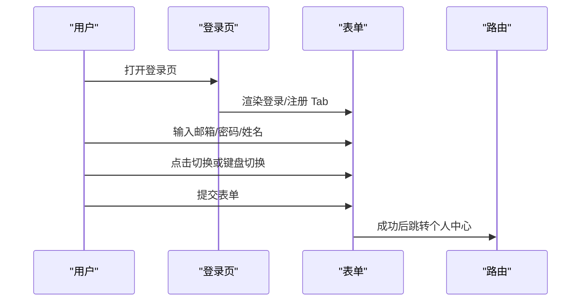
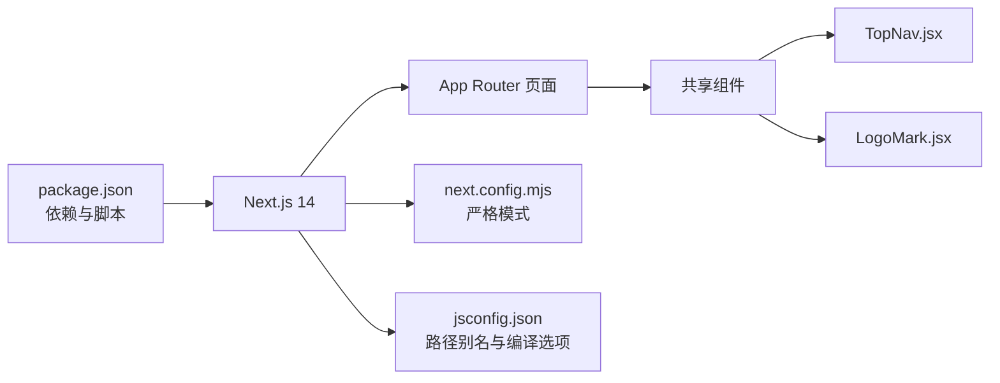

# 项目概述

<cite>
**本文引用的文件**
- [README.md](file://README.md)
- [package.json](file://package.json)
- [next.config.mjs](file://next.config.mjs)
- [jsconfig.json](file://jsconfig.json)
- [src/app/layout.jsx](file://src/app/layout.jsx)
- [src/app/page.jsx](file://src/app/page.jsx)
- [src/app/home/page.jsx](file://src/app/home/page.jsx)
- [src/app/create/page.jsx](file://src/app/create/page.jsx)
- [src/app/execution/page.jsx](file://src/app/execution/page.jsx)
- [src/app/report/page.jsx](file://src/app/report/page.jsx)
- [src/app/profile/page.jsx](file://src/app/profile/page.jsx)
- [src/app/login/page.jsx](file://src/app/login/page.jsx)
- [src/app/states/loading/page.jsx](file://src/app/states/loading/page.jsx)
- [src/components/TopNav.jsx](file://src/components/TopNav.jsx)
- [src/components/LogoMark.jsx](file://src/components/LogoMark.jsx)
</cite>

## 目录
1. [简介](#简介)
2. [项目结构](#项目结构)
3. [核心组件](#核心组件)
4. [架构总览](#架构总览)
5. [详细组件分析](#详细组件分析)
6. [依赖关系分析](#依赖关系分析)
7. [性能考量](#性能考量)
8. [故障排除指南](#故障排除指南)
9. [结论](#结论)
10. [附录](#附录)

## 简介
InsightMesh 是一个“多 AI Agent 智能调研平台”的高保真原型，基于 Open Design 原型（“调研报告”项目）转换而来，采用 Next.js 14 与 React 18 构建，保留了原有的极简科技风格视觉、布局、交互与素材。项目以“在五分钟内自动生成结构化行业调研报告”为目标，通过五个专业 AI Agent 并行协作，实现从全网信息采集、交叉核验、观点提炼到报告生成的自动化闭环。

- 价值主张：以极简科技风格的 SaaS 交互，将复杂的多 Agent 协作过程可视化，让用户在 5 分钟内获得可直接使用的深度报告。
- 技术理念：从 HTML 原型到现代前端应用的迁移，强调“高保真交互”与“可维护架构”的平衡，使用 React Hooks、Next.js App Router、全局样式与组件化设计，确保开发效率与用户体验双优。
- 设计哲学：极简科技风格贯穿视觉、交互与体验，强调信息密度与操作效率，通过清晰的步骤引导、状态页与可视化反馈，降低用户认知负担。

**章节来源**
- [README.md:1-94](file://README.md#L1-L94)

## 项目结构
项目采用 Next.js App Router 的目录结构，页面按功能模块划分，共享组件位于 components 目录，根布局与全局样式在 app 目录中集中管理。核心页面包括首页、任务创建、多 Agent 执行、报告展示、个人中心、登录以及五种状态页。

**图表来源**
- [src/app/layout.jsx:1-21](file://src/app/layout.jsx#L1-L21)
- [src/app/page.jsx:1-78](file://src/app/page.jsx#L1-L78)
- [src/app/home/page.jsx:1-212](file://src/app/home/page.jsx#L1-L212)
- [src/app/create/page.jsx:1-183](file://src/app/create/page.jsx#L1-L183)
- [src/app/execution/page.jsx:1-169](file://src/app/execution/page.jsx#L1-L169)
- [src/app/report/page.jsx:1-250](file://src/app/report/page.jsx#L1-L250)
- [src/app/profile/page.jsx:1-284](file://src/app/profile/page.jsx#L1-L284)
- [src/app/login/page.jsx:1-185](file://src/app/login/page.jsx#L1-L185)
- [src/app/states/loading/page.jsx:1-12](file://src/app/states/loading/page.jsx#L1-L12)
- [src/components/TopNav.jsx:1-45](file://src/components/TopNav.jsx#L1-L45)

**章节来源**
- [README.md:13-39](file://README.md#L13-L39)
- [src/app/layout.jsx:1-21](file://src/app/layout.jsx#L1-L21)
- [src/app/page.jsx:1-78](file://src/app/page.jsx#L1-L78)

## 核心组件
- 根布局与元数据：定义站点标题、描述、视口参数与全局样式引入，确保页面一致性与 SEO 友好。
- 启动器页面：以卡片网格形式列出所有主页面与状态页，便于快速预览与测试。
- 顶部导航组件：提供统一的导航与 CTA 控制，支持活动状态高亮与右侧按钮配置。
- 品牌标识组件：SVG 星形标志，用于页面头部与品牌区域的一致性展示。

这些组件共同构成页面的基础骨架，保证跨页面的视觉与交互一致性。

**章节来源**
- [src/app/layout.jsx:1-21](file://src/app/layout.jsx#L1-L21)
- [src/app/page.jsx:1-78](file://src/app/page.jsx#L1-L78)
- [src/components/TopNav.jsx:1-45](file://src/components/TopNav.jsx#L1-L45)
- [src/components/LogoMark.jsx:1-19](file://src/components/LogoMark.jsx#L1-L19)

## 架构总览
项目采用“页面即组件”的 App Router 架构，每个页面是一个客户端或服务端组件，配合共享组件与全局样式，形成高内聚、低耦合的前端结构。路由以静态预渲染方式构建，保证首屏性能与 SEO。

**图表来源**
- [src/app/layout.jsx:1-21](file://src/app/layout.jsx#L1-L21)
- [src/app/page.jsx:1-78](file://src/app/page.jsx#L1-L78)
- [src/components/TopNav.jsx:1-45](file://src/components/TopNav.jsx#L1-L45)
- [src/components/LogoMark.jsx:1-19](file://src/components/LogoMark.jsx#L1-L19)

**章节来源**
- [README.md:6-12](file://README.md#L6-L12)
- [next.config.mjs:1-7](file://next.config.mjs#L1-L7)
- [jsconfig.json:1-14](file://jsconfig.json#L1-L14)

## 详细组件分析

### 首页（home）
- 功能要点：主题输入区、模板芯片、信任徽标、场景卡片、统计数据与 CTA。
- 交互特性：输入框支持回车跳转；模板芯片点击填充主题；场景卡片与统计区块增强信任感与转化。
- 设计价值：通过“极简科技风”强化专业感，配合渐入动画与视觉层次，提升首屏体验。

**图表来源**
- [src/app/home/page.jsx:30-52](file://src/app/home/page.jsx#L30-L52)
- [src/app/home/page.jsx:193-210](file://src/app/home/page.jsx#L193-L210)

**章节来源**
- [src/app/home/page.jsx:1-212](file://src/app/home/page.jsx#L1-L212)

### 调研任务创建（create）
- 功能要点：维度多选、深度三选一、格式多选、预计耗时与输出格式动态展示、开始按钮。
- 交互特性：多选芯片切换、深度档位高亮、格式组合计算、底部信息实时更新。
- 设计价值：通过清晰的步骤与可视化反馈，降低用户决策成本，提升任务配置效率。

**图表来源**
- [src/app/create/page.jsx:45-182](file://src/app/create/page.jsx#L45-L182)

**章节来源**
- [src/app/create/page.jsx:1-183](file://src/app/create/page.jsx#L1-L183)

### 多 Agent 实时执行（execution）
- 功能要点：整体进度条（模拟递增）、Agent 工作看板（状态/百分比/提示）、实时日志流、可视化指标。
- 交互特性：定时器驱动进度条动画；Agent 状态随阶段推进变化；日志滚动展示核验与观点提炼过程。
- 设计价值：通过“实时可视化”让用户感知后台协作过程，建立信任与可控感。

**图表来源**
- [src/app/execution/page.jsx:55-168](file://src/app/execution/page.jsx#L55-L168)

**章节来源**
- [src/app/execution/page.jsx:1-169](file://src/app/execution/page.jsx#L1-L169)

### 报告展示（report）
- 功能要点：报告头部元信息、目录导航、六大章节内容、图表可视化、来源溯源、操作栏（导出/复制/分享/重新调研）。
- 交互特性：目录锚点跳转、章节内高亮、来源标签与类型区分、操作按钮分组。
- 设计价值：以结构化内容与可视化图表承载复杂信息，辅以可追溯的来源，提升报告权威性与可用性。

**图表来源**
- [src/app/report/page.jsx:37-249](file://src/app/report/page.jsx#L37-L249)

**章节来源**
- [src/app/report/page.jsx:1-250](file://src/app/report/page.jsx#L1-L250)

### 个人中心（profile）
- 功能要点：侧边栏导航（我的报告/收藏夹/使用统计/账户设置）、报告列表（搜索/筛选/状态/操作）、统计面板（活跃度/领域偏好/深度分布）。
- 交互特性：侧边栏切换、搜索与筛选联动、收藏/分享/删除/取消等操作按钮。
- 设计价值：将用户资产与使用数据集中呈现，帮助用户高效管理与回顾历史调研。

**图表来源**
- [src/app/profile/page.jsx:42-283](file://src/app/profile/page.jsx#L42-L283)

**章节来源**
- [src/app/profile/page.jsx:1-284](file://src/app/profile/page.jsx#L1-L284)

### 登录/注册（login）
- 功能要点：左右分区（品牌区/表单区）、登录/注册 Tab 切换、密码显隐、第三方登录、表单校验与提交。
- 交互特性：Tab 键切换与键盘导航、焦点管理、提交后跳转个人中心。
- 设计价值：通过品牌区强化信任与记忆点，表单区提供简洁高效的认证流程。

**图表来源**
- [src/app/login/page.jsx:18-184](file://src/app/login/page.jsx#L18-L184)

**章节来源**
- [src/app/login/page.jsx:1-185](file://src/app/login/page.jsx#L1-L185)

### 状态页（states）
- 功能要点：加载中、空数据、失败重试、网络异常、权限提示五种状态，分别对应不同用户情境下的引导与操作。
- 交互特性：加载中显示旋转动画与倒计时提示；失败/网络异常提供重试与引导；权限提示引导登录。
- 设计价值：通过明确的状态反馈与操作按钮，减少用户困惑，提升系统可用性。

**章节来源**
- [src/app/states/loading/page.jsx:1-12](file://src/app/states/loading/page.jsx#L1-L12)

## 依赖关系分析
- 技术栈：Next.js 14（App Router）、React 18、全局样式（globals.css）、字体与图标（SVG）。
- 构建与运行：开发服务器、生产构建、代码检查；所有路由均静态预渲染，首屏 JS 体积较小。
- 路由与导航：使用 Next.js Link 进行客户端导航，替代原 HTML 的 a 标签跳转。
- 组件复用：TopNav 作为共享组件贯穿多个页面，LogoMark 作为品牌标识组件统一视觉。

**图表来源**
- [package.json:1-18](file://package.json#L1-L18)
- [next.config.mjs:1-7](file://next.config.mjs#L1-L7)
- [jsconfig.json:1-14](file://jsconfig.json#L1-L14)

**章节来源**
- [package.json:1-18](file://package.json#L1-L18)
- [README.md:52-86](file://README.md#L52-L86)

## 性能考量
- 静态预渲染：所有 14 个路由均为静态预渲染，首屏 JS 体积在 87–101 kB 之间，有利于首屏加载速度与 SEO。
- 组件化与样式：通过共享组件与全局样式减少重复代码，提升维护效率；页面内使用 SVG 图标与简单动画，避免额外资源开销。
- 交互优化：执行页进度条使用定时器模拟，避免真实网络请求带来的复杂性；登录页 Tab 切换与焦点管理提升可访问性。

**章节来源**
- [README.md:82-86](file://README.md#L82-L86)

## 故障排除指南
- 构建失败：检查 Next.js 与 React 版本是否匹配，确认 package.json 中依赖安装完整。
- 路由无法访问：确认 App Router 路径与页面命名是否符合约定，检查 src/app 下是否存在对应页面文件。
- 样式异常：确认 globals.css 是否正确引入，检查组件中是否使用了正确的 CSS 类名。
- 交互失效：确认页面是否启用客户端模式（如使用 "use client"），检查事件绑定与状态更新逻辑。

**章节来源**
- [package.json:6-11](file://package.json#L6-L11)
- [src/app/layout.jsx:1-21](file://src/app/layout.jsx#L1-L21)

## 结论
InsightMesh 将传统 HTML 原型成功迁移为基于 Next.js 14 与 React 18 的现代化前端应用，既保留了极简科技风格的视觉与交互，又通过组件化与静态预渲染提升了可维护性与性能。项目以“五个专业 AI Agent 并行协作”为核心，围绕“五分钟生成结构化行业调研报告”的目标，提供了从任务创建、执行监控到报告展示与个人管理的完整流程原型，适合初学者理解现代前端架构，也为有经验的开发者提供了可扩展的工程实践参考。

## 附录
- 预览路由清单与页面映射，便于快速定位与测试各页面功能。
- 与原型差异说明：从静态链接迁移到客户端导航、内联脚本替换为 React 事件处理、样式合并为单一全局样式文件。

**章节来源**
- [README.md:61-94](file://README.md#L61-L94)